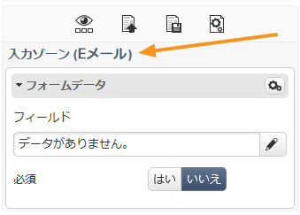
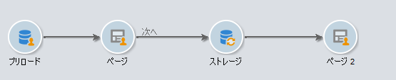

# コンテンツ編集のベストプラクティス{#content-editing-best-practices}

エディターの最適な操作のために、次のガイドラインを確認することをお勧めします。

* Adobe Campaign で **HTML ページテンプレートをインポートする**&#x200B;前に、様々なブラウザーでテンプレートを開いて適切に表示されることを確認してください。
* HTML ページに **JavaScript スクリプト**&#x200B;が含まれている場合、エディターの外部で&#x200B;**エラーなしで**&#x200B;実行する必要があります。
* When building a template, we recommend adding a **&#39;type&#39;** attribute to `<input>` tags. この情報はエディターで処理され、Web アプリケーションを設定する際に、ユーザーがデータベースのフィールドをフォームのフィールドにリンクするのに便利です。

   テンプレート内の HTML コードの例：

   ```
   <input id="email" type="email" name="email"/>
   ```

   「**type**」属性は、次のフォームのインターフェイスに表示されます。

   

   「type」属性の正式なリストは、このWebサイトで [入手できます](https://www.w3schools.com/tags/att_input_type.asp)。

* DCE での終了ページのシミュレーションの手順：

   

* Make sure that there is only one `<body> </body>` in the page.
* CSS または JS ファイルがアップロードされても、.zip ファイルに含まれる画像はアップロードされません。したがって、CSS に存在するこれらの画像への参照は更新されません。

## コンテンツエディターでサポートされる形式 {#content-editor-supported-formats}

デジタルコンテンツエディターは、HTML 形式をサポートします。いつでも&#x200B;**ソース**&#x200B;モードに切り替えることができます。

デジタルコンテンツエディターのインポート機能は、次のサポートされる形式で、次のように動作します。

* CSS：.zip ファイルに含まれる画像はインポートされません。CSS のこれらの画像への参照は、更新されません。
* JS：.zip ファイルに含まれる画像はインポートされません。JS のこれらの画像への参照は、更新されません。
* IFrame：リンクされたページは、インポートされません。
* ランディングページおよび Web アプリ： **form** タグが見つからない場合、警告が表示されます。A `<form> </form>` must always be present in the message body.

デジタルコンテンツエディターは、次のコードページの編集もサポートします。

* iso-8859-1
* iso-8859-2
* utf-7
* utf-8（BOM を使用する場合に推奨）
* iso-8859-15
* us-ascii
* shift jis
* iso-2022-jp
* big-5
* euc-kr
* utf-16

>[!NOTE]
>
>HTML コードページは、meta タグ（HTML 4 または HTML 5）または BOM で定義されている必要があります。使用可能なコードページがない場合、ファイルを latin1 で開きます。

## HTML コンテンツのステータス {#html-content-statuses}

エディターの上部のセクションには、コンテンツのステータスに関するメッセージが表示されます。メッセージのカラーコードを次に示します。

* **グレーのメッセージ**：情報メッセージ。エディターでアクションを実行する必要はありません。
* **青いメッセージ**：編集されるコンテンツに関連する情報メッセージ。
* **黄色いメッセージ**：ユーザーの代わりにアクションが必要な警告またはエラーメッセージ。

### Web アプリケーション編集時のメッセージのリスト {#list-of-messages-when-editing-a-web-application}

* HTML コンテンツは機能しています。
* この Web アプリケーションはパブリッシュされていないので、オンラインでアクセスできません。
* Web アプリケーションがオンラインです。変更を適用するには、再度パブリッシュする必要があります。
* ページコンテンツが機能しません。It must include an HTML form (`<form>`)
* 設定する入力ゾーンまたはボタンがありません。
* 次のページへのトランジションを有効にするには、現在のページ上のボタンまたはリンクに「次のページ」アクションをリンクする必要があります。

### 配信編集時のメッセージのリスト {#list-of-messages-when-editing-a-delivery}

* 配信コンテンツは機能しています。
* まだ、n フィールドまたはパーソナライゼーションブロックを設定する必要があります。
* 配信コンテンツの準備が整いました。変更を適用するには、再度分析を実行する必要があります。
* 配信の送信準備が整いました。

