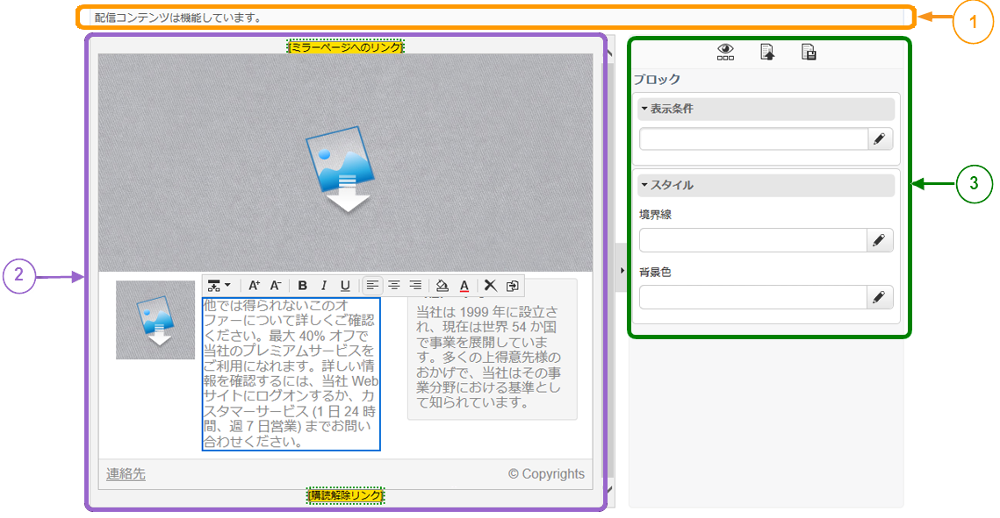
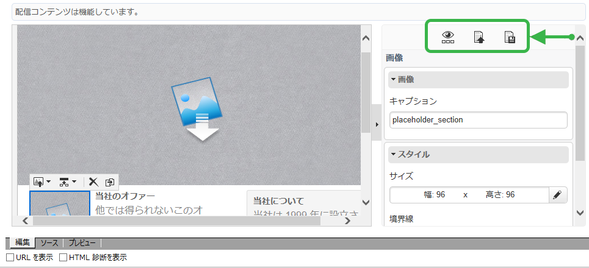
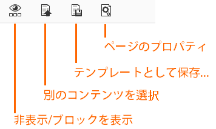
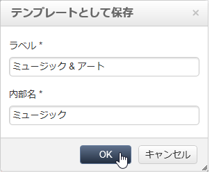
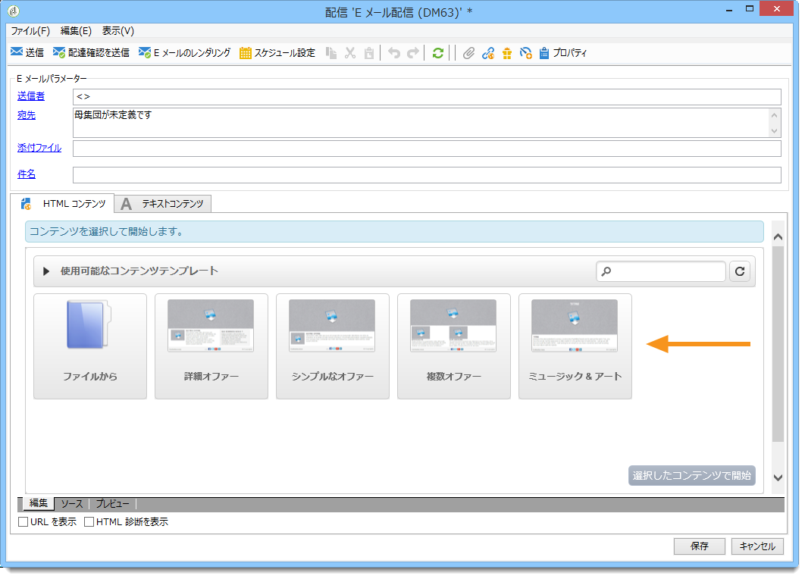
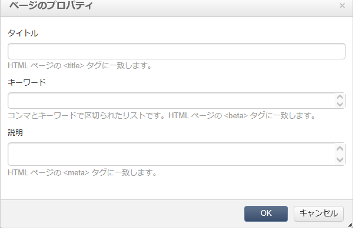
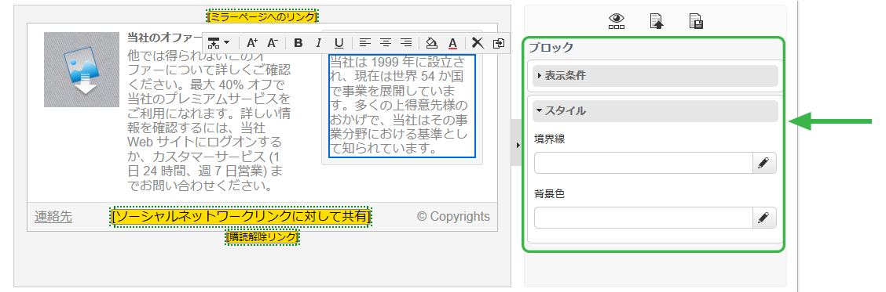

# コンテンツエディターのインターフェイス{#content-editor-interface}

## 編集ウィンドウ {#editing-window}

DCE 編集ウィンドウは、3 つの異なるセクションに分類されます。 これらにより、コンテンツのステータスを表示、修正および確認できます。

1. **上部**&#x200B;のセクションは、ユーザーに対するメッセージの表示領域です。 これらのメッセージは、Web アプリケーションのステータスや作成される配信、およびコンテンツに関連する警告やエラーメッセージを示します。 詳しくは、[HTML コンテンツのステータス](content-editing-best-practices.md#html-content-statuses)を参照してください。
1. ウィンドウの&#x200B;**左側**&#x200B;のセクションは、コンテンツを編集するための領域です。 この領域から、ポップアップツールバーを使用して直接コンテンツを操作できます（画像へのリンクの挿入、フォントの変更、フィールドの削除など）。詳しくは、 [フォームの編集](editing-content.md#editing-forms)を参照してください。
1. ウィンドウの&#x200B;**右側**&#x200B;のセクションは、コントロールパネル領域です。 この領域は、エディターの様々なオプション、特にページ見出しの設定に関するものとブロックの全般的なオプションをグループ化します（境界線の追加、データベースフィールドと入力ゾーンのリンク、web ページのプロパティへのアクセスなど）。詳しくは、[グローバルオプション](#global-options)および[コンテンツの編集](editing-content.md)の節を参照してください。

## グローバルオプション {#global-options}

エディターの右上のオプションを使用すると、グローバルオプションにアクセスできます。現在作成されているコンテンツを制御できます。

4 つのアイコンがあります。

* **ブロックを表示／非表示**&#x200B;アイコンを使用すると、コンテンツブロック（`
` HTML タグに対応）の周りに青い枠を表示できます。

* **別のコンテンツを選択**&#x200B;アイコンを使用すると、ユーザーは新しいコンテンツをテンプレート（既存のテンプレートまたは標準のテンプレート）から読み込むことができます。

  

  >[!CAUTION]
  >
  >選択したコンテンツが現在のコンテンツを置き換えます。

* **テンプレートとして保存**&#x200B;アイコンを使用すると、現在のコンテンツをテンプレートとして保存できます。 テンプレートのラベルおよび内部名を入力する必要があります。 テンプレートは、**[!UICONTROL リソース／テンプレート／コンテンツテンプレート]**&#x200B;ノードに格納されます。

  

  保存すれば、テンプレートは使用でき、新しいコンテンツを作成する際に選択できます。

  

* **ページのプロパティ**&#x200B;アイコンを使用すると、HTML ページの上部でコンテンツ情報を選択できます。

  

  >[!NOTE]
  >
  >この情報は、ページの **`<title>`** および **`<meta>`** HTML タグに対応します。
  >
  >キーワードは、コンマで区切る必要があります。

## ブロックオプション {#block-options}

エディターの右側のセクションは、コンテンツに作用するメインオプションをグループ化します。 これらのオプションを表示するには、ブロックを選択する必要があります。これらのオプションの特性は、選択したブロックによって異なります。

次の操作をおこなうことができます。

* 1 つまたは複数のブロックの表示を決定（[表示条件の定義](editing-content.md#defining-a-visibility-condition)を参照）
* 境界線とフレームを定義（[境界線と背景の追加](editing-content.md#adding-a-border-and-background)を参照）
* 画像の属性（サイズ、キャプション）を定義（[画像プロパティの編集](editing-content.md#editing-image-properties)を参照）
* データベースをフォーム要素（入力ゾーン、チェックボックス）にリンク（[フォームのデータプロパティの変更](editing-content.md#changing-the-data-properties-for-a-form)を参照）
* フォームの一部を必須にする（[フォームのデータプロパティの変更](editing-content.md#changing-the-data-properties-for-a-form)を参照）
* ボタンのアクションを定義（[ボタンへのアクションの追加](editing-content.md#adding-an-action-to-a-button)を参照）

## コンテンツツールバー {#content-toolbar}

ツールバーは、選択したブロックに応じて異なる機能を表示する、DCE インターフェイスの&#x200B;**ポップアップ要素**&#x200B;です。

>[!CAUTION]
>
>特定のツールバー機能を使用すると、HTML コンテンツを書式設定できます。 ただし、ページに CSS スタイルシートが含まれる場合、スタイルシートからの&#x200B;**指示**&#x200B;が、ツールバーで指定された指示よりも&#x200B;**優先**&#x200B;されることがあります。
