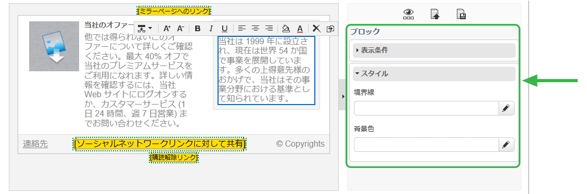

# コンテンツエディターのインターフェイス{#content-editor-interface}

## 編集ウィンドウ {#editing-window}

DCE 編集ウィンドウは、3 つの異なるセクションに分類されます。これらにより、コンテンツのステータスを表示、修正および確認できます。

1. **上部**&#x200B;のセクションは、ユーザーに対するメッセージの表示領域です。これらのメッセージは、Web アプリケーションのステータスや作成される配信、およびコンテンツに関連する警告やエラーメッセージを示します。詳しくは、 [HTMLコンテンツのステータスを参照してください](#html-content-statuses)。
1. ウィンドウの&#x200B;**左側**&#x200B;のセクションは、コンテンツを編集するための領域です。この領域から、ユーザーはポップアップツールバーを使用してコンテンツを直接操作できます。画像へのリンクの挿入、フォントの変更、フィールドの削除など For more on this refer to [Editing forms](../../web/using/editing-content.md#editing-forms).
1. ウィンドウの&#x200B;**右側**&#x200B;のセクションは、コントロールパネル領域です。この領域では、エディタの様々なオプション、特にブロックのページ見出しや一般オプションの設定に関連するオプションをグループ化します。枠線の追加、データベースフィールドと入力ゾーンのリンク、Webページのプロパティへのアクセスなど For more on this, refer to the [Global options](#global-options) and [Editing content](../../web/using/editing-content.md) sections.

## グローバルオプション {#global-options}

エディターの右上のオプションを使用すると、グローバルオプションにアクセスできます。現在作成されているコンテンツを制御できます。

4 つのアイコンがあります。

* The **Display/Hide blocks** icon lets you display blue frames around the content blocks (corresponding to the `
` HTML tag).

* **別のコンテンツを選択**&#x200B;アイコンを使用すると、ユーザーは新しいコンテンツをテンプレート（既存のテンプレートまたは標準のテンプレート）から読み込むことができます。

   

   >[!CAUTION]
   >
   >選択したコンテンツが現在のコンテンツを置き換えます。

* **テンプレートとして保存**&#x200B;アイコンを使用すると、現在のコンテンツをテンプレートとして保存できます。テンプレートのラベルおよび内部名を入力する必要があります。テンプレートはノードに保存さ **[!UICONTROL Resources > Templates > Content templates]** れます。

   

   保存すれば、テンプレートは使用でき、新しいコンテンツを作成する際に選択できます。

   

* **ページのプロパティ**&#x200B;アイコンを使用すると、HTML ページの上部でコンテンツ情報を選択できます。

   

   >[!NOTE]
   >
   >This information corresponds to the **`<title>`** and **`<meta>`** HTML tags on the page.
   >
   >キーワードは、コンマで区切る必要があります。

## ブロックオプション {#block-options}

エディターの右側のセクションは、コンテンツに作用するメインオプションをグループ化します。これらのオプションを表示するには、ブロックを選択する必要があります。これらのオプションの特性は、選択したブロックによって異なります。

次の操作をおこなうことができます。

* 1つまたは複数のブロックの表示を決定するには、「表 [示条件の定義](../../web/using/editing-content.md#defining-a-visibility-condition)、
* 枠線とフレームの定義については、境界線と背 [景の追加を参照してください](../../web/using/editing-content.md#adding-a-border-and-background)。
* 画像属性（サイズ、キャプション）の定義については、画像プロパ [ティの編集](../../web/using/editing-content.md#editing-image-properties)、
* データベースをフォーム要素（入力ゾーン、チェックボックス）にリンクします。詳しくは、 [フォームのデータプロパティの変更](../../web/using/editing-content.md#changing-the-data-properties-for-a-form)、
* フォームの一部を必須にする場合は、「フォームのデ [ータプロパティの変更](../../web/using/editing-content.md#changing-the-data-properties-for-a-form)、
* ボタンのアクションを定義する方法については、「ボタンへ [のアクションの追加」を参照してください](../../web/using/editing-content.md#adding-an-action-to-a-button)。

## コンテンツツールバー {#content-toolbar}

ツールバーは、選択したブロックに応じて異なる機能を表示する、DCE インターフェイスの&#x200B;**ポップアップ要素**&#x200B;です。

>[!CAUTION]
>
>特定のツールバー機能を使用すると、HTML コンテンツを書式設定できます。ただし、ページに CSS スタイルシートが含まれる場合、スタイルシートからの&#x200B;**指示**&#x200B;が、ツールバーで指定された指示よりも&#x200B;**優先**&#x200B;されることがあります。

