# ランディングページの作成{#creating-a-landing-page}

## ランディングページの作成について {#about-landing-pages-creation}

この使用例では、Adobe Campaign コンソールからランディングページを作成するためのデジタルコンテンツエディターの使用方法を示します。

Adobe Campaign でランディングページの設定を開始する前に、HTML ページに表示する **1 つ以上のテンプレート**&#x200B;があることを確認します。

この使用例の主な目的は、DCE の機能を使用して、ランディングページフォームフィールドを Adobe Campaign の内部フィールドに対応させることです。

## ランディングページの作成 {#creating-the-landing-page}

新しいランディングページタイプの Web アプリケーションを作成するには、次の手順を実行します。

1. 「**[!UICONTROL キャンペーン]**」タブに移動し、「**[!UICONTROL Web アプリケーション]**」リンクをクリックして、「**[!UICONTROL 作成]**」ボタンをクリックします。
1. **[!UICONTROL 新しいランディングページ]**&#x200B;テンプレートを選択して、ラベルを入力し、「**[!UICONTROL 保存]**」をクリックします。

   

1. 「**[!UICONTROL 編集]**」タブをクリックします。
1. **終了**&#x200B;アクティビティを削除します。
1. 「**[!UICONTROL ストレージ]**」アクティビティの後に「**[!UICONTROL ページ]**」アクティビティを追加します。
1. **ページ 2** アクティビティを編集してから、「**[!UICONTROL プロパティ]**」タブの「**[!UICONTROL アウトバウンドトランジションを有効にする]**」オプションのチェックをオフにします。

   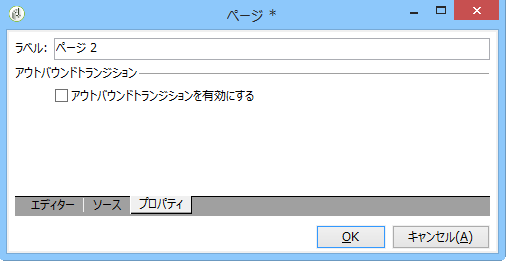

1. 変更を保存します。

その後は、次の順番になります。

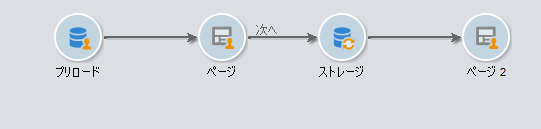

>[!NOTE]
>
>Web アプリケーションの作成について詳しくは、[この節](../../web/using/creating-a-new-web-application.md)を参照してください。

## 手順 1 - テンプレートの選択と読み込み {#step-1---selecting-and-loading-templates}

ここでは、Web アプリケーションの各ページの **HTML コンテンツのインポート**&#x200B;方法について見ていきます。

テンプレートには、次が含まれている必要があります。

* **HTML** ファイル（必須）
* 1 つ以上の **CSS** ファイル（オプション）
* 1 つ以上の&#x200B;**画像**（オプション）

テンプレートを最初のページに読み込むには、次の手順に従います。

1. Web アプリケーションの最初の&#x200B;**[!UICONTROL ページ]**&#x200B;アクティビティを開きます。
1. 「**[!UICONTROL ファイルから]**」を選択し、コンテンツテンプレートを取得します。

   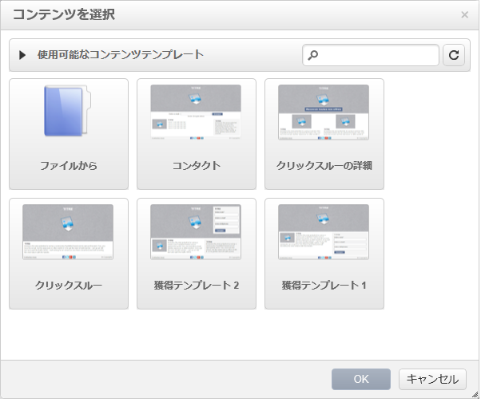

1. 使用する HTML ファイルを選択します。
1. 「**開く**」をクリックしてインポートを開始します。

   読み込み中、共有ファイルのリストが表示されます。インポートシステムは、選択した HTML にリンクされたすべてのファイル（CSS、画像など）があることを確認します。

   インポートが終了したら、「**[!UICONTROL 閉じる]**」ボタンをクリックします。

   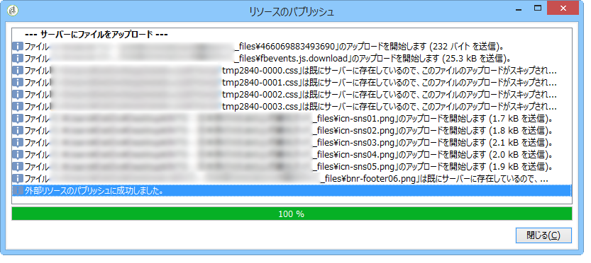

   >[!CAUTION]
   >
   >閉じる前に、「**[!UICONTROL 外部リソースのパブリッシュに成功しました。]**」というメッセージが表示されるまで待たなければなりません。

1. 「**[!UICONTROL プロパティ]**」タブをクリックします。
1. 各ページの&#x200B;**ラベル**&#x200B;を入力します（例：1 ページ目 = 収集、2 ページ目 = ありがとうございます）。

   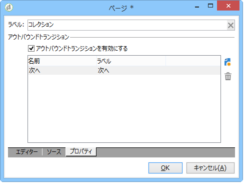

Web アプリケーションに挿入された各ページについて、これらの手順を適用します。

>[!CAUTION]
>
>**DCE は、読み込んだ HTML ページの JavaScript を実行します。** HTML テンプレートの JavaScript エラーは、Adobe Campaign インターフェイスに表示されることがあります。これらのエラーは、エディターとは関係ありません。インポートしたファイルにエラーがないことを確認するには、ファイルを DCE にインポートする前に、ブラウザー（Internet Explorer／Firefox／Chrome）でテストすることをお勧めします。

## 手順 2 - コンテンツの設定 {#step-2---configuring-the-content}

ここでは、インポートしたコンテンツを調整し、データベースのフィールドを Web ページのフォームにリンクします。前に作成した Web アプリケーションを次に示します。

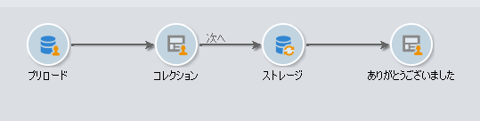

### コンテンツの修正 {#modifying-content}

最初に、ページの色を変更します。手順は次のとおりです。

1. **[!UICONTROL Collection]** ページを開きます。
1. 背景をクリックします。
1. 右側で「**背景色**」をクリックします。
1. 新しい背景色を選択します。
1. 「**OK**」をクリックして、変更を確定します。

   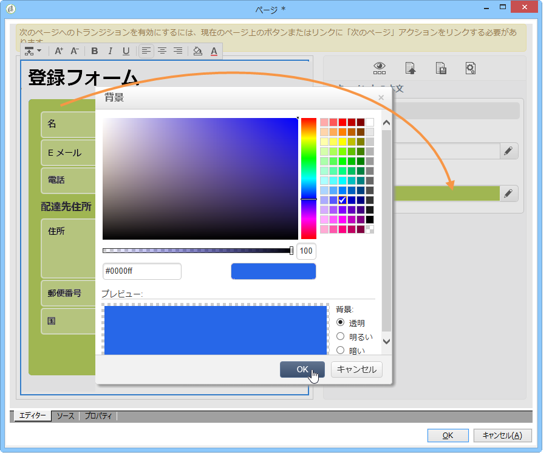

1. 同じ処理を適用して、ボタンの色を変更します。

   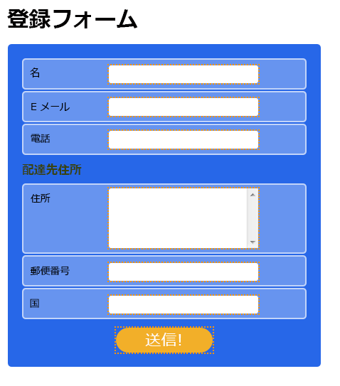

### フォームフィールドのリンク {#linking-form-fields}

提供された情報を保存するために、ページのフィールドをデータベースのフィールドにリンクします。

1. フォームフィールドを選択します。
1. エディターの右側で「**[!UICONTROL フィールド]**」セクションを編集します。
1. 選択したフィールドにリンクするデータベースフィールドを選択します。

   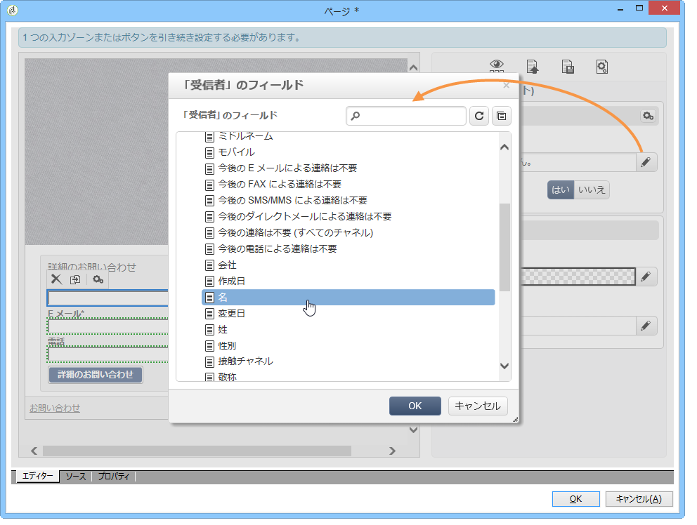

1. ページの各フィールドについて、この処理を繰り返します。

フィールドを必須にできます。例えば、「**[!UICONTROL E メール]**」フィールドをクリックして、「**必須**」オプションを有効にします。

### 次のページへのリンクの作成 {#creating-a-link-to-the-next-page}

この手順は必須です。これは、Web アプリケーションが次の手順の順序を決定できるためです。収集したデータをデータベースに保存し、次のページ（「**ありがとうございます**」ページ）を表示します。

1. **[!UICONTROL Collection]** ページの「**[!UICONTROL Send it!]**」ボタンを選択します。
1. **[!UICONTROL アクション]**&#x200B;ドロップダウンメニューをクリックします。
1. **[!UICONTROL 次のページ]**&#x200B;アクションを選択します。

   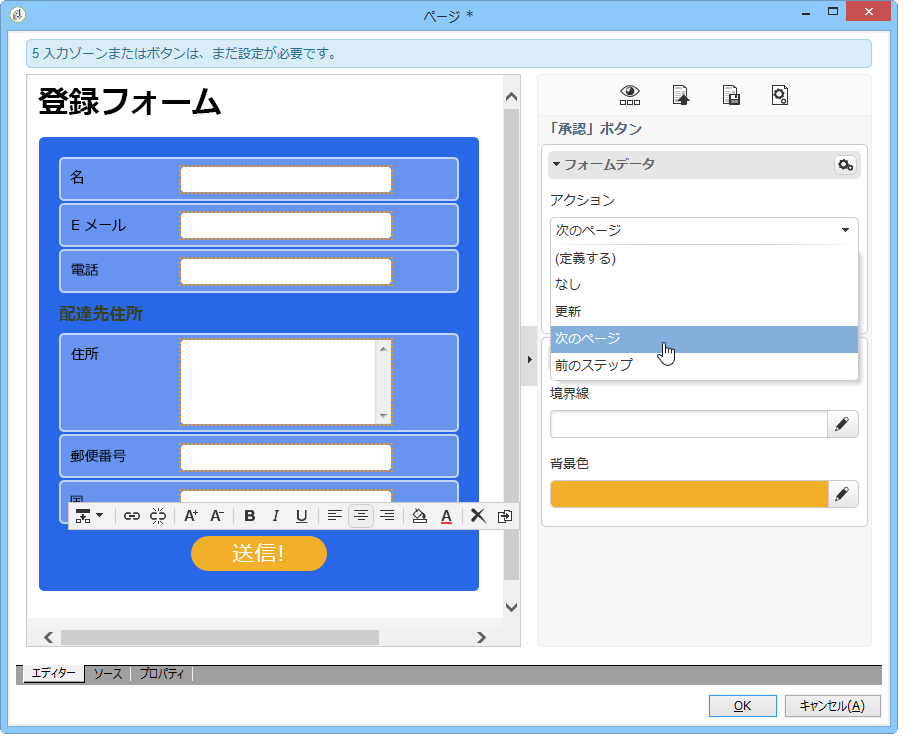

### パーソナライゼーションフィールドの挿入 {#inserting-a-personalization-field}

このステップでは、Thank you ページをパーソナライズします。手順は次のとおりです。

1. **[!UICONTROL Thank you]** ページを開きます。
1. テキスト領域の受信者の名を挿入する場所にマウスポインターを置きます。
1. ツールバーの&#x200B;**[!UICONTROL 挿入]**&#x200B;メニューで、「**[!UICONTROL パーソナライゼーションフィールド]**」を選択します。
1. 名を選択します。

   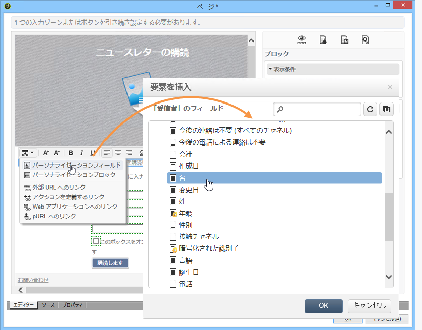

パーソナライゼーションフィールドは、エディターで黄色い背景で示されます。

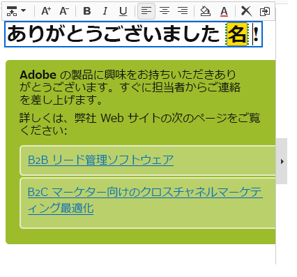

## 手順 3 - コンテンツのパブリッシュ {#step-3---publishing-content}

コンテンツは、Web アプリケーションダッシュボードからパブリッシュされます。「**[!UICONTROL パブリッシュ]**」ボタンをクリックして、実行します。

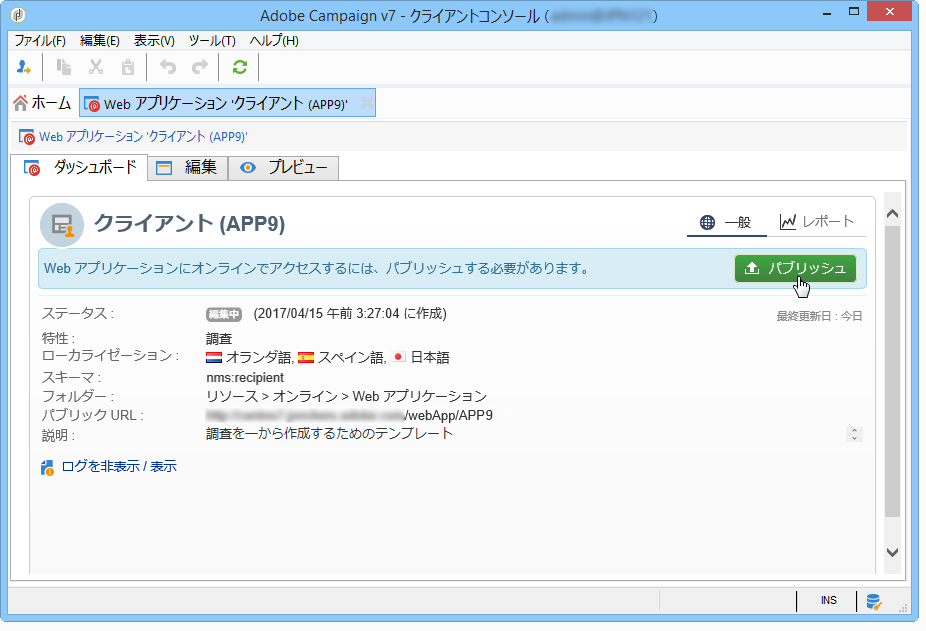

パブリッシュ中に、ログが表示されます。パブリッシュシステムは、Web アプリケーションで見つかったすべてのコンテンツを分析します。

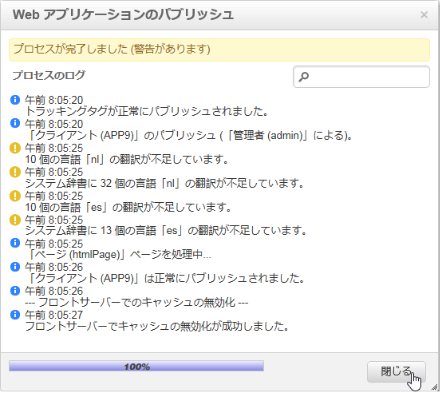

>[!NOTE]
>
>パブリッシュログでは、警告およびエラーがアクティビティごとに並べ替えられます。

これで、フォームが使用できます。フォームの URL は、アプリケーションダッシュボードでアクセスでき、受信者に送信できます。
