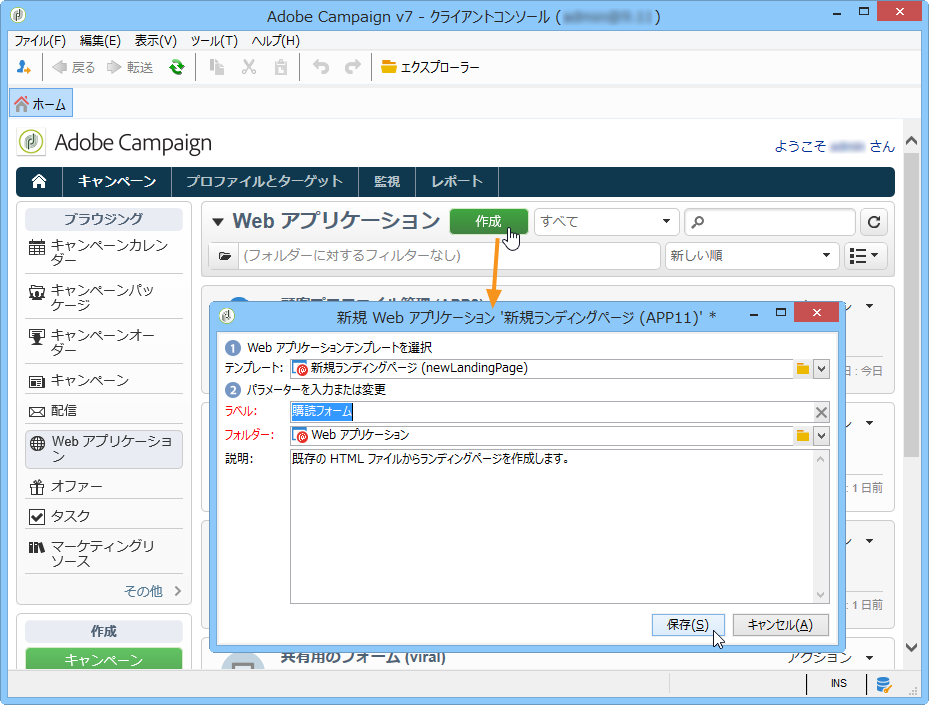

# ランディングページの作成{#creating-a-landing-page}

## ランディングページの作成について {#about-landing-pages-creation}

この使用例では、Adobe Campaign コンソールからランディングページを作成するためのデジタルコンテンツエディターの使用方法を示します。

Adobe Campaign でランディングページの設定を開始する前に、HTML ページに表示する **1 つ以上のテンプレート**&#x200B;があることを確認します。

この使用例の主な目的は、DCE の機能を使用して、ランディングページフォームフィールドを Adobe Campaign の内部フィールドに対応させることです。

## ランディングページの作成 {#creating-the-landing-page}

新しいランディングページタイプの Web アプリケーションを作成するには、次の手順を実行します。

1. タブに移動し、 **[!UICONTROL Campaigns]** リンクをクリックし **[!UICONTROL Web application]** て、ボタンをクリックし **[!UICONTROL Create]** ます。
1. テンプレート **[!UICONTROL New landing page]** を選択してラベルを入力し、をクリックしま **[!UICONTROL Save]**&#x200B;す。

   

1. タブをクリック **[!UICONTROL Edit]** します。
1. **終了**&#x200B;アクティビティを削除します。
1. アクティビティの **[!UICONTROL Page]** 後にアクティビティを追 **[!UICONTROL Storage]** 加します。
1. ページ2アクテ **ィビティを編集** し、タブのオ **[!UICONTROL Activate outbound transitions]** プションのチェックを **[!UICONTROL Properties]** 外します。

   

1. 変更を保存します。

その後、次のシーケンスが取得されます。

>[!NOTE]
>
>Web アプリケーションの作成について詳しくは、[この節](../../web/using/creating-a-new-web-application.md)を参照してください。

## 手順 1 - テンプレートの選択と読み込み {#step-1---selecting-and-loading-templates}

ここでは、Web アプリケーションの各ページの **HTML コンテンツのインポート**&#x200B;方法について見ていきます。

テンプレートには、次が含まれている必要があります。

* **HTML** ファイル（必須）
* 1 つ以上の **CSS** ファイル（オプション）
* 1 つ以上の&#x200B;**画像**（オプション）

テンプレートを最初のページに読み込むには、次の手順に従います。

1. Open the first **[!UICONTROL Page]** activity of the Web application.
1. コンテンツテ **[!UICONTROL From a file]** ンプレートを取得する場合に選択します。

   

1. 使用する HTML ファイルを選択します。
1. 「**開く**」をクリックしてインポートを開始します。

   読み込み中、共有ファイルのリストが表示されます。インポートシステムは、選択した HTML にリンクされたすべてのファイル（CSS、画像など）があることを確認します。

   Click the **[!UICONTROL Close]** button once the import has finished.

   

   >[!CAUTION]
   >
   >閉じる前に、次のメッセージが表示されるまで待つ必要があります。 **[!UICONTROL The external resources have been successfully published]** .

1. タブをクリック **[!UICONTROL Properties]** します。
1. 各ページ **のラベル** (例：1ページ目=収集、2ページ目=ありがとうございます)。

   

Web アプリケーションに挿入された各ページについて、これらの手順を適用します。

>[!CAUTION]
>
>**DCE は、読み込んだ HTML ページの JavaScript を実行します。** HTML テンプレートの JavaScript エラーは、Adobe Campaign インターフェイスに表示されることがあります。これらのエラーは、エディターとは関係ありません。インポートしたファイルにエラーがないことを確認するには、ファイルを DCE にインポートする前に、ブラウザー（Internet Explorer／Firefox／Chrome）でテストすることをお勧めします。

## 手順 2 - コンテンツの設定 {#step-2---configuring-the-content}

ここでは、インポートしたコンテンツを調整し、データベースのフィールドを Web ページのフォームにリンクします。前に作成した Web アプリケーションを次に示します。

### コンテンツの修正 {#modifying-content}

最初に、ページの色を変更します。手順は次のとおりです。

1. Open the **[!UICONTROL Collection]** page.
1. 背景をクリックします。
1. 右側で「**背景色**」をクリックします。
1. 新しい背景色を選択します。
1. 「**OK**」をクリックして、変更を確定します。

   

1. 同じ処理を適用して、ボタンの色を変更します。

   

### フォームフィールドのリンク {#linking-form-fields}

提供された情報を保存するために、ページのフィールドをデータベースのフィールドにリンクします。

1. フォームフィールドを選択します。
1. Edit the **[!UICONTROL Field]** section on right-hand side of the editor.
1. 選択したフィールドにリンクするデータベースフィールドを選択します。

   

1. ページの各フィールドについて、この処理を繰り返します。

You can make a field mandatory: for example, click the **[!UICONTROL Email]** field then enable the **Mandatory** option.

### 次のページへのリンクの作成 {#creating-a-link-to-the-next-page}

この手順は必須です。これは、Webアプリケーションが次の手順の順序を決定できるためです。収集したデータをデータベースに保存し、次のページを表示します(**「ありがとう** 」ページ)。

1. Select the **[!UICONTROL Send it!]** button of the **[!UICONTROL Collection]** page.
1. Click the **[!UICONTROL Action]** drop-down menu.
1. アクションを選 **[!UICONTROL Next page]** 択します。

   

### パーソナライゼーションフィールドの挿入 {#inserting-a-personalization-field}

このステップでは、Thank you ページをパーソナライズします。手順は次のとおりです。

1. Open the **[!UICONTROL Thank you]** page.
1. テキスト領域の受信者の名を挿入する場所にマウスポインターを置きます。
1. ツール **[!UICONTROL Personalization field]** バーのメ **[!UICONTROL Insert]** ニューでを選択します。
1. 名を選択します。

   

パーソナライゼーションフィールドは、エディターで黄色い背景で示されます。

## 手順 3 - コンテンツのパブリッシュ {#step-3---publishing-content}

コンテンツは、Web アプリケーションダッシュボードからパブリッシュされます。Click the **[!UICONTROL Publish]** button to run it.

パブリッシュ中に、ログが表示されます。パブリッシュシステムは、Web アプリケーションで見つかったすべてのコンテンツを分析します。

>[!NOTE]
>
>パブリッシュログでは、警告およびエラーがアクティビティごとに並べ替えられます。

これで、フォームが使用できます。フォームの URL は、アプリケーションダッシュボードでアクセスでき、受信者に送信できます。
