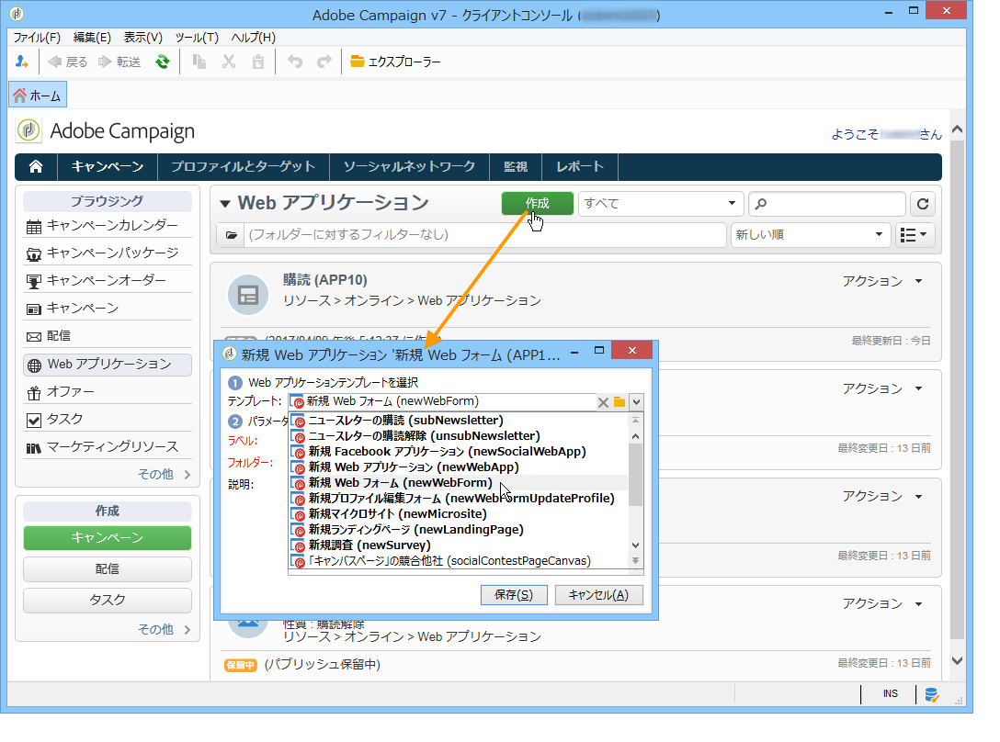

# 新しい Web アプリケーションの作成{#creating-a-new-web-application}

作成時に Web アプリケーションの種類が選択されます。

「キャンペーン」タブ **に移動し** 、メニューを選択 **[!UICONTROL Web Applications]** します。 ボタンをクリッ **[!UICONTROL Create]** クします。 使用する Web アプリケーションテンプレートを選択します。

このテンプレートにより、Web アプリケーションの種類が決まります。以下を作成できます。

1. Web フォーム（+ プロファイル変更）

   入力フィールドや選択フィールドを備えた Web ページを作成できます。ユーザーが入力した情報は Adobe Campaign データベースに格納できます。詳しくは、[Web フォーム](../../web/using/about-web-forms.md)を参照してください。

1. Web アプリケーション

   Web プラットフォームやエクストラネットなどに公開する Web アプリケーションを作成できます。これにより、データの編集や情報の記録を Adobe Campaign 内でおこなえるようになります。その際、アクセス制御を適用して認証済みユーザーのみがアクセスできるようにしたり、様々な条件に基づいてデータをあらかじめ読み込む機能を設定したりできます。詳しくは、[この節](../../web/using/about-web-applications.md)を参照してください。

1. ランディングページ

   ランディングページは、Web サイト上でコンテンツを利用できる HTML ページで、Adobe Campaign データベースプロファイルに保存される情報をユーザーから受け付けるための場になります。この種のページのコンテンツは、通常は専門の Web 業者によって制作されます。制作されたコンテンツが Adobe Campaign にインポートされ、公開、管理、フォローアップがおこなわれます。詳しくは、[このページ](../../web/using/creating-a-landing-page.md)を参照してください。

1. 調査

   **調査マネージャー**&#x200B;オプションを使用すると、Adobe Campaign でオンライン調査を設計および管理して、結果を処理することができます。動的なフィールド作成、スコア管理、回答および専用レポートのエクスポートなどをおこなうことができます。詳しくは、[この節](../../web/using/about-surveys.md)を参照してください。

   >[!CAUTION]
   >
   >**調査マネージャー**&#x200B;は、オプションの Adobe Campaign モジュールです。使用許諾契約書を確認してください。

1. Facebook アプリケーション

   **Social Marketing** オプションを使用すると、Adobe Campaign で Facebook アプリケーションの個人用コンテンツを公開できます。詳しくは、[この節](../../social/using/about-social-marketing.md)を参照してください。

   >[!CAUTION]
   >
   >**Social Marketing** は、オプションの Adobe Campaign モジュールです。使用許諾契約書を確認してください。

ページ設定モードおよび利用可能な設定は、いくつかの Web アプリケーションの種類で同一です。詳しくは、[この節](../../web/using/about-web-forms.md)を参照してください。
