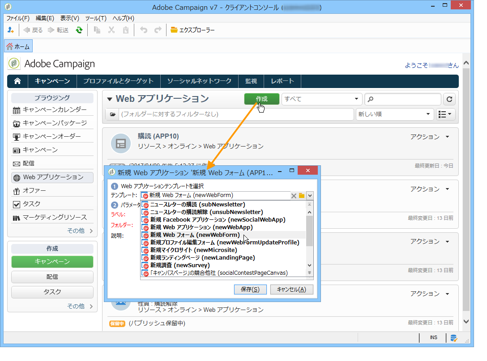

# Web アプリケーションの新規作成{#creating-a-new-web-application}

作成時に web アプリケーションタイプが選択されます。

「**キャンペーン**」タブに移動し、**[!UICONTROL web アプリケーション]**&#x200B;メニューを選択します。 「**[!UICONTROL 作成]**」ボタンをクリックします。 使用する web アプリケーションテンプレートを選択します。

>[!NOTE]
>
>個人情報を含む可能性のあるページは常に保護してください。 [セキュリティおよびプライバシーチェックリスト](https://helpx.adobe.com/jp/campaign/kb/acc-security.html#privacy)を参照してください。

このテンプレートにより、web アプリケーションタイプが決まります。 以下を作成できます。

1. web フォーム（+ プロファイル変更）

   入力フィールドや選択フィールドを備えた web ページを作成できます。ユーザーが入力した情報は Adobe Campaign データベースに格納できます。 詳しくは、[web フォーム](about-web-forms.md)を参照してください。

1. web アプリケーション

   web プラットフォームやエクストラネットなどに公開する web アプリケーションを作成できます。 これにより、データの編集や情報の記録を Adobe Campaign 内でおこなえるようになります。 その際、アクセス制御を適用して認証済みユーザーのみがアクセスできるようにしたり、様々な条件に基づいてデータをあらかじめ読み込む機能を設定したりできます。 詳しくは、[この節](about-web-applications.md)を参照してください。

1. ランディングページ

   ランディングページは、web サイト上でコンテンツを利用できる HTML ページで、Adobe Campaign データベースプロファイルに保存される情報をユーザーから受け付けるための場になります。 この種のページのコンテンツは、通常は専門の web 業者によって制作されます。制作されたコンテンツが Adobe Campaign にインポートされ、公開、管理、フォローアップがおこなわれます。 詳しくは、[このページ](creating-a-landing-page.md)を参照してください。

1. 調査

   **調査マネージャー**&#x200B;オプションを使用すると、Adobe Campaign でオンライン調査を設計および管理して、結果を処理することができます。動的なフィールド作成、スコア管理、回答および専用レポートのエクスポートなどをおこなうことができます。 詳しくは、[この節](../../surveys/using/about-surveys.md)を参照してください。

   >[!CAUTION]
   >
   >**調査マネージャー**&#x200B;は、オプションの Adobe Campaign モジュールです。 使用許諾契約書を確認してください。

1. Facebook アプリケーション

   **Social Marketing** オプションを使用すると、Adobe Campaign で Facebook アプリケーションの個人用コンテンツを公開できます。 詳しくは、[この節](../../social/using/about-social-marketing.md)を参照してください。

   >[!CAUTION]
   >
   >**Social Marketing** は、オプションの Adobe Campaign モジュールです。 使用許諾契約書を確認してください。

ページ設定モードおよび利用可能な設定は、いくつかの web アプリケーションタイプで同一です。 詳しくは、[この節](about-web-forms.md)を参照してください。
