# Web フォームレイアウトの定義{#defining-web-forms-layout}

## コンテナの作成 {#creating-containers}

コンテナを使用すると、ページのフィールドを組み合わせたり、レイアウトを設定したりして、ページの要素を整理できます。

For each page of the form, containers are created via the **[!UICONTROL Containers]** button of the toolbar.

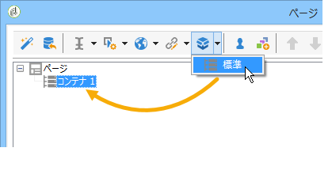

コンテナを使用して、最終レンダリングにラベルを追加せずに、ページの要素をグループ化します。要素は、コンテナサブツリーにグループ化されます。標準コンテナを使用すると、レイアウトを管理できます。

次に例を示します。

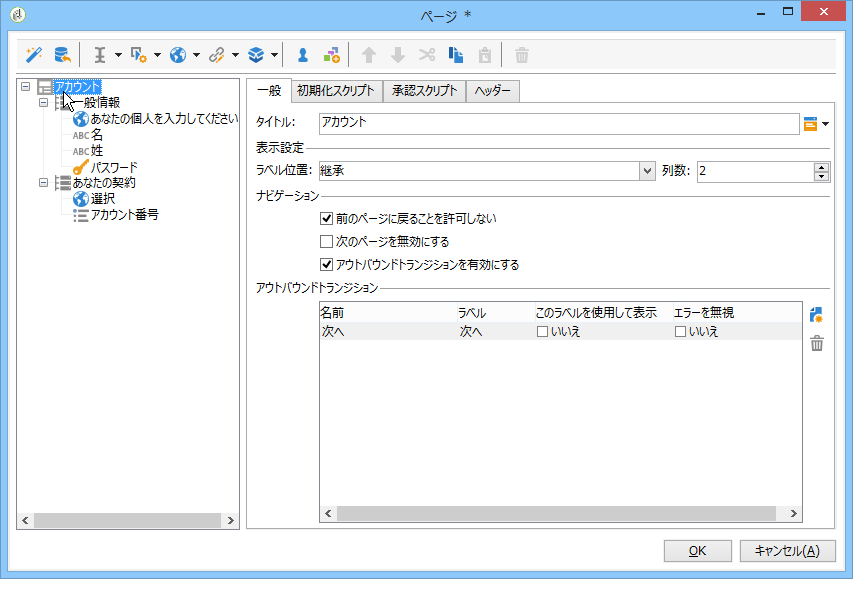

ラベルの位置は、階層のコンテナの下に配置された要素に適用されます。必要に応じて、各要素についてオーバーロードできます。列を追加または削除して、レイアウトを変更します。See [Positioning the fields on the page](#positioning-the-fields-on-the-page).

上記の例では、レンダリングは次のようになります。

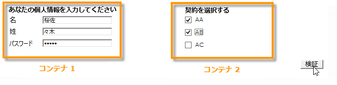

## ページへのフィールドの配置 {#positioning-the-fields-on-the-page}

Web フォームのレイアウトは、各コンテナのページごとに定義され、各チェックに対してオーバーロードできます。

ページは列に分類されます。各ページには、一定数の列が含まれます。ページの各フィールドは、**n** 個のセルを占有します。また、コンテナは一定数の列を占有し、それに含まれるフィールドは一定数のセルを占有します。

デフォルトでは、ページは単一の列で構築され、各要素が 1 つのセルを占有します。これは、次に示すように、フィールドが別のフィールドの下に表示され、各フィールドが行全体を占めることを意味します。

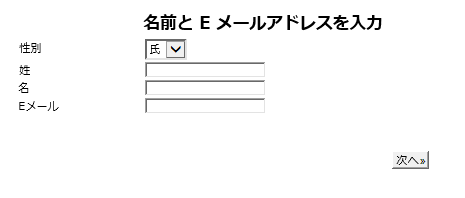

次の例では、デフォルトの設定が維持されています。ページは、4 つのコンテナを含む単一の列を占有します。

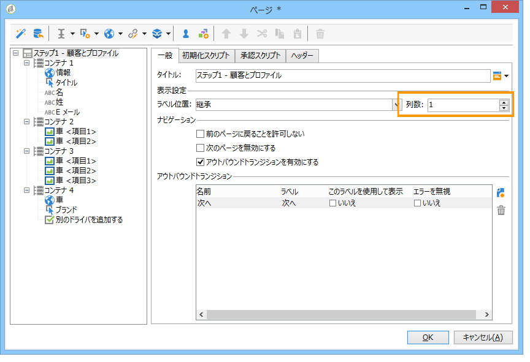

各コンテナは 1 列を占有し、各要素は 1 つのセルを占有します。

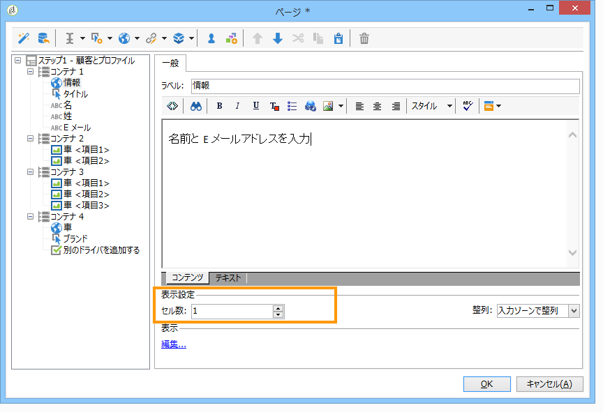

レンダリングは次のようになります。

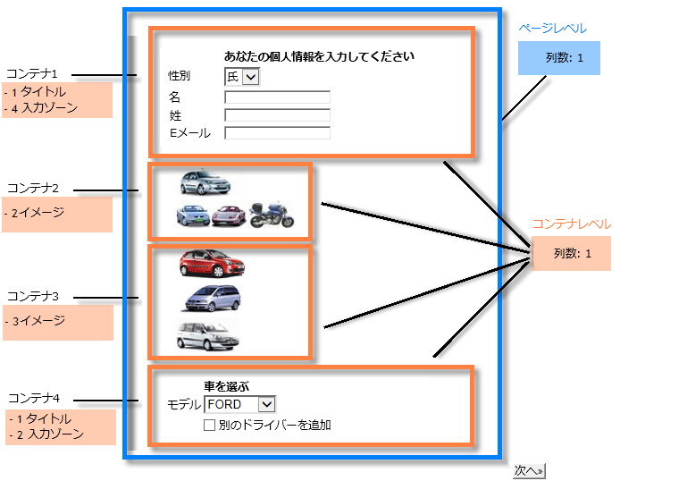

表示パラメーターを適応させて、次のようなレンダリングを取得できます。

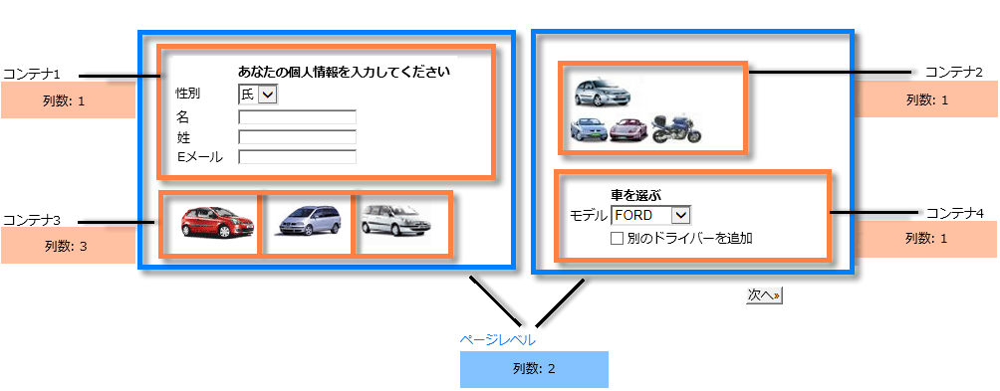

このレンダリングの例では、各入力フィールド、タイトルおよび画像は、コンテナの列の 1 つのセルを占有します。

各コンテナの書式設定を修正できます。この例では、コンテナ 4 のコンテンツを 2 列に広げて、要素を分配します。

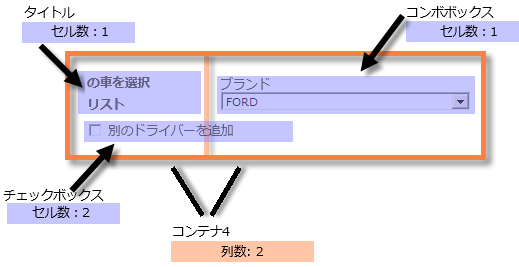

タイトルとリストは、それぞれ 1 つのセル（つまりコンテナの行全体）を占有し、チェックボックスは 2 つのセルをまたがっています。The number of cells attributed to the input field is defined in the **[!UICONTROL General]** tab or the **[!UICONTROL Advanced]** tab, according to the type of field:

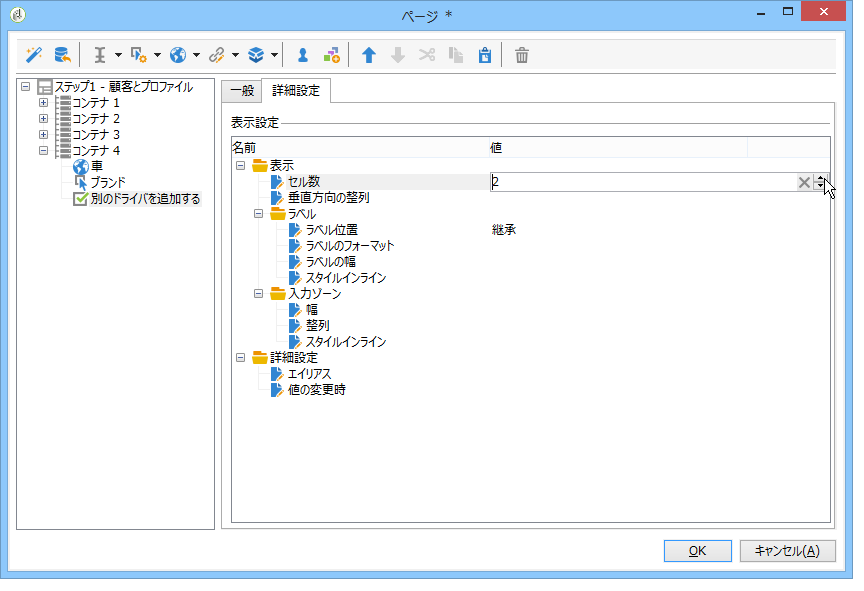

## ラベルの位置の定義 {#defining-the-position-of-labels}

フォームのフィールドおよびラベルの整列を定義できます。

デフォルトでは、ページのフィールドおよびその他のコンテンツの表示パラメーターは、フォームの全般設定、ページの設定、または存在する場合は親コンテナの設定から継承されます。

フォーム全体のグローバルな表示パラメーターは、フォームプロパティボックスで指定されます。The **[!UICONTROL Rendering]** tab lets you select the position of labels.

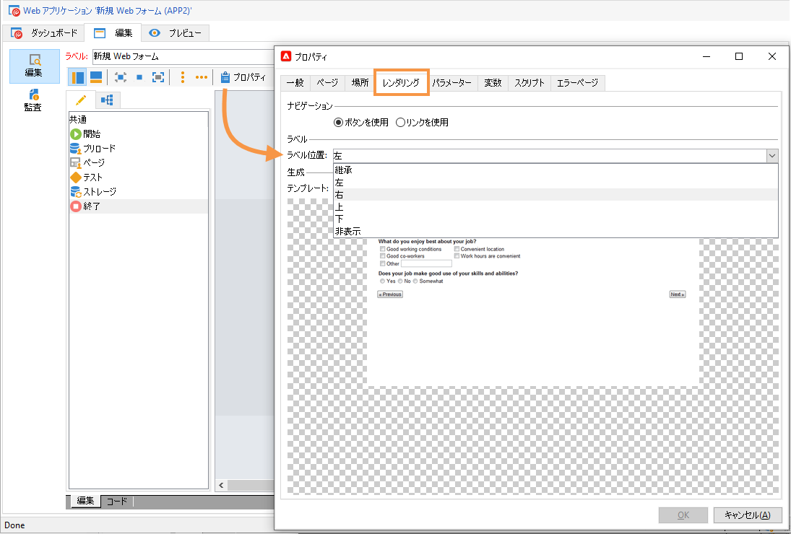

This position can be overloaded for each page, each container, and each field, via the **[!UICONTROL Advanced]** tab.

次の整列がサポートされます。

* 継承：整列は、親要素（デフォルト値）つまり親コンテナ（ある場合）、またはページのその他から継承されます。
* 左／右：ラベルはフィールドの右または左に配置されます。
* 上／下：ラベルはフィールドの上または下に配置されます。
* 非表示：ラベルは表示されません。

