# Web フォームページの順番の定義{#defining-web-forms-page-sequencing}

フォームには、1 つ以上のページを含めることができます。フォームは、ページとテスト、スクリプト実行およびページジャンプを記録するステージを並べることができるダイアグラムを使用して構築されます。ダイアグラム設定モードは、ワークフローの場合と同じです。

## 前のページと次のページについて {#about-previous-page-and-next-page}

各ページで、「**[!UICONTROL 次へ]**」または「**[!UICONTROL 前へ]**」ボタンを削除できます。これをおこなうには、関連するページを選択し、「**[!UICONTROL 次のページを無効にする]**」または「**[!UICONTROL 前のページに戻ることを許可しない]**」オプションを選択します。

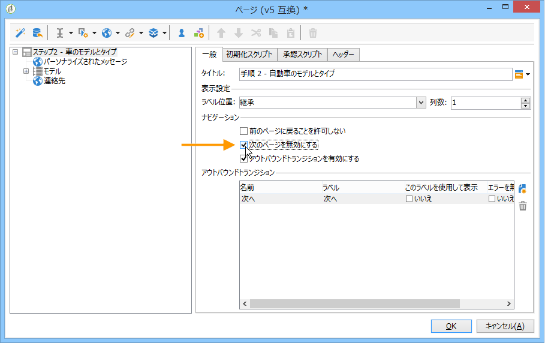

これらのボタンをリンクに置き換えることができます。[HTML コンテンツの挿入](../../web/using/static-elements-in-a-web-form.md#inserting-html-content)を参照してください。

## ジャンプの挿入 {#inserting-a-jump}

**[!UICONTROL ジャンプ]**&#x200B;オブジェクトを使用すると、ユーザーが「**[!UICONTROL 次へ]**」をクリックする場合に、別のページまたは別のフォームにアクセスできます。

次のジャンプ先を設定できます。

* フォームの別のページ。これをおこなうには、次のように、「**[!UICONTROL 内部アクティビティ]**」を選択し、目的のページを指定します。

   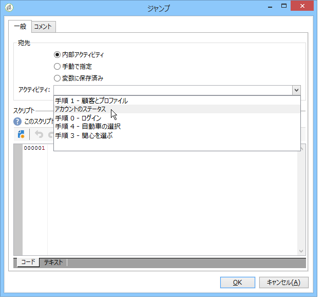

* 別のフォーム。これをおこなうには、「**[!UICONTROL 手動で指定]**」オプションを選択し、ジャンプ先のフォームを指定します。

   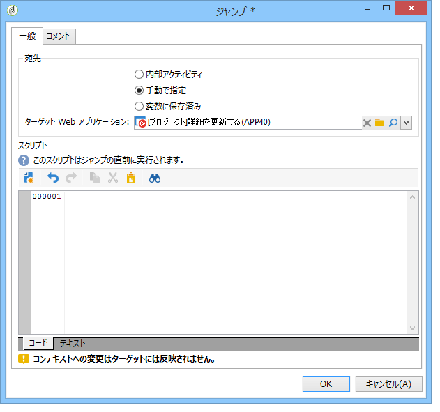

* ジャンプ先は変数に格納できます。この場合、次に示すように、ドロップダウンリストから選択します。

   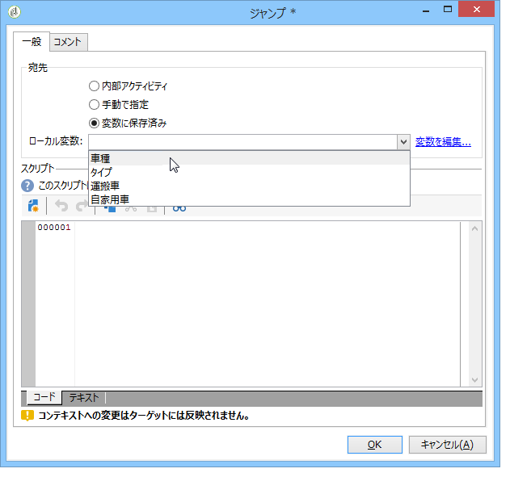

* 「**[!UICONTROL コメント]**」タブを使用すると、オペレーターがダイアグラムのオブジェクトをクリックする際に表示される情報を入力できます。

   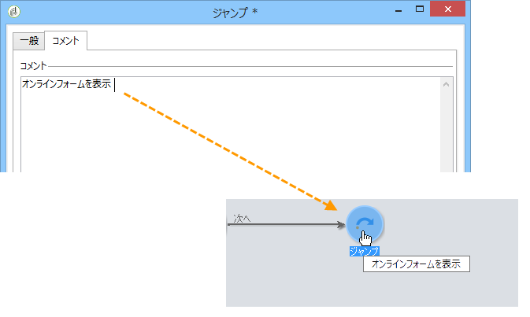

## 例：URL のパラメーターに基づいた別のフォームへのアクセス {#example--accessing-another-form-according-to-a-parameter-of-the-url}

次の例では、承認の際に URL のパラメーターによって指定された別のフォームを表示する Web フォームを設定します。それには、次の手順に従います。

1. フォームの最後にジャンプを挿入します。これには、**[!UICONTROL 終了]**&#x200B;ボックスを置き換えます。

   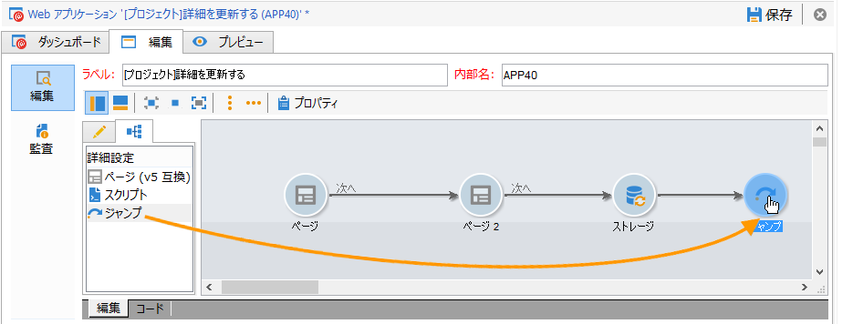

1. フォームプロパティで、ローカル変数（**next**）に格納されたパラメーター（**next**）を追加します。ローカル変数について詳しくは、[ローカル変数へのデータの格納](../../web/using/web-forms-answers.md#storing-data-in-a-local-variable)で説明しています。

   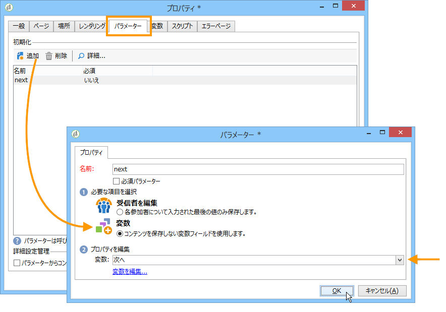

1. **[!UICONTROL ジャンプ]**&#x200B;オブジェクトを編集し、「**[!UICONTROL 変数に保存済み]**」オプションを選択して、ドロップダウンボックスから **next** 変数を選択します。

   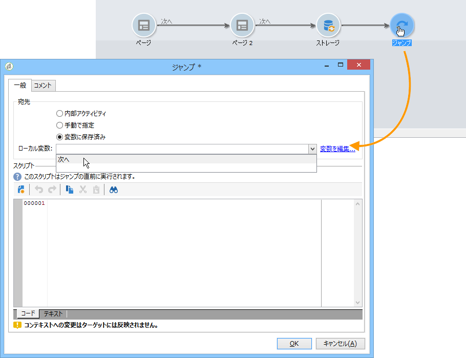

1. 配信 URL には、次のような、宛先のフォームの内部名を含める必要があります。

   ```
   https://[myserver]/webForm/APP62?&next=APP22
   ```

   ユーザーが「**[!UICONTROL 承認]**」ボタンをクリックしたら、フォーム **APP22** が表示されます。

## フォームの別のページへのリンクの挿入 {#inserting-a-link-to-another-page-of-the-form}

フォームの別のページへのリンクを挿入できます。これをおこなうには、**[!UICONTROL リンク]**&#x200B;タイプの静的要素をページに追加します。詳しくは、[リンクの挿入](../../web/using/static-elements-in-a-web-form.md#inserting-a-link)を参照してください。

## 条件付きページ表示 {#conditional-page-display}

### 回答に基づいて表示 {#display-based-on-responses}

**[!UICONTROL テスト]**&#x200B;ボックスを使用すると、フォームのページの順番に条件を設定できます。テスト結果に応じた様々な分岐線を定義できますこれにより、ユーザーが提供する回答に応じて異なるページを表示できます。

例えば、既にオンラインで注文した顧客に異なるページを表示したり、10 を超える注文をした顧客に別のページを表示したりできます。これをおこなうには、フォームの最初のページで、ユーザーがこれまでにおこなった注文数を提示するために、**[!UICONTROL 数値]**&#x200B;タイプの入力フィールドを挿入します。

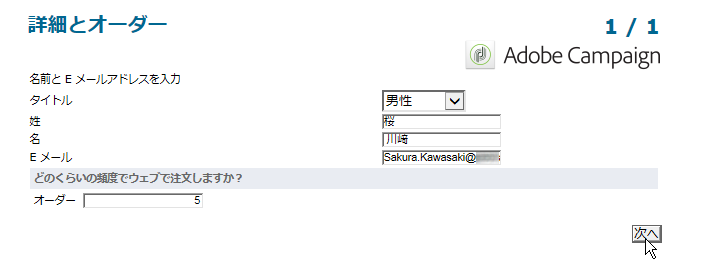

この情報をデータベースのフィールドに格納するか、ローカル変数を使用できます。

>[!NOTE]
>
>ストレージモードについて詳しくは、[回答ストレージフィールド](../../web/using/web-forms-answers.md#response-storage-fields)で説明しています。

この例では、変数を使用します。

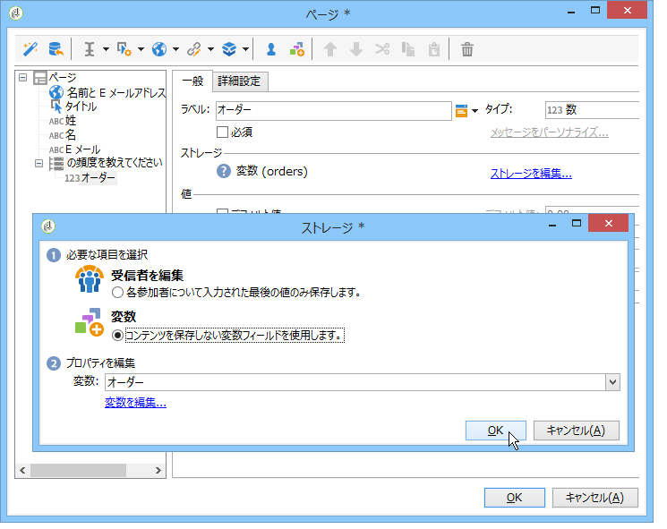

フォームのダイアグラムで、条件を定義するためにテストボックスを挿入します。各条件について、テストボックスの出力時に、新しい分岐が追加されます。

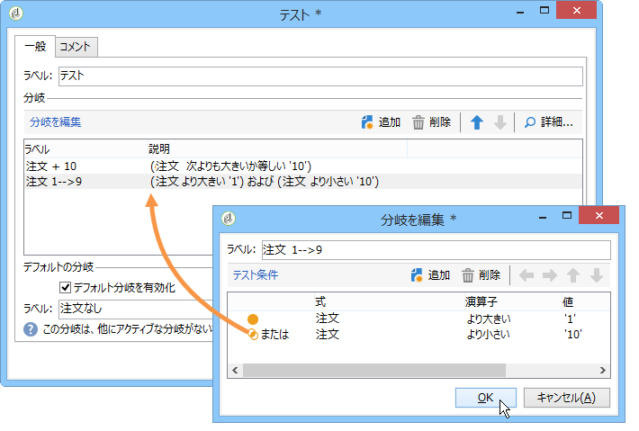

「**[!UICONTROL デフォルト分岐を有効化]**」オプションを選択して、どの条件も true でない場合のためのトランジションを追加します。このオプションは、定義した条件によってすべての可能性がカバーされている場合は、不要です。

次に、例えば次のように、いずれかの条件が true である場合のページの順番を定義します。

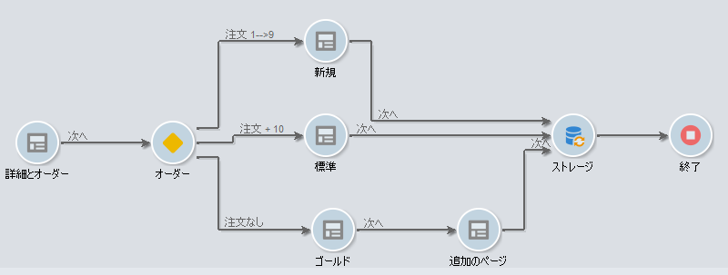

### パラメーターに基づいて表示 {#display-based-on-parameters}

また、Web フォームの初期化パラメーターに応じて、またはデータベースに格納された値に応じて、ページの順番をパーソナライズできます。[フォーム URL パラメーター](../../web/using/defining-web-forms-properties.md#form-url-parameters)を参照してください。

## スクリプトの追加 {#adding-scripts}

**[!UICONTROL スクリプト]**&#x200B;オブジェクトを使用すると、JavaScript のスクリプトを直接入力して、例えば、フィールドの値を修正したり、データベースからデータを取得したり、Adobe Campaign API を呼び出したりすることができます。

## 終了ページのパーソナライズ {#personalizing-the-end-page}

終了ページをダイアグラム最後に配置する必要があります。終了ページは、ユーザーが Web フォームの「**[!UICONTROL 承認]**」ボタンをクリックすると表示されます。

このページをパーソナライズするには、「**[!UICONTROL 終了]**」をダブルクリックして、中央のエディターにページのコンテンツを入力します。

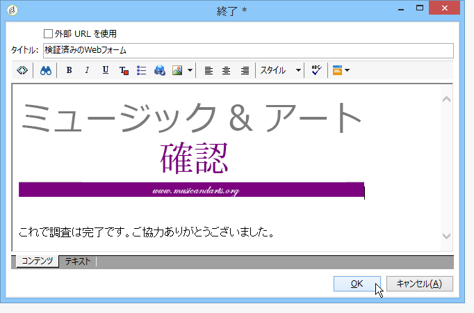

* 既存の HTML コンテンツをコピー＆ペーストできます。これをおこなうには、**[!UICONTROL ソースコードを表示]**&#x200B;をクリックして、HTML コードを挿入します。
* 外部 URL を使用できます。これをおこなうには、対応するオプションを選択し、表示するページの URL を入力します。

