# Web フォームプロパティの定義{#defining-web-forms-properties}

Web フォームでは、独自の要件を満たすための設定やパーソナライズを完全におこなうことができます。パラメーターは、プロパティウィンドウで入力する必要があります。

The properties window is accessible via the **[!UICONTROL Properties]** button in the toolbar of the Web form. このウィンドウを使用すると、Web フォームに特有の様々な設定にアクセスできます。一部の設定は、テンプレートの設定に由来することがあります。

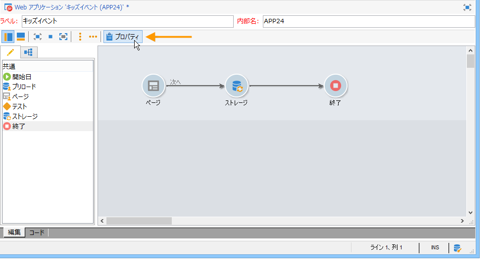

## 全般的なフォームプロパティ {#overall-form-properties}

In the **[!UICONTROL General]** tab of the properties window, you can modify the **Label** of the form. **内部名**&#x200B;は変更しないことを強くお勧めします。

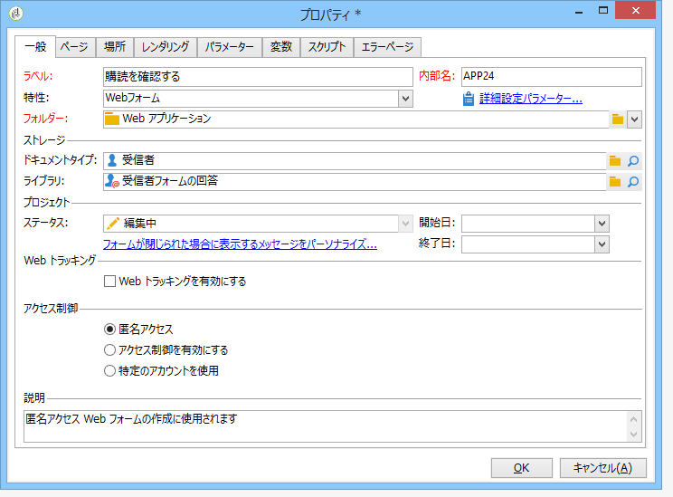

フォームテンプレートは、フォームの作成中に選択されます。後から変更することはできません。フォームテンプレートの作成と管理の詳細については、「Webフォームテンプ [レートの使用」を参照してくださ](../../web/using/using-a-web-form-template.md)い。

## フォームデータストレージ {#form-data-storage}

Web フォームのフィールドは、デフォルトで、受信者テーブルに格納されます。You can change the table used by selecting a new table from the **[!UICONTROL Document type]** field. The **[!UICONTROL Zoom]** icon lets you view the content of the selected table.

デフォルトでは、回答はテーブルに保存され **[!UICONTROL Answer to a recipient form]** ます。

## エラーページの設定 {#setting-up-an-error-page}

エラーページを設定できます。このページは、フォーム実行中にエラーが発生した場合に表示されます。

エラーページは、フォームプロパティウィンドウの対応するタブで定義されます。

デフォルトでは、次の情報が表示されます。

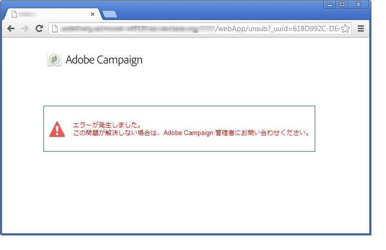

The content of the strings displayed is defined in the **[!UICONTROL Error page]** tab of the properties window. The **[!UICONTROL HTML]** tab displays the rendering and the **[!UICONTROL Texts]** tab lets you modify the text strings and add some text if necessary:

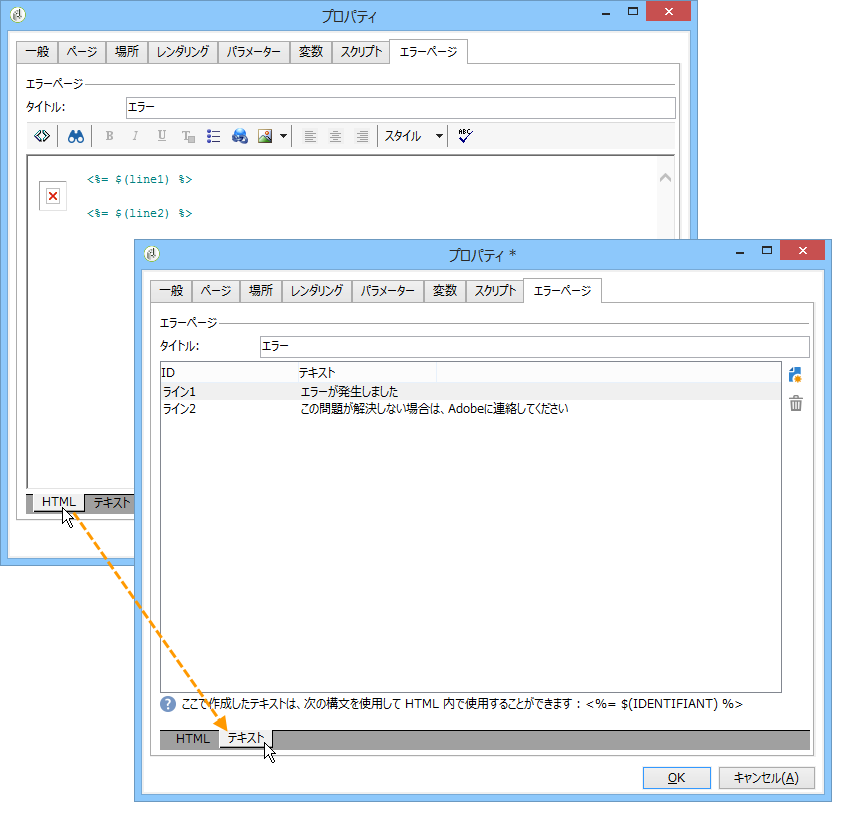

## フォームのローカライゼーション {#form-localization}

The **[!UICONTROL Localization]** tab lets you select the design and display languages for the Web form.

See [Translating a web form](../../web/using/translating-a-web-form.md).

## フォームのブラウジングとレンダリング {#form-browsing-and-rendering}

The **[!UICONTROL Rendering]** tab lets you define the type of browsing between pages of the Web form and the rendering template used.

リンクまたはボタンを使用したナビゲートを選択できます。

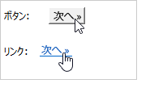

ボタンは、デフォルトのナビゲーション要素です。次の操作を実行できます。

* Approve the current page and display the next page by clicking **[!UICONTROL Next]**. このボタンは、最後を除くすべてのページに表示されます。
* Display the previous page by clicking **[!UICONTROL Previous]**. このボタンは、最初を除くすべてのページに表示されます。
* Save the form responses by clicking the **[!UICONTROL Approve]** button. このボタンは、最後のページにのみ表示されます。

これらの要素は、各ページの下部に表示されます。位置は変更できます。これをおこなうには、スタイルシートを修正する必要があります。

>[!NOTE]
>
>It&#39;s possible to hide the **[!UICONTROL Previous]** button on some pages. これを行うには、関連ページに移動し、オプションをオンにし **[!UICONTROL Disallow returning to the previous page]** ます。 このオプションは、ページツリーのルートが選択されている場合にアクセスできます。

The **[!UICONTROL Template]** field of the **[!UICONTROL Rendering]** tab lets you select a theme from those available.

テーマはツリーのノ **[!UICONTROL Administration>Configuration>Form rendering]** ードに保存されます。 See [Selecting the form rendering template](../../web/using/form-rendering.md#selecting-the-form-rendering-template)

プロパティウィンドウの下の部分にレンダリングのサンプルが表示されます。The **[!UICONTROL Edit link]** icon lets you view the configuration for the selected theme.

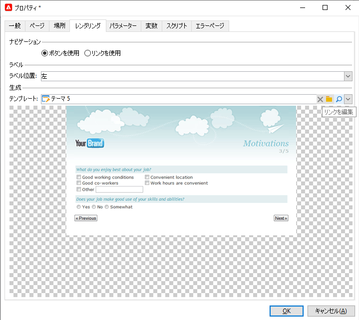

## フォームのテキスト {#texts-in-the-form}

The **[!UICONTROL Page]** tab lets you define the content of the form header and footer. See [Defining headers and footers](../../web/using/form-rendering.md#defining-headers-and-footers).

また、翻訳も管理できます。See [Translating a web form](../../web/using/translating-a-web-form.md).

## フォームのアクセシビリティ {#accessibility-of-the-form}

A Web form is accessible to users if it is **[!UICONTROL Online]** and if the current date is within its validity period. The status of the form is modified during the publication stage (see [Publishing a form](../../web/using/publishing-a-web-form.md#publishing-a-form)). The status is displayed in the **Project** section of the **[!UICONTROL General]** tab of the properties window.

有効期間は日付から日付ま **[!UICONTROL Start]** で実行されます **[!UICONTROL End date]**。 これらのフィールドに日付が指定されていない場合、フォームは永続的に有効です。

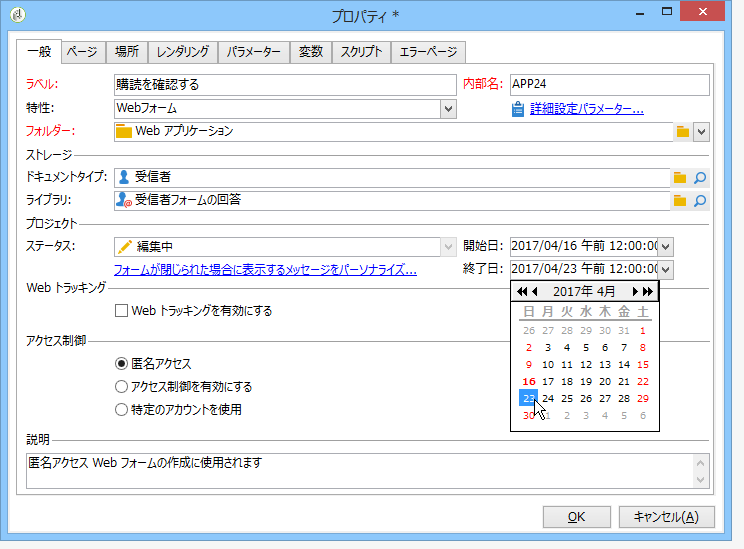

>[!NOTE]
>
>フォームが閉じられて、結果として有効期限に到達しない場合または期限が切れた場合、または Adobe Campaign オペレーターによって閉じられた場合、ユーザーがアクセスしようとするとメッセージが表示されます。このメッセージは、をクリックしてパーソナライズできま **[!UICONTROL Personalize the message displayed if the form is closed...]**&#x200B;す。

## フォームのアクセス制御 {#form-access-control}

デフォルトでは、Web フォームへのアクセスは、匿名モードで実行されます。フォームにアクセスするすべてのオペレーターに WebApp オペレーター権限が割り当てられます。

例えば、イントラネットサイトにフォームを配信する際に、ユーザーを認証するために、フォームの表示に対するアクセス制限を有効にできます。To do this, display the **[!UICONTROL Properties]** window of the concerned form and click the **[!UICONTROL Enable access control]** option, as shown below:

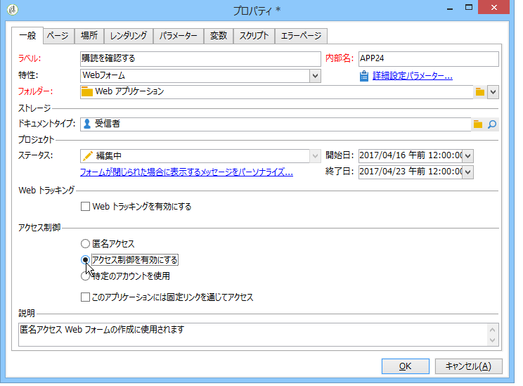

ページにアクセスすると、次の認証フォームが表示されます。

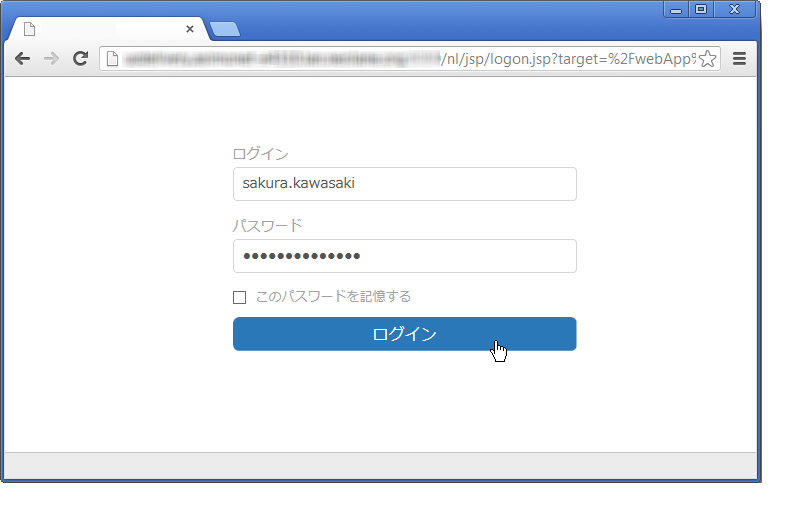

ログインおよびパスワードは、Adobe Campaign オペレーターによって使用されるものです。詳しくは、[この節](../../platform/using/access-management.md)を参照してください。

The **[!UICONTROL Use a specific account]** option lets you limit the read or write permission of the operator who accesses the form. ドロップダウンボックスを使用して、これらの権限の付与を担当するオペレーターまたはオペレーターグループを選択します。

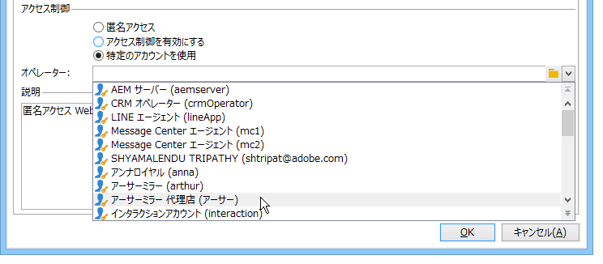

## フォームの URL パラメーター {#form-url-parameters}

フォームの URL に追加のパラメーターを追加して、コンテンツをパーソナライズして、コンテキストを初期化できます（言語、暗号化された受信者 ID、会社、変数に格納された計算済み数式など）。これにより、いくつかの異なる URL を使用して 1 つのフォームにアクセスでき、URL に示されたパラメーターの値に基づいてページコンテンツをパーソナライズできます。

デフォルトでは、Adobe Campaign は、フォームのプレビューおよびエラーの確認用のパラメーターを提供します。フォームにリンクされた新しい設定を作成できます。これには、データベースのフィールドの値またはローカル変数の値を使用できます。

## 標準パラメーター {#standard-parameters}

デフォルトでは、次のパラメーターを使用できます。

* **id** は、暗号化された識別子を示します。
* **lang** は、表示言語を変更します。
* **origin** は、回答者の接触チャネルを指定します。
* **_uuid** は、パブリッシュ前のフォーム表示とエラートラッキングを有効にします。このパラメーターは、内部でのみ使用されます（作成およびデバッグ）。この URL を使用して Web フォームにアクセスすると、作成されたレコードはトラッキング（レポート）で考慮されません。The origin is forced to the **[!UICONTROL Adobe Campaign]** value.

   これは、**_preview** パラメーターまたは **_debug** と共に使用されます。

   **_preview** は、最後に保存されたバージョンを表示します。このパラメーターは、テストフェーズでのみ使用される必要があります。

   **_debug** は、フォームのページで入力または計算されたデータのトレースを表示します。これは、フォームがパブリッシュされた場合を含め、エラーに関する詳細情報を取得するために使用されます。

   >[!CAUTION]
   >
   >フォームが **_uuid** パラメーターを使用した URL で表示されると、**[!UICONTROL origin]** パラメーターの値は、強制的に **Adobe Campaign** になります。

## パラメーターの追加 {#adding-parameters}

Parameters can be added via the **[!UICONTROL Parameters...]** tab in the Properties window of the form. それらは、次に示すように、必須に設定できます。

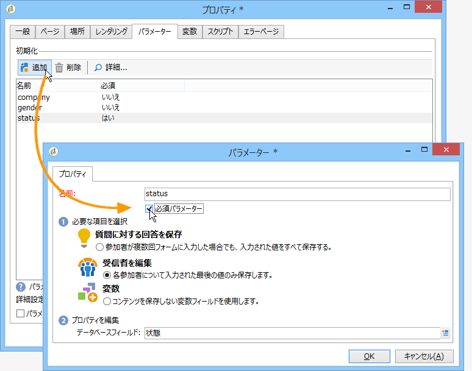

パラメーターの値が取得されるストレージの場所を指定する必要があります。To do this, select one of the storage options and then click the **[!UICONTROL Storage]** tab to select the field or the variable concerned. ストレージオプションの詳細は、「 [Response storage」フィールドに示されます](../../web/using/web-forms-answers.md#response-storage-fields)。

回答者のステータス（0、1 またはその他の値）は、フォームにアクセスするために URL に追加されます。この情報は、フォームのページまたはテストボックスで再利用できます。表示されるページは、次に示すように、コンテキストの値に基づいて条件を設定できます。

1. 顧客向けのホームページ（**status=1**）:

   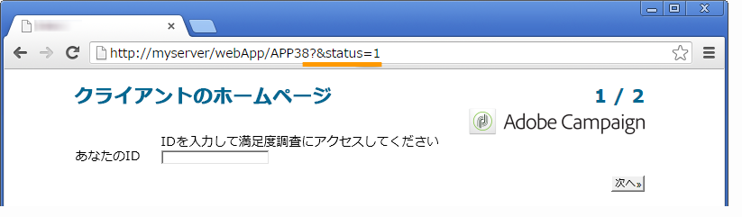

1. 見込み客向けのホームページ（**status=0**）:

   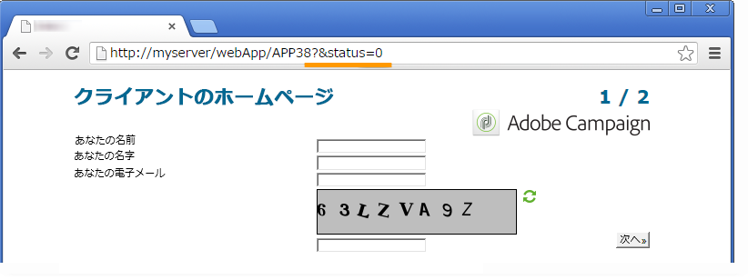

1. その他のプロファイル向けのホームページ（例：**status=12**）:

   

このフォームを設定するには、次に示すように、テストボックスを作成し、ダイアグラムの最初に配置します。

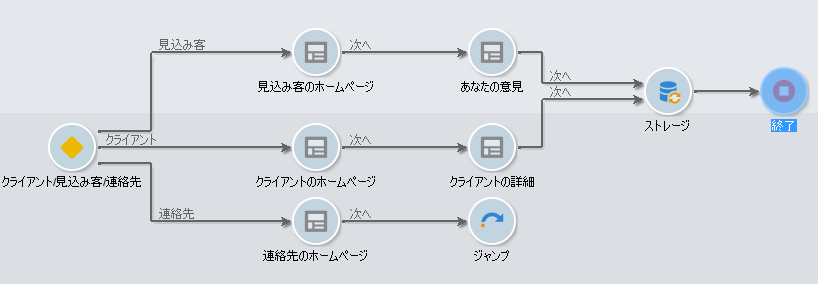

テストボックスを使用すると、ページの並び順の条件を設定できます。

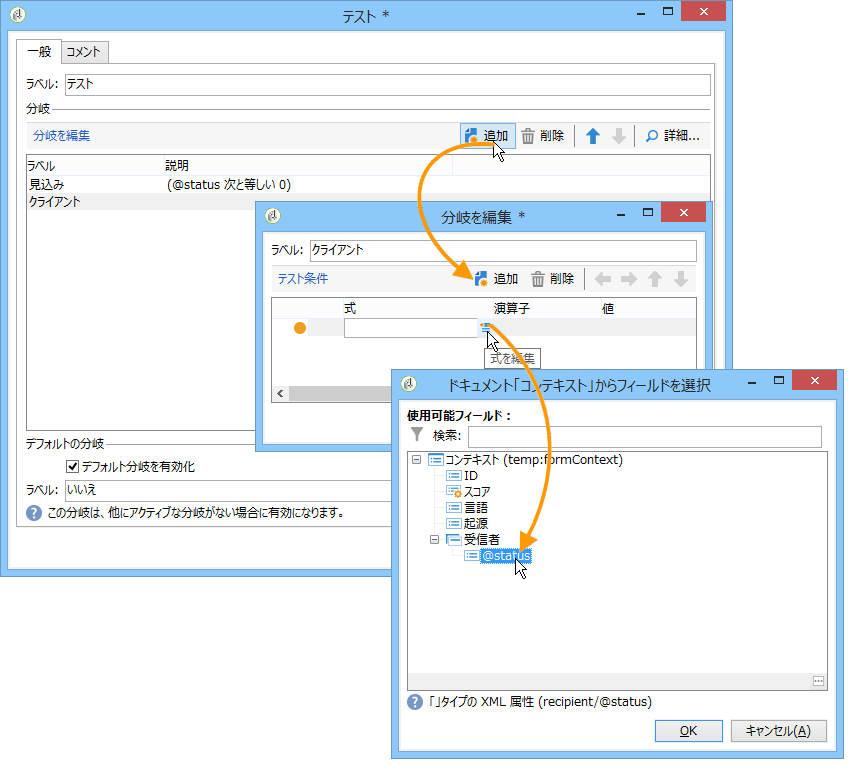

