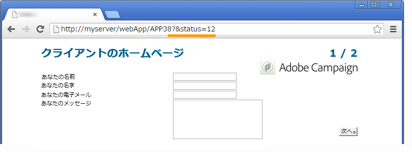

# Web フォームプロパティの定義{#defining-web-forms-properties}

Web フォームでは、独自の要件を満たすための設定やパーソナライズを完全におこなうことができます。パラメーターは、プロパティウィンドウで入力する必要があります。

プロパティウィンドウは、Web フォームのツールバーにある「**[!UICONTROL プロパティ]**」ボタンを使用してアクセスできます。このウィンドウを使用すると、Web フォームに特有の様々な設定にアクセスできます。一部の設定は、テンプレートの設定に由来することがあります。

## 全般的なフォームプロパティ {#overall-form-properties}

プロパティウィンドウの「**[!UICONTROL 一般]**」タブで、フォームの&#x200B;**ラベル**&#x200B;を修正できます。**内部名**&#x200B;は変更しないことを強くお勧めします。

フォームテンプレートは、フォームの作成中に選択されます。後から変更することはできません。フォームテンプレートの作成と管理について詳しくは、[Web フォームテンプレートの使用](../../web/using/using-a-web-form-template.md)を参照してください。

## フォームデータストレージ {#form-data-storage}

Web フォームのフィールドは、デフォルトで、受信者テーブルに格納されます。「**[!UICONTROL ドキュメントタイプ]**」フィールドから新しいテーブルを選択することで、使用するテーブルを変更できます。**[!UICONTROL ズーム]**&#x200B;アイコンを使用すると、選択したテーブルの内容を表示できます。

デフォルトでは、回答は、**[!UICONTROL 受信者フォームへの回答]**&#x200B;テーブルに格納されます。

## エラーページの設定 {#setting-up-an-error-page}

エラーページを設定できます。このページは、フォーム実行中にエラーが発生した場合に表示されます。

エラーページは、フォームプロパティウィンドウの対応するタブで定義されます。

デフォルトでは、次の情報が表示されます。

表示される文字列の内容は、プロパティウィンドウの「**[!UICONTROL エラーページ]**」タブで定義されます。「**[!UICONTROL HTML]**」タブにレンダリングが表示され、「**[!UICONTROL テキスト]**」タブを使用して、テキスト文字列を修正し、必要に応じて一部のテキストを追加できます。

## フォームのローカライゼーション {#form-localization}

「**[!UICONTROL ローカライゼーション]**」タブを使用すると、Web フォームのデザインと表示言語を選択できます。

[Web フォームの翻訳](../../web/using/translating-a-web-form.md)を参照してください。

## フォームのブラウジングとレンダリング {#form-browsing-and-rendering}

「**[!UICONTROL レンダリング]**」タブを使用すると、Web フォームのページと使用するレンダリングテンプレートの間のブラウジングのタイプを定義できます。

リンクまたはボタンを使用したナビゲートを選択できます。

ボタンは、デフォルトのナビゲーション要素です。次の操作を実行できます。

* 「**[!UICONTROL 次へ]**」をクリックすることで、現在のページを承認し、次のページを表示します。このボタンは、最後を除くすべてのページに表示されます。
* 「**[!UICONTROL 前へ]**」をクリックすることで、前のページを表示します。このボタンは、最初を除くすべてのページに表示されます。
* 「**[!UICONTROL 承認]**」ボタンをクリックすることで、回答フォームを保存します。このボタンは、最後のページにのみ表示されます。

これらの要素は、各ページの下部に表示されます。位置は変更できます。これをおこなうには、スタイルシートを修正する必要があります。

>[!NOTE]
>
>一部のページで「**[!UICONTROL 前へ]**」ボタンを非表示にすることができます。これをおこなうには、関連するページに移動し、「**[!UICONTROL 前のページに戻ることを許可しない]**」オプションをチェックします。このオプションは、ページツリーのルートが選択されている場合にアクセスできます。

「**[!UICONTROL レンダリング]**」タブの「**[!UICONTROL テンプレート]**」フィールドを使用すると、使用可能な中からテーマを選択できます。

テーマは、ツリーの&#x200B;**[!UICONTROL 管理／設定／フォームのレンダリング]**&#x200B;ノードに保存されます。[フォームレンダリングテンプレートの選択](../../web/using/form-rendering.md#selecting-the-form-rendering-template)を参照してください。

プロパティウィンドウの下の部分にレンダリングのサンプルが表示されます。**[!UICONTROL リンクを編集]**&#x200B;アイコンを使用すると、選択したテーマの設定が表示されます。

## フォームのテキスト {#texts-in-the-form}

「**[!UICONTROL ページ]**」タブを使用すると、フォームヘッダーおよびフッターのコンテンツを定義できます。[ヘッダーとフッターの定義](../../web/using/form-rendering.md#defining-headers-and-footers)を参照してください。

また、翻訳も管理できます。[Web フォームの翻訳](../../web/using/translating-a-web-form.md)を参照してください。

## フォームのアクセシビリティ {#accessibility-of-the-form}

Web フォームは、**[!UICONTROL オンライン]**&#x200B;の状態で、現在の日付が有効期間内である場合に、ユーザーがアクセスできます。フォームのステータスは、パブリッシュステージ（[フォームのパブリッシュ](../../web/using/publishing-a-web-form.md#publishing-a-form)を参照）の間に修正できます。ステータスは、プロパティウィンドウの「**[!UICONTROL 一般]**」タブの「**プロジェクト**」セクションに表示されます。

有効期間は、**[!UICONTROL 開始]**&#x200B;日から&#x200B;**[!UICONTROL 終了日]**&#x200B;までです。これらのフィールドに日付が指定されていない場合、フォームは永続的に有効です。

>[!NOTE]
>
>フォームが閉じられて、結果として有効期限に到達しない場合または期限が切れた場合、または Adobe Campaign オペレーターによって閉じられた場合、ユーザーがアクセスしようとするとメッセージが表示されます。「**[!UICONTROL フォームが閉じられた場合に表示するメッセージをパーソナライズ]**」をクリックすることで、このメッセージをパーソナライズできます。

## フォームのアクセス制御 {#form-access-control}

デフォルトでは、Web フォームへのアクセスは、匿名モードで実行されます。フォームにアクセスするすべてのオペレーターに WebApp オペレーター権限が割り当てられます。

例えば、イントラネットサイトにフォームを配信する際に、ユーザーを認証するために、フォームの表示に対するアクセス制限を有効にできます。これをおこなうには、次に示すように、関連するフォームの&#x200B;**[!UICONTROL プロパティ]**&#x200B;ウィンドウを表示して、「**[!UICONTROL アクセス制御を有効にする]**」オプションをクリックします。

ページにアクセスすると、次の認証フォームが表示されます。

ログインおよびパスワードは、Adobe Campaign オペレーターによって使用されるものです。詳しくは、[この節](../../platform/using/access-management.md)を参照してください。

「**[!UICONTROL 特定のアカウントを使用]**」オプションを使用すると、フォームにアクセスするオペレーターの読み取りまたは書き込み権限を制限できます。ドロップダウンボックスを使用して、これらの権限の付与を担当するオペレーターまたはオペレーターグループを選択します。

## フォームの URL パラメーター {#form-url-parameters}

フォームの URL に追加のパラメーターを追加して、コンテンツをパーソナライズして、コンテキストを初期化できます（言語、暗号化された受信者 ID、会社、変数に格納された計算済み数式など）。これにより、いくつかの異なる URL を使用して 1 つのフォームにアクセスでき、URL に示されたパラメーターの値に基づいてページコンテンツをパーソナライズできます。

デフォルトでは、Adobe Campaign は、フォームのプレビューおよびエラーの確認用のパラメーターを提供します。フォームにリンクされた新しい設定を作成できます。これには、データベースのフィールドの値またはローカル変数の値を使用できます。

## 標準パラメーター {#standard-parameters}

デフォルトでは、次のパラメーターを使用できます。

* **id** は、暗号化された識別子を示します。
* **lang** は、表示言語を変更します。
* **origin** は、回答者の接触チャネルを指定します。
* **_uuid** は、パブリッシュ前のフォーム表示とエラートラッキングを有効にします。このパラメーターは、内部でのみ使用されます（作成およびデバッグ）。この URL を使用して Web フォームにアクセスすると、作成されたレコードはトラッキング（レポート）で考慮されません。origin は、強制的に **[!UICONTROL Adobe Campaign]** の値になります。

   これは、**_preview** パラメーターや **_debug** と共に使用されます。

   **_preview** は、最後に保存されたバージョンを表示します。このパラメーターは、テストフェーズでのみ使用される必要があります。

   **_debug** は、フォームのページで入力または計算されたデータのトレースを表示します。これは、フォームがパブリッシュされた場合を含め、エラーに関する詳細情報を取得するために使用されます。

   >[!CAUTION]
   >
   >フォームが **_uuid** パラメーターを使用した URL で表示されると、**[!UICONTROL origin]** パラメーターの値は、強制的に **Adobe Campaign** になります。

## パラメーターの追加 {#adding-parameters}

パラメーターは、フォームのプロパティウィンドウの「**[!UICONTROL パラメーター]**」タブを使用して追加できます。それらは、次に示すように、必須に設定できます。

パラメーターの値が取得されるストレージの場所を指定する必要があります。これをおこなうには、いずれかのストレージオプションを選択し、「**[!UICONTROL ストレージ]**」タブをクリックして、関連するフィールドまたは変数を選択します。ストレージオプションについて詳しくは、[回答ストレージフィールド](../../web/using/web-forms-answers.md#response-storage-fields)を参照してください。

回答者のステータス（0、1 またはその他の値）は、フォームにアクセスするために URL に追加されます。この情報は、フォームのページまたはテストボックスで再利用できます。表示されるページは、次に示すように、コンテキストの値に基づいて条件を設定できます。

1. 顧客向けのホームページ（**status=1**）:

   

1. 見込み客向けのホームページ（**status=0**）:

   

1. その他のプロファイル向けのホームページ（例：**status=12**）:

   

このフォームを設定するには、次に示すように、テストボックスを作成し、ダイアグラムの最初に配置します。

テストボックスを使用すると、ページの並び順の条件を設定できます。

