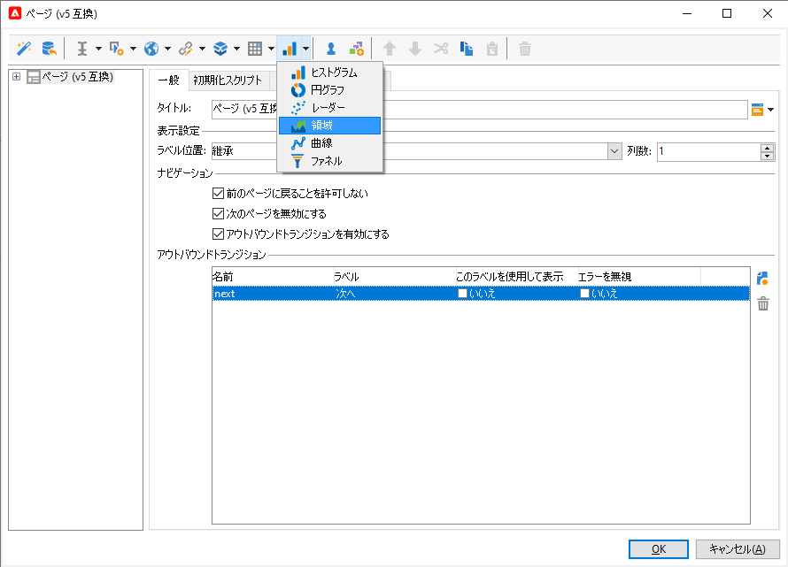
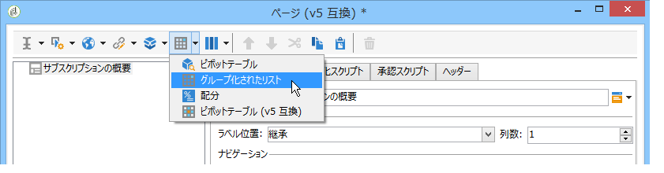
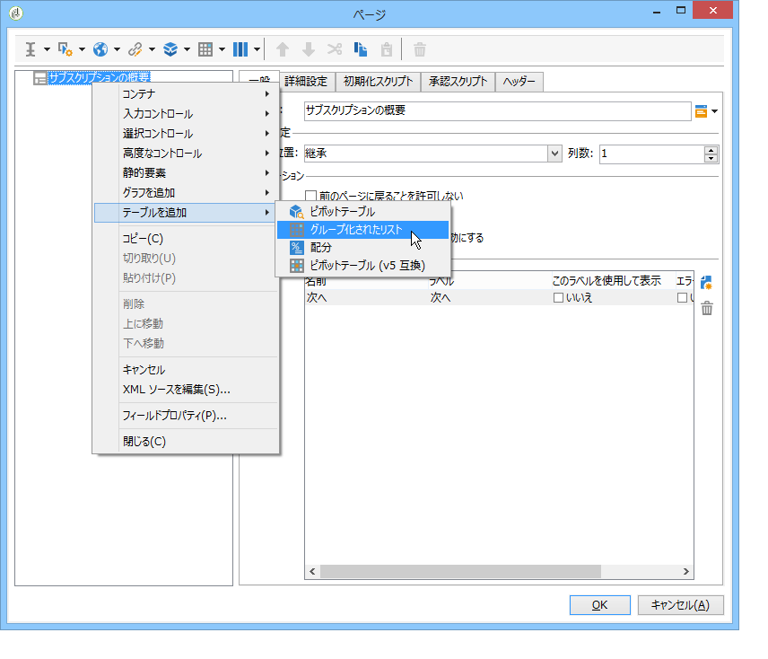

# Web アプリケーションの設計{#designing-a-web-application}

Web アプリケーションは、[オンライン調査](../../web/using/about-surveys.md)と同じ原則に従って作成および管理されます。

ただし、機能的な違いは次のとおりです。

* Web アプリケーションは、アーカイブされたフィールドを使用しません。データは、そのため、データベースフィールドまたはローカル変数にのみ格納されます。
* Web アプリケーションには組み込みレポートはありません。
* 主にテーブルおよびグラフの作成のために、追加のフィールドが提供されます。

>[!CAUTION]
>
>Web アプリケーション構築プロセスで早期にエラーを検出するために、適用した設定を継続的にチェックすることを強くお勧めします。修正のレンダリングをチェックするには、アプリケーションを保存してから、「**[!UICONTROL プレビュー]**」サブタブをクリックします。
>
>Web アプリケーションがパブリッシュされるまで、変更はエンドユーザーには表示されません。

## Web アプリケーションへのグラフの追加 {#inserting-charts-in-a-web-application}

Web アプリケーションにグラフを含めることができます。そのためには、ツールバーにあるグラフのドロップダウンリストを使用して、挿入するグラフのタイプを選択します。

また、**[!UICONTROL グラフを追加]**&#x200B;メニューを選択することもできます。

## Web アプリケーションへのテーブルの追加 {#inserting-tables-in-a-web-application}

テーブルを追加するには、ツールバーにあるテーブルのドロップダウンリストを使用して、使用するテーブルのタイプを選択します。

また、ドロップダウンメニューでテーブルのタイプを選択することもできます。

## 概要タイプの Web アプリケーション {#overview-type-web-applications}

Adobe Campaign インターフェイスは、受信者、配信、キャンペーン、在庫などのアクセス、管理、操作に、多くの Web アプリケーションを使用します。

それらは、1 ページのみのダッシュボードの形のインターフェイスで表示されます。

標準の Web アプリケーションは、**[!UICONTROL 管理／設定／Web アプリケーション]**&#x200B;ノードに格納されています。

## フォームタイプの Web アプリケーションの編集 {#edit-forms-type-web-applications}

エクストラネット用のフォームを編集 Web アプリケーションには、次の特徴があります。

* プリロードボックス

   ほとんどの場合、表示されるデータは、プリロードされる必要があります。これらのフォームにアクセスするユーザーは識別される（アクセス制御で）ので、プリロードは暗号化される必要はありません。

* 保存ボックス
* ページの追加

   すべての「概要」タイプの Web アプリケーションは単一ページなのに対して、編集フォームは、特定の条件（テスト、選択肢、関係するオペレーターのプロファイルなど）に基づいた一連のページを提供できます。

このタイプの Web アプリケーションの操作は、**調査**&#x200B;に似ていますが、履歴管理またはフィールドのアーカイブがありません。ユーザーは、通常、自己を証明する必要があるログインページを使用してアクセスします。
