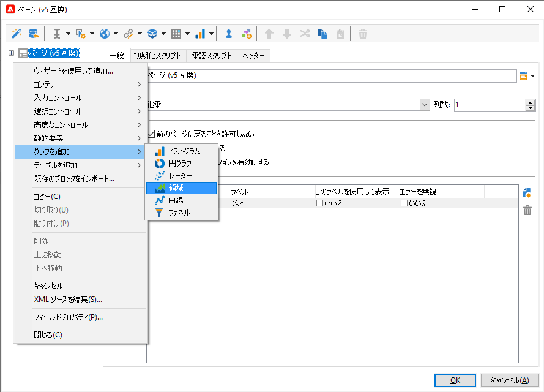

# Web アプリケーションの設計{#designing-a-web-application}

Web アプリケーションは、[web フォーム](about-web-forms.md)と同じ原則に従って作成および管理されます。

>[!CAUTION]
>
>「**[!UICONTROL プレビュー]**」サブタブを使用すると、Web アプリケーションの設計中にエラーを確認できます。
>
>Web アプリケーションが公開されるまで、変更はエンドユーザーには公開されません。

## Web アプリケーションへのグラフの挿入 {#inserting-charts-in-a-web-application}

Web アプリケーションにグラフを含めることができます。そのためには、ツールバーにあるグラフのドロップダウンリストを使用して、挿入するグラフのタイプを選択します。

また、**[!UICONTROL グラフを追加]**&#x200B;メニューを選択することもできます。

## Web アプリケーションへのテーブルの挿入 {#inserting-tables-in-a-web-application}

テーブルを追加するには、ツールバーにあるテーブルのドロップダウンリストを使用して、使用するテーブルのタイプを選択します。

また、ドロップダウンメニューでテーブルのタイプを選択することもできます。

## 概要タイプの Web アプリケーション {#overview-type-web-applications}

Adobe Campaign インターフェイスは、受信者、配信、キャンペーン、在庫などのアクセス、管理、操作に、多くの Web アプリケーションを使用します。

それらは、1 ページのみのダッシュボードの形のインターフェイスで表示されます。

標準の Web アプリケーションは、**[!UICONTROL 管理／設定／Web アプリケーション]**&#x200B;ノードに格納されています。

## フォームタイプの Web アプリケーションの編集 {#edit-forms-type-web-applications}

エクストラネット用のフォームを編集 Web アプリケーションには、次の特徴があります。

* プリロードボックス

   ほとんどの場合、表示されるデータは、プリロードされる必要があります。これらのフォームにアクセスするユーザーは識別される（アクセス制御で）ので、プリロードは暗号化される必要はありません。

* 保存ボックス
* ページの追加

   すべての「概要」タイプの Web アプリケーションは単一ページなのに対して、編集フォームは、特定の条件（テスト、選択肢、関係するオペレーターのプロファイルなど）に基づいた一連のページを提供できます。

