# コンテンツの編集{#editing-content}

## 表示条件の定義 {#defining-a-visibility-condition}

Web ページ要素の表示条件を指定できます。この要素は、条件が遵守されている場合にのみ、表示されます。

To add a visibility condition, select a block and enter the condition in the **[!UICONTROL Visibility condition]** field using the expression editor.

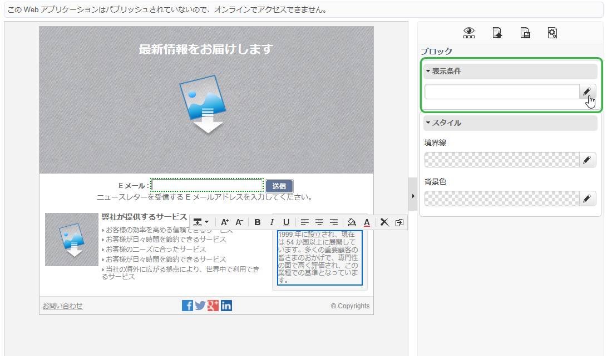

>[!NOTE]
>
>高度な式の編集については、[このページ](../../platform/using/defining-filter-conditions.md#list-of-functions)を参照してください。

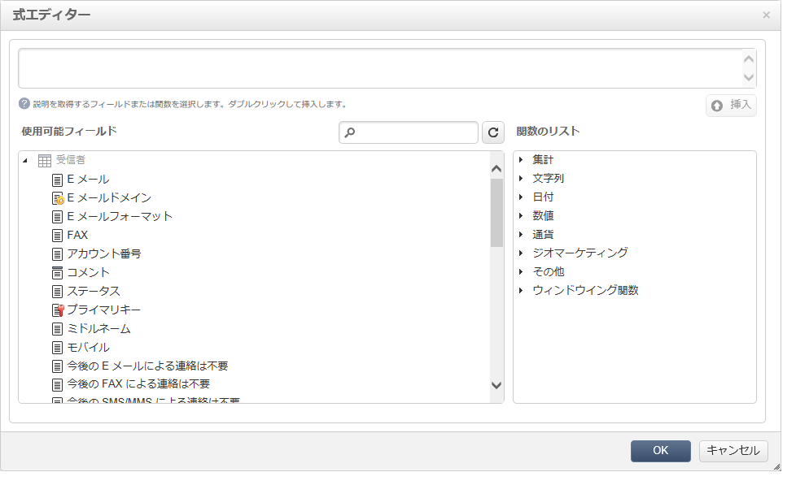

These conditions adopt the XTK expression syntax (for example **ctx.recipient.@email != &quot;&quot;** ま **たはctx.recipient.@status==&quot;0&quot;**). デフォルトでは、すべてのファイルが表示されます。

>[!NOTE]
>
>非表示の動的ブロック（ドロップダウンメニューなど）は、編集できません。

## 境界線および背景の追加 {#adding-a-border-and-background}

選択したブロックに&#x200B;**境界線**&#x200B;を追加できます。境界線は、スタイル、サイズおよび色の 3 つのオプションを使用して定義されます。

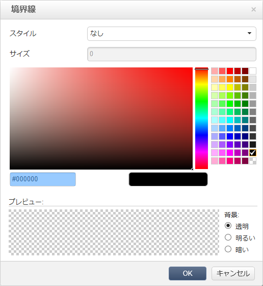

また、カラーチャートから色を選択することで、**背景色**&#x200B;を定義できます。

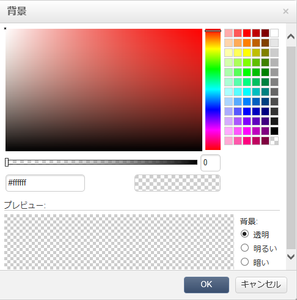

## フォームの編集 {#editing-forms}

### フォームのデータプロパティの変更 {#changing-the-data-properties-for-a-form}

データベースフィールドを入力ゾーン、ラジオボタンまたはチェックボックスタイプのブロックにリンクできます。

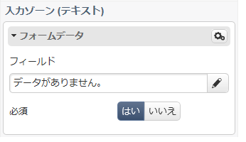

>[!NOTE]
>
>デフォルトのフィールドは、Web アプリケーションストレージスキーマにあります。

**フィールド**&#x200B;入力ゾーンを使用すると、フォームフィールドとリンクするためのデータベースフィールドを選択できます。

デフォルトでは、提供されたフィールドは、**nms:recipient** テーブルにあります。

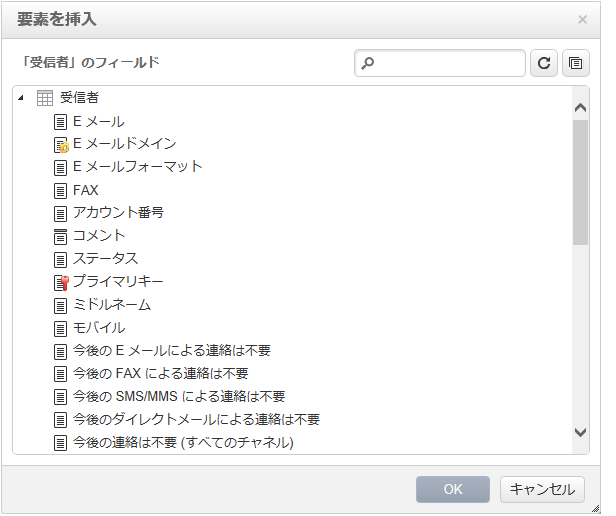

**必須フィールド**&#x200B;オプションを使用すると、ユーザーがフィールドに入力した場合にのみページを承認します。必須フィールドに入力されていない場合、エラーメッセージが表示されます。

ラジオボタンおよびチェックボックスの場合、**追加の設定が必要です**。

実際、使用されるテンプレートにデフォルトで値が含まれない場合、エディターで完成させる必要があります。

手順は次のとおりです。

* アイコンをクリッ **[!UICONTROL Edit]** クします。

   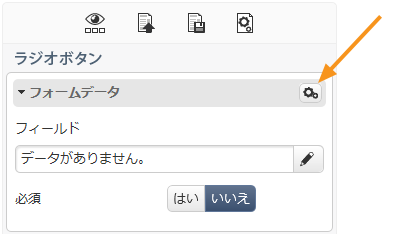

* Enter the itemized list value (defined by the selected field) into the **[!UICONTROL Value]** field.

   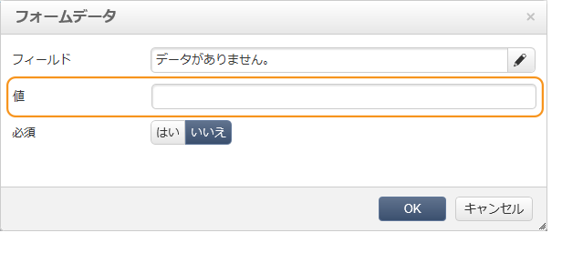

### フォームフィールドの修正 {#modifying-form-fields}

ラジオボタン、入力ゾーン、ドロップダウンリストなどのフォームフィールドは、ツールバーから修正できます。

変更できる設定内容は次のとおりです。

* Delete the block containing the form fields using the **[!UICONTROL Delete]** icon.
* Duplicate the selected field by creating a new block using the **[!UICONTROL Duplicate]** icon.
* Edit the **[!UICONTROL Form data]** window to link a database field to the form zone, using the **[!UICONTROL Edit]** icon.

   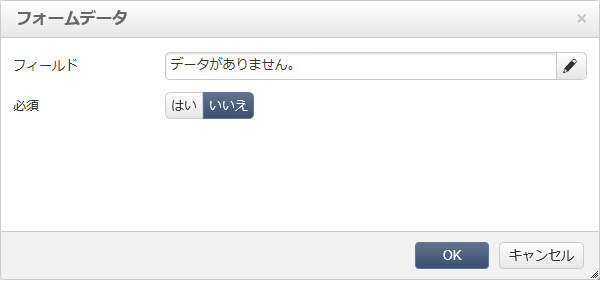

## ボタンへのアクションの追加 {#adding-an-action-to-a-button}

ユーザーがボタンをクリックする際に、関連するアクションを定義できますこれをおこなうには、ドロップダウンリストから実行されるアクションを選択します。

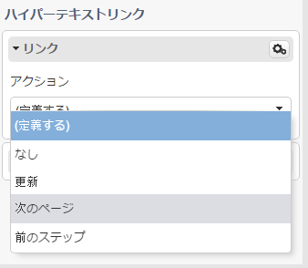

利用可能なアクションを次に示します。

* **[!UICONTROL Refresh]** :現在のページを更新します。
* **[!UICONTROL Next page]** :webアプリケーションの次のページへのリンクを作成します。
* **[!UICONTROL Previous page]** :webアプリケーション内の前のページへのリンクを作成します。

>[!NOTE]
>
>The **[!UICONTROL None]** value allows you to not activate the button.

対応するフィールドのボタンにリンクされたラベルを修正できます。

## リンクの追加 {#adding-a-link}

リンクを任意のページ要素（画像、単語、単語のグループ、テキストのブロックなど）に挿入できます。

これをおこなうには、要素を選択してから、ポップアップメニューの最初のアイコンを使用します。

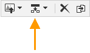

このアイコンを使用すると、利用できるすべてのタイプのリンクにアクセスできます。

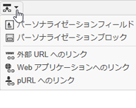

パーソナライゼーションブロックおよびフィールドは、テキストタイプのブロックにのみ挿入されます。

>[!NOTE]
>
>各タイプのリンクについて、開くモードを設定できます。**ターゲット**&#x200B;ドロップダウンリストでターゲットウィンドウを選択します。This value corresponds to the **`<target>`** HTML tag.
>
>利用可能な&#x200B;**ターゲット**&#x200B;のリストは、次のとおりです。

>* その他 (IFrame)
>* 最上位のウィンドウ (_top)
* 親ウィンドウ (_parent)
* 新しいウィンドウ (_blank)
* 現在のウィンドウ (_self)
* ブラウザーのデフォルト動作


### URL へのリンク {#link-to-a-url}

「**外部 URL へのリンク**」オプションを使用すると、ソースコンテンツから任意の URL を開くことができます。

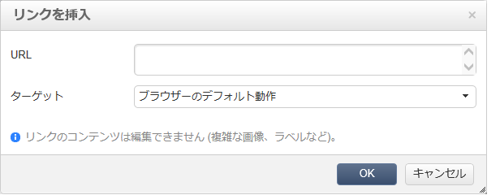

問題になっているリンクアドレスを「**URL**」フィールドに入力します。The URL field should be entered as: **https://www.myURL.com**.

### Web アプリケーションへのリンク {#link-to-a-web-application}

「**Web アプリケーションへのリンク**」オプションを使用すると、Adobe Campaign Web アプリケーションにアクセスできます。

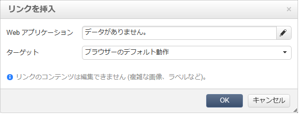

対応するフィールドから Web アプリケーションを選択します。

The list of suggested Web applications corresponds to the available applications in the **[!UICONTROL Resources > Online > Web Applications]** node.

### アクションへのリンク {#link-to-an-action}

「**アクションを定義するリンク**」オプションを使用すると、ソース要素をクリックする際に、アクションを設定できます。

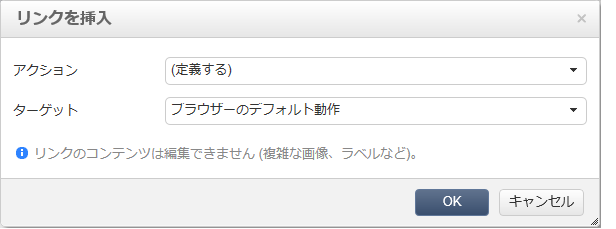

>[!NOTE]
使用可能なアクションについて詳しくは、「ボ [タンへのアクションの追加](#adding-an-action-to-a-button) 」を参照してください。

### リンクの削除 {#delete-a-link}

リンクが挿入されると、ツールバーに2つの新しいアイコンが表示されます。リン **クを編集** 、作成 **** したリンクを操作できるリンクを解除します。

* **[!UICONTROL Edit link]** リンクのすべてのパラメーターを含むウィンドウを表示できます。
* **[!UICONTROL Break the link]** 確認後に、リンクとすべての関連パラメーターを削除できます。

>[!NOTE]
リンクが削除されても、コンテンツは保持されます。

## フォント属性の変更 {#changing-font-attributes}

テキスト要素を選択する場合、フォント属性（スタイル、書式設定）を修正できます。

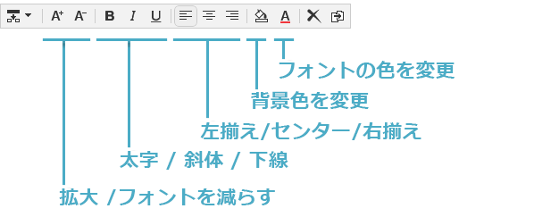

利用可能なオプションを次に示します。

* **Enlarge font** icon:選択したテキストのサイズを拡大(追加 `<span style="font size:">`)
* **フォントを縮小** :選択したテキストのサイズを小さくします(追加 `<span style="font size:">`)。
* **太字** アイコン：選択したテキストを太字にします(テキストをタグで囲 `<strong> </strong>` みます)。
* **斜体** :選択したテキストを斜体にします(タグでテキストを折り返 `<em> </em>` します)。
* **下線** アイコン：選択したテキストに下線を付けます(テキストをタグで囲 `<span style="text-decoration: underline;">` みます)。
* **左揃え** アイコン：選択したブロックの左にテキストを揃えます(style=&quot;text-align:left;&quot;)
* **中央** アイコン：選択したブロックの文字を中央に配置します(style=&quot;text-align:center;&quot;)
* **右揃え** アイコン：選択したブロックの右にテキストを揃えます(style=&quot;text-align:right;&quot;)
* **背景色アイコンを変更します** 。選択したブロックの背景色を変更できます(style=&quot;background-color:rgba(170, 86, 255, 0.87))
* **テキストカラーアイコンの変更** :選択したブロックの文字色または選択した文字のみを変更できます(`<span style="color: #CODE">`)

>[!NOTE]
* **削除**&#x200B;アイコン：ブロックおよびそのすべてのコンテンツを削除します。

* **複製**&#x200B;アイコン：ブロックおよびブロックに関連するすべてのスタイルを複製します。


## 画像とアニメーションの管理 {#managing-images-and-animations}

デジタルコンテンツエディターを使用すると、ブラウザーと互換性のある&#x200B;**すべてのタイプの画像**&#x200B;を操作できます。

DCE と互換性を保つには、次のように、**「Flash」タイプのアニメーション**&#x200B;が HTML ページに挿入されている必要があります。

```
<object type="application/x-shockwave-flash" data="https://www.mydomain.com/flash/your_animation.swf" width="200" height="400">
 <param name="movie" value="https://www.mydomain.com/flash/your_animation.swf" />
 <param name="quality" value="high" />
 <param name="play" value="true"/>
 <param name="loop" value="true"/> 
</object>
```

>[!CAUTION]
You must not call up external files in a **script** tag of the HTML page. これらのファイルは、Adobe Campaign サーバーにインポートされません。

### 画像の追加／削除／複製 {#adding---deleting---duplicating-an-image}

画像を挿入するには、画像タイプのブロックを選択して、**画像**&#x200B;アイコンをクリックします。

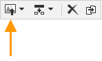

ローカルに保存された画像ファイルを選択します。

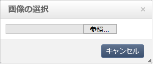

The **Delete** icon deletes the  tag containing the image.

The **Duplicate** icon duplicates the  tag and its content.

>[!CAUTION]
画像を複製すると、新しい画像に関連する識別子は削除されます。

### 画像プロパティの編集 {#editing-image-properties}

画像を含むブロックを選択する場合、次のプロパティにアクセスします。

* **キャプション**&#x200B;を使用すると、画像にリンクされたキャプションを定義できます（**alt** HTML 属性に対応）。
* **サイズ**&#x200B;を使用すると、画像サイズをピクセル単位で指定できます。

   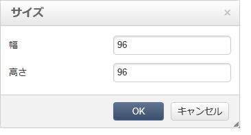

## パーソナライゼーションコンテンツの追加 {#adding-personalization-content}

### パーソナライゼーションフィールドの挿入 {#inserting-a-personalization-field}

挿入アイコン用の「**パーソナライゼーションフィールド**」オプションを使用すると、データベースフィールドをコンテンツに追加できます（受信者の名前など）。このオプションは、テキストタイプのブロックでのみ使用できます。

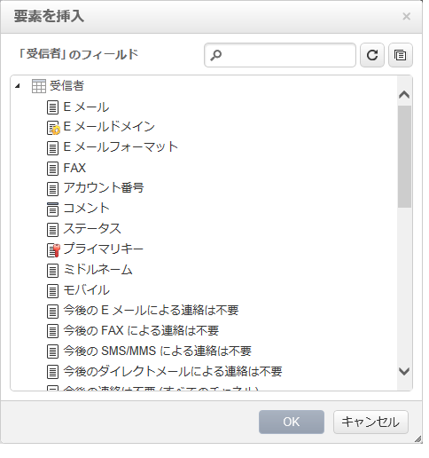

By default, the fields offered are from the **[!UICONTROL Recipient]** table. 必要に応じて、Web アプリケーションプロパティを編集して、別のテーブルを選択します。

フィールド名がエディターに表示され、黄色でハイライトされます。パーソナライゼーションが生成されると（例えば、ランディングページのプレビュー時）、ターゲット化された受信者のプロファイルで置き換えられます。

「パーソナライゼーションフィールドの挿 [入」の節に例が示され](../../web/using/creating-a-landing-page.md#inserting-a-personalization-field) 、

### パーソナライゼーションブロックの挿入 {#inserting-a-personalization-block}

「**パーソナライゼーションブロック**」オプションを使用すると、動的でパーソナライズされたブロックをコンテンツに挿入できます。例えば、ロゴや挨拶メッセージを追加できます。これは、テキストタイプのブロックでは使用できません。

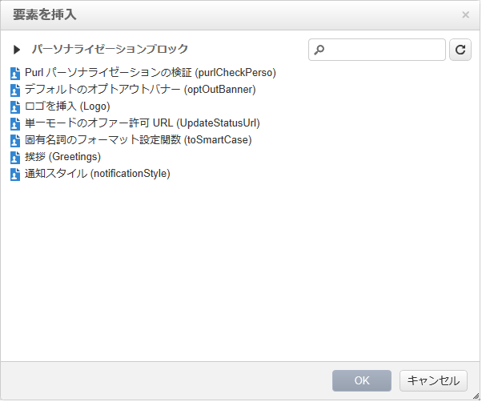

挿入後、パーソナライゼーションブロック名がエディターに表示され、黄色でハイライトされます。パーソナライゼーションが生成されると、受信者プロファイルに自動的に適応されます。

For more on built-in personalization blocks and how to define custom personalization blocks, refer to [this page](../../delivery/using/personalization-blocks.md).
