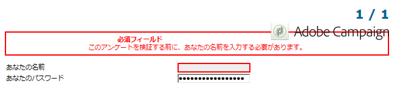

# フォームレンダリング{#form-rendering}

## フォームレンダリングテンプレートの選択 {#selecting-the-form-rendering-template}

フォーム設定により、ページ生成に使用するテンプレートを選択できます。これらにアクセスするには、フォームの詳細ツールバーの&#x200B;**[!UICONTROL 設定]**&#x200B;ボタンをクリックして、「**[!UICONTROL レンダリング]**」タブを選択します。デフォルトで、多数のテンプレート（スタイルシート）を使用できます。

エディターの下部のセクションで、選択したテンプレートのレンダリングを表示できます。

ズーム機能を使用すると、選択したテンプレートを編集できます。

これらのテンプレートを修正または上書きできます。これをおこなうには、「**[!UICONTROL ページレイアウト]**」リンクをクリックして、情報をパーソナライズします。

次の操作をおこなうことができます。

* ロゴとして使用する画像を変更し、サイズを適応させます。
* また、ユーザーがこのレンダリングテンプレートを選択する際にプレビュー画像にアクセスするためのパスを指定します。

「**[!UICONTROL ヘッダー／フッター]**」タブを使用すると、このテンプレートを使用する各フォームページのヘッダーおよびフッターに表示される情報を変更できます。

「**[!UICONTROL ページヘッダー]**」および「**[!UICONTROL ページフッター]**」セクションの各行は、HTML ページの各行に対応します。新しい行を作成するには、「**[!UICONTROL 追加]**」をクリックします。

既存の行を選択して、「**[!UICONTROL 詳細]**」ボタンをクリックしてパーソナライズします。

各タブで、行のコンテンツを変更したり、境界線を追加したり、フォント属性を変更したりできます。「**[!UICONTROL OK]**」をクリックして、これらの変更を確定します。

「**[!UICONTROL 位置]**」フィールドを使用すると、ページヘッダーおよびフッターの要素の位置を定義できます

>[!NOTE]
>
>レンダリングテンプレートは、**[!UICONTROL 管理／設定／フォームレンダリング]**&#x200B;ノードに格納されます。\
>詳しくは、[フォームのレンダリングのカスタマイズ](#customizing-form-rendering)を参照してください。

## フォームのレンダリングのカスタマイズ {#customizing-form-rendering}

### 要素のレイアウトの変更 {#changing-the-layout-of-elements}

フォームの各要素（入力フィールド、画像、ラジオボタンなど）について、スタイルシートをオーバーロードできます。

これをおこなうには、「**[!UICONTROL 詳細設定]**」タブを使用します。

次のプロパティを定義できます。

* **[!UICONTROL ラベルの位置]**：[ラベルの位置の定義](../../web/using/defining-web-forms-layout.md#defining-the-position-of-labels)を参照
* **[!UICONTROL ラベルのフォーマット]**：テキストを折り返す、または折り返さない
* **[!UICONTROL セル数]**：[ページへのフィールドの配置](../../web/using/defining-web-forms-layout.md#positioning-the-fields-on-the-page)を参照
* **[!UICONTROL 水平方向の整列]**（左、右、中央揃え）および&#x200B;**[!UICONTROL 垂直方向の整列]**（高、低、中央）。
* ゾーンの&#x200B;**[!UICONTROL 幅]**：これは、パーセンテージまたは em、point、pixel（デフォルト値）で表示できます。
* 最大の&#x200B;**[!UICONTROL 長さ]**：許容される最大文字数（テキスト、数値およびパスワードタイプのコントロール）
* **[!UICONTROL ライン]**：**[!UICONTROL 複数ラインテキスト]**&#x200B;タイプのゾーンのライン数。
* **[!UICONTROL スタイルインライン]**：CSS スタイルシートを追加の設定でオーバーロードできます。これらは、次の例のように、**;** 文字を使用して区切られます。

   

### ヘッダーとフッターの定義 {#defining-headers-and-footers}

フィールドは、ルートがページと同じ名前のツリー構造で並んでいます。フィールドを選択して、名前を修正します。

ウィンドウのタイトルは、フォームプロパティウィンドウの「**[!UICONTROL ページ]**」タブに入力されている必要があります。また、ページヘッダーとフッターにセットコンテンツを追加できます（この情報は、すべてのページに表示されます）。このコンテンツは、次に示すように、「**[!UICONTROL テキスト]**」タブの一致するセクションに入力されます。

### HTML ヘッダーへの要素の追加 {#adding-elements-to-html-header}

フォームページの HTML ヘッダーに挿入する追加の要素を入力できます。これをおこなうには、関連するページの「**[!UICONTROL ヘッダー]**」タブに要素を入力します。

これにより、例えば、ページのタイトルバーに表示されるアイコンを参照できます。

## コントロール設定の定義 {#defining-control-settings}

ユーザーがフォームに入力する際に、形式または設定に応じて、特定のフィールドに対するチェックが自動的に実行されます。これにより、特定のフィールドを必須にしたり（[必須フィールドの定義](#defining-mandatory-fields)を参照）、入力されたデータの形式をチェックしたり（[データフォーマットのチェック](#checking-data-format)を参照）できます。（アウトバウンドトランジションを有効にするリンクまたはボタンをクリックすることで）ページの承認中にチェックが実行されます。

### 必須フィールドの定義 {#defining-mandatory-fields}

特定のフィールドを必須にするには、フィールドの作成時にこのオプションを選択します。

フィールドに入力することなく、ユーザーがこのページを承認すると、次のメッセージが表示されます。

「**[!UICONTROL メッセージをパーソナライズ]**」リンクをクリックすることで、このメッセージをパーソナライズできます。

フィールドに入力することなく、ユーザーがこのページを承認すると、次のメッセージが表示されます。

### データ形式のチェック {#checking-data-format}

その値がデータベースの既存のフィールドに格納されるフォームのチェックの場合、ストレージフィールドのルールが適用されます。

その値が変数に格納されるフォームのチェックの場合、承認ルールは変数の形式によって異なります。

例えば、**[!UICONTROL 数値]**&#x200B;チェックを作成してクライアント番号をチェックする場合、次のようになります。

ユーザーは、フォームフィールドに整数を入力する必要があります。

## フィールドの条件付き表示の定義 {#defining-fields-conditional-display}

ユーザーが選択した値に基づいて表示されるページでのフィールドの表示を設定できます。これは、1 つのフィールドまたはフィールドグループ（コンテナでグループ化されている場合）に適用できます。

グループの各要素について、「**[!UICONTROL 表示]**」セクションを使用して表示条件を定義できます。

条件は、データベースフィールドまたは変数の値が関係する可能性があります。

フィールドの選択ウィンドウで、次のデータから選択できます。

* メインツリーには、フォームコンテキストのパラメーターが含まれます。デフォルトパラメーターは、識別子（受信者の暗号化された識別子に一致）、言語および接触チャネルです。

   詳しくは、この[ページ](../../web/using/defining-web-forms-properties.md#form-url-parameters)を参照してください。

* **[!UICONTROL 受信者]**&#x200B;サブツリーには、フォームに挿入され、データベースに格納された入力フィールドが含まれます。

   詳しくは、[データベースへのデータの格納](../../web/using/web-forms-answers.md#storing-data-in-the-database)を参照してください。

* **[!UICONTROL 変数]**&#x200B;サブツリーには、このフォームで使用可能な変数が含まれます。詳しくは、[ローカル変数へのデータの格納](../../web/using/web-forms-answers.md#storing-data-in-a-local-variable)を参照してください。

詳しくは、[選択した値に応じた異なるオプションの表示](../../web/using/use-cases--web-forms.md#displaying-different-options-depending-on-the-selected-values)で説明されている使用例を参照してください。

また、**[!UICONTROL テスト]**&#x200B;オブジェクトを使用するフォームページの表示に条件を設定することもできます。詳しくは、この[ページ](../../web/using/defining-web-forms-page-sequencing.md#conditional-page-display)を参照してください。

## 既存のフォームからの要素のインポート {#importing-elements-from-an-existing-form}

他の Web フォームからフィールドまたはコンテナをインポートできます。これにより、アドレスブロック、ニュースレターの購読エリアなど、フォームに挿入される再利用可能なブロックのライブラリを作成できます。

要素をフォームに挿入するには、次の手順に従います。

1. 1 つまたは複数の要素を挿入するページを編集し、ツールバーの&#x200B;**[!UICONTROL 既存のブロックをインポート]**&#x200B;をクリックします。

   

1. インポートするフィールドを含む Web フォームを選択し、インポートするコンテナおよびフィールドを選択します。

   

   >[!NOTE]
   >
   >ソースフォーム名の右側にある&#x200B;**[!UICONTROL リンクを編集]**&#x200B;アイコンを使用すると、選択した Web フォームを表示できます。

1. 「**[!UICONTROL OK]**」をクリックして、挿入を確定します。

   

