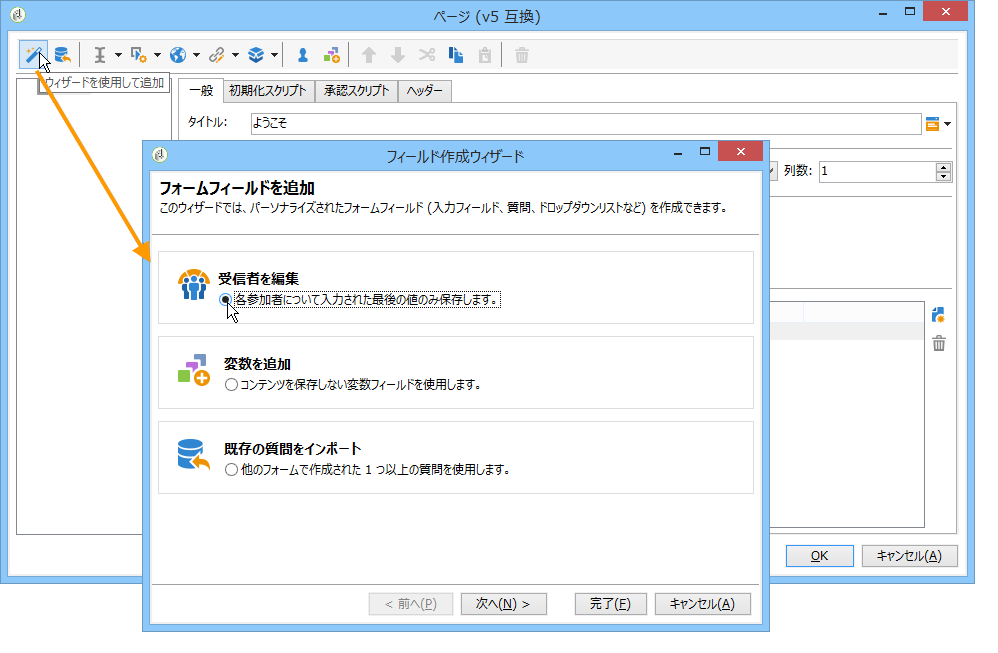

# 調査の概要{#getting-started-with-surveys}

ここでは、次のテンプレートを使用して、簡単な調査を作成するための主な手順について要約しています。

手順は次のとおりです。

1. [手順 1 - 調査の作成](#step-1---creating-a-survey),
1. [手順 2 - テンプレートの選択](#step-2---selecting-the-template),
1. [手順 3 - 調査の構築](#step-3---building-the-survey),
1. [手順 4 - ページコンテンツの作成](#step-4---creating-the-page-content),
1. [手順 5 - 調査データの格納](#step-5---storing-the-survey-data-),
1. [手順 6 - ページのパブリッシュ](#step-6---publishing-the-pages),
1. [手順 7 - オンライン調査の共有](#step-7---sharing-your-online-survey).

## 手順 1 - 調査の作成 {#step-1---creating-a-survey}

新しい調査を作成するには、「**[!UICONTROL キャンペーン]**」または「**[!UICONTROL プロファイルとターゲット]**」タブに移動して、**[!UICONTROL Web アプリケーション]**&#x200B;メニューをクリックします。フォームのリストの上にある「**[!UICONTROL 作成]**」ボタンをクリックします。

## 手順 2 - テンプレートの選択 {#step-2---selecting-the-template}

調査テンプレートを選択して、調査に名前を付けます。この名前は、エンドユーザーには表示されませんが、Adobe Campaign 内で調査を識別するのに使用できます。「**[!UICONTROL 保存]**」をクリックして、調査を Web アプリケーションのリストに追加します。

## 手順 3 - 調査の構築 {#step-3---building-the-survey}

調査は、ダイアグラムで構築されます。ダイアグラムには、コンテンツが作成されるページ、データがプリロードおよび保存される手順およびテストフェーズの各要素が配置されます。また、スクリプトおよびクエリも挿入できます。

グラフを構築するには、調査のフォームの「**[!UICONTROL 編集]**」をクリックします。

調査には、**少なくとも**、ページ、ストレージボックス、終了ページの 3 つのコンポーネントが含まれている必要があります。

* ページを作成するには、次に示すように、エディターの左側のセクションで「**[!UICONTROL ページ]**」オブジェクトを選択し、中央のセクションに移動させます。

   

* 次に、「**[!UICONTROL ストレージ]**」オブジェクトを選択し、ページのアウトバウンドトランジション上に配置します。
* 最後に、「**[!UICONTROL 終了]**」オブジェクトを選択し、次のダイアグラムのように、ストレージボックスのアウトバウンドトランジションの終わりに配置ます。

   

## 手順 4 - ページコンテンツの作成 {#step-4---creating-the-page-content}

次の例では、**[!UICONTROL ページ（v5 互換）]**&#x200B;タイプのページを使用します。このタイプのページは、「**[!UICONTROL 編集]**」タブの詳細設定メニューからアクセスします。

* 入力フィールドの追加

   ページのコンテンツを作成するには、ページを編集する必要があります。これをおこなうには、**[!UICONTROL ページ]**&#x200B;オブジェクトをダブルクリックします。ツールバーの最初のアイコンをクリックし、フィールド作成ウィザードを開きます。ここでは、ユーザーの名前用の入力フィールドを作成し、受信者のプロファイルの一致するフィールドにデータが格納されるようにします。これには、「**[!UICONTROL 受信者を編集]**」を選択します。

   

   「**[!UICONTROL 次へ]**」ボタンをクリックして、データベースのデータ格納のフィールドを選択します。この場合、「姓」フィールドです。

   

   「**[!UICONTROL 完了]**」をクリックして、フィールドの作成を確認します。

   デフォルトでは、既にデータベースに存在するフィールドに情報が格納されると、そのフィールドは、選択したフィールドの名前になります（つまり、この例では「姓」）。このラベルは、次に示すように修正できます。

   

   次に、ユーザーのアカウント番号用の入力フィールドを作成します。操作を繰り返して、「アカウント番号」フィールドを選択します。

   同じ手順を実行して、ユーザーが E メールアドレスを入力するためのフィールドを追加します。

* 質問を作成するには、ツリーの最後の要素を右クリックし、**[!UICONTROL コンテナ／質問]**&#x200B;を選択するか、**[!UICONTROL コンテナ]**&#x200B;アイコンをクリックして&#x200B;**[!UICONTROL 質問]**&#x200B;を選択します。

   

   質問のラベルを入力して、質問のサブ分岐として回答フィールドを挿入します。これをおこなうには、回答フィールドを作成する際に、質問にリンクされたノードが選択されている必要があります。**[!UICONTROL 選択コントロール]**&#x200B;アイコンまたは次のように右クリックで、**[!UICONTROL ドロップダウンリスト]**&#x200B;を追加します。

   

   ストレージスペースを選択します。列挙フィールドを選択し、値を自動的に取得します（この場合、E メール形式）。

   

   「**[!UICONTROL 一般]**」タブで、「**[!UICONTROL データベースからの値のリストを初期化]**」リンクをクリックします。値のテーブルが自動的に入力されます。

   

   「**[!UICONTROL OK]**」をクリックしてエディターを閉じ、「**[!UICONTROL 保存]**」をクリックして変更を保存します。

   >[!NOTE]
   >
   >各フィールドまたは質問では、「**[!UICONTROL 詳細設定]**」タブのオプションを使用して、ニーズに合わせてページレイアウトを適応できます。調査画面のレイアウトについて詳しくは、[この節](../../web/using/about-web-forms.md)を参照してください。

   詳細画面で、「**[!UICONTROL プレビュー]**」タブをクリックして、今作成した調査のレンダリングを表示します。

   

## 手順 5 - 調査データの格納 {#step-5---storing-the-survey-data-}

ストレージボックスを使用すると、ユーザーの回答をデータベースに保存できます。既にデータベースにあるプロファイルを識別するために、紐付けキーを選択する必要があります。

これをおこなうには、ボックスを編集して、データを格納する際に紐付けキーとして使用するフィールドを選択します。

次の例では、保存（確認）を実行する際に、フォームに入力したのと同じアカウント番号のプロファイルがデータベースに保存されている場合、そのプロファイルが更新されます。プロファイルが存在しない場合は、作成されます。

「**[!UICONTROL OK]**」をクリックして確認し、「**[!UICONTROL 保存]**」をクリックして調査を保存します。

## 手順 6 - ページのパブリッシュ {#step-6---publishing-the-pages}

ユーザーが HTML ページにアクセスできるようにするには、アプリケーションを使用可能にする必要があります。編集中の状態から本番にしなければなりません。調査を本番に移行するには、パブリッシュする必要があります。これには、以下の手順に従います。

* 調査ダッシュボードの上にある「**[!UICONTROL パブリッシュ]**」ボタンをクリックします。
* 「**[!UICONTROL 開始]**」をクリックして、パブリッシュを開始し、ウィザードを閉じます。

   

   調査のステータスが&#x200B;**オンライン**&#x200B;に変わります。

   

## 手順 7 - オンライン調査の共有{#step-7---sharing-your-online-survey}

本番に移行された調査はサーバーでアクセスでき、配信可能となります。調査にアクセスするための URL は、ダッシュボードに表示されます。

調査を配信するには、例えば、ターゲット母集団へのアクセスリンクを含むメッセージを送信したり、調査のアクセス URL を Web ページに配置したりできます。

その後、レポートおよびログを使用して、ユーザーの回答を監視できます。[回答のトラッキング](../../web/using/publish--track-and-use-collected-data.md#response-tracking)を参照してください。

>[!CAUTION]
>
>パブリック URL には、調査の内部名が含まれます。内部名を修正すると、URL は自動的に更新されます。すべての調査へのリンクも、更新する必要があります。
>
>フォームへのリンクを含む配信が、既に送信されている場合、このリンクは機能しなくなります。

