# 回答の管理{#managing-answers}

## 収集した回答の格納 {#storing-collected-answers}

Adobe Campaign のすべての Web フォームで共通の標準ストレージモード（データベースフィールドおよびローカル変数）に加えて、調査では、アーカイブされたフィールドを使用したデータモデルの動的な拡張が可能です。

>[!CAUTION]
>
>このオプションは、**調査**&#x200B;タイプの Web アプリケーションでのみ使用できます。他のタイプの Web フォームには提供されません。

### アーカイブされたフィールドへの格納 {#storing-in-an-archived-field}

調査で提供された回答を保存するための新しいストレージスペースを追加することで、データテンプレートを簡単に拡張できます。これを行うには、入力フィールドを作 **[!UICONTROL Store answers to a question]** 成する際にこのオプションを選択します。 Click the **[!UICONTROL New field...]** link and give its properties:

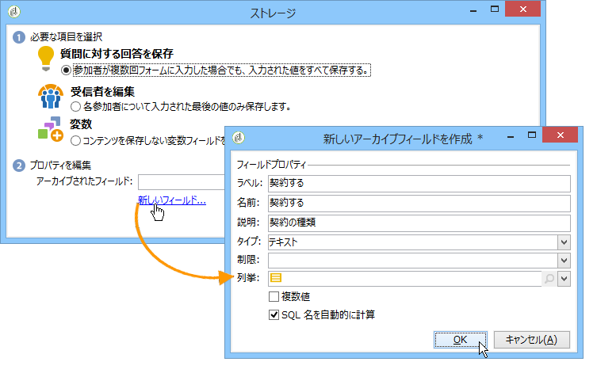

フィールドのラベルと名前を入力し、フィールドの種類を選択します。テキスト、ブール値、整数または10進数、日付など

選択したフィールドのタイプは、回答がユーザーによって入力される際の、データの制御に作用します。テキ **ストフィールドの場合** 、制約（大文字と小文字の区別、書式）を追加したり、既存の列挙にリンクを追加して、強制的に選択することができます。

拘束を追加するには、ドロップダウンリストから拘束を選択します。 2 つのタイプの制約があります。

1. 大文字と小文字

   入力された情報は、すべて大文字、すべて小文字、または先頭文字のみ大文字の形式でフィールドに格納できます。この制約では、ユーザーは選択した形式でデータを入力する必要はありませんが、フィールドに入力されたコンテンツは、保存時に変換されます。

1. データフォーマット

If this field is used in a list, the values of the enumeration can be retrieved automatically in the table of values using the **[!UICONTROL Initialize the list of values from the database]** link above the list of values.

例えば、ユーザーが母国語を選択するためのドロップダウンリストを作成できます。対応するアーカイブされたフィールドは、言語のリストを含む&#x200B;**言語**&#x200B;の列挙と関連付けることができます。

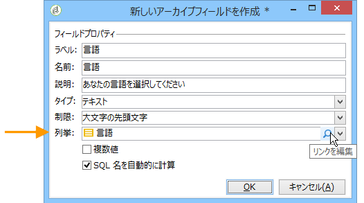

The **[!UICONTROL Edit link]** icon located to the right of the field lets you edit the content of this enumeration:

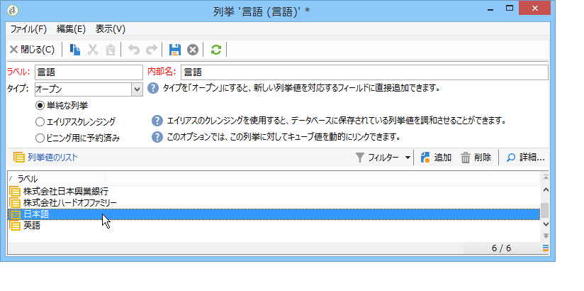

フィールド **[!UICONTROL General]** のタブで、リンクを使用 **[!UICONTROL Initialize the list of values from the database]** して、提供されるラベルのリストを自動的に入力できます。

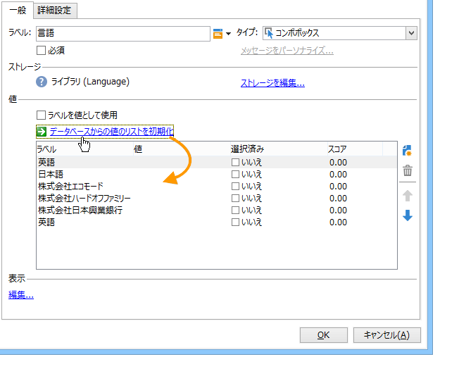

**例**：受信者の契約を 1 つのフィールドに格納します。

1つのフィールドに異なるタイプの契約を保存するには、入力フィールドを作 **[!UICONTROL Text]** 成し、このオプションを選択 **[!UICONTROL Store answers to a question]** します。

Click the **[!UICONTROL New field...]** link and enter the field properties. Select the **[!UICONTROL Multiple values]** option to enable several values to be stored.

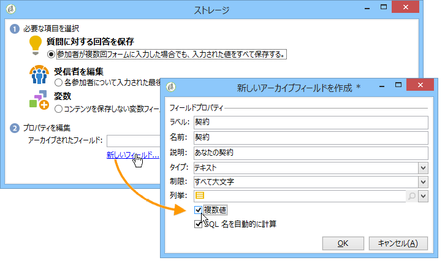

他の契約用の入力フィールドを作成し、同じアーカイブされたフィールドにデータを格納します。

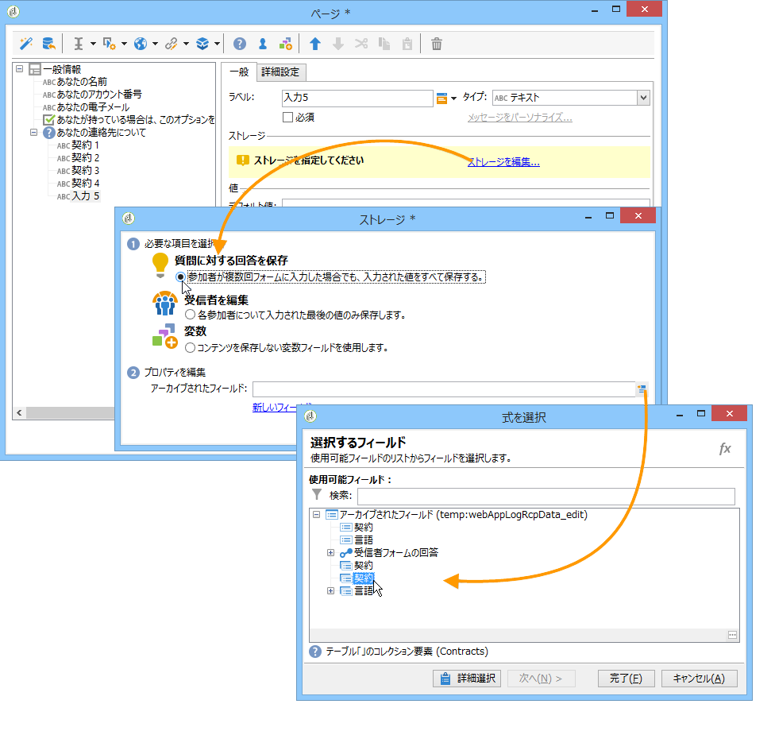

When users approve the survey, their answers will be stored in the **[!UICONTROL Contracts]** field.

この例では、次の回答が格納されます。

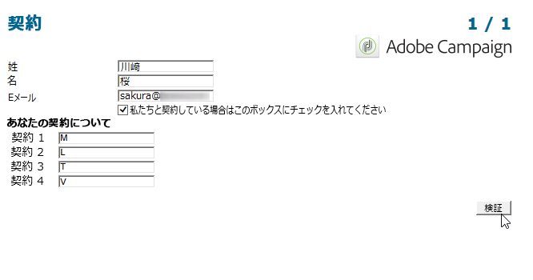

回答者のプロファイルには、入力された 4 つの契約が含まれます。

They can be viewed in the **[!UICONTROL Answers]** tab of the survey by displaying the relevant columns.

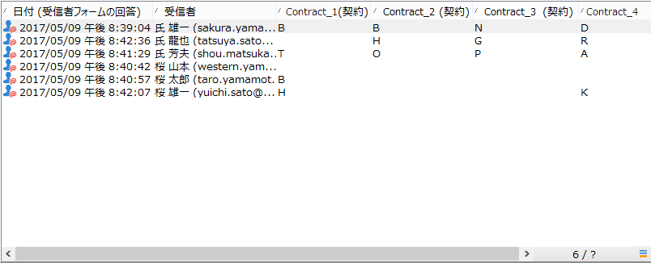

また、回答に基づいて受信者をフィルターして、関心のあるユーザーのみを表示できます。To do this, create a targeting workflow and use the **[!UICONTROL Survey responses]** box.

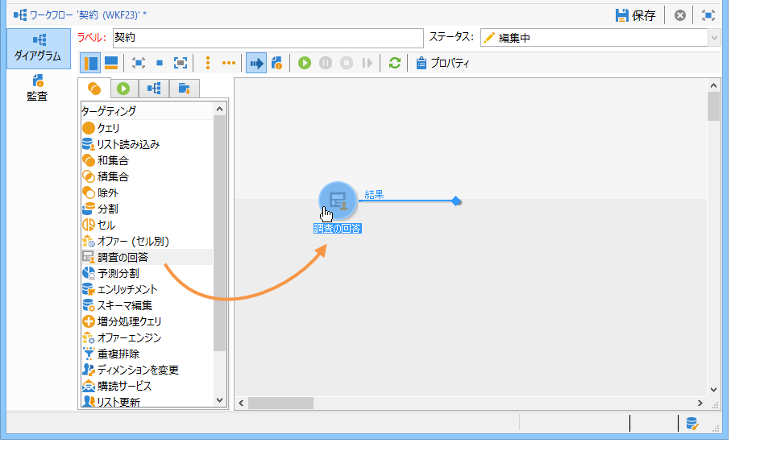

復元するプロファイルに基づいてクエリを作成します。次の例では、クエリによって、A タイプの契約を含む、少なくとも 2 つの契約のあるプロファイルを選択できます。

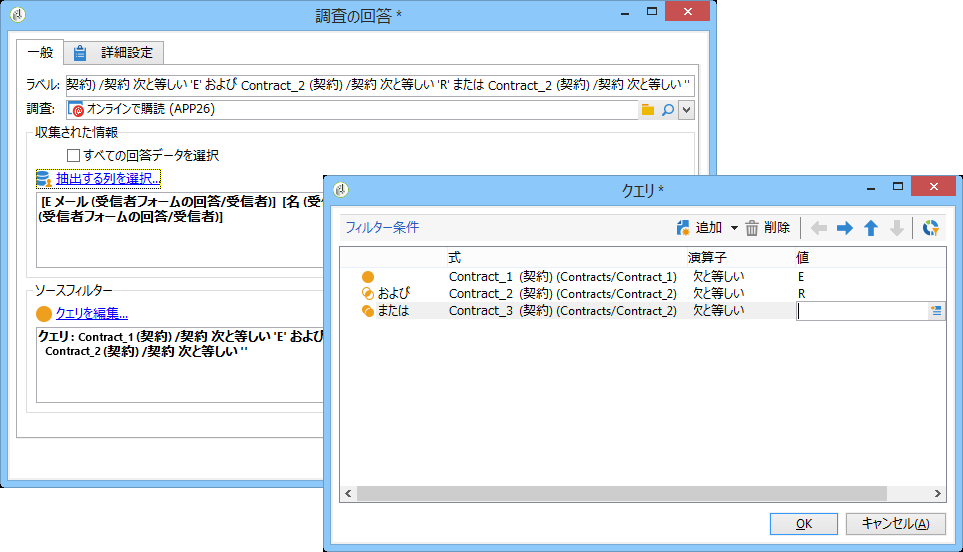

各フォームについて、提供された回答は、フィールドまたはラベルで利用できます。アーカイブされたフィールドに格納された契約に対して、次の構文を使用します。

```
<%= ctx.webAppLogRcpData.name of the archived field %
```

>[!NOTE]
>
>別のタイプのフィールドの場合の構文について詳しくは、[この節](../../platform/using/about-queries-in-campaign.md)を参照してください。

### ストレージ設定 {#storage-settings}

調査の回答を XML 形式でアーカイブできます。This lets you save a raw copy of the answers collected, which can be useful in case of excessive standardization of the data in an itemized list (for more on this, refer to [Standardizing data](../../web/using/publish--track-and-use-collected-data.md#standardizing-data)).

>[!CAUTION]
>
>生の回答のアーカイブは、必要なストレージスペースを大幅に増加させます。このオプションを使用する際は注意してください。

手順は次のとおりです。

* Edit the survey properties via the **[!UICONTROL Properties]** button of the **[!UICONTROL Edit]** tab.
* リンクをクリック **[!UICONTROL Advanced parameters]** し、オプションをオンに **[!UICONTROL Save a copy of raw answers]** します。

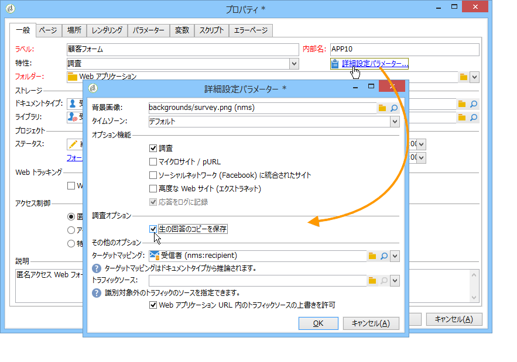

すべての調査に対して、デフォルトで有効にできます（このオプションは、調査がパブリッシュされると適用されます）。これをおこなうには、次に示すように、**[!UICONTROL NmsWebApp_XmlBackup]** オプションを作成して、それに値 &quot;**[!UICONTROL 1]**&quot; を割り当てます。

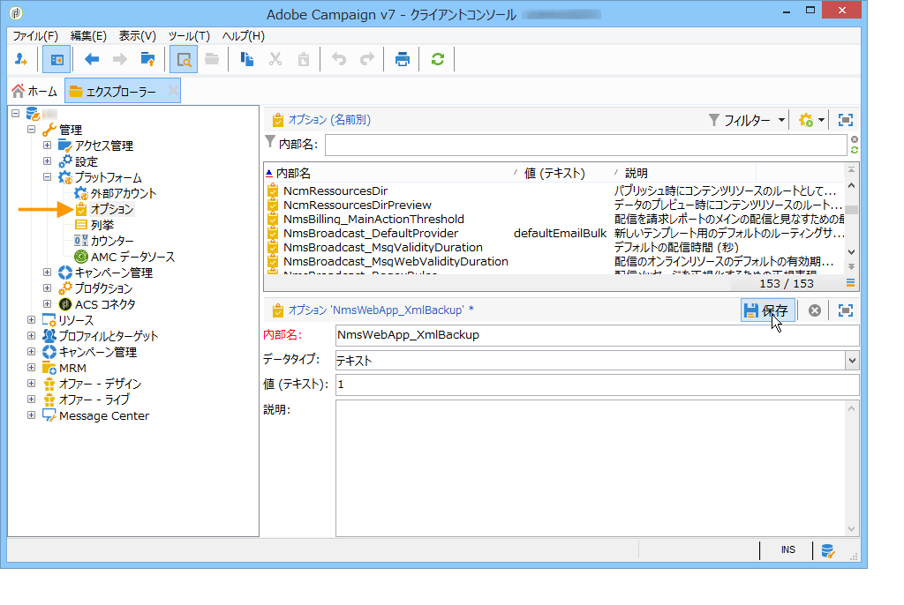

## スコア管理 {#score-management}

フォームのページで提供されたオプションにスコアを割り当てることができます。スコアは、非公開の質問（チェックボックス、ドロップダウンリストからの値、購読など）にのみリンクされていることがあります。

>[!CAUTION]
>
>スコア管理は、**調査**&#x200B;でのみ使用できます。

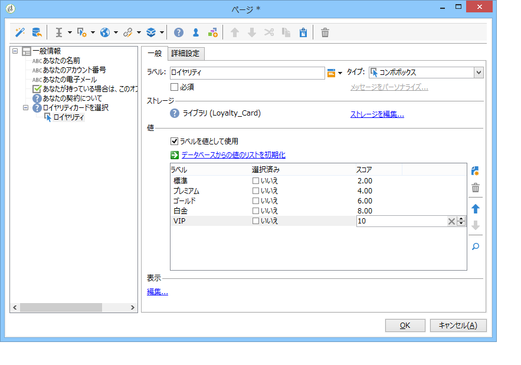

The scores are accumulated and saved on the server side when the page is confirmed, i.e. when the user clicks the **[!UICONTROL Next]** or **[!UICONTROL Finish]** button.

>[!NOTE]
>
>正または負、整数または非整数の値を使用できます。

スコアは、テストまたはスクリプトで使用できます。

>[!CAUTION]
>
>スコアは、同じページにあるフィールドの表示条件には使用できません。ただし、後続のページでは使用できます。

* To use scores in tests, use the **[!UICONTROL Score]** field in the test calculation formula, as shown below:

   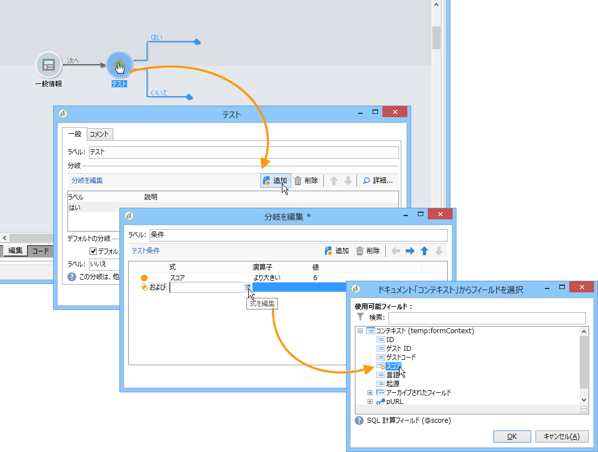

* スコアをスクリプトで使用できます。

**例**：スコアを計算して、次のページの表示の条件として使用します。

* 調査で、次のページを使用すると、ドロップダウンリストで選択した値に応じて、異なるスコアをユーザーに割り当てることができます。

   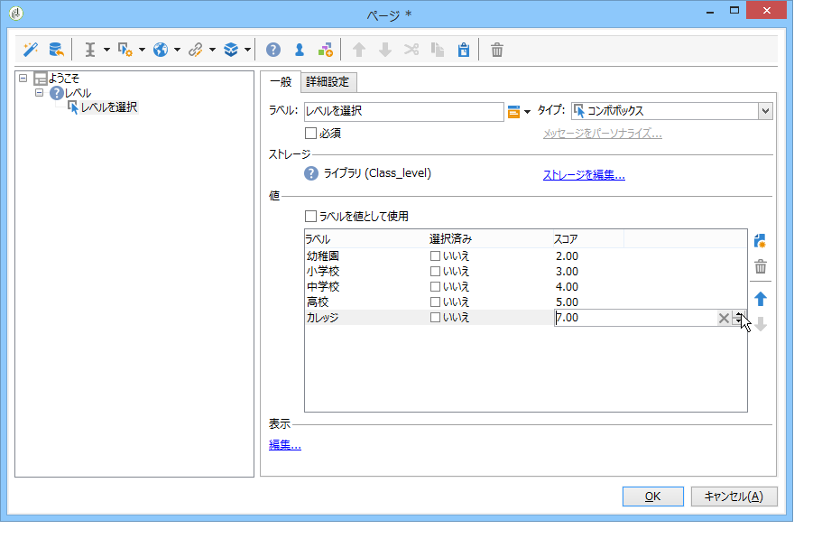

* 選択したオプションに応じて、このスコアを 2 番目の値と組み合わせることができます。

   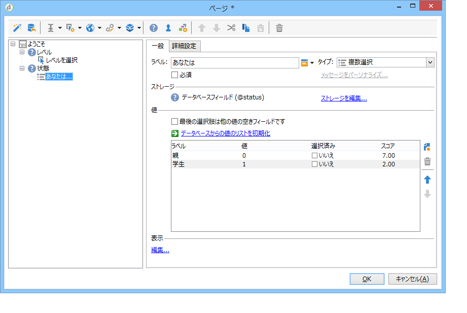

* When the user clicks the **[!UICONTROL Next]** button, the two values are added up.

   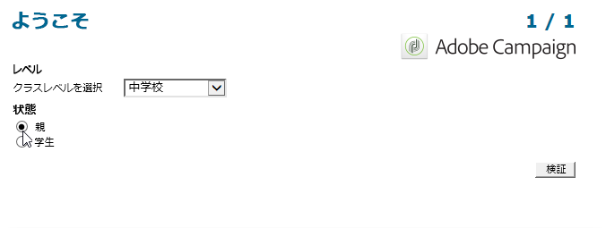

* 条件は、スコアに応じて、表示されるページに適用できます。これは、次のように設定します。

   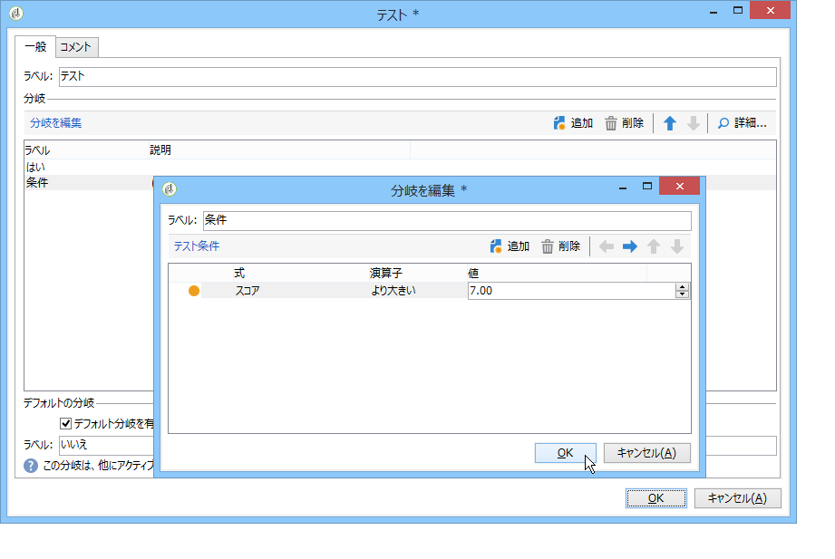

   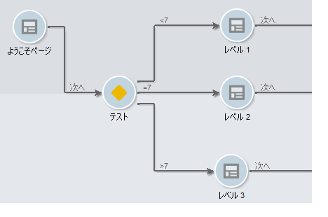

