# Web フォームのパブリッシュ{#publishing-a-web-form}

## フォームデータのプリロード {#pre-loading-the-form-data}

Web フォームを使用して、データベースに格納されたプロファイルを更新する場合、プリロードボックスを使用できます。プリロードボックスを使用すると、データベースで更新されるレコードの検索方法を示すことができます。

次の識別方法が可能です。

* **[!UICONTROL Adobe Campaign の暗号化]**

   この暗号化方法は、暗号化された Adobe Campaign 識別子（ID）を使用します。この方法は、Adobe Campaign オブジェクトにのみ適用でき、暗号化された ID は、Adobe Campaign プラットフォームでのみ生成できます。

   この方法を使用する場合、パラメーター **`<%=escapeUrl(recipient.cryptedId) %>`** を追加することで、フォームの URL を適応させて、E メールアドレスに配信する必要があります。詳しくは、[E メールによるフォームの配信](#delivering-a-form-via-email)を参照してください。

* **[!UICONTROL DES 暗号化]**

   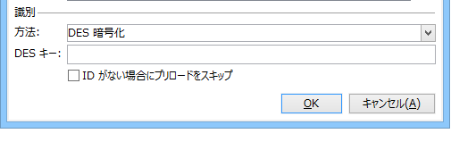

   この暗号化方法は、外部的に提供される識別子（ID）を使用し、Adobe Campaign および外部プロバイダーによって共有されるキーにリンクされます。**[!UICONTROL DES キー]**&#x200B;フィールドを使用すると、この暗号化キーを入力できます。

* **[!UICONTROL フィールドのリスト]**

   このオプションを使用すると、フォームの現在のコンテキストのフィールドから選択でき、データベースの対応するプロファイルを検索するために使用されます。

   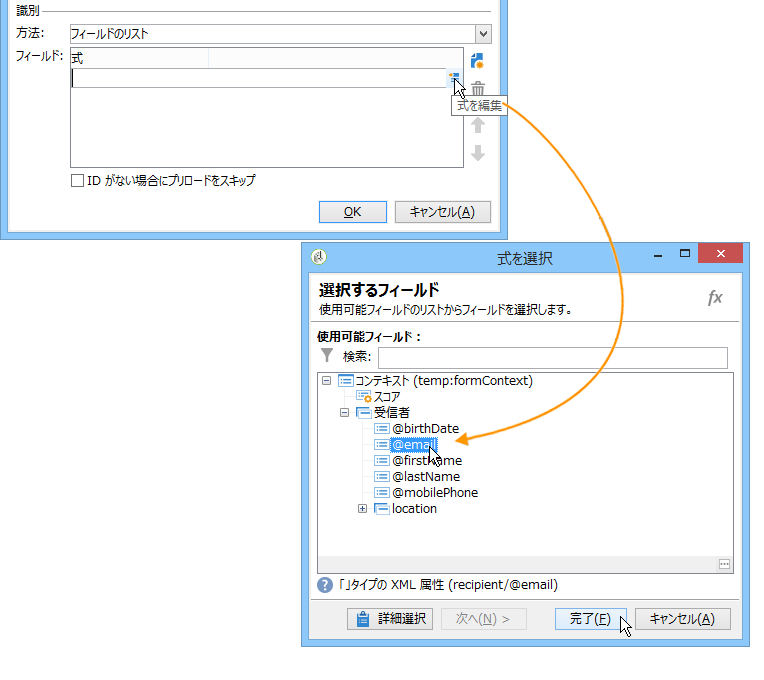

   フィールドは、「**[!UICONTROL パラメーター]**」タブを使用してフォームプロパティに追加できます（[パラメーターの追加](../../web/using/defining-web-forms-properties.md#adding-parameters)を参照）。フォーム URL または入力ゾーンに配置されます。

   >[!CAUTION]
   >
   >選択されたフィールドのデータは、暗号化されません。「**[!UICONTROL フィールドリスト]**」オプションが選択されている場合、Adobe Campaign で復号化できないので、暗号化されたフォームで提供しないようにする必要があります。

   次の例では、プリロードされるプロファイルは E メールアドレスに基づいています。

   ユーザーが関連するページに直接アクセスできる場合、URL には、暗号化されていない E メールアドレスを含めることができます。

   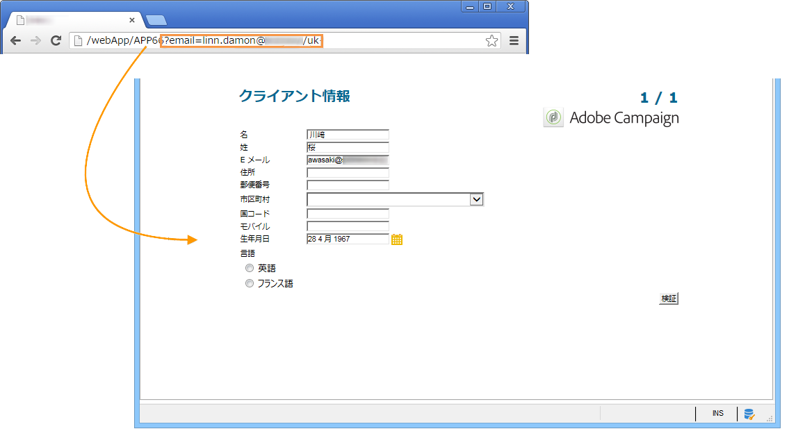

   そうでない場合、パスワードが求められます。

   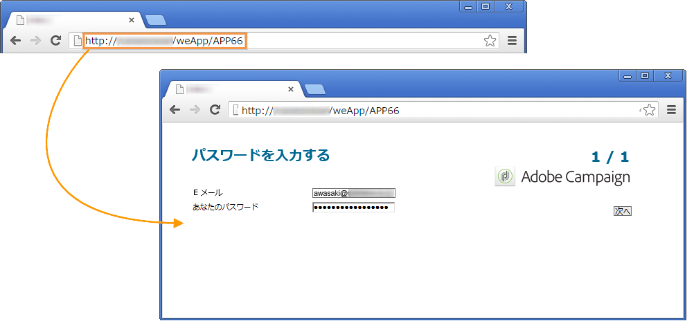

   >[!CAUTION]
   >
   >いくつかのフィールドがリストで指定されている場合、プロファイルをアップロードするために、**すべてのフィールド**&#x200B;のデータがデータベースに格納されたデータと一致する必要があります。そうでない場合、新しいプロファイルが作成されます。
   > 
   >この機能は、Web アプリケーションで特に便利ですが、パブリックフォームにはお勧めしません。選択したアクセス制御オプションは、「アクセス制御を有効にする」が選択されている必要があります。

プロファイルを更新しない場合、「**[!UICONTROL ID がない場合にプリロードをスキップ]**」オプションが選択されている必要があります。この場合、入力した各プロファイルは、フォームの承認後にデータベースに追加されます。例えば、フォームが Web サイトに投稿される際に、このオプションが使用されます。

「**[!UICONTROL フォームで参照されるデータを自動読み込み]**」オプションを使用すると、フォームの入力および結合フィールドに一致するデータを自動的にプリロードします。ただし、**[!UICONTROL スクリプト]**&#x200B;および&#x200B;**[!UICONTROL テスト]**&#x200B;アクティビティで参照されるデータは、関係ありません。このオプションが選択されていない場合、「**[!UICONTROL 追加データを読み込み]**」オプションを使用するフィールドを定義する必要があります。

「**[!UICONTROL 追加データを読み込み]**」オプションを使用すると、フォームのページで使用しない情報を追加できますが、それにも関わらずプリロードされます。

例えば、受信者の性別をプリロードして、テストボックスを使用して適切なページに自動的に導くことができます。

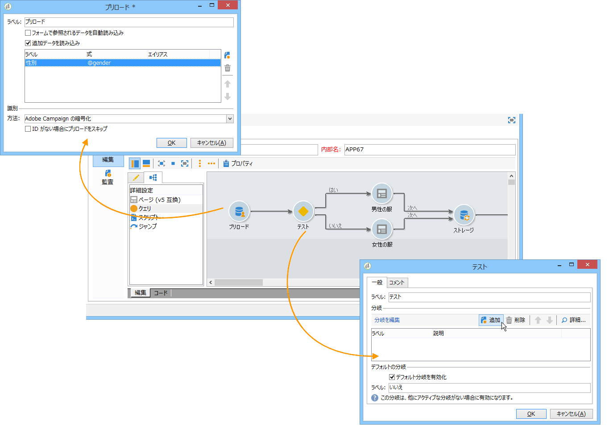

## Web フォームの配信とトラッキングの管理 {#managing-web-forms-delivery-and-tracking}

フォームを作成、設定およびパブリッシュしたら、フォームを配信して回答をトラッキングできます。

### フォームのライフサイクル {#life-cycle-of-a-form}

フォームのライフサイクルには、次の 3 つのステージがあります。

1. **フォーム編集中**

   これは、最初のデザインフェーズです。新しいフォームが作成されると、編集フェーズになります。テスト目的でのみ、フォームにアクセスし、パラメーター **[!UICONTROL __uuid]** をその URL で使用する必要があります。この URL は、「**[!UICONTROL プレビュー]**」サブタブでアクセスできます。[フォーム URL パラメーター](../../web/using/defining-web-forms-properties.md#form-url-parameters)を参照してください。

   >[!CAUTION]
   >
   >フォームが編集されている限り、そのアクセス URL は、特別な URL です。

1. **フォームオンライン**

   デザインフェーズが完了すると、フォームは配信できます。最初に、パブリッシュする必要があります。詳しくは、[フォームのパブリッシュ](#publishing-a-form)を参照してください。

   フォームは、有効期限が切れるまで、**[!UICONTROL ライブ]**&#x200B;になります。

   >[!CAUTION]
   >
   >配信するには、調査の URL には、**[!UICONTROL __uuid]** パラメーターを含めないようにする必要があります。

1. **フォーム使用不可**

   フォームが閉じられると、配信フェーズが終了し、フォームは使用できなくなり、ユーザーはフォームにアクセスできなくなります。

   期日は、フォームプロパティウィンドウで定義できます。詳しくは、[フォームをオンラインで利用できるようにする](#making-a-form-available-online)を参照してください。

フォームのパブリッシュステータスがフォームのリストに表示されます。

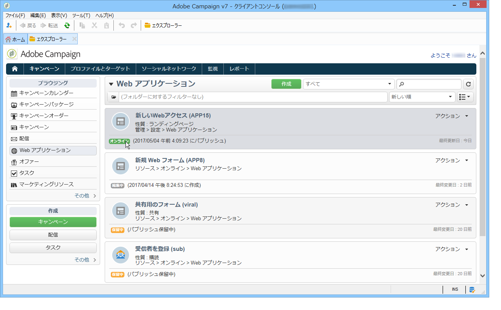

### フォームのパブリッシュ {#publishing-a-form}

フォームの状態を変更するには、パブリッシュする必要があります。これをおこなうには、Web フォームのリストの上にある「**[!UICONTROL パブリケーション]**」ボタンをクリックして、ドロップダウンボックスで状態を選択します。

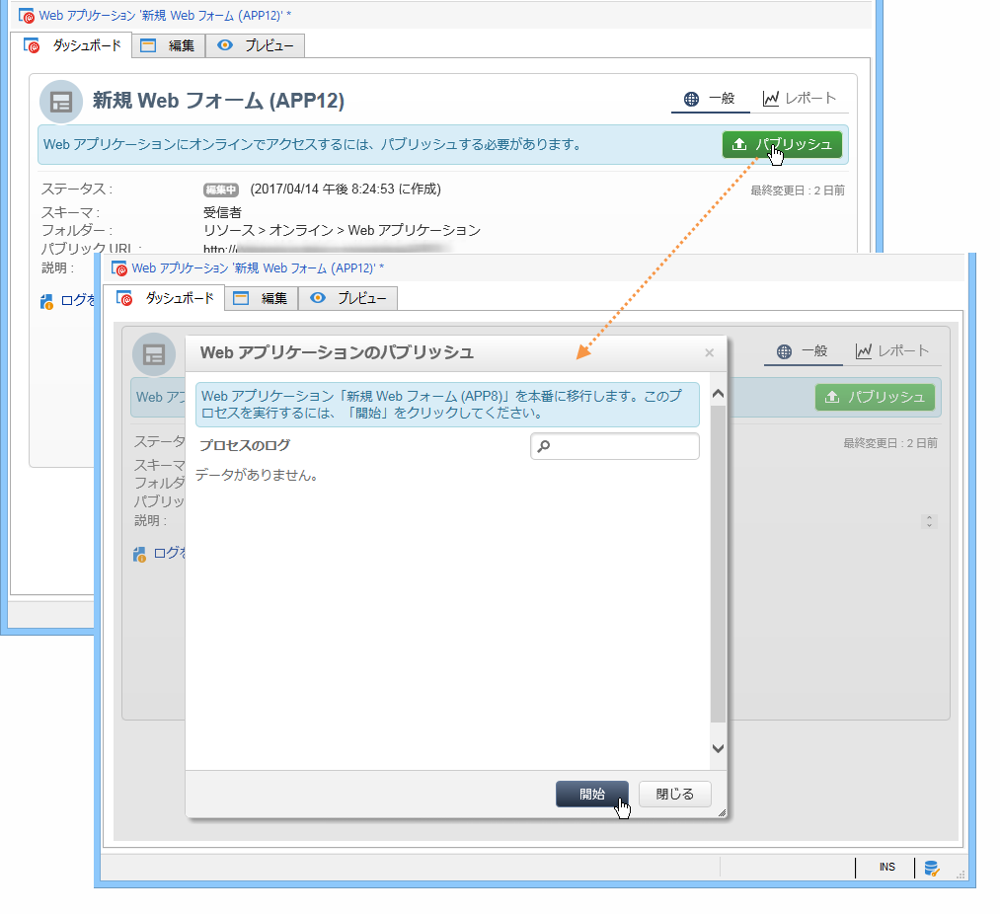

### フォームをオンラインで利用できるようにする {#making-a-form-available-online}

ユーザーがアクセスできるようにするためには、フォームは、本番で開始される必要があります。つまり、有効期間内にある必要があります。有効な日付は、フォームの「**[!UICONTROL プロパティ]**」リンクを使用して入力します。

* 「**[!UICONTROL プロジェクト]**」セクションのフィールドを使用して、フォームの開始および終了日を入力します。

   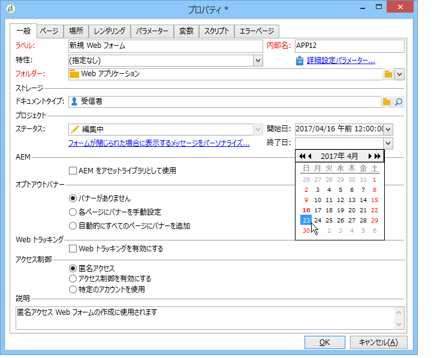

* 「**[!UICONTROL フォームが閉じられた場合に表示するメッセージをパーソナライズ...]**」リンクをクリックし、有効となっていないフォームにユーザーがアクセスしようとした場合に表示するエラーメッセージを定義します。

   [フォームのアクセシビリティ](../../web/using/defining-web-forms-properties.md#accessibility-of-the-form)を参照してください。

### E メールによるフォームの配信 {#delivering-a-form-via-email}

E メールで招待状を配信する場合、データの紐付けに「**[!UICONTROL Adobe Campaign の暗号化]**」オプションを使用できます。これをおこなうには、配信ウィザードに移動して、次のパラメーターを追加することで、リンクをフォームに適応させます。

```
<a href="https://server/webApp/APP264?&id=<%=escapeUrl(recipient.cryptedId) %>">
```

この場合、データストレージの紐付けキーは、受信者の暗号化された識別子である必要があります。詳しくは、[フォームデータのプリロード](#pre-loading-the-form-data)を参照してください。

この場合、レコードボックスの「**[!UICONTROL プリロードされたレコードを更新]**」オプションをチェックする必要があります。詳しくは、[Web フォームの回答の保存](../../web/using/web-forms-answers.md#saving-web-forms-answers)を参照してください。

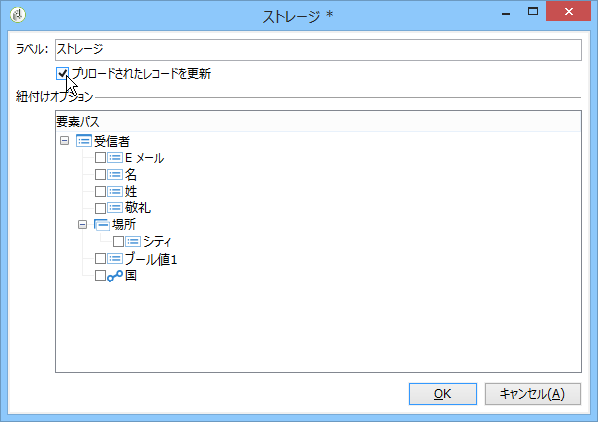

### 応答をログに記録 {#log-responses}

回答のトラッキングを専用のタブで有効化すると、Web フォームの影響を監視することができます。これをおこなうには、フォームプロパティウィンドウの「**[!UICONTROL 詳細設定パラメーター]**」リンクをクリックして、「**[!UICONTROL 回答をログに記録]**」オプションを選択します。

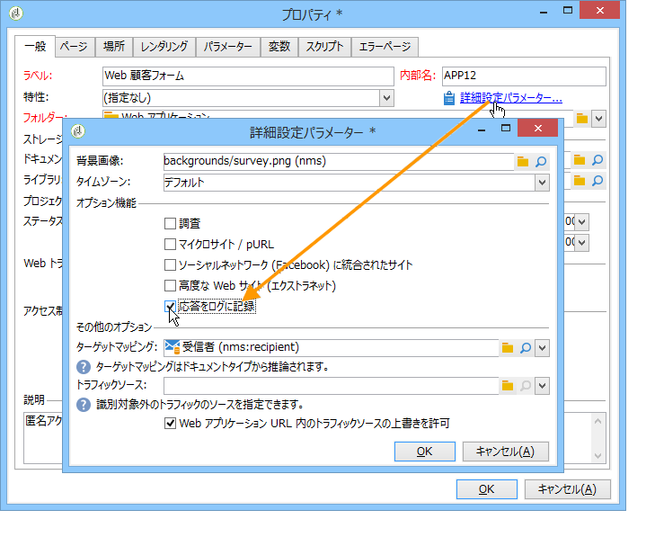

「**[!UICONTROL 回答]**」タブが表示され、回答者の ID を表示できます。

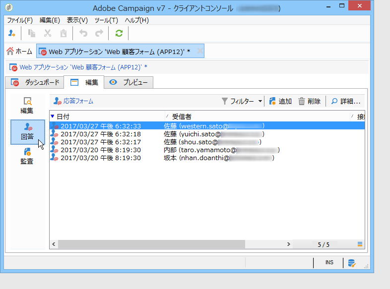

受信者を選択し、「**[!UICONTROL 詳細...]**」ボタンをクリックして提供された回答を表示します。

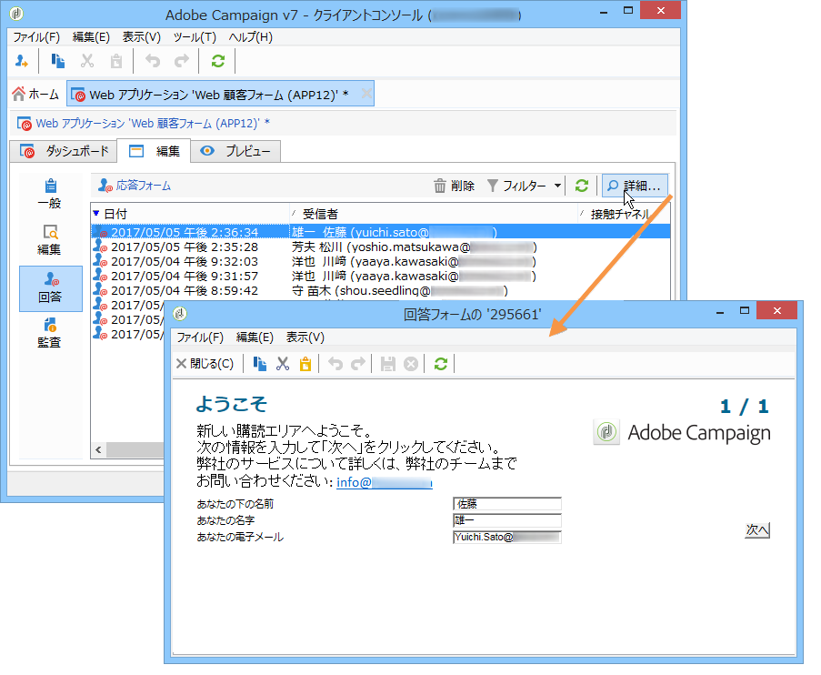

例えば、リマインダーの送信時に非回答者のみをターゲットにしたり、回答者のみに特別なコミュニケーションを提供したりするために、クエリで提供された回答ログを処理できます。

>[!NOTE]
>
>提供された回答を完全にトラッキングし、回答をエクスポートして、専用のレポートを表示または作成するには、オプションの&#x200B;**調査**&#x200B;モジュールを使用します。詳しくは、[この節](../../web/using/about-surveys.md)を参照してください。

