# Web フォームの静的要素{#static-elements-in-a-web-form}

フォームのページにユーザーインタラクションのない要素を含めることができます。これらは、画像、HTML コンテンツ、横棒またはハイパーリンクなどの、静的要素です。These elements are created via the first button in the toolbar, by clicking the **[!UICONTROL Add static element]** menu.

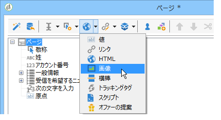

次のフィールドのタイプを使用できます。

* （フォームのコンテキストで）以前提供した回答またはデータベースに基づく値。
* ハイパーリンク、HTML、横棒。詳しくは、HTML [コンテンツの挿入を参照してくださ](#inserting-html-content)い。
* リソースライブラリまたはユーザーがアクセスできるサーバーに保存された画像。詳しくは、イ [メージの挿入を参照してくださ](#inserting-images)い。
* クライアント側またはサーバー側で実行されたスクリプト。クライアント側で適切に実行するには、JavaScript で記述され、ほとんどのブラウザーとの互換性が必要です。

   >[!NOTE]
   >
   >サーバー側では、スクリプトは、Adobe Campaign が提供する [Campaign JSAPI ドキュメント](http://docs.campaign.adobe.com/doc/AC/en/jsapi/index.html)で定義された関数を使用できます。

## HTML コンテンツの挿入 {#inserting-html-content}

フォームページに、ハイパーテキストリンク、画像、書式設定された段落、ビデオまたは Flash オブジェクトなどの HTML コンテンツを含めることができます。

HTML エディターを使用すると、コンテンツを入力して、フォームページに挿入できます。エディターを開くには、に進みま **[!UICONTROL Static elements>HTML]** す。

コンテンツを直接入力および書式設定したり、ソースコードウィンドウを表示して、一部の外部コンテンツを貼り付けたりできます。「ソースコード」モードに切り替えるには、ツールバーの最初のアイコンをクリックします。

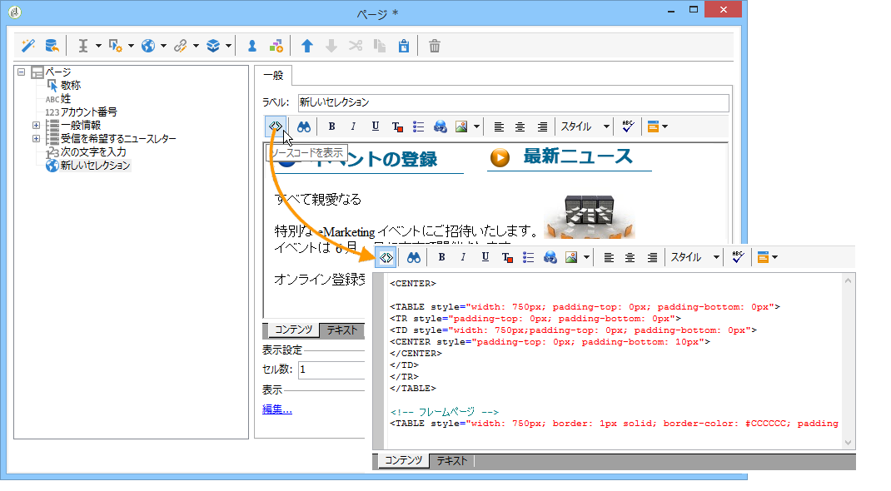

データベースフィールドを挿入するには、パーソナライゼーションボタンを使用します。

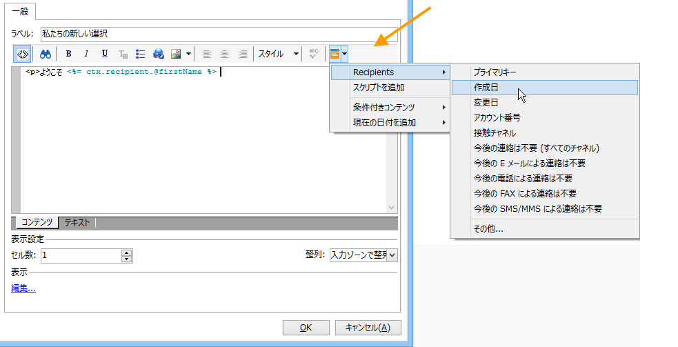

>[!NOTE]
>
>The strings entered in the HTML editor are only translated if they are defined in the **[!UICONTROL Texts]** sub-tab. そうでない場合、収集されません。For more on this, refer to [Translating a web form](../../web/using/translating-a-web-form.md).

### リンクの挿入 {#inserting-a-link}

次の例のように、編集ウィンドウのフィールドに入力します。

ハイパーテキストリンクを追加するには、に進みま **[!UICONTROL Static elements>Link]**&#x200B;す。

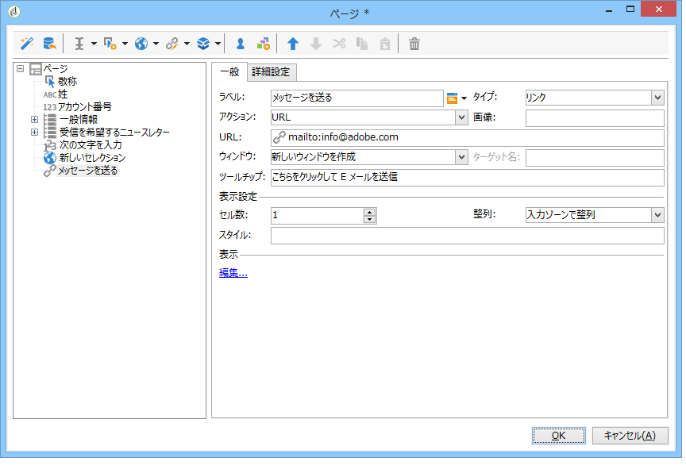

* The **[!UICONTROL Label]** is the content of the hypertext link as it will be displayed on the form page.
* は **[!UICONTROL URL]** 目的のアドレスです。例：https://www.adobe.com [(Webサイトの場合](https://www.adobe.com) )またはinfo@adobe.com [(メッセージを送信する場合](mailto:info@adobe.com) )。
* The **[!UICONTROL Window]** field lets you select the display mode for the link in the case of a site. リンクを新しいウィンドウで開いたり、現在のウィンドウで開いたり、別のウィンドウで開いたりできます。
* 次に示すように、ツールチップを追加できます。

   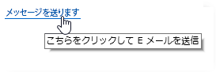

* リンクをボタンとして表示するか、画像として表示するかを選択できます。To do this, select the type of display in the **[!UICONTROL Type]** field.

### リンクのタイプ {#types-of-links}

デフォルトでは、リンクは、リンク先アドレスが「URL」フィールドに入力できるように、URL タイプのアクションに関連付けられています。

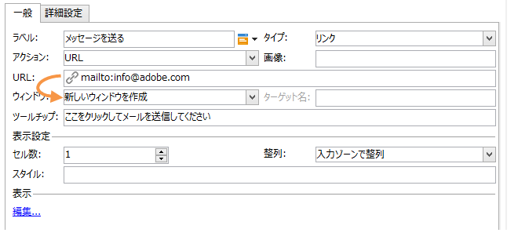

ユーザーがリンクをクリックして次のアクションをおこなえるように、リンクに別のアクションを定義できます。

* ページの更新

   To do this, select the **[!UICONTROL Refresh page]** option in the drop-down box of the **[!UICONTROL Action]** field.

   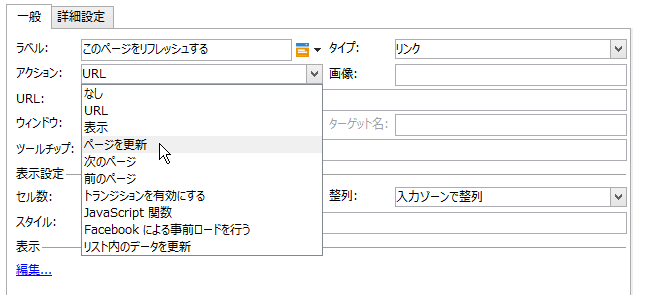

* 次／前のページの表示

   To do this, select the **[!UICONTROL Next page]** or **[!UICONTROL Previous page]** option in the drop-down box of the **[!UICONTROL Action]** field.

   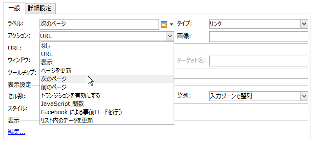

   You can hide the **[!UICONTROL Next]** and/or **[!UICONTROL Back]** buttons if they are to be replaced by a link. この[ページ](../../web/using/defining-web-forms-page-sequencing.md)を参照してください。

   The link will replace the **[!UICONTROL Next]** button used by default.

   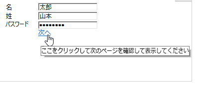

* 別のページの表示

   The **[!UICONTROL Enable a transition]** option lets you display a specific page associated with the outgoing transition selected in the **[!UICONTROL Transition]** field.

   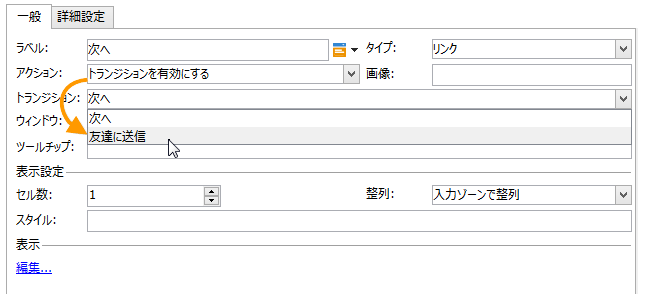

   デフォルトでは、ページには 1 つのアウトバウンドトランジションのみがあります。To create new transitions, select the page and then click the **[!UICONTROL Add]** button in the **[!UICONTROL Output transitions]** section, as shown below:

   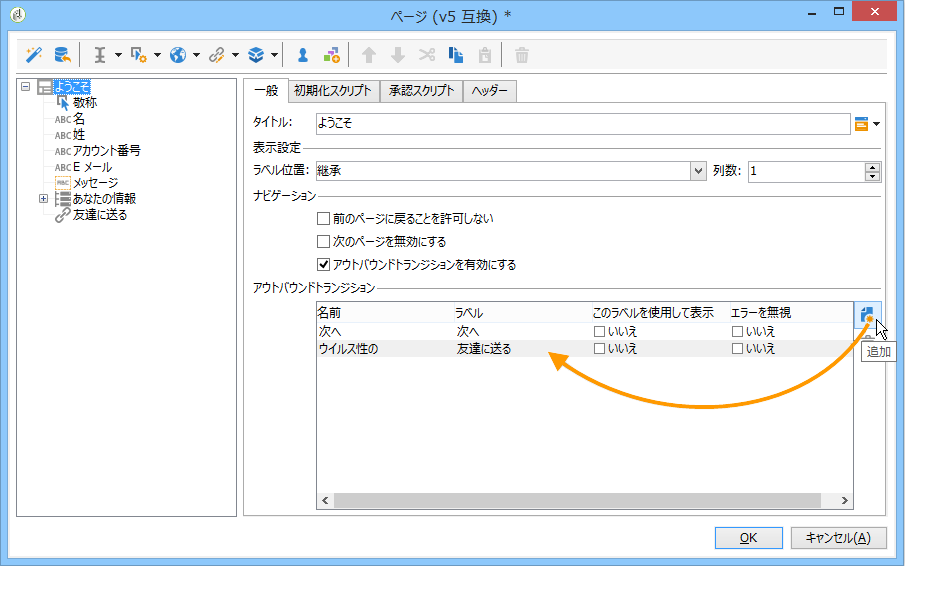

   ダイアグラムでは、この追加は次のように表示されます。

   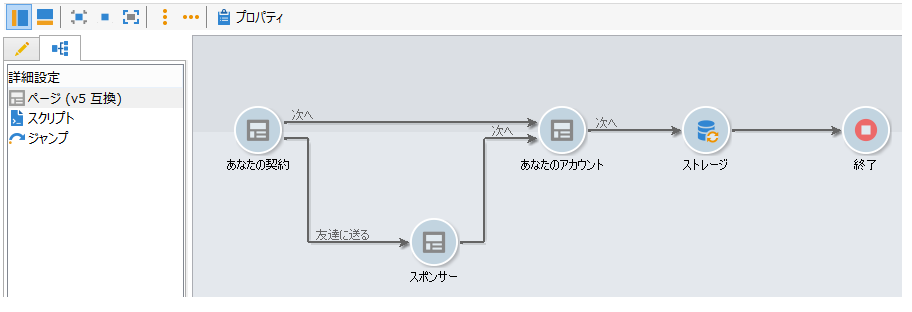

   >[!NOTE]
   >
   >Webフォームでのページ順序付けの詳細については、「Webフォームページ順 [序の定義」を参照してください](../../web/using/defining-web-forms-page-sequencing.md)。

* Facebook プロファイルから取得したデータによるフォームのフィールドのプリロード

   >[!CAUTION]
   >
   >この機能は、**[!UICONTROL Social Marketing]** アプリケーションがインストールされている場合にのみ使用できます。このオプションを使用するには、**[!UICONTROL Facebook Connect]** タイプの外部アカウントと連動する Facebook アプリケーションを作成する必要があります。詳しくは、[このページ](../../social/using/creating-a-facebook-application.md#configuring-external-accounts)を参照してください。

   The **[!UICONTROL Preload with Facebook]** option lets you insert a button into a form to preload fields using Facebook profile information.

   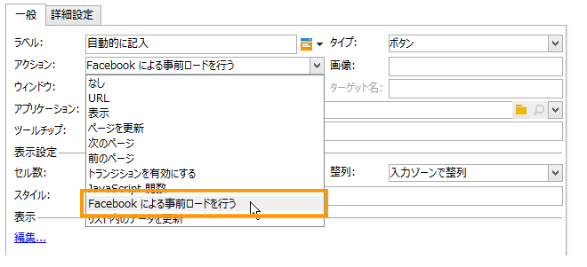

   When a user clicks the **[!UICONTROL Fill in automatically]** button, the Facebook request for permission window opens.

   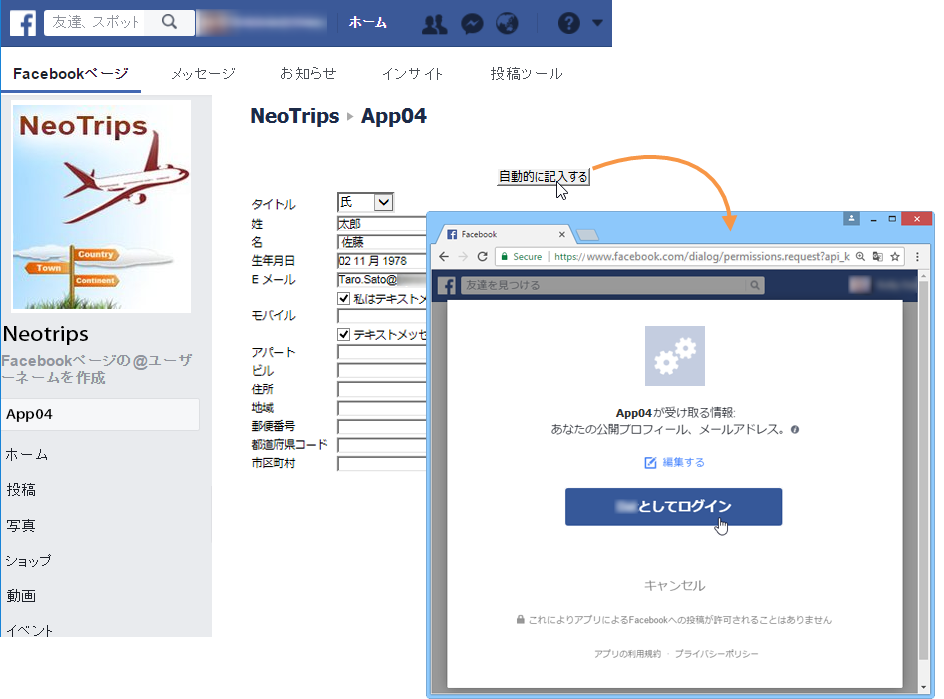

   >[!NOTE]
   >
   >外部アカウントの設定時に拡張された権限のリストを変更できます。拡張された権限を入力しない場合、Facebook は、デフォルトでは、基本プロファイル情報を転送します。\
   >拡張権限とその構文のリストを表示するには、次をクリックします。https://developers.facebook.com/docs/reference/api/permissions/ [](https://developers.facebook.com/docs/reference/api/permissions/)

   ユーザーが情報の共有に同意すれば、フォームのフィールドにプリロードされます。

   

この事例では、次の要素で構成された Web アプリケーションを作成しました。

* フォームを含むページ
* 活 **[!UICONTROL Record]** 動
* 活 **[!UICONTROL End]** 動

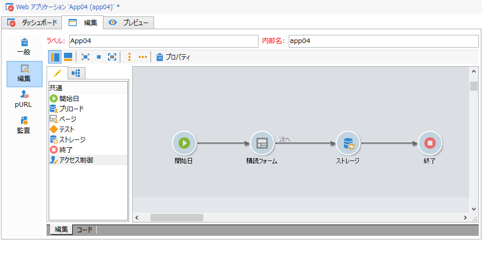

プリロードボタンを追加するには、次の手順に従います。

1. フォームを作成します。

   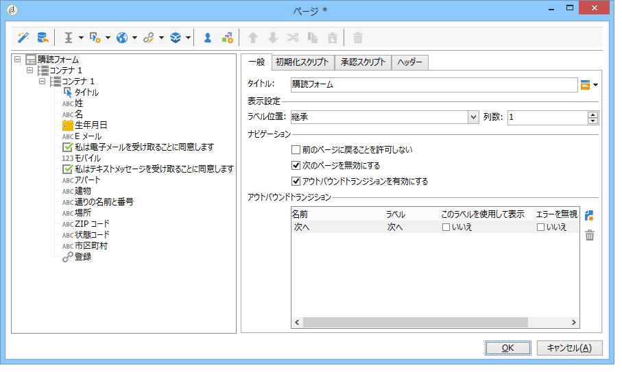

1. フォームのフィールドと同じレベルに移動し、リンクを追加します。

   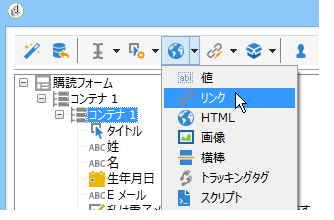

1. Enter the label and select the **[!UICONTROL Button]** type.

   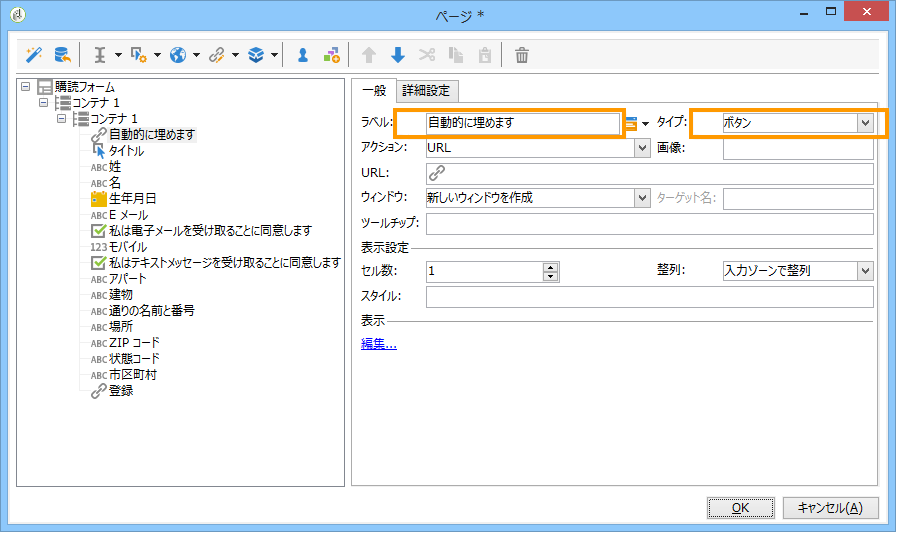

1. フィールドに移動 **[!UICONTROL Action]** し、を選択しま **[!UICONTROL Preload with Facebook]**&#x200B;す。

   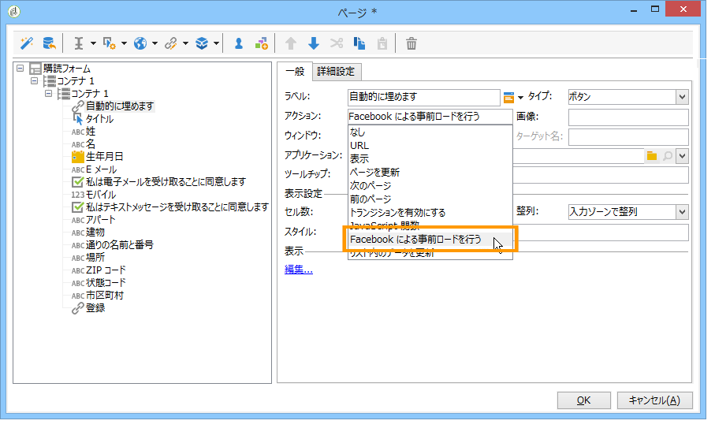

1. Go to the **[!UICONTROL Application]** field and select the **[!UICONTROL Facebook Connect]** type external account created previously. 詳しくは、[このページ](../../social/using/creating-a-facebook-application.md#configuring-external-accounts)を参照してください。

   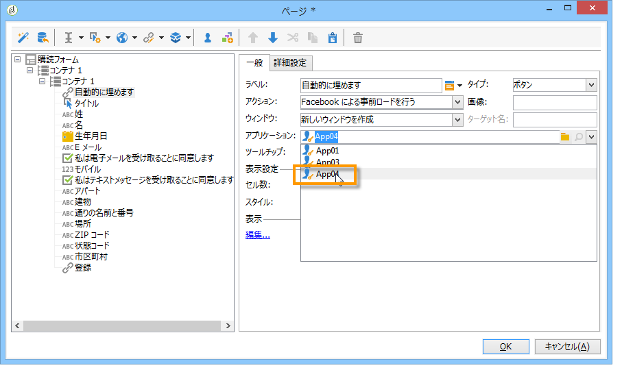

### HTML コンテンツのパーソナライゼーション {#personalizing-html-content}

フォームページの HTML コンテンツを前のページで記録したデータでパーソナライズできます。例えば、自動車保険の Web フォームを作成して、最初のページで連絡先情報および自動車のブランドを提供できます。

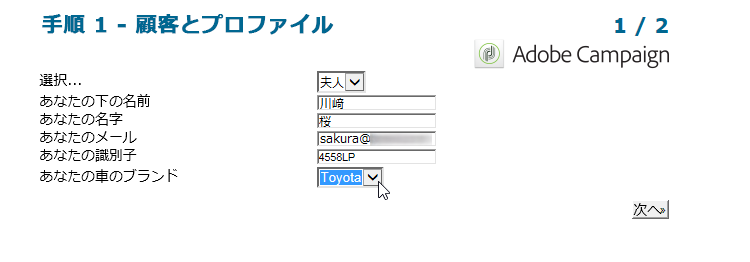

パーソナライゼーションフィールドを使用して、ユーザー名と選択したブランドを次のページに再挿入できます。使用する構文は、情報ストレージモードによって異なります。詳しくは、「収集した情報の使用」を [参照してください](../../web/using/web-forms-answers.md#using-collected-information)。

>[!NOTE]
>
>For security reasons, the value entered in the **`<%=`** formula is replaced with escape characters. To avoid this, and only when necessary, use the following syntax: **`<%=`**.

この例では、受信者の姓と名がデータベースのフィールドに格納され、自動車のブランドが変数に格納されます。ページ 2 でパーソナライズされたメッセージの構文は、次のようになります。

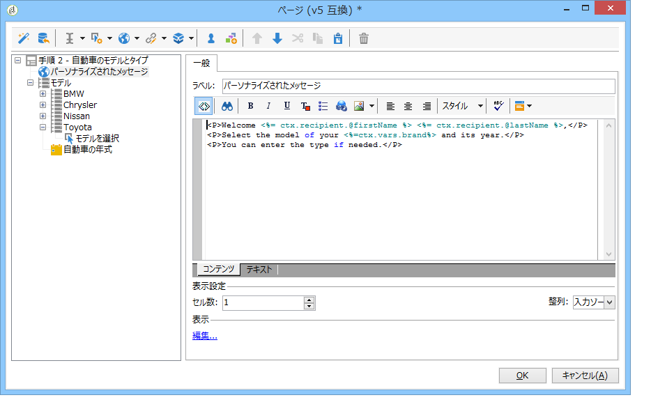

```
<P>Welcome <%= ctx.recipient.@firstName %> <%= ctx.recipient.@lastName %>,</P>
<P>To start your customized study, please select your car <%=ctx.vars.marque%> and its year of purchase.</P>
```

これにより、次のような結果が導かれます。

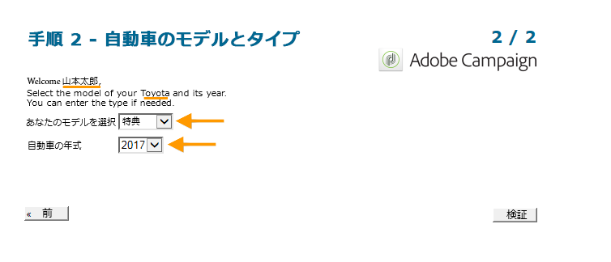

### テキスト変数の使用 {#using-text-variables}

The **[!UICONTROL Text]** tab lets you create variable fields which can be used in the HTML between the &lt;%= and %> characters with the following syntax: **$(IDENTIFIER)**.

この方法を使用すると、文字列を容易にローカライズできます。See [Translating a web form](../../web/using/translating-a-web-form.md)

例えば、「最終コンタクト日：」という文字列を HTML コンテンツに表示できる、**Contact** フィールドを作成できます。これをおこなうには、以下の手順に従います。

1. Click on the **[!UICONTROL Text]** tab of the HTML text.
1. アイコンをクリッ **[!UICONTROL Add]** クします。
1. In the **[!UICONTROL Identifier]** column, enter the name of the variable
1. In the **[!UICONTROL Text]** column, enter the default value.

   

1. HTML コンテンツでは、**&lt;%= $(Contact) %>** 構文を使用してこのテキスト変数を挿入できます。

   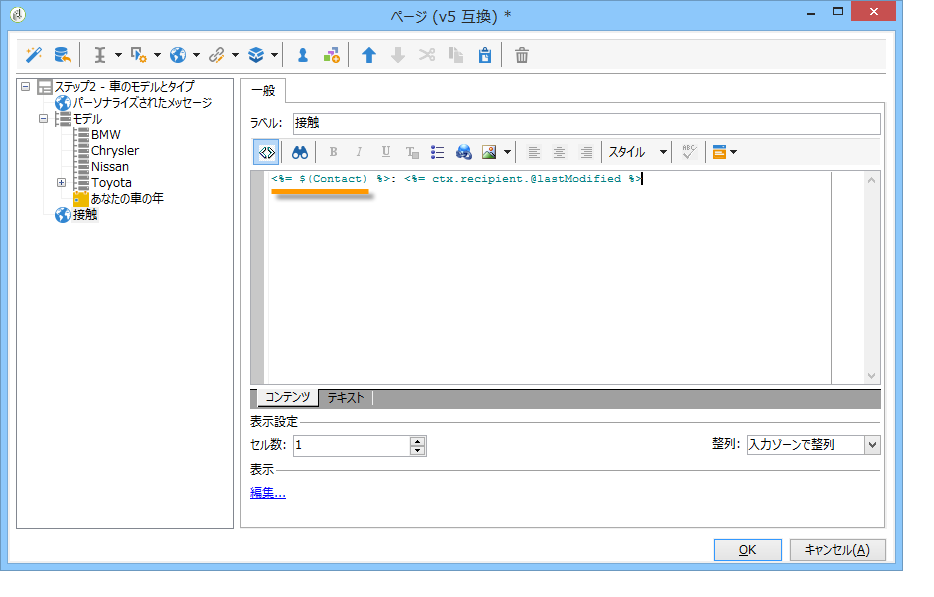

   >[!CAUTION]
   >
   >HTML エディターにこれらの文字を入力する場合、**&lt;** および **>** フィールドは、エスケープ文字で置き換えられます。In this case, you need to correct the source code by clicking the **[!UICONTROL Display source code]** icon of the HTML text editor.

1. Open the **[!UICONTROL Preview]** label of the form to view the value entered in the HTML:

   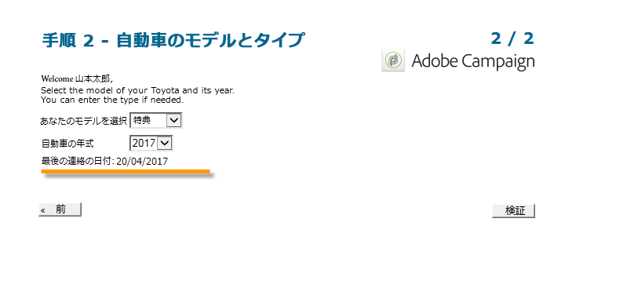

この操作モードを使用すると、Web フォームのテキストを分解し、統合された翻訳ツールを使用して翻訳を管理できます。For more on this, refer to [Translating a web form](../../web/using/translating-a-web-form.md).

## 画像の挿入 {#inserting-images}

画像をフォームに含める場合、外部からアクセス可能なサーバーに保存されている必要があります。

メニューを選択 **[!UICONTROL Static elements>Image]** します。

挿入する画像のソースを選択します。パブリックリソースライブラリから取得したり、外部からアクセス可能なサーバーに保存したりできます。

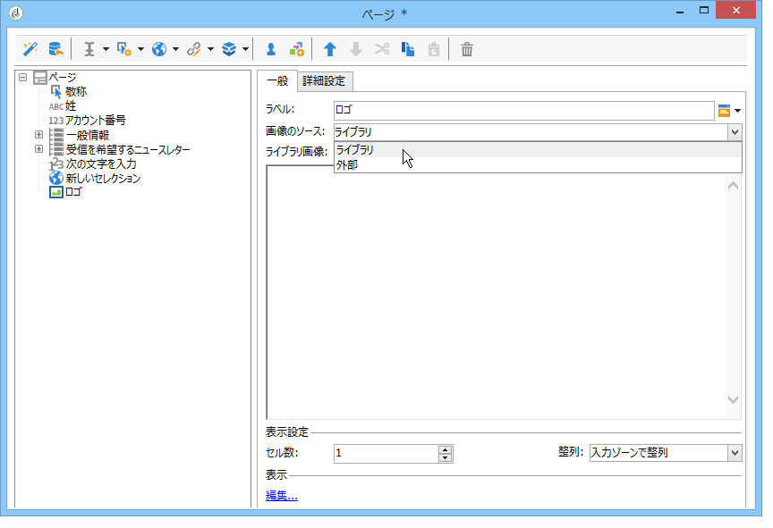

ライブラリからの画像の場合、フィールドのコンボボックスで選択します。外部ファイルにある場合、アクセスパスを入力します。ラベルは、画像にマウスポインターを重ねるか、画像が表示されない場合に表示されます（HTML の ALT フィールドと同じ）。

画像は、エディター中央のセクションに表示できます。
