<?xml version="1.0" encoding="UTF-8"?>
<xliff xmlns="urn:oasis:names:tc:xliff:document:1.2" xmlns:okp="okapi-framework:xliff-extensions" xmlns:its="http://www.w3.org/2005/11/its" xmlns:itsxlf="http://www.w3.org/ns/its-xliff/" version="1.2" its:version="2.0">
<file original="help/web/using/static-elements-in-a-web-form.md.mdsc" source-language="en-US" target-language="en-XX" datatype="x-text/markdown">
<body>
<trans-unit id="tu15" xml:space="preserve">
<source xml:lang="en-US">https://experienceleague.adobe.com/en/tools/campaign-api</source>
<target xml:lang="en-XX">https://experienceleague.adobe.com/ja/tools/campaign-api</target>
</trans-unit>
<trans-unit id="tu31" xml:space="preserve">
<source xml:lang="en-US">https://www.adobe.com</source>
<target xml:lang="en-XX">https://www.adobe.com/jp</target>
</trans-unit>
<trans-unit id="tu1" restype="x-YAML_METADATA_HEADER_VALUE" xml:space="preserve">
<source xml:lang="en-US">Static elements in a web form</source>
<target xml:lang="en-XX">Web フォームの静的要素</target>
</trans-unit>
<trans-unit id="tu2" restype="x-YAML_METADATA_HEADER_VALUE" xml:space="preserve">
<source xml:lang="en-US">Static elements in a web form</source>
<target xml:lang="en-XX">Web フォームの静的要素</target>
</trans-unit>
<trans-unit id="tu3" xml:space="preserve">
<source xml:lang="en-US">Also applies to v8</source>
<target xml:lang="en-XX">v8 にも適用されます</target>
</trans-unit>
<trans-unit id="tu4" xml:space="preserve">
<source xml:lang="en-US">Also applies to Campaign v8</source>
<target xml:lang="en-XX">Campaign v8 にも適用されます</target>
</trans-unit>
<trans-unit id="tu5" xml:space="preserve">
<source xml:lang="en-US">Static elements in a web form</source>
<target xml:lang="en-XX">Web フォームの静的要素</target>
</trans-unit>
<trans-unit id="tu6" xml:space="preserve">
<source xml:lang="en-US">You can include elements with which the user has no interaction in the pages of the form; these are static elements such as images, HTML content, a horizontal bar, or a hypertext link. These elements are created via the first button in the toolbar, by selecting <ph id="1" ctype="x-STRONG_EMPHASIS">**[!UICONTROL </ph>Static elements<ph id="3" ctype="x-LINK_REF">]**</ph>.</source>
<target xml:lang="en-XX">ユーザーインタラクションのない要素をフォームのページに含めることができます。これらは、画像、HTML コンテンツ、横棒グラフまたはハイパーリンクなどの静的要素です。 これらの要素は、ツールバーの最初のボタンで「<ph id="1" ctype="x-STRONG_EMPHASIS">**[!UICONTROL </ph>静的要素<ph id="3" ctype="x-LINK_REF">]**</ph>」を選択して作成します。</target>
</trans-unit>
<trans-unit id="tu7" xml:space="preserve">
<source xml:lang="en-US"><ph id="1" ctype="x-IMAGE">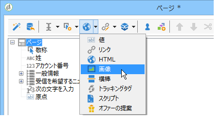</ph></source>
<target xml:lang="en-XX"><ph id="1" ctype="x-IMAGE"></ph></target>
</trans-unit>
<trans-unit id="tu8" xml:space="preserve">
<source xml:lang="en-US">The following types of field are available:</source>
<target xml:lang="en-XX">次のフィールドのタイプを使用できます。</target>
</trans-unit>
<trans-unit id="tu9" xml:space="preserve">
<source xml:lang="en-US">Value based on previously provided answers (in the context of the form) or on the database.</source>
<target xml:lang="en-XX">（フォームのコンテキストで）以前提供した回答またはデータベースに基づく値。</target>
</trans-unit>
<trans-unit id="tu10" xml:space="preserve">
<source xml:lang="en-US">Hypertext link, HTML, horizontal bar. See <ph id="1" ctype="x-LINK">[</ph>Inserting HTML content<ph id="2" ctype="x-LINK">](#inserting-html-content)</ph>.</source>
<target xml:lang="en-XX">ハイパーリンク、HTML、横棒。 <ph id="1" ctype="x-LINK">[</ph>HTML コンテンツの挿入<ph id="2" ctype="x-LINK">](#inserting-html-content)</ph>を参照してください。</target>
</trans-unit>
<trans-unit id="tu11" xml:space="preserve">
<source xml:lang="en-US">Image saved in the resource library or on a server accessible by users. See <ph id="1" ctype="x-LINK">[</ph>Inserting images<ph id="2" ctype="x-LINK">](#inserting-images)</ph>.</source>
<target xml:lang="en-XX">リソースライブラリまたはユーザーがアクセスできるサーバーに保存された画像。 <ph id="1" ctype="x-LINK">[</ph>画像の挿入<ph id="2" ctype="x-LINK">](#inserting-images)</ph>を参照してください。</target>
</trans-unit>
<trans-unit id="tu12" xml:space="preserve">
<source xml:lang="en-US">Script executed on client side and/or server side. It must be written in JavaScript and be compatible with most browsers to ensure correct execution on the client side.</source>
<target xml:lang="en-XX">クライアント側またはサーバー側で実行されたスクリプト。 クライアント側で適切に実行するには、JavaScript で記述され、ほとんどのブラウザーとの互換性が必要です。</target>
</trans-unit>
<trans-unit id="tu13" xml:space="preserve">
<source xml:lang="en-US"><ph id="1" ctype="x-regxph" equiv-text="&lbrack;!NOTE">[!NOTE]</ph></source>
<target xml:lang="en-XX"><ph id="1" ctype="x-regxph" equiv-text="&lbrack;!NOTE">[!NOTE]</ph></target>
</trans-unit>
<trans-unit id="tu14" xml:space="preserve">
<source xml:lang="en-US">On the server side, the script can use the functions defined in <ph id="1" ctype="x-LINK">&lbrack;</ph>Campaign JSAPI documentation<ph id="2" ctype="x-LINK">[#$tu15]</ph>.</source>
<target xml:lang="en-XX">サーバー側では、スクリプトは、Adobe Campaign が提供する <ph id="1" ctype="x-LINK">&lbrack;</ph>Campaign JSAPI ドキュメント<ph id="2" ctype="x-LINK">[#$tu15]</ph>で定義された関数を使用できます。</target>
</trans-unit>
<trans-unit id="tu16" xml:space="preserve">
<source xml:lang="en-US">Insert HTML content</source>
<target xml:lang="en-XX">HTML コンテンツの挿入</target>
</trans-unit>
<trans-unit id="tu17" xml:space="preserve">
<source xml:lang="en-US">You can include HTML content in a form page: hypertext links, images, formatted paragraphs, videos, etc.</source>
<target xml:lang="en-XX">フォームページに、ハイパーテキストリンク、画像、書式設定された段落、ビデオなどの HTML コンテンツを含めることができます。</target>
</trans-unit>
<trans-unit id="tu18" xml:space="preserve">
<source xml:lang="en-US">The HTML editor lets you enter the content to insert into the form page. To open the editor, click <ph id="1" ctype="x-STRONG_EMPHASIS">**[!UICONTROL </ph>Static elements<ph id="3" ctype="x-LINK_REF">]**</ph> > <ph id="5" ctype="x-STRONG_EMPHASIS">**[!UICONTROL </ph>HTML<ph id="7" ctype="x-LINK_REF">]**</ph> .</source>
<target xml:lang="en-XX">HTML エディターを使用すると、フォームページに挿入するコンテンツを入力できます。 エディターを開くには、<ph id="1" ctype="x-STRONG_EMPHASIS">**[!UICONTROL </ph>静的要素<ph id="3" ctype="x-LINK_REF">]**</ph>／<ph id="5" ctype="x-STRONG_EMPHASIS">**[!UICONTROL </ph>HTML<ph id="7" ctype="x-LINK_REF">]**</ph> をクリックします。</target>
</trans-unit>
<trans-unit id="tu19" xml:space="preserve">
<source xml:lang="en-US">You can enter and format your content directly or display the source code window to paste in some external content. To switch to "source code" mode, click the first icon in the toolbar:</source>
<target xml:lang="en-XX">コンテンツを直接入力および書式設定したり、ソースコードウィンドウを表示して、一部の外部コンテンツを貼り付けたりできます。 「ソースコード」モードに切り替えるには、ツールバーの最初のアイコンをクリックします。</target>
</trans-unit>
<trans-unit id="tu20" xml:space="preserve">
<source xml:lang="en-US"><ph id="1" ctype="x-IMAGE">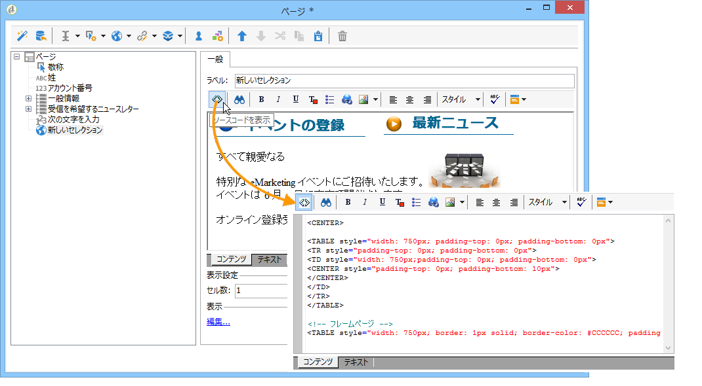</ph></source>
<target xml:lang="en-XX"><ph id="1" ctype="x-IMAGE"></ph></target>
</trans-unit>
<trans-unit id="tu21" xml:space="preserve">
<source xml:lang="en-US">To insert a database field, use the personalization button.</source>
<target xml:lang="en-XX">データベースフィールドを挿入するには、パーソナライゼーションボタンを使用します。</target>
</trans-unit>
<trans-unit id="tu22" xml:space="preserve">
<source xml:lang="en-US"><ph id="1" ctype="x-IMAGE">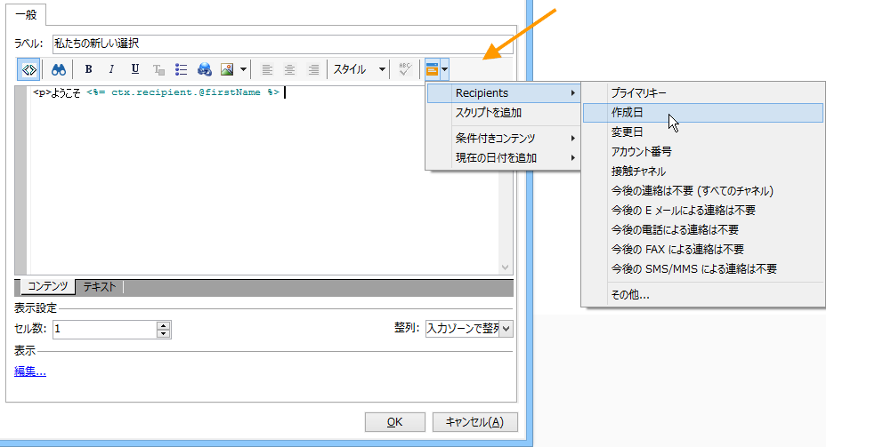</ph></source>
<target xml:lang="en-XX"><ph id="1" ctype="x-IMAGE"></ph></target>
</trans-unit>
<trans-unit id="tu23" xml:space="preserve">
<source xml:lang="en-US"><ph id="1" ctype="x-regxph" equiv-text="&lbrack;!NOTE">[!NOTE]</ph></source>
<target xml:lang="en-XX"><ph id="1" ctype="x-regxph" equiv-text="&lbrack;!NOTE">[!NOTE]</ph></target>
</trans-unit>
<trans-unit id="tu24" xml:space="preserve">
<source xml:lang="en-US">The strings entered in the HTML editor are only translated if they are defined in the <ph id="1" ctype="x-STRONG_EMPHASIS">**[!UICONTROL </ph>Texts<ph id="3" ctype="x-LINK_REF">]**</ph> sub-tab. Otherwise they will not be collected. For more on this, refer to <ph id="5" ctype="x-LINK">[</ph>Translating a web form<ph id="6" ctype="x-LINK">](translating-a-web-form.md)</ph>.</source>
<target xml:lang="en-XX">HTML エディターに入力した文字列は、「<ph id="1" ctype="x-STRONG_EMPHASIS">**[!UICONTROL </ph>テキスト<ph id="3" ctype="x-LINK_REF">]**</ph>」サブタブで定義されている場合にのみ、翻訳されます。 そうでない場合、収集されません。 詳しくは、<ph id="5" ctype="x-LINK">[</ph>Web フォームの翻訳<ph id="6" ctype="x-LINK">](translating-a-web-form.md)</ph>を参照してください。</target>
</trans-unit>
<trans-unit id="tu25" xml:space="preserve">
<source xml:lang="en-US">Insert a link</source>
<target xml:lang="en-XX">リンクの挿入</target>
</trans-unit>
<trans-unit id="tu26" xml:space="preserve">
<source xml:lang="en-US">Fill in the fields in the editing window as shown in the following example:</source>
<target xml:lang="en-XX">次の例のように、編集ウィンドウのフィールドに入力します。</target>
</trans-unit>
<trans-unit id="tu27" xml:space="preserve">
<source xml:lang="en-US">To add a hypertext link, go to <ph id="1" ctype="x-STRONG_EMPHASIS">**[!UICONTROL </ph>Static elements<ph id="3" ctype="x-LINK_REF">]**</ph> > <ph id="5" ctype="x-STRONG_EMPHASIS">**[!UICONTROL </ph>Link<ph id="7" ctype="x-LINK_REF">]**</ph>.</source>
<target xml:lang="en-XX">ハイパーリンクを追加するには、<ph id="1" ctype="x-STRONG_EMPHASIS">**[!UICONTROL </ph>静的要素<ph id="3" ctype="x-LINK_REF">]**</ph>／<ph id="5" ctype="x-STRONG_EMPHASIS">**[!UICONTROL </ph>リンク<ph id="7" ctype="x-LINK_REF">]**</ph>に移動します。</target>
</trans-unit>
<trans-unit id="tu28" xml:space="preserve">
<source xml:lang="en-US"><ph id="1" ctype="x-IMAGE">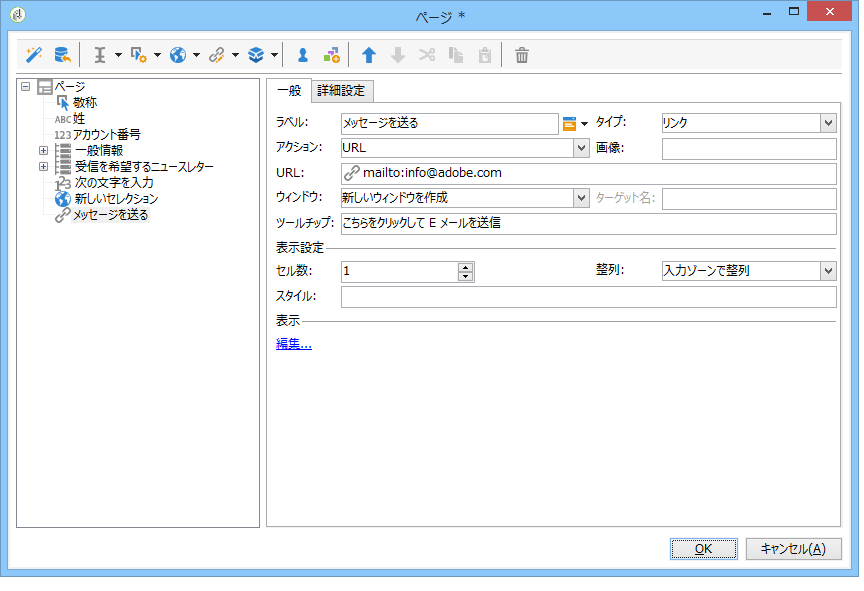</ph></source>
<target xml:lang="en-XX"><ph id="1" ctype="x-IMAGE"></ph></target>
</trans-unit>
<trans-unit id="tu29" xml:space="preserve">
<source xml:lang="en-US">The <ph id="1" ctype="x-STRONG_EMPHASIS">**[!UICONTROL </ph>Label<ph id="3" ctype="x-LINK_REF">]**</ph> is the content of the hypertext link as it will be displayed on the form page.</source>
<target xml:lang="en-XX">「<ph id="1" ctype="x-STRONG_EMPHASIS">**[!UICONTROL </ph>ラベル<ph id="3" ctype="x-LINK_REF">]**</ph>」は、フォームページに表示されるハイパーリンクの内容です。</target>
</trans-unit>
<trans-unit id="tu30" xml:space="preserve">
<source xml:lang="en-US">The <ph id="1" ctype="x-STRONG_EMPHASIS">**[!UICONTROL </ph>URL<ph id="3" ctype="x-LINK_REF">]**</ph> is the desired address, e.g.: <ph id="5" ctype="x-LINK">&lbrack;</ph>https://www.adobe.com<ph id="6" ctype="x-LINK">[#$tu31]</ph> for a website, or <ph id="7" ctype="x-LINK">[</ph>info@adobe.com<ph id="8" ctype="x-LINK">](mailto:info@adobe.com)</ph> to send a message.</source>
<target xml:lang="en-XX">「<ph id="1" ctype="x-STRONG_EMPHASIS">**[!UICONTROL </ph>URL<ph id="3" ctype="x-LINK_REF">]**</ph>」は、目的のアドレス（例：Web サイトの場合は <ph id="5" ctype="x-LINK">&lbrack;</ph>https://www.adobe.com<ph id="6" ctype="x-LINK">[#$tu31]</ph>、メッセージを送信したい場合には <ph id="7" ctype="x-LINK">[</ph>info@adobe.com<ph id="8" ctype="x-LINK">](mailto:info@adobe.com)</ph>）です。</target>
</trans-unit>
<trans-unit id="tu32" xml:space="preserve">
<source xml:lang="en-US">The <ph id="1" ctype="x-STRONG_EMPHASIS">**[!UICONTROL </ph>Window<ph id="3" ctype="x-LINK_REF">]**</ph> field lets you select the display mode for the link in the case of a site. You can decide to open the link in a new window, the current window, or another window.</source>
<target xml:lang="en-XX">「<ph id="1" ctype="x-STRONG_EMPHASIS">**[!UICONTROL </ph>ウィンドウ<ph id="3" ctype="x-LINK_REF">]**</ph>」フィールドを使用すると、サイトの場合のリンクの表示モードを選択できます。 リンクを新しいウィンドウで開いたり、現在のウィンドウで開いたり、別のウィンドウで開いたりできます。</target>
</trans-unit>
<trans-unit id="tu33" xml:space="preserve">
<source xml:lang="en-US">You can add a ToolTip, as shown below:</source>
<target xml:lang="en-XX">次に示すように、ツールチップを追加できます。</target>
</trans-unit>
<trans-unit id="tu34" xml:space="preserve">
<source xml:lang="en-US"><ph id="1" ctype="x-IMAGE">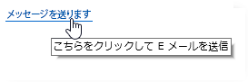</ph></source>
<target xml:lang="en-XX"><ph id="1" ctype="x-IMAGE"></ph></target>
</trans-unit>
<trans-unit id="tu35" xml:space="preserve">
<source xml:lang="en-US">You can choose to display the link as a button or an image. To do this, select the type of display in the <ph id="1" ctype="x-STRONG_EMPHASIS">**[!UICONTROL </ph>Type<ph id="3" ctype="x-LINK_REF">]**</ph> field.</source>
<target xml:lang="en-XX">リンクをボタンとして表示するか、画像として表示するかを選択できます。 これをおこなうには、「<ph id="1" ctype="x-STRONG_EMPHASIS">**[!UICONTROL </ph>タイプ<ph id="3" ctype="x-LINK_REF">]**</ph>」フィールドで表示のタイプを選択します。</target>
</trans-unit>
<trans-unit id="tu36" xml:space="preserve">
<source xml:lang="en-US">Types of links</source>
<target xml:lang="en-XX">リンクのタイプ</target>
</trans-unit>
<trans-unit id="tu37" xml:space="preserve">
<source xml:lang="en-US">By default, the links are associated with a URL-type action, so that a link destination address can be entered in the URL field.</source>
<target xml:lang="en-XX">デフォルトでは、リンクは、リンク先アドレスが「URL」フィールドに入力できるように、URL タイプのアクションに関連付けられています。</target>
</trans-unit>
<trans-unit id="tu38" xml:space="preserve">
<source xml:lang="en-US"><ph id="1" ctype="x-IMAGE">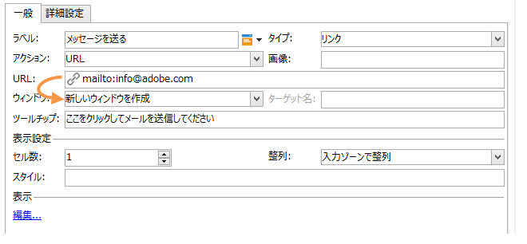</ph></source>
<target xml:lang="en-XX"><ph id="1" ctype="x-IMAGE"></ph></target>
</trans-unit>
<trans-unit id="tu39" xml:space="preserve">
<source xml:lang="en-US">You can define other actions for the link, so that the user can click the link to do the following:</source>
<target xml:lang="en-XX">ユーザーがリンクをクリックして次のアクションをおこなえるように、リンクに別のアクションを定義できます。</target>
</trans-unit>
<trans-unit id="tu40" xml:space="preserve">
<source xml:lang="en-US">Refresh the page</source>
<target xml:lang="en-XX">ページの更新</target>
</trans-unit>
<trans-unit id="tu41" xml:space="preserve">
<source xml:lang="en-US">To do this, select the <ph id="1" ctype="x-STRONG_EMPHASIS">**[!UICONTROL </ph>Refresh page<ph id="3" ctype="x-LINK_REF">]**</ph> option in the drop-down box of the <ph id="5" ctype="x-STRONG_EMPHASIS">**[!UICONTROL </ph>Action<ph id="7" ctype="x-LINK_REF">]**</ph> field.</source>
<target xml:lang="en-XX">これをおこなうには、「<ph id="5" ctype="x-STRONG_EMPHASIS">**[!UICONTROL </ph>アクション<ph id="7" ctype="x-LINK_REF">]**</ph>」フィールドのドロップダウンボックスで、「<ph id="1" ctype="x-STRONG_EMPHASIS">**[!UICONTROL </ph>ページを更新<ph id="3" ctype="x-LINK_REF">]**</ph>」オプションを選択します。</target>
</trans-unit>
<trans-unit id="tu42" xml:space="preserve">
<source xml:lang="en-US"><ph id="1" ctype="x-IMAGE">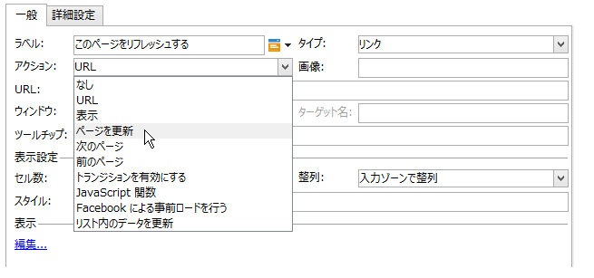</ph></source>
<target xml:lang="en-XX"><ph id="1" ctype="x-IMAGE"></ph></target>
</trans-unit>
<trans-unit id="tu43" xml:space="preserve">
<source xml:lang="en-US">Display the next/previous page</source>
<target xml:lang="en-XX">次／前のページの表示</target>
</trans-unit>
<trans-unit id="tu44" xml:space="preserve">
<source xml:lang="en-US">To do this, select the <ph id="1" ctype="x-STRONG_EMPHASIS">**[!UICONTROL </ph>Next page<ph id="3" ctype="x-LINK_REF">]**</ph> or <ph id="5" ctype="x-STRONG_EMPHASIS">**[!UICONTROL </ph>Previous page<ph id="7" ctype="x-LINK_REF">]**</ph> option in the drop-down box of the <ph id="9" ctype="x-STRONG_EMPHASIS">**[!UICONTROL </ph>Action<ph id="11" ctype="x-LINK_REF">]**</ph> field.</source>
<target xml:lang="en-XX">これをおこなうには、「<ph id="9" ctype="x-STRONG_EMPHASIS">**[!UICONTROL </ph>アクション<ph id="11" ctype="x-LINK_REF">]**</ph>」フィールドのドロップダウンボックスで、「<ph id="1" ctype="x-STRONG_EMPHASIS">**[!UICONTROL </ph>次のページ<ph id="3" ctype="x-LINK_REF">]**</ph>」または「<ph id="5" ctype="x-STRONG_EMPHASIS">**[!UICONTROL </ph>前のページ<ph id="7" ctype="x-LINK_REF">]**</ph>」オプションを選択します。</target>
</trans-unit>
<trans-unit id="tu45" xml:space="preserve">
<source xml:lang="en-US"><ph id="1" ctype="x-IMAGE">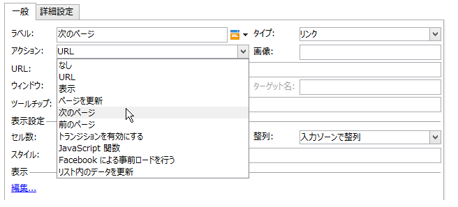</ph></source>
<target xml:lang="en-XX"><ph id="1" ctype="x-IMAGE"></ph></target>
</trans-unit>
<trans-unit id="tu46" xml:space="preserve">
<source xml:lang="en-US">You can hide the <ph id="1" ctype="x-STRONG_EMPHASIS">**[!UICONTROL </ph>Next<ph id="3" ctype="x-LINK_REF">]**</ph> and/or <ph id="5" ctype="x-STRONG_EMPHASIS">**[!UICONTROL </ph>Back<ph id="7" ctype="x-LINK_REF">]**</ph> buttons if they are to be replaced by a link. Refer to this <ph id="9" ctype="x-LINK">[</ph>page<ph id="10" ctype="x-LINK">](defining-web-forms-page-sequencing.md)</ph>.</source>
<target xml:lang="en-XX">リンクで置き換える場合は、「<ph id="1" ctype="x-STRONG_EMPHASIS">**[!UICONTROL </ph>次へ<ph id="3" ctype="x-LINK_REF">]**</ph>」および「<ph id="5" ctype="x-STRONG_EMPHASIS">**[!UICONTROL </ph>戻る<ph id="7" ctype="x-LINK_REF">]**</ph>」ボタンを非表示することができます。 この<ph id="9" ctype="x-LINK">[</ph>ページ<ph id="10" ctype="x-LINK">](defining-web-forms-page-sequencing.md)</ph>を参照してください。</target>
</trans-unit>
<trans-unit id="tu47" xml:space="preserve">
<source xml:lang="en-US">The link will replace the <ph id="1" ctype="x-STRONG_EMPHASIS">**[!UICONTROL </ph>Next<ph id="3" ctype="x-LINK_REF">]**</ph> button used by default.</source>
<target xml:lang="en-XX">リンクは、デフォルトで使用される「<ph id="1" ctype="x-STRONG_EMPHASIS">**[!UICONTROL </ph>次へ<ph id="3" ctype="x-LINK_REF">]**</ph>」ボタンを置き換えます。</target>
</trans-unit>
<trans-unit id="tu48" xml:space="preserve">
<source xml:lang="en-US"><ph id="1" ctype="x-IMAGE">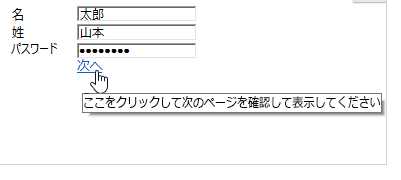</ph></source>
<target xml:lang="en-XX"><ph id="1" ctype="x-IMAGE"></ph></target>
</trans-unit>
<trans-unit id="tu49" xml:space="preserve">
<source xml:lang="en-US">Display another page</source>
<target xml:lang="en-XX">別のページの表示</target>
</trans-unit>
<trans-unit id="tu50" xml:space="preserve">
<source xml:lang="en-US">The <ph id="1" ctype="x-STRONG_EMPHASIS">**[!UICONTROL </ph>Enable a transition<ph id="3" ctype="x-LINK_REF">]**</ph> option lets you display a specific page associated with the outgoing transition selected in the <ph id="5" ctype="x-STRONG_EMPHASIS">**[!UICONTROL </ph>Transition<ph id="7" ctype="x-LINK_REF">]**</ph> field.</source>
<target xml:lang="en-XX">「<ph id="1" ctype="x-STRONG_EMPHASIS">**[!UICONTROL </ph>トランジションを有効にする<ph id="3" ctype="x-LINK_REF">]**</ph>」オプションを使用すると、「<ph id="5" ctype="x-STRONG_EMPHASIS">**[!UICONTROL </ph>トランジション<ph id="7" ctype="x-LINK_REF">]**</ph>」フィールドで選択されたアウトバウンドトランジションに関連付けられた特定のページを表示できます。</target>
</trans-unit>
<trans-unit id="tu51" xml:space="preserve">
<source xml:lang="en-US"><ph id="1" ctype="x-IMAGE">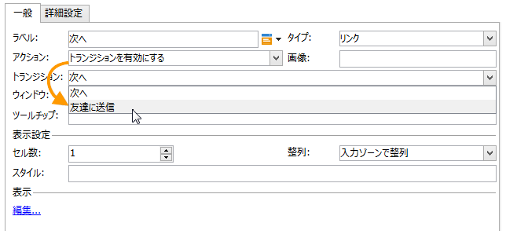</ph></source>
<target xml:lang="en-XX"><ph id="1" ctype="x-IMAGE"></ph></target>
</trans-unit>
<trans-unit id="tu52" xml:space="preserve">
<source xml:lang="en-US">By default, a page has only one output transition. To create new transitions, select the page and then click the <ph id="1" ctype="x-STRONG_EMPHASIS">**[!UICONTROL </ph>Add<ph id="3" ctype="x-LINK_REF">]**</ph> button in the <ph id="5" ctype="x-STRONG_EMPHASIS">**[!UICONTROL </ph>Output transitions<ph id="7" ctype="x-LINK_REF">]**</ph> section, as shown below:</source>
<target xml:lang="en-XX">デフォルトでは、ページには 1 つのアウトバウンドトランジションのみがあります。 新しいトランジションを作成するには、ページを選択して、次に示すように、「<ph id="5" ctype="x-STRONG_EMPHASIS">**[!UICONTROL </ph>アウトバウンドトランジション<ph id="7" ctype="x-LINK_REF">]**</ph>」セクションの<ph id="1" ctype="x-STRONG_EMPHASIS">**[!UICONTROL </ph>追加<ph id="3" ctype="x-LINK_REF">]**</ph>ボタンをクリックします。</target>
</trans-unit>
<trans-unit id="tu53" xml:space="preserve">
<source xml:lang="en-US"><ph id="1" ctype="x-IMAGE">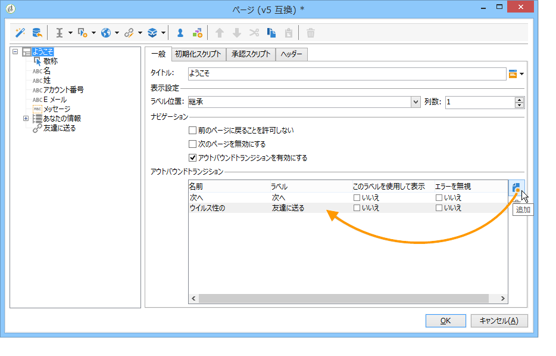</ph></source>
<target xml:lang="en-XX"><ph id="1" ctype="x-IMAGE"></ph></target>
</trans-unit>
<trans-unit id="tu54" xml:space="preserve">
<source xml:lang="en-US">In the diagram, this addition will look like this:</source>
<target xml:lang="en-XX">ダイアグラムでは、この追加は次のように表示されます。</target>
</trans-unit>
<trans-unit id="tu55" xml:space="preserve">
<source xml:lang="en-US"><ph id="1" ctype="x-IMAGE">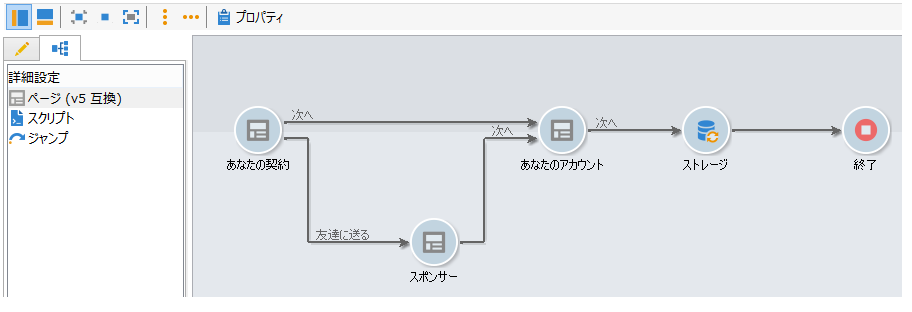</ph></source>
<target xml:lang="en-XX"><ph id="1" ctype="x-IMAGE"></ph></target>
</trans-unit>
<trans-unit id="tu56" xml:space="preserve">
<source xml:lang="en-US"><ph id="1" ctype="x-regxph" equiv-text="&lbrack;!NOTE">[!NOTE]</ph></source>
<target xml:lang="en-XX"><ph id="1" ctype="x-regxph" equiv-text="&lbrack;!NOTE">[!NOTE]</ph></target>
</trans-unit>
<trans-unit id="tu57" xml:space="preserve">
<source xml:lang="en-US">For more on page sequencing in a Web form, refer to <ph id="1" ctype="x-LINK">[</ph>Defining web forms page sequencing<ph id="2" ctype="x-LINK">](defining-web-forms-page-sequencing.md)</ph>.</source>
<target xml:lang="en-XX">Web フォームのページの順番について詳しくは、<ph id="1" ctype="x-LINK">[</ph>Web フォームページの順番の定義<ph id="2" ctype="x-LINK">](defining-web-forms-page-sequencing.md)</ph>を参照してください。</target>
</trans-unit>
<trans-unit id="tu58" xml:space="preserve">
<source xml:lang="en-US">Personalize HTML content</source>
<target xml:lang="en-XX">HTML コンテンツのパーソナライズ</target>
</trans-unit>
<trans-unit id="tu59" xml:space="preserve">
<source xml:lang="en-US">You can personalize the HTML content of a form page with data recorded in a previous page. For example, you can create a car insurance Web form whose first page lets you provide contact information and the brand of the car.</source>
<target xml:lang="en-XX">フォームページの HTML コンテンツを前のページで記録したデータでパーソナライズできます。 例えば、自動車保険の Web フォームを作成して、最初のページで連絡先情報および自動車のブランドを提供できます。</target>
</trans-unit>
<trans-unit id="tu60" xml:space="preserve">
<source xml:lang="en-US"><ph id="1" ctype="x-IMAGE">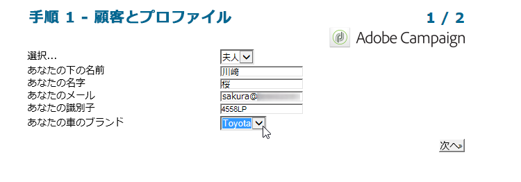</ph></source>
<target xml:lang="en-XX"><ph id="1" ctype="x-IMAGE"></ph></target>
</trans-unit>
<trans-unit id="tu61" xml:space="preserve">
<source xml:lang="en-US">Use personalization fields to re-inject the user name and selected brand into the next page. The syntax to use depends on the information storage mode. For more on this, refer to <ph id="1" ctype="x-LINK">[</ph>Using collected information<ph id="2" ctype="x-LINK">](web-forms-answers.md#using-collected-information)</ph>.</source>
<target xml:lang="en-XX">パーソナライゼーションフィールドを使用して、ユーザー名と選択したブランドを次のページに再挿入できます。 使用する構文は、情報ストレージモードによって異なります。 詳しくは、<ph id="1" ctype="x-LINK">[</ph>収集された情報の使用<ph id="2" ctype="x-LINK">](web-forms-answers.md#using-collected-information)</ph>を参照してください。</target>
</trans-unit>
<trans-unit id="tu62" xml:space="preserve">
<source xml:lang="en-US"><ph id="1" ctype="x-regxph" equiv-text="&lbrack;!NOTE">[!NOTE]</ph></source>
<target xml:lang="en-XX"><ph id="1" ctype="x-regxph" equiv-text="&lbrack;!NOTE">[!NOTE]</ph></target>
</trans-unit>
<trans-unit id="tu63" xml:space="preserve">
<source xml:lang="en-US">For security reasons, the value entered in the <ph id="1" ctype="x-STRONG_EMPHASIS">**`&lt;%=`**</ph> formula is replaced with escaped characters.</source>
<target xml:lang="en-XX">セキュリティ上の理由により、<ph id="1" ctype="x-STRONG_EMPHASIS">**`&lt;%=`**</ph> 式に入力された値はエスケープ文字に置き換えられます。</target>
</trans-unit>
<trans-unit id="tu64" xml:space="preserve">
<source xml:lang="en-US">In our example, the first and last name of the recipient are stored in a field of the database, while the brand of their car is stored in a variable. The syntax of the message personalized on page 2 will be as follows:</source>
<target xml:lang="en-XX">この例では、受信者の姓と名がデータベースのフィールドに格納され、自動車のブランドが変数に格納されます。 ページ 2 でパーソナライズされたメッセージの構文は、次のようになります。</target>
</trans-unit>
<trans-unit id="tu65" xml:space="preserve">
<source xml:lang="en-US"><ph id="1" ctype="x-IMAGE">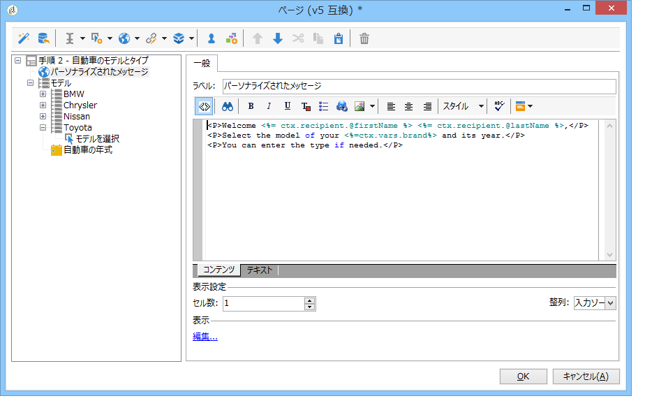</ph></source>
<target xml:lang="en-XX"><ph id="1" ctype="x-IMAGE"></ph></target>
</trans-unit>
<trans-unit id="tu66" xml:space="preserve">
<source xml:lang="en-US">This produces the following result:</source>
<target xml:lang="en-XX">これにより、次のような結果が導かれます。</target>
</trans-unit>
<trans-unit id="tu67" xml:space="preserve">
<source xml:lang="en-US"><ph id="1" ctype="x-IMAGE">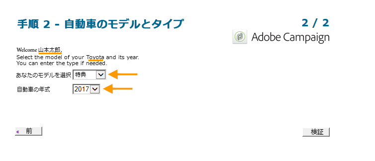</ph></source>
<target xml:lang="en-XX"><ph id="1" ctype="x-IMAGE"></ph></target>
</trans-unit>
<trans-unit id="tu68" xml:space="preserve">
<source xml:lang="en-US">Use text variables</source>
<target xml:lang="en-XX">テキスト変数の使用</target>
</trans-unit>
<trans-unit id="tu69" xml:space="preserve">
<source xml:lang="en-US">The <ph id="1" ctype="x-STRONG_EMPHASIS">**[!UICONTROL </ph>Text<ph id="3" ctype="x-LINK_REF">]**</ph> tab lets you create variable fields which can be used in the HTML between the &lt;%= and %> characters with the following syntax: <ph id="5" ctype="x-STRONG_EMPHASIS">**</ph>$(IDENTIFIER)<ph id="6" ctype="x-STRONG_EMPHASIS">**</ph>.</source>
<target xml:lang="en-XX">「<ph id="1" ctype="x-STRONG_EMPHASIS">**[!UICONTROL </ph>テキスト<ph id="3" ctype="x-LINK_REF">]**</ph>」タブでは、HTML の &lt;%= 文字と %> 文字の間で使用できる変数フィールドを構文 <ph id="5" ctype="x-STRONG_EMPHASIS">**</ph>$(IDENTIFIER)<ph id="6" ctype="x-STRONG_EMPHASIS">**</ph>.を使用して作成できます。</target>
</trans-unit>
<trans-unit id="tu70" xml:space="preserve">
<source xml:lang="en-US">Use this method to easily have your strings localized. See <ph id="1" ctype="x-LINK">[</ph>Translating a web form<ph id="2" ctype="x-LINK">](translating-a-web-form.md)</ph></source>
<target xml:lang="en-XX">この方法を使用すると、文字列を容易にローカライズできます。 <ph id="1" ctype="x-LINK">[</ph>Web フォームの翻訳<ph id="2" ctype="x-LINK">](translating-a-web-form.md)</ph>を参照してください。</target>
</trans-unit>
<trans-unit id="tu71" xml:space="preserve">
<source xml:lang="en-US">For example, you can create a <ph id="1" ctype="x-STRONG_EMPHASIS">**</ph>Contact<ph id="2" ctype="x-STRONG_EMPHASIS">**</ph> field that will enable you to display the "Date of last contact:" string to the HTML content. To do this, follow the steps below:</source>
<target xml:lang="en-XX">例えば、「最終コンタクト日：」という文字列を HTML コンテンツに表示できる、<ph id="1" ctype="x-STRONG_EMPHASIS">**</ph>Contact<ph id="2" ctype="x-STRONG_EMPHASIS">**</ph> フィールドを作成できます。 これをおこなうには、以下の手順に従います。</target>
</trans-unit>
<trans-unit id="tu72" xml:space="preserve">
<source xml:lang="en-US">Click on the <ph id="1" ctype="x-STRONG_EMPHASIS">**[!UICONTROL </ph>Text<ph id="3" ctype="x-LINK_REF">]**</ph> tab of the HTML text.</source>
<target xml:lang="en-XX">HTML テキストの「<ph id="1" ctype="x-STRONG_EMPHASIS">**[!UICONTROL </ph>テキスト<ph id="3" ctype="x-LINK_REF">]**</ph>」タブをクリックします。</target>
</trans-unit>
<trans-unit id="tu73" xml:space="preserve">
<source xml:lang="en-US">Click the <ph id="1" ctype="x-STRONG_EMPHASIS">**[!UICONTROL </ph>Add<ph id="3" ctype="x-LINK_REF">]**</ph> icon.</source>
<target xml:lang="en-XX">「<ph id="1" ctype="x-STRONG_EMPHASIS">**[!UICONTROL </ph>追加<ph id="3" ctype="x-LINK_REF">]**</ph>」アイコンをクリックします。</target>
</trans-unit>
<trans-unit id="tu74" xml:space="preserve">
<source xml:lang="en-US">In the <ph id="1" ctype="x-STRONG_EMPHASIS">**[!UICONTROL </ph>Identifier<ph id="3" ctype="x-LINK_REF">]**</ph> column, enter the name of the variable</source>
<target xml:lang="en-XX"><ph id="1" ctype="x-STRONG_EMPHASIS">**[!UICONTROL </ph>識別子<ph id="3" ctype="x-LINK_REF">]**</ph>列に、変数名を入力します。</target>
</trans-unit>
<trans-unit id="tu75" xml:space="preserve">
<source xml:lang="en-US">In the <ph id="1" ctype="x-STRONG_EMPHASIS">**[!UICONTROL </ph>Text<ph id="3" ctype="x-LINK_REF">]**</ph> column, enter the default value.</source>
<target xml:lang="en-XX"><ph id="1" ctype="x-STRONG_EMPHASIS">**[!UICONTROL </ph>テキスト<ph id="3" ctype="x-LINK_REF">]**</ph>列に、デフォルト値を入力します。</target>
</trans-unit>
<trans-unit id="tu76" xml:space="preserve">
<source xml:lang="en-US"><ph id="1" ctype="x-IMAGE">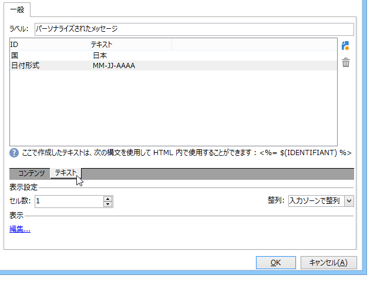</ph></source>
<target xml:lang="en-XX"><ph id="1" ctype="x-IMAGE"></ph></target>
</trans-unit>
<trans-unit id="tu77" xml:space="preserve">
<source xml:lang="en-US">In the HTML content, insert this text variable via the <ph id="1" ctype="x-STRONG_EMPHASIS">**</ph>&lt;%= $(Contact) %><ph id="2" ctype="x-STRONG_EMPHASIS">**</ph> syntax.</source>
<target xml:lang="en-XX">HTML コンテンツでは、<ph id="1" ctype="x-STRONG_EMPHASIS">**</ph>&lt;%= $(Contact) %><ph id="2" ctype="x-STRONG_EMPHASIS">**</ph> 構文を使用してこのテキスト変数を挿入できます。</target>
</trans-unit>
<trans-unit id="tu78" xml:space="preserve">
<source xml:lang="en-US"><ph id="1" ctype="x-IMAGE">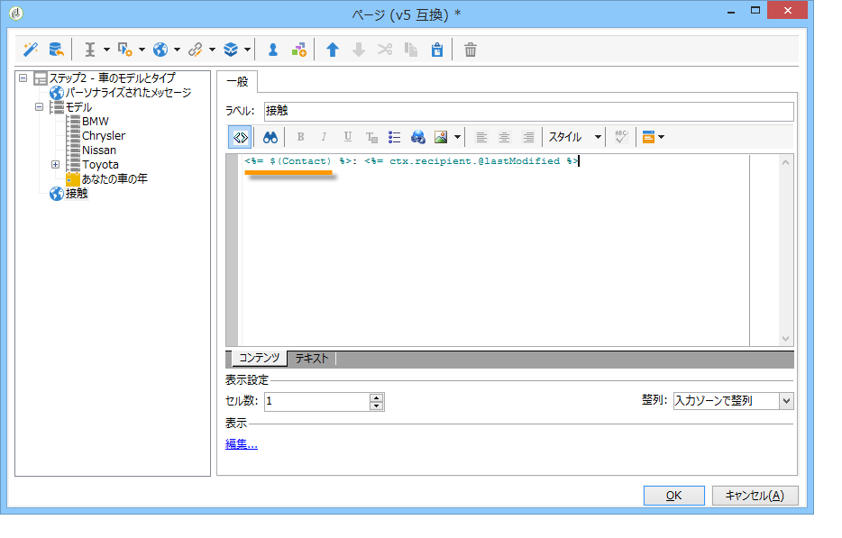</ph></source>
<target xml:lang="en-XX"><ph id="1" ctype="x-IMAGE"></ph></target>
</trans-unit>
<trans-unit id="tu79" xml:space="preserve">
<source xml:lang="en-US"><ph id="1" ctype="x-regxph" equiv-text="&lbrack;!CAUTION">[!CAUTION]</ph></source>
<target xml:lang="en-XX"><ph id="1" ctype="x-regxph" equiv-text="&lbrack;!CAUTION">[!CAUTION]</ph></target>
</trans-unit>
<trans-unit id="tu80" xml:space="preserve">
<source xml:lang="en-US">If you enter these characters in the HTML editor, the <ph id="1" ctype="x-STRONG_EMPHASIS">**</ph>&lt;<ph id="2" ctype="x-STRONG_EMPHASIS">**</ph> and <ph id="3" ctype="x-STRONG_EMPHASIS">**</ph>><ph id="4" ctype="x-STRONG_EMPHASIS">**</ph> fields will be replaced with their escaped characters. In this case, you need to correct the source code by clicking the <ph id="5" ctype="x-STRONG_EMPHASIS">**[!UICONTROL </ph>Display source code<ph id="7" ctype="x-LINK_REF">]**</ph> icon of the HTML text editor.</source>
<target xml:lang="en-XX">これらの文字を HTML エディターに入力する場合、<ph id="1" ctype="x-STRONG_EMPHASIS">**</ph>&lt;<ph id="2" ctype="x-STRONG_EMPHASIS">**</ph> および <ph id="3" ctype="x-STRONG_EMPHASIS">**</ph>><ph id="4" ctype="x-STRONG_EMPHASIS">**</ph> フィールドはエスケープ文字に置き換えられます。 この場合、HTML テキストエディターの<ph id="5" ctype="x-STRONG_EMPHASIS">**[!UICONTROL </ph>ソースコードを表示<ph id="7" ctype="x-LINK_REF">]**</ph>アイコンをクリックして、ソースコードを修正する必要があります。</target>
</trans-unit>
<trans-unit id="tu81" xml:space="preserve">
<source xml:lang="en-US">Open the <ph id="1" ctype="x-STRONG_EMPHASIS">**[!UICONTROL </ph>Preview<ph id="3" ctype="x-LINK_REF">]**</ph> label of the form to view the value entered in the HTML:</source>
<target xml:lang="en-XX">フォームの<ph id="1" ctype="x-STRONG_EMPHASIS">**[!UICONTROL </ph>プレビュー<ph id="3" ctype="x-LINK_REF">]**</ph>ラベルを開いて、HTML に入力した値を表示します。</target>
</trans-unit>
<trans-unit id="tu82" xml:space="preserve">
<source xml:lang="en-US"><ph id="1" ctype="x-IMAGE">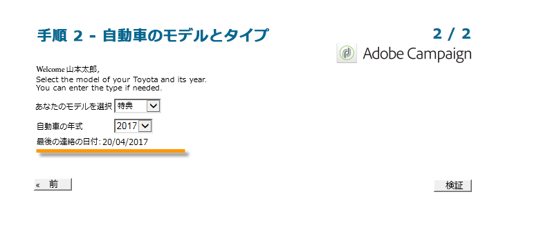</ph></source>
<target xml:lang="en-XX"><ph id="1" ctype="x-IMAGE"></ph></target>
</trans-unit>
<trans-unit id="tu83" xml:space="preserve">
<source xml:lang="en-US">This operating mode lets you define the text of Web forms only once, and manage translations using the integrated translation tool. For more on this, refer to <ph id="1" ctype="x-LINK">[</ph>Translating a web form<ph id="2" ctype="x-LINK">](translating-a-web-form.md)</ph>.</source>
<target xml:lang="en-XX">この操作モードでは、Web フォームのテキストを 1 回だけ定義でき、統合翻訳ツールを使用して翻訳を管理できます。 詳しくは、<ph id="1" ctype="x-LINK">[</ph>web フォームの翻訳<ph id="2" ctype="x-LINK">](translating-a-web-form.md)</ph>を参照してください。</target>
</trans-unit>
<trans-unit id="tu84" xml:space="preserve">
<source xml:lang="en-US">Insert images</source>
<target xml:lang="en-XX">画像の挿入</target>
</trans-unit>
<trans-unit id="tu85" xml:space="preserve">
<source xml:lang="en-US">For images to be included in forms, they must be saved on a server that is accessible from outside.</source>
<target xml:lang="en-XX">画像をフォームに含める場合、外部からアクセス可能なサーバーに保存されている必要があります。</target>
</trans-unit>
<trans-unit id="tu86" xml:space="preserve">
<source xml:lang="en-US">Select the <ph id="1" ctype="x-STRONG_EMPHASIS">**[!UICONTROL </ph>Static elements<ph id="3" ctype="x-LINK_REF">]**</ph> > <ph id="5" ctype="x-STRONG_EMPHASIS">**[!UICONTROL </ph>Image<ph id="7" ctype="x-LINK_REF">]**</ph> menu.</source>
<target xml:lang="en-XX"><ph id="1" ctype="x-STRONG_EMPHASIS">**[!UICONTROL </ph>静的要素<ph id="3" ctype="x-LINK_REF">]**</ph>／<ph id="5" ctype="x-STRONG_EMPHASIS">**[!UICONTROL </ph>画像<ph id="7" ctype="x-LINK_REF">]**</ph>メニューを選択します。</target>
</trans-unit>
<trans-unit id="tu87" xml:space="preserve">
<source xml:lang="en-US">Select the source of the image to be inserted: it can come from the public resource library or be stored on an external server accessible from outside.</source>
<target xml:lang="en-XX">挿入する画像のソースを選択します。パブリックリソースライブラリから取得したり、外部からアクセス可能なサーバーに保存したりできます。</target>
</trans-unit>
<trans-unit id="tu88" xml:space="preserve">
<source xml:lang="en-US"><ph id="1" ctype="x-IMAGE">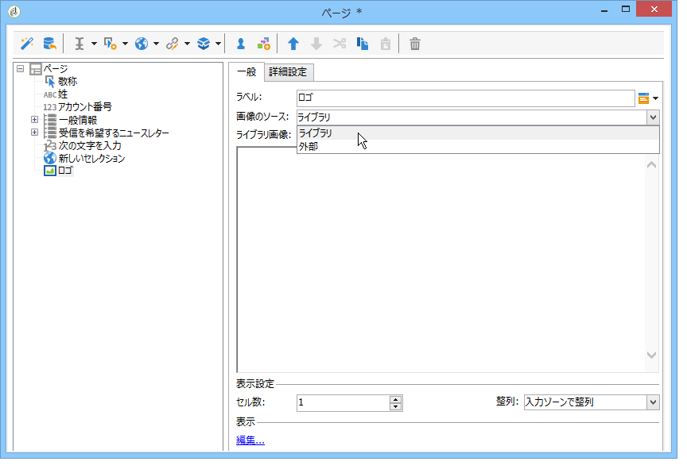</ph></source>
<target xml:lang="en-XX"><ph id="1" ctype="x-IMAGE"></ph></target>
</trans-unit>
<trans-unit id="tu89" xml:space="preserve">
<source xml:lang="en-US">If this is an image from the library, select it in the combo-box of the field; if it is located in an external file, enter the access path. The label will be displayed by passing the cursor over the image (coincides with an ALT field in HTML), or when the image isn't displayed.</source>
<target xml:lang="en-XX">ライブラリからの画像の場合、フィールドのコンボボックスで選択します。外部ファイルにある場合、アクセスパスを入力します。 ラベルは、画像にマウスポインターを重ねるか、画像が表示されない場合に表示されます（HTML の ALT フィールドと同じ）。</target>
</trans-unit>
<trans-unit id="tu90" xml:space="preserve">
<source xml:lang="en-US">The image can be viewed in the central section of the editor.</source>
<target xml:lang="en-XX">画像は、エディター中央のセクションに表示できます。</target>
</trans-unit>
</body>
</file>
</xliff>