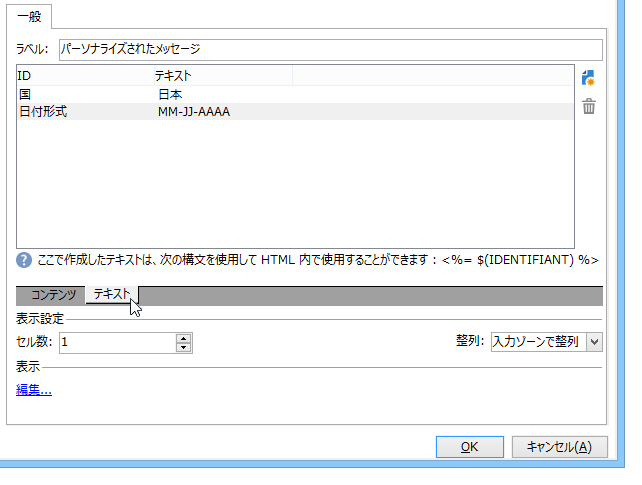

# Web フォームの静的要素{#static-elements-in-a-web-form}

フォームのページにユーザーインタラクションのない要素を含めることができます。これらは、画像、HTML コンテンツ、横棒またはハイパーリンクなどの、静的要素です。これらの要素は、**[!UICONTROL 静的要素を追加]**&#x200B;メニューをクリックし、ツールバーの最初のボタンを使用して作成されます。


次のフィールドのタイプを使用できます。

* （フォームのコンテキストで）以前提供した回答またはデータベースに基づく値。
* ハイパーリンク、HTML、横棒。[HTML コンテンツの挿入](#inserting-html-content)を参照してください。
* リソースライブラリまたはユーザーがアクセスできるサーバーに保存された画像。[画像の挿入](#inserting-images)を参照してください。
* クライアント側またはサーバー側で実行されたスクリプト。クライアント側で適切に実行するには、JavaScript で記述され、ほとんどのブラウザーとの互換性が必要です。

   >[!NOTE]
   >
   >サーバー側では、スクリプトは、Adobe Campaign が提供する [Campaign JSAPI ドキュメント](https://docs.adobe.com/content/help/en/campaign-classic/technicalresources/api/index.html)で定義された関数を使用できます。

## HTML コンテンツの挿入 {#inserting-html-content}

フォームページに、ハイパーテキストリンク、画像、書式設定された段落、ビデオまたは Flash オブジェクトなどの HTML コンテンツを含めることができます。

HTML エディターを使用すると、コンテンツを入力して、フォームページに挿入できます。エディターを開くには、**[!UICONTROL 静的要素／HTML]** に移動します。

コンテンツを直接入力および書式設定したり、ソースコードウィンドウを表示して、一部の外部コンテンツを貼り付けたりできます。「ソースコード」モードに切り替えるには、ツールバーの最初のアイコンをクリックします。


データベースフィールドを挿入するには、パーソナライゼーションボタンを使用します。


>[!NOTE]
>
>HTML エディターに入力した文字列は、「**[!UICONTROL テキスト]**」サブタブで定義されている場合にのみ、翻訳されます。そうでない場合、収集されません。詳しくは、[Web フォームの翻訳](../../web/using/translating-a-web-form.md)を参照してください。

### リンクの挿入 {#inserting-a-link}

次の例のように、編集ウィンドウのフィールドに入力します。

ハイパーリンクを追加するには、**[!UICONTROL 静的要素／リンク]**&#x200B;に移動します。


* 「**[!UICONTROL ラベル]**」は、フォームページに表示されるハイパーリンクのコンテンツです。
* 「**[!UICONTROL URL]**」は、目的のアドレス（例：Web サイトの場合は [https://www.adobe.com](https://www.adobe.com/jp)、メッセージを送信したい場合には [info@adobe.com](mailto:info@adobe.com)）です。
* 「**[!UICONTROL ウィンドウ]**」フィールドを使用すると、サイトの場合のリンクの表示モードを選択できます。リンクを新しいウィンドウで開いたり、現在のウィンドウで開いたり、別のウィンドウで開いたりできます。
* 次に示すように、ツールチップを追加できます。

   

* リンクをボタンとして表示するか、画像として表示するかを選択できます。これをおこなうには、「**[!UICONTROL タイプ]**」フィールドで表示のタイプを選択します。

### リンクのタイプ {#types-of-links}

デフォルトでは、リンクは、リンク先アドレスが「URL」フィールドに入力できるように、URL タイプのアクションに関連付けられています。


ユーザーがリンクをクリックして次のアクションをおこなえるように、リンクに別のアクションを定義できます。

* ページの更新

   これをおこなうには、「**[!UICONTROL アクション]**」フィールドのドロップダウンボックスで、「**[!UICONTROL ページを更新]**」オプションを選択します。

   

* 次／前のページの表示

   これをおこなうには、「**[!UICONTROL アクション]**」フィールドのドロップダウンボックスで、「**[!UICONTROL 次のページ]**」または「**[!UICONTROL 前のページ]**」オプションを選択します。

   

   リンクで置き換える場合は、「**[!UICONTROL 次へ]**」および「**[!UICONTROL 戻る]**」ボタンを非表示することができます。この[ページ](../../web/using/defining-web-forms-page-sequencing.md)を参照してください。

   リンクは、デフォルトで使用される「**[!UICONTROL 次へ]**」ボタンを置き換えます。

   

* 別のページの表示

   「**[!UICONTROL トランジションを有効にする]**」オプションを使用すると、「**[!UICONTROL トランジション]**」フィールドで選択されたアウトバウンドトランジションに関連付けられた特定のページを表示できます。

   

   デフォルトでは、ページには 1 つのアウトバウンドトランジションのみがあります。新しいトランジションを作成するには、ページを選択して、次に示すように、「**[!UICONTROL アウトバウンドトランジション]**」セクションの&#x200B;**[!UICONTROL 追加]**&#x200B;ボタンをクリックします。

   

   ダイアグラムでは、この追加は次のように表示されます。

   

   >[!NOTE]
   >
   >Web フォームのページの順番について詳しくは、[Web フォームページの順番の定義](../../web/using/defining-web-forms-page-sequencing.md)を参照してください。

* Facebook プロファイルから取得したデータによるフォームのフィールドのプリロード

   >[!CAUTION]
   >
   >この機能は、**[!UICONTROL Social Marketing]** アプリケーションがインストールされている場合にのみ使用できます。このオプションを使用するには、**[!UICONTROL Facebook Connect]** タイプの外部アカウントと連動する Facebook アプリケーションを作成する必要があります。詳しくは、[このページ](../../social/using/creating-a-facebook-application.md#configuring-external-accounts)を参照してください。

   「**[!UICONTROL Facebook による事前ロードをおこなう]**」オプションを使用すると、フォームにボタンを挿入して、Facebook プロファイル情報を使用してフィールドをプリロードできます。

   

   ユーザーが&#x200B;**[!UICONTROL 自動入力]**&#x200B;ボタンをクリックすると、Facebook のアプリの許可ウィンドウが開きます。

   

   >[!NOTE]
   >
   >外部アカウントの設定時に拡張された権限のリストを変更できます。拡張された権限を入力しない場合、Facebook は、デフォルトでは、基本プロファイル情報を転送します。\
   >拡張権限のリストとその構文を表示するには、[https://developers.facebook.com/docs/reference/api/permissions/](https://developers.facebook.com/docs/reference/api/permissions/) をクリックします。

   ユーザーが情報の共有に同意すれば、フォームのフィールドにプリロードされます。

   

この事例では、次の要素で構成された Web アプリケーションを作成しました。

* フォームを含むページ
* **[!UICONTROL レコード]**&#x200B;アクティビティ
* **[!UICONTROL 終了]**&#x200B;アクティビティ


プリロードボタンを追加するには、次の手順に従います。

1. フォームを作成します。

   

1. フォームのフィールドと同じレベルに移動し、リンクを追加します。

   

1. ラベルを入力し、**[!UICONTROL ボタン]**&#x200B;タイプを選択します。

   

1. 「**[!UICONTROL アクション]**」フィールドに移動して、「**[!UICONTROL Facebook による事前ロードをおこなう]**」を選択します。

   

1. 「**[!UICONTROL アプリケーション]**」フィールドに移動して、以前作成した **[!UICONTROL Facebook Connect]** タイプの外部アカウントを選択します。詳しくは、[このページ](../../social/using/creating-a-facebook-application.md#configuring-external-accounts)を参照してください。

   

### HTML コンテンツのパーソナライゼーション {#personalizing-html-content}

フォームページの HTML コンテンツを前のページで記録したデータでパーソナライズできます。例えば、自動車保険の Web フォームを作成して、最初のページで連絡先情報および自動車のブランドを提供できます。


パーソナライゼーションフィールドを使用して、ユーザー名と選択したブランドを次のページに再挿入できます。使用する構文は、情報ストレージモードによって異なります。詳しくは、[収集された情報の使用](../../web/using/web-forms-answers.md#using-collected-information)を参照してください。

>[!NOTE]
>
>セキュリティ上の理由により、**`<%=`** 式に入力された値は、エスケープ文字に置き換えられます。これを回避するには、必要な場合に限り、構文 **`<%=`** を使用します。

この例では、受信者の姓と名がデータベースのフィールドに格納され、自動車のブランドが変数に格納されます。ページ 2 でパーソナライズされたメッセージの構文は、次のようになります。


```
<P>Welcome <%= ctx.recipient.@firstName %> <%= ctx.recipient.@lastName %>,</P>
<P>To start your customized study, please select your car <%=ctx.vars.marque%> and its year of purchase.</P>
```

これにより、次のような結果が導かれます。


### テキスト変数の使用 {#using-text-variables}

「**[!UICONTROL テキスト]**」タブでは、HTML の &lt;%= 文字と %> 文字の間で使用できる変数フィールドを構文 **$(IDENTIFIER)**.を使用して作成できます。

この方法を使用すると、文字列を容易にローカライズできます。[Web フォームの翻訳](../../web/using/translating-a-web-form.md)を参照してください。

例えば、「最終コンタクト日：」という文字列を HTML コンテンツに表示できる、**Contact** フィールドを作成できます。これをおこなうには、以下の手順に従います。

1. HTML テキストの「**[!UICONTROL テキスト]**」タブをクリックします。
1. 「**[!UICONTROL 追加]**」アイコンをクリックします。
1. **[!UICONTROL 識別子]**&#x200B;列に、変数名を入力します。
1. **[!UICONTROL テキスト]**&#x200B;列に、デフォルト値を入力します。

   

1. HTML コンテンツでは、**&lt;%= $(Contact) %>** 構文を使用してこのテキスト変数を挿入できます。

   

   >[!CAUTION]
   >
   >HTML エディターにこれらの文字を入力する場合、**&lt;** および **>** フィールドは、エスケープ文字で置き換えられます。この場合、HTML テキストエディターの&#x200B;**[!UICONTROL ソースコードを表示]**&#x200B;アイコンをクリックして、ソースコードを修正する必要があります。

1. フォームの&#x200B;**[!UICONTROL プレビュー]**&#x200B;ラベルを開いて、HTML に入力した値を表示します。

   

この操作モードを使用すると、Web フォームのテキストを分解し、統合された翻訳ツールを使用して翻訳を管理できます。詳しくは、[Web フォームの翻訳](../../web/using/translating-a-web-form.md)を参照してください。

## 画像の挿入 {#inserting-images}

画像をフォームに含める場合、外部からアクセス可能なサーバーに保存されている必要があります。

**[!UICONTROL 静的要素／画像]**&#x200B;メニューを選択します。

挿入する画像のソースを選択します。パブリックリソースライブラリから取得したり、外部からアクセス可能なサーバーに保存したりできます。


ライブラリからの画像の場合、フィールドのコンボボックスで選択します。外部ファイルにある場合、アクセスパスを入力します。ラベルは、画像にマウスポインターを重ねるか、画像が表示されない場合に表示されます（HTML の ALT フィールドと同じ）。

画像は、エディター中央のセクションに表示できます。
