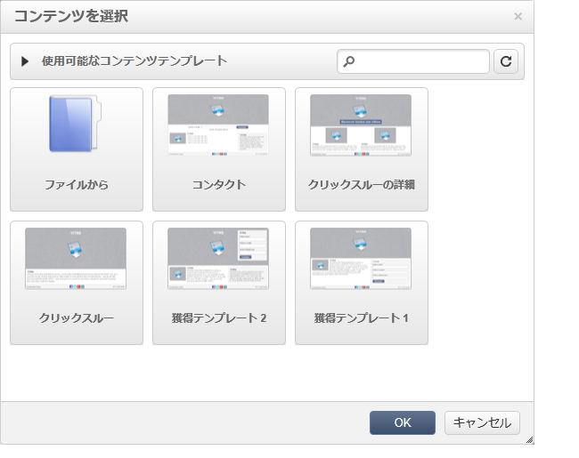
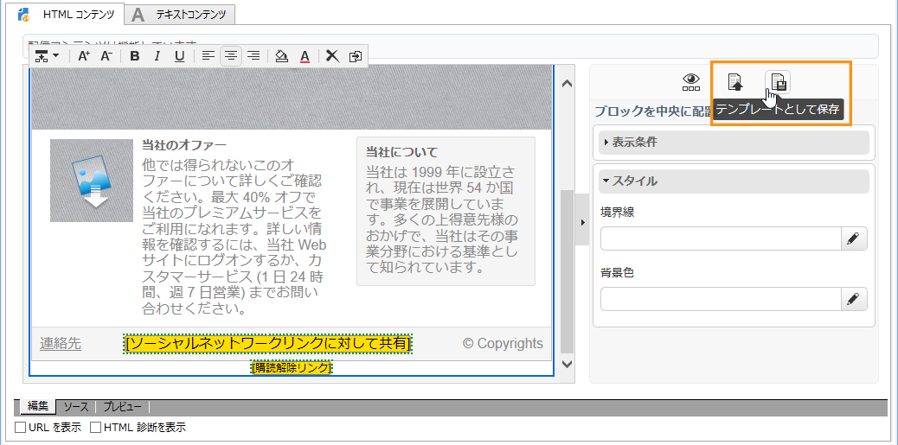

# テンプレート管理{#template-management}

デジタルコンテンツエディターは、Web アプリケーションおよび配信用の&#x200B;**標準テンプレート**&#x200B;を提供します。

ランディングページタイプの Web アプリケーションを作成する場合、ユーザーはこれらのテンプレートのいずれかを選択できます。また、Adobe Campaign 以外で作成した HTML テンプレートをインポートすることもできます。

To add a template, refer to [Global options](../../web/using/content-editor-interface.md#global-options).

## 配信をテンプレートとして保存 {#saving-a-delivery-as-a-template}

配信を設定したら、将来の配信で再利用するために、テンプレートとして保存できます。

**キャンペーン**&#x200B;ウィンドウで、選択した配信を開きます。**テンプレートとして保存**&#x200B;ボタンをクリックして、テンプレートに名前を付けてから保存します。

新しいテンプレートは、エクスプローラーの&#x200B;**リソース／テンプレート／コンテンツテンプレート**&#x200B;ノードに保存されます。
