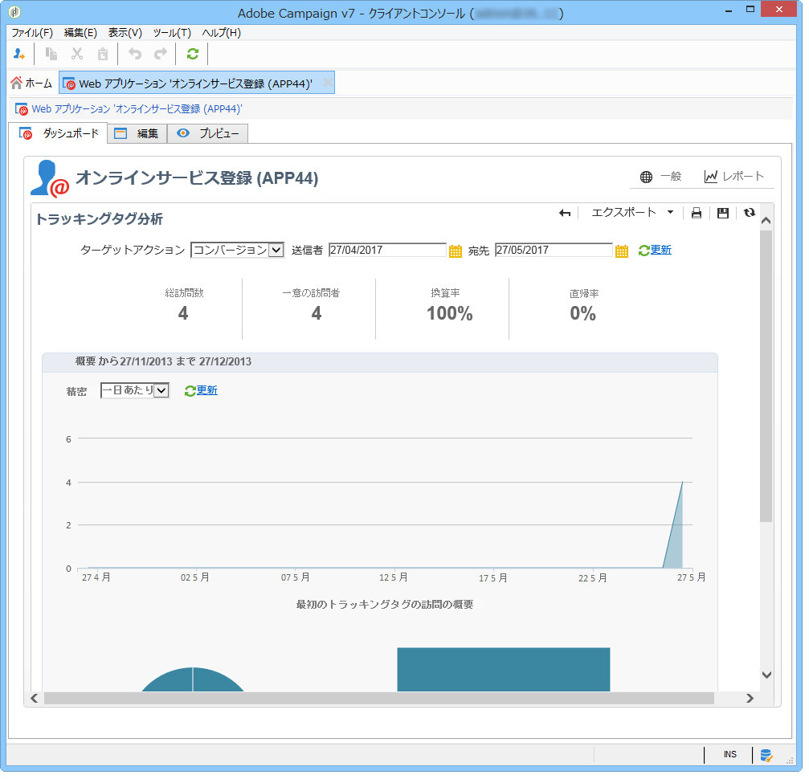

# Web アプリケーションのトラッキング{#tracking-a-web-application}

Adobe Campaignでは、トラッキングタグを挿入することで、Webアプリケーションページの訪問を追跡および測定できます。 この機能は、すべての Web アプリケーションタイプ（フォーム、オンライン調査、DCE で作成された Web ページなど）で使用できます。

そのため、複数のナビゲーションパスを定義して、成功を評価できます。復元したデータは、各アプリケーションのレポートで使用できます。

このバージョンの主な強化点を次に示します。

* ナビゲーションパスの定義を簡単にするために、複数のトラッキングタグを同じページに挿入可能（例：購入、購読、戻るなど）
* Web アプリケーションダッシュボードでの、異なるページのナビゲーションパスおよびトラッキングタグの表示

   

* 完全なトラッキングレポートの生成

   

   主な指標を次に示します。

   * **コンバージョン率**:ナビゲーションパスのすべてのステップを表示した人の数。
   * **直帰率**:最初のステップのみを表示した人の数
   * **変換トンネル**:各ステップ間の損失率。
   In addition, a **Sector** type chart shows the population according to its source.

## トラフィックソースの識別 {#identifying-the-traffic-source}

Webアプリケーションにアクセスする際に、訪問者がどこから来たかを識別するには、次の2つの異なるモードを使用できます。

1. 特定の配信を送信してWebアプリケーションページへのアクセスを許可する：この場合、トラフィックソースはこの配信です。
1. Webアプリケーションを専用のトラフィックソースに関連付ける：この場合、外部の「トラフィックソース」タイプの配信である必要があります。 Web アプリケーションプロパティから、またはターゲットマッピングから、選択できます。

   

Web アプリケーションのトラフィックソースを識別するために、Adobe Campaign は引き続き次の情報を探します。

1. ソース配信識別子（存在する場合）（nlId cookie）
1. Web アプリケーションプロパティで定義された、外部配信の識別子（存在する場合）
1. ターゲットマッピングで定義された、外部配信の識別子（存在する場合）

>[!NOTE]
>
>匿名トラッキングは、デプロイウィザードで対応するオプションが有効化されている場合にのみ可能です。
>
>詳しくは、[インストールガイド](../../installation/using/deploying-an-instance.md)を参照してください。

## Web applications designed with Digital Content Editor (DCE) {#web-applications-designed-with-digital-content-editor--dce-}

When a Web application is created using the HTML content editor - **Digital Content Editor (DCE)** - tracking tags are inserted from the **[!UICONTROL Properties]** tab of the editor. デジタルコンテンツエディター（DCE）について詳しくは、[この節](../../web/using/about-campaign-html-editor.md)を参照してください。

Web インターフェイスを使用する場合、トラッキングタグは、ページプロパティから挿入される必要があります。

The **[!UICONTROL Display blocks]** icon lets you view the number of tracking tags defined for the page.

