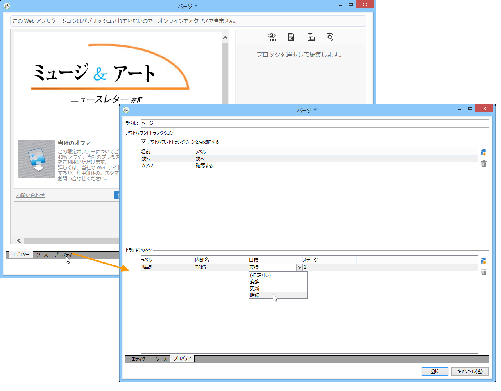

# Web アプリケーションのトラッキング{#tracking-a-web-application}

Adobe Campaign では、トラッキングタグを挿入することで、Web アプリケーションページへの訪問をトラッキングおよび測定できます。この機能は、すべての Web アプリケーションタイプ（フォーム、オンライン調査、DCE で作成された Web ページなど）で使用できます。

そのため、複数のナビゲーションパスを定義して、成功を評価できます。復元したデータは、各アプリケーションのレポートで使用できます。

このバージョンの主な強化点を次に示します。

* ナビゲーションパスの定義を簡単にするために、複数のトラッキングタグを同じページに挿入可能（例：購入、購読、戻るなど）
* Web アプリケーションダッシュボードでの、異なるページのナビゲーションパスおよびトラッキングタグの表示

   

* 完全なトラッキングレポートの生成

   

   主な指標を次に示します。

   * **コンバージョン率**：ナビゲーションパスのすべてのステップを表示した人の数
   * **バウンス率**：最初のステップのみ表示した人の数
   * **コンバージョンファネル**：各ステップ間の損失率
   さらに、**扇形**&#x200B;のグラフに、そのソースに応じた母集団が表示されます。

## トラフィックソースの識別 {#identifying-the-traffic-source}

Web アプリケーションにアクセスする訪問者がどこから来たかを識別するには、次の 2 つの異なる手法を使用できます。

1. Web アプリケーションページへのアクセス権を付与するための特別な配信を送信。この場合、トラフィックソースは、この配信です。
1. Web アプリケーションを専用のトラフィックソースと関連付け。この場合、外部の「トラフィックソース」タイプの配信である必要があります。Web アプリケーションプロパティから、またはターゲットマッピングから、選択できます。

   

Web アプリケーションのトラフィックソースを識別するために、Adobe Campaign は引き続き次の情報を探します。

1. ソース配信識別子（存在する場合）（nlId cookie）
1. Web アプリケーションプロパティで定義された、外部配信の識別子（存在する場合）
1. ターゲットマッピングで定義された、外部配信の識別子（存在する場合）

>[!NOTE]
>
>匿名トラッキングは、デプロイウィザードで対応するオプションが有効化されている場合にのみ可能です。
>
>詳しくは、[インストールガイド](../../installation/using/deploying-an-instance.md)を参照してください。

## デジタルコンテンツエディター（DCE）で設計された Web アプリケーション{#web-applications-designed-with-digital-content-editor--dce-}

Web アプリケーションが HTML コンテンツエディター - **デジタルコンテンツエディター（DCE）** - を使用して作成されている場合、トラッキングタグは、エディターの「**[!UICONTROL プロパティ]**」タブで挿入されます。デジタルコンテンツエディター（DCE）について詳しくは、[この節](../../web/using/about-campaign-html-editor.md)を参照してください。

Web インターフェイスを使用する場合、トラッキングタグは、ページプロパティから挿入される必要があります。

**[!UICONTROL ブロックを表示]**&#x200B;アイコンを使用すると、そのページに定義されたトラッキングタグの数を表示できます。

