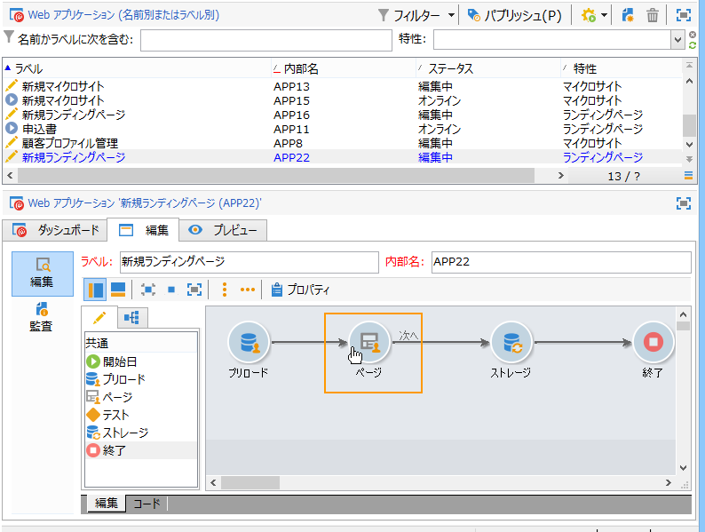
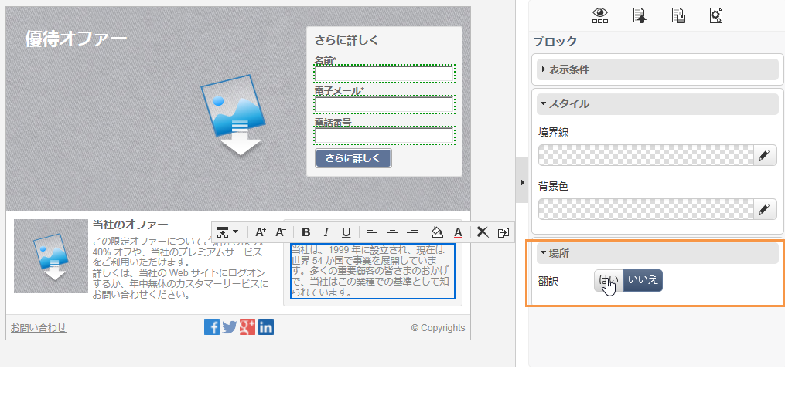
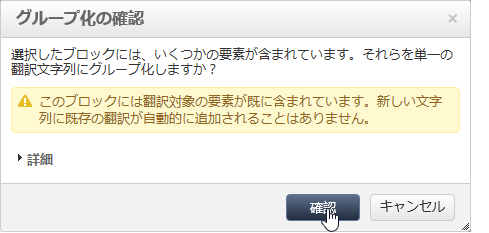
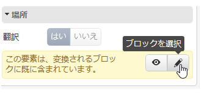

# Web アプリケーションの翻訳{#translating-a-web-application}

Adobe Campaign デジタルコンテンツエディター（DCE）で作成した Web アプリケーションページを翻訳できます。

Web アプリケーションの&#x200B;**[!UICONTROL プロパティ]**&#x200B;の「**[!UICONTROL ローカライゼーション]**」タブで少なくとも 1 つの追加言語を選択すると、DCE で編集したページに HTML コンテンツブロックを追加する際に、新しいオプションが利用できるようになります。

このオプションを使用すると、ブロックコンテンツを翻訳する必要があるかどうかを示すことができます。

翻訳される文字列は、アプリケーションの「**[!UICONTROL 翻訳]**」タブを使用して、Web アプリケーションの他の文字列と同じ方法で収集されます。詳しくは、[このページ](../../web/using/translating-a-web-form.md)を参照してください。

翻訳する文字列にフラグを設定するには：

1. DCE で編集されたコンテンツページを Web アプリケーションで開きます。

   

1. HTML ブロックを選択します。
1. 右側のパラメーターブロックで、「**[!UICONTROL ローカライゼーション]**」オプションを使用すると、選択したブロックのコンテンツにフラグを設定できます。デフォルトでは、ページタイトルのみが翻訳されます。

   

   >[!NOTE]
   >
   >文字列は、1,023 文字以下にする必要があります。

   3 つの特殊なケースがあります。

   * 選択したブロックに複数の文字列／ブロックが含まれる場合、翻訳する単一の文字列としてフラグされます。そのため、文字列には、このブロック内の要素の HTML コードが含まれます。
   * 複数の文字列を含むブロックにフラグを設定する場合、それらの文字列のうち少なくとも 1 つに既にフラグが設定されていると、警告が表示されます。独立した文字列からフラグを削除して、ブロック全体にフラグを追加できます。

      

   * 既にフラグが設定されたブロックに含まれている文字列からフラグを削除する場合、文字列翻訳オプションを直接修正することはできません。ただし、変更するために、文字列を含むブロックにアクセスすることはできます。

      

1. 文字列のフラグ設定が終了したら、Web アプリケーションに戻って、「**[!UICONTROL 翻訳]**」タブを選択します。
1. 「**[!UICONTROL 翻訳する文字列を収集]**」を選択します。DCE でフラグを設定した文字列は、Web アプリケーションの文字列に追加されます。

   >[!NOTE]
   >
   >文字列が収集されたら、DCE で翻訳フラグを削除しても、リストからは削除されません。これにより、翻訳メモリに保持できます。

1. 文字列を翻訳して承認します。

   そうすると、Web アプリケーションの「**[!UICONTROL プレビュー]**」タブで目的の言語を選択することで、翻訳をプレビューできます。

