# Web フォームの翻訳{#translating-a-web-form}

1 つの Web アプリケーションを多言語にローカライズすることができます。

Adobe Campaign コンソールで直接翻訳を実行したり（[エディターでの翻訳の管理 ](#managing-translations-in-the-editor)を参照）、文字列をエクスポートおよびインポートして外部で翻訳したり（[外部での翻訳](#externalizing-translation)を参照）できます。

デフォルトで使用可能な翻訳言語のリストは、[フォームの表示言語の変更](#changing-forms-display-language)を参照してください。

Web アプリケーションは、編集言語で設計されます。これは、翻訳するラベルおよびその他のコンテンツを入力するために使用される基準言語です。

デフォルト言語は、アクセス URL に言語設定が追加されていない場合に Web アプリケーションで表示される言語です。

>[!NOTE]
>
>デフォルトでは、編集言語とデフォルト言語は、コンソールの言語と同じです。

## 言語の選択{#choosing-languages}

To define one or more translation languages, click the **[!UICONTROL Properties]** button of the Web application, then the **[!UICONTROL Localization]** tab. Click the **[!UICONTROL Add]** button to define a new translation language for the Web application.

>[!NOTE]
>
>また、このウィンドウでは、デフォルト言語および編集言語を変更できます。

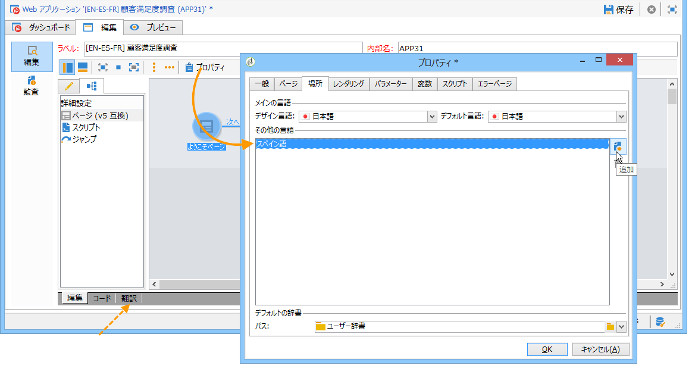

When you add translation languages for a Web application (or when the default language and the editing language are different), a **[!UICONTROL Translation]** sub-tab is added to the **[!UICONTROL Edit]** tab to manage translations.

Adobe Campaign には、複数言語の翻訳を実行および管理するためのツールが含まれています。このエディターを使用すると、翻訳または承認する文字列を表示したり、インターフェイスに直接翻訳を入力したり、外部翻訳に対して文字列をインポート／エクスポートしたりできます。

## エディターでの翻訳の管理 {#managing-translations-in-the-editor}

### 文字列の収集 {#collecting-strings}

The **[!UICONTROL Translations]** tab lets you enter translations for the character strings that make up the Web application.

このタブを初めて開いたときは、何のデータも含まれていません。リンクをクリ **[!UICONTROL Collect the strings to translate]** ックして、Webアプリケーション内の文字列を更新します。

Adobe Campaign collects labels of fields and strings defined in the **[!UICONTROL Texts]** tabs of all static elements: HTML blocks, Javascript, etc. 静的要素について詳しくは、[Web フォームの静的要素](../../web/using/static-elements-in-a-web-form.md)で説明しています。

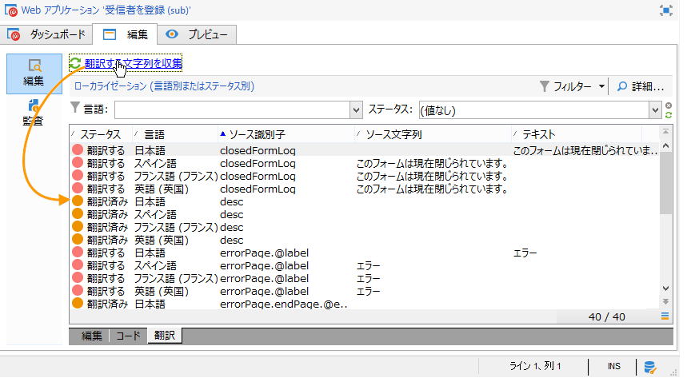

>[!CAUTION]
>
>このプロセスは、処理するデータの量によっては数分間かかることがあります。
> 
>システム辞書に一部の翻訳が見つからないという警告が表示される場合は、[システム文字列の翻訳](#translating-the-system-strings)を参照してください。

文字列が翻訳されるたびに、その翻訳が翻訳辞書に追加されます。

When the collection process detects that a translation already exists, this translation is displayed in the **[!UICONTROL Text]** column of the string. The status of the string is turned to **[!UICONTROL Translated]**.

For characters strings which have never been translated, the **[!UICONTROL Text]** field is empty and the status is **[!UICONTROL To translate]**.

### 文字列のフィルタリング {#filtering-strings}

デフォルトでは、Web アプリケーションの各翻訳言語が表示されます。デフォルトでは、フィルターには、言語とステータスの 2 つがあります。ボタンをクリ **[!UICONTROL Filters]** ックし、をクリックし **[!UICONTROL By language or status]** て、一致するドロップダウンボックスを表示します。 また、詳細フィルターを作成することもできます。詳しくは、[このページ](../../platform/using/creating-filters.md#creating-an-advanced-filter)を参照してください。

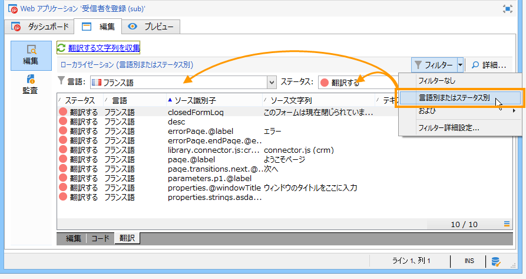

Go to the **[!UICONTROL Language]** drop-down box to select the translation language.

To display only untranslated strings, select **[!UICONTROL To translate]** in the **[!UICONTROL Status]** drop-down box. また、翻訳済みまたは承認済みの文字列のみを表示することもできます。

### 文字列の翻訳 {#translating-strings}

1. 単語を翻訳するには、文字列のリストでその行をダブルクリックします。

   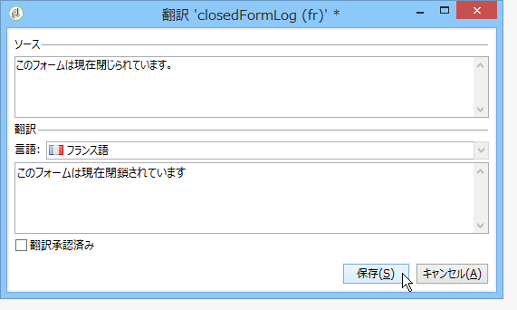

   ソース文字列が、ウィンドウの上のセクションに表示されます。

1. 下のセクションに翻訳を入力します。承認するには、このオプションをオンに **[!UICONTROL Translation approved]** します。

   >[!NOTE]
   >
   >翻訳承認済みはオプションで、処理をブロックしません。

   Non-approved translations are displayed as **[!UICONTROL Translated]**. Approved translations are displayed as **[!UICONTROL Approved]**.

## 外部での翻訳 {#externalizing-translation}

文字列をエクスポートおよびインポートして、Adobe Campaign 以外のツールを使用して翻訳できます。

>[!CAUTION]
>
>文字列をエクスポートしたら、統合ツールを使用した翻訳を実行しないでください。これは、翻訳を再インポートする際に競合を引き起こし、これらの翻訳が失われます。

### ファイルのエクスポート {#exporting-files}

1. 文字列を読み込むWebアプリケーションを選択し、右クリックして、 **[!UICONTROL Actions > Export strings for translation...]**

   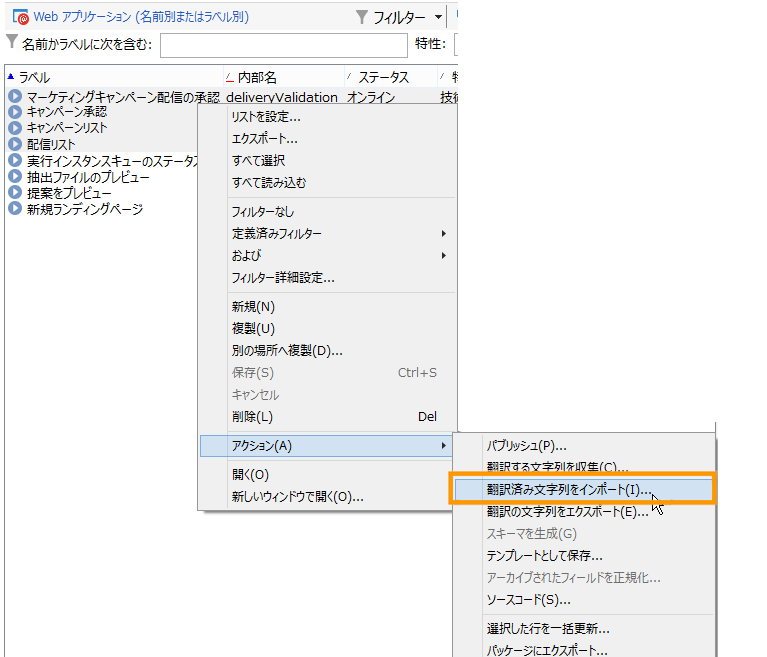

1. 次のいずれかを選択しま **[!UICONTROL Export strategy]** す。

   * **[!UICONTROL One file per language]**:書き出しでは、翻訳言語ごとに1つのファイルが生成されます。 各ファイルは、選択したすべての Web アプリケーションで共通です。
   * **[!UICONTROL One file per Web application]**:エクスポートでは、選択したWebアプリケーションごとに1つのファイルが生成されます。 各ファイルには、すべての翻訳言語が含まれます。

      >[!NOTE]
      >
      >このタイプのエクスポートは、XLIFF エクスポートでは使用できません。

   * **[!UICONTROL One file per language and per Web application]**:書き出しでは複数のファイルが生成されます。 各ファイルには、Web アプリケーションごとに 1 つの翻訳言語が含まれます。
   * **[!UICONTROL One file for all]**:書き出しにより、すべてのWebアプリケーション用に単一の多言語ファイルが生成されます。 選択したすべての Web アプリケーションのすべての翻訳言語が含まれます。

      >[!NOTE]
      >
      >このタイプのエクスポートは、XLIFF エクスポートでは使用できません。

1. Then chose the **[!UICONTROL Target folder]** where files will be recorded.
1. Select the file format ( **[!UICONTROL CSV]** or **[!UICONTROL XLIFF]** ) and click **[!UICONTROL Start]**.

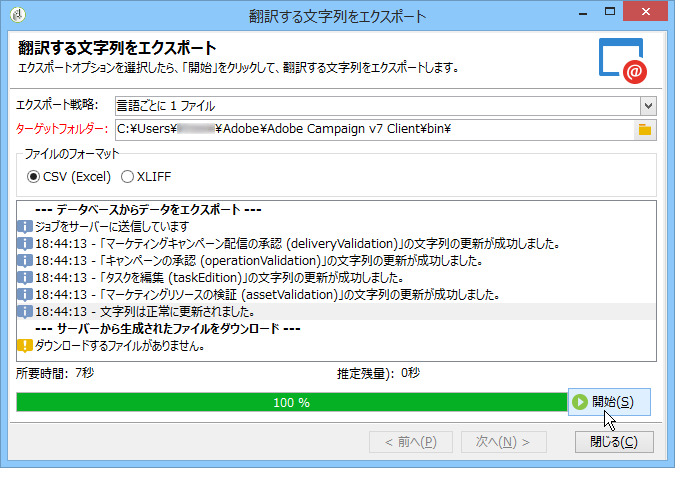

>[!NOTE]
>
>エクスポートファイルの名前は、自動的に生成されます。同じエクスポートを複数回実行すると、既存のファイルは新しいファイルに置き換えられます。If you need to keep the previous files, change the **[!UICONTROL Target folder]** , then click **[!UICONTROL Start]** again to run the export.

**CSV 形式**&#x200B;でファイルをエクスポートする場合、各言語はステータスおよび承認ステータスにリンクされます。**承認**&#x200B;列を使用すると、翻訳を承認できます。この列には、値 **Yes** または **No** が含まれることがあります。統合エディター（[エディターでの翻訳の管理](#managing-translations-in-the-editor)を参照）については、翻訳の承認はオプションで、処理をブロックしません。

### ファイルのインポート {#importing-files}

外部翻訳が完了したら、翻訳済みファイルをインポートできます。

1. Webアプリケーションのリストに移動し、右クリックして、「 **[!UICONTROL Actions > Import translated strings...]**

   >[!NOTE]
   >
   >翻訳に関係する Web アプリケーションを選択する必要はありません。Web アプリケーションのリスト上にマウスポインターを置きます。

   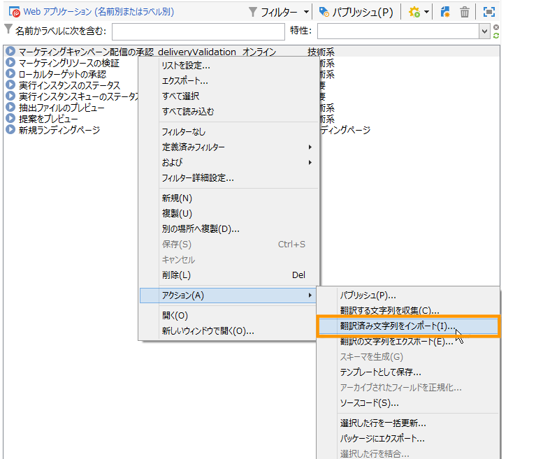

1. Select the file to import, then click **[!UICONTROL Upload]**.

   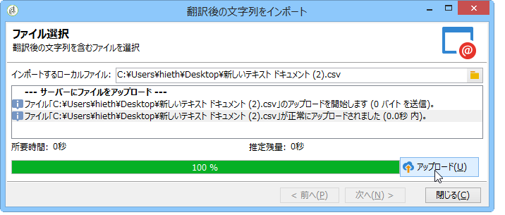

>[!NOTE]
>
>外部翻訳は、常に内部翻訳よりも優先されます。競合が発生した場合、内部翻訳は、外部翻訳で上書きされます。

## フォームの表示言語の変更 {#changing-forms-display-language}

Web forms are displayed in the default language specified in the **[!UICONTROL Localization]** tab of the Web application properties. 言語を変更するには、URL の末尾に次の文字列を追加する必要があります（**xx** は、言語のシンボルです）。

```
?lang=xx
```

言語が URL の最初または唯一のパラメーターの場合。例：**https://myserver/webApp/APP34?lang=en**

```
&lang=xx
```

URL の言語の前に他のパラメーターがある場合。例：**https://myserver/webApp/APP34?status=1&amp;lang=en**

デフォルトで使用できる翻訳言語と辞書を次に示します。

**デフォルトのシステム辞書**：一部の言語には、システム文字列の翻訳を含むデフォルト辞書が含まれています。詳しくは、[システム文字列の翻訳](#translating-the-system-strings)を参照してください。

**カレンダーの管理**：Web アプリケーションのページには、日付を入力するためのカレンダーを含めることができます。デフォルトでは、このカレンダーがいくつかの言語で使用できます（曜日、日付フォーマットの翻訳）。

<table> 
 <tbody> 
  <tr> 
   <td> <strong>言語（シンボル）</strong><br /> </td> 
   <td> <strong>デフォルトのシステム辞書</strong><br /> </td> 
   <td> <strong>カレンダーの管理</strong><br /> </td> 
  </tr> 
  <tr> 
   <td> ドイツ語（de）<br /> </td> 
   <td> ○<br /> </td> 
   <td> ○<br /> </td> 
  </tr> 
  <tr> 
   <td> 英語（en）<br /> </td> 
   <td> ○<br /> </td> 
   <td> ○<br /> </td> 
  </tr> 
  <tr> 
   <td> 英語（米国）（en_US）<br /> </td> 
   <td> </td> 
   <td> </td> 
  </tr> 
  <tr> 
   <td> 英語（英国）（en_GB）<br /> </td> 
   <td> </td> 
   <td> </td> 
  </tr> 
  <tr> 
   <td> アラビア語（ar）<br /> </td> 
   <td> </td> 
   <td> </td> 
  </tr> 
  <tr> 
   <td> 中国語（zh）<br /> </td> 
   <td> </td> 
   <td> </td> 
  </tr> 
  <tr> 
   <td> 韓国語（ko）<br /> </td> 
   <td> </td> 
   <td> </td> 
  </tr> 
  <tr> 
   <td> デンマーク語（da）<br /> </td> 
   <td> ○<br /> </td> 
   <td> ○<br /> </td> 
  </tr> 
  <tr> 
   <td> スペイン語（es）<br /> </td> 
   <td> ○<br /> </td> 
   <td> ○<br /> </td> 
  </tr> 
  <tr> 
   <td> エストニア語（et）<br /> </td> 
   <td> </td> 
   <td> </td> 
  </tr> 
  <tr> 
   <td> フィンランド語（fi）<br /> </td> 
   <td> </td> 
   <td> ○<br /> </td> 
  </tr> 
  <tr> 
   <td> フランス語（fr）<br /> </td> 
   <td> ○<br /> </td> 
   <td> ○<br /> </td> 
  </tr> 
  <tr> 
   <td> フランス語（ベルギー）（fr_BE）<br /> </td> 
   <td> </td> 
   <td> </td> 
  </tr> 
  <tr> 
   <td> フランス語（フランス）（fr_FR）<br /> </td> 
   <td> </td> 
   <td> </td> 
  </tr> 
  <tr> 
   <td> ギリシャ語（el）<br /> </td> 
   <td> </td> 
   <td> ○<br /> </td> 
  </tr> 
  <tr> 
   <td> ヘブライ語（he）<br /> </td> 
   <td> </td> 
   <td> </td> 
  </tr> 
  <tr> 
   <td> ハンガリー語（hu）<br /> </td> 
   <td> </td> 
   <td> ○<br /> </td> 
  </tr> 
  <tr> 
   <td> インドネシア語（id）<br /> </td> 
   <td> </td> 
   <td> </td> 
  </tr> 
  <tr> 
   <td> アイルランド語（ga）<br /> </td> 
   <td> </td> 
   <td> </td> 
  </tr> 
  <tr> 
   <td> イタリア語（it）<br /> </td> 
   <td> ○<br /> </td> 
   <td> ○<br /> </td> 
  </tr> 
  <tr> 
   <td> イタリア語（イタリア）（it_IT）<br /> </td> 
   <td> </td> 
   <td> </td> 
  </tr> 
  <tr> 
   <td> イタリア語（スイス）（it_CH）<br /> </td> 
   <td> </td> 
   <td> </td> 
  </tr> 
  <tr> 
   <td> 日本語（ja）<br /> </td> 
   <td> </td> 
   <td> </td> 
  </tr> 
  <tr> 
   <td> ラトビア語（lv）<br /> </td> 
   <td> </td> 
   <td> ○<br /> </td> 
  </tr> 
  <tr> 
   <td> リトアニア語（lt）<br /> </td> 
   <td> </td> 
   <td> </td> 
  </tr> 
  <tr> 
   <td> マルタ語（mt）<br /> </td> 
   <td> </td> 
   <td> </td> 
  </tr> 
  <tr> 
   <td> オランダ語（nl）<br /> </td> 
   <td> </td> 
   <td> ○<br /> </td> 
  </tr> 
  <tr> 
   <td> オランダ語（ベルギー）（nl_BE）<br /> </td> 
   <td> </td> 
   <td> </td> 
  </tr> 
  <tr> 
   <td> オランダ語（オランダ）（nl_NL）<br /> </td> 
   <td> </td> 
   <td> </td> 
  </tr> 
  <tr> 
   <td> ノルウェー語（ノルウェー）（no_NO）<br /> </td> 
   <td> </td> 
   <td> ○<br /> </td> 
  </tr> 
  <tr> 
   <td> ポーランド語（pl）<br /> </td> 
   <td> </td> 
   <td> ○<br /> </td> 
  </tr> 
  <tr> 
   <td> ポルトガル語（pt）<br /> </td> 
   <td> </td> 
   <td> ○<br /> </td> 
  </tr> 
  <tr> 
   <td> ポルトガル語（ブラジル）（pt_BR）<br /> </td> 
   <td> </td> 
   <td> </td> 
  </tr> 
  <tr> 
   <td> ポルトガル語（ポルトガル）（pt_PT）<br /> </td> 
   <td> </td> 
   <td> </td> 
  </tr> 
  <tr> 
   <td> ロシア語（ru）<br /> </td> 
   <td> </td> 
   <td> ○<br /> </td> 
  </tr> 
  <tr> 
   <td> スロベニア語（sl）<br /> </td> 
   <td> </td> 
   <td> </td> 
  </tr> 
  <tr> 
   <td> スロバキア語（sk）<br /> </td> 
   <td> </td> 
   <td> </td> 
  </tr> 
  <tr> 
   <td> スウェーデン語（sv）<br /> </td> 
   <td> ○<br /> </td> 
   <td> ○<br /> </td> 
  </tr> 
  <tr> 
   <td> スウェーデン語（フィンランド）（sv_FI）<br /> </td> 
   <td> </td> 
   <td> </td> 
  </tr> 
  <tr> 
   <td> スウェーデン語（スウェーデン）（sv_SE）<br /> </td> 
   <td> </td> 
   <td> </td> 
  </tr> 
  <tr> 
   <td> チェコ語（cs）<br /> </td> 
   <td> </td> 
   <td> </td> 
  </tr> 
  <tr> 
   <td> タイ語（th）<br /> </td> 
   <td> </td> 
   <td> </td> 
  </tr> 
  <tr> 
   <td> ベトナム語（vi）<br /> </td> 
   <td> </td> 
   <td> </td> 
  </tr> 
  <tr> 
   <td> ワロン語（wa）<br /> </td> 
   <td> </td> 
   <td> </td> 
  </tr> 
 </tbody> 
</table>

>[!NOTE]
>
>デフォルトで提供されている以外の言語を追加するには、[翻訳言語の追加](#adding-a-translation-language)を参照してください。

## 例：いくつかの言語での Web アプリケーションの表示 {#example--displaying-a-web-application-in-several-languages}

次の Web フォームは、英語、フランス語、ドイツ語、スペイン語の 4 つの言語で使用できます。The character strings have all been translated via the **[!UICONTROL Translation]** tab of the Web form. デフォルト言語が英語なので、調査がパブリッシュされる際には、英語で表示するための標準 URL が使用されます。

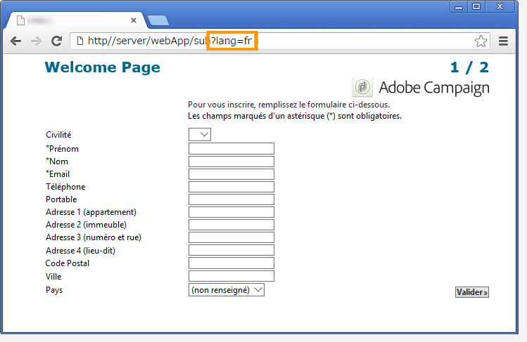

フランス語で表示するには、URL の末尾に **?lang=fr** を追加します。

>[!NOTE]
>
>各言語のシンボルのリストについて詳しくは、[フォームの表示言語の変更](#changing-forms-display-language)を参照してください。

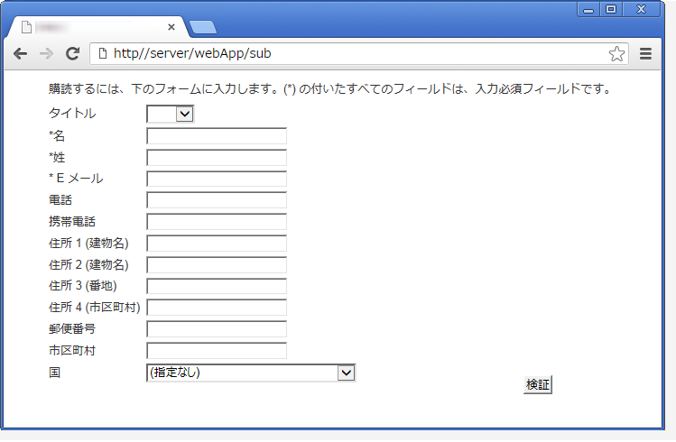

**?lang=es** または **?lang=de** を追加して、スペイン語またはドイツ語で表示することができます。

>[!NOTE]
>
>この Web アプリケーションで他のパラメーターが既に使用されている場合は、**&amp;lang=** を追加します。\
>例：**https://myserver/webApp/APP34?status=1&amp;lang=en**

## 詳細な翻訳設定 {#advanced-translation-configuration}

>[!CAUTION]
>
>このセクションはエキスパートユーザー専用です。

### システム文字列の翻訳 {#translating-the-system-strings}

システム文字列は、すべての Web アプリケーションで標準の文字列です。例：、 **[!UICONTROL Next]** ボタ **[!UICONTROL Previous]**&#x200B;ン、メ **[!UICONTROL Approve]** ッセ **[!UICONTROL Loading]** ージなど デフォルトでは、一部の言語には、これらの文字列の翻訳を含む辞書が含まれています。言語のリストについて詳しくは、[フォームの表示言語の変更](#changing-forms-display-language)を参照してください。

システム辞書が翻訳されていない言語に Web アプリケーションを翻訳する場合、一部の翻訳が見つからないことを知らせる警告メッセージが表示されます。


言語を追加するには、次の手順に従います。

1. Adobe Campaignツリーに移動し、をクリックします **[!UICONTROL Administration > Configuration > Global dictionary > System dictionary]** 。
1. In the upper section of the window, select the system string to translate, then click **[!UICONTROL Add]** in the lower section.

   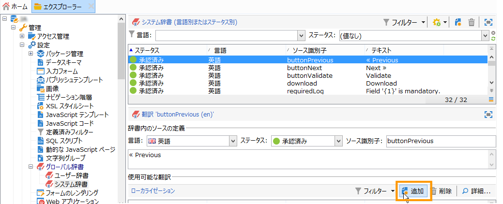

1. 翻訳言語を選択して、その文字列の翻訳を入力します。You can approve the translation by checking the **[!UICONTROL Translation validated]** option.

   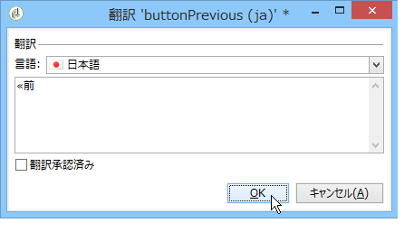

   >[!NOTE]
   >
   >翻訳承認済みはオプションで、処理をブロックしません。

>[!CAUTION]
>
>標準のシステム文字列は削除しないでください。

### 翻訳言語の追加 {#adding-a-translation-language}

Web アプリケーションをデフォルト以外の言語に翻訳するには（[フォームの表示言語の変更](#changing-forms-display-language)を参照）、新しい翻訳言語を追加する必要があります。

1. Adobe Campaignツリー **[!UICONTROL Administration > Platform > Itemized lists]** のノードをクリックし、リストから **[!UICONTROL Languages available for translation]** 選択します。 使用できる翻訳のリストが、ウィンドウの下部のセクションに表示されます。

   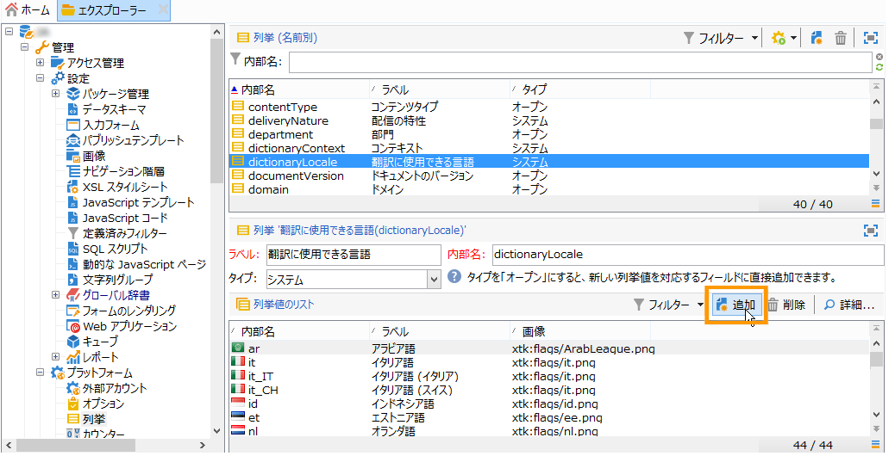

1. ボタンを **[!UICONTROL Add]** クリックし、画像の **[!UICONTROL Internal name]** ID( **[!UICONTROL Label]** フラグ)とIDを入力します。 新しい画像を追加するには、管理者にお問い合わせください。

   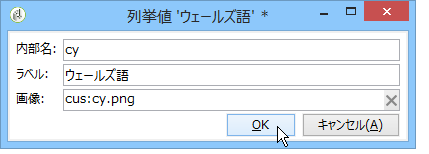

