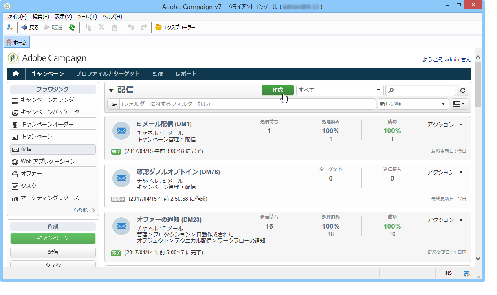
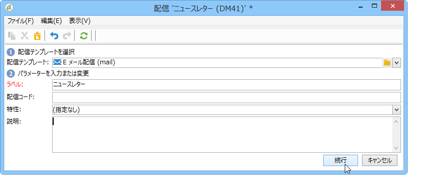
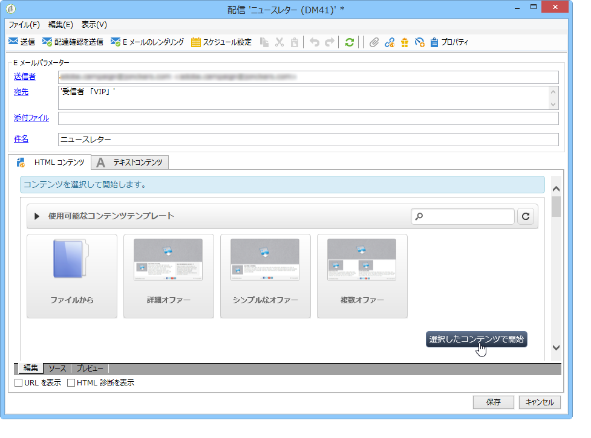
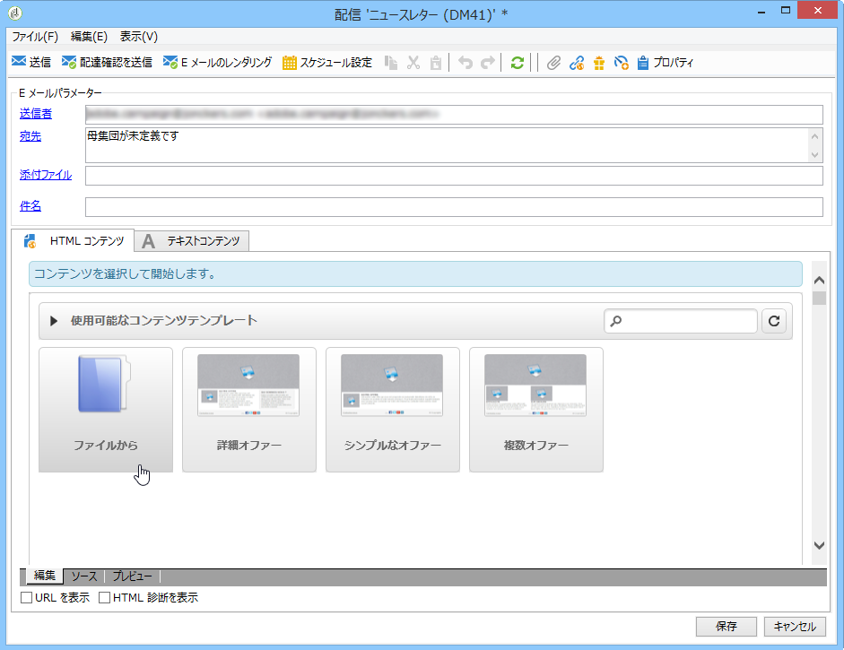
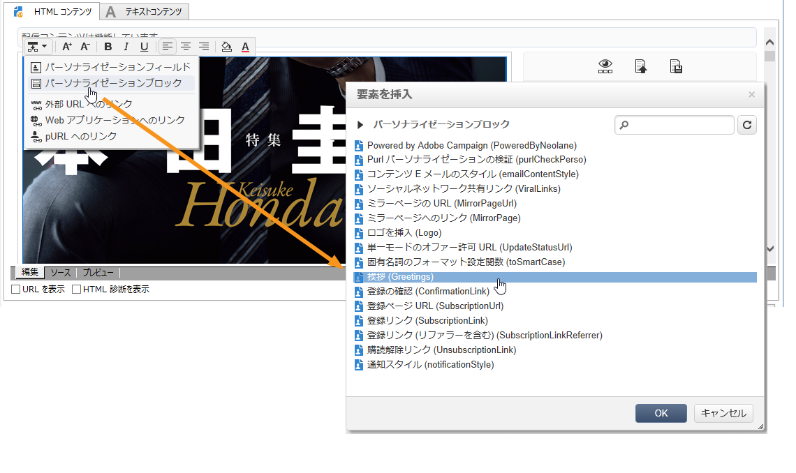
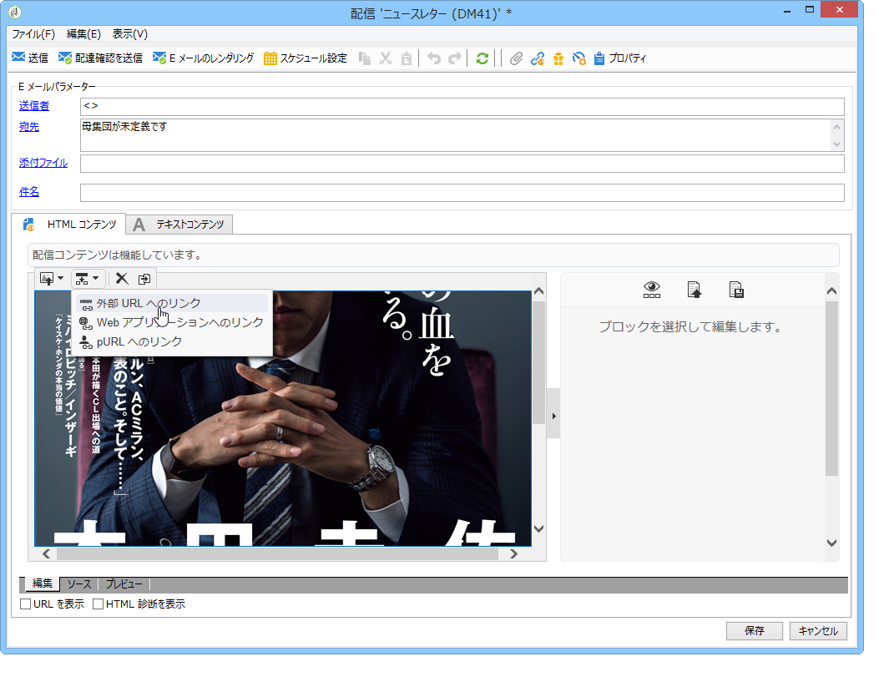
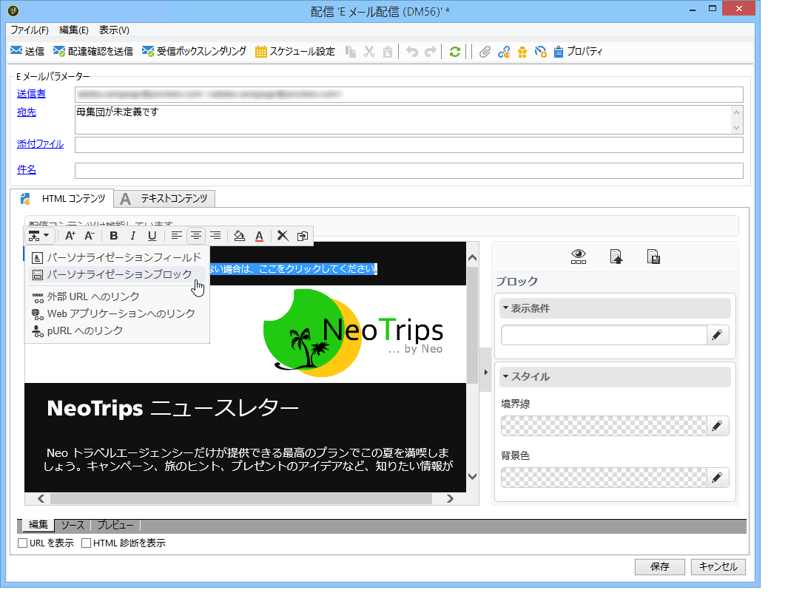
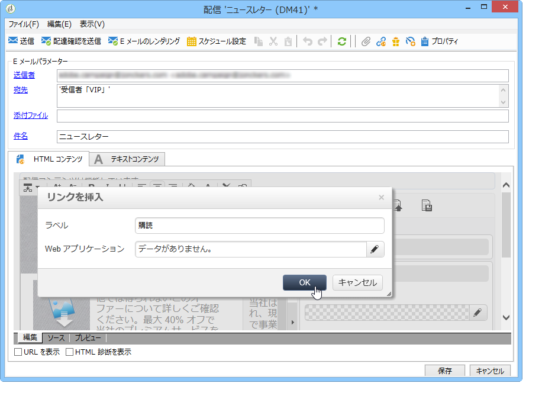

# ユースケース：E メール配信の作成{#use-case-creating-an-email-delivery}

この使用事例では、Adobe Campaignデジタルコンテンツエディター(DCE)を使用して電子メール配信をデザインする手順を学習します。

最終目標は、次の要素を含むパーソナライズされたテンプレートを使用して配信を作成することです。

* 受信者へ直接の挨拶（姓と名を使用）
* 外部 URL へのリンク 2 種類
* ミラーページ
* Web アプリケーションへのリンク

>[!NOTE]
>
>将来の配信のコンテンツをホストするために、開始する前に少なくとも 1 つの **HTML テンプレート**&#x200B;が設定されている必要があります。
>
>配信で、( **[!UICONTROL Properties]** タブ内の)がに設 **[!UICONTROL Content editing mode]** 定されてい **[!UICONTROL Advanced]** ることを確認します **[!UICONTROL DCE]**。 編集者の最適な操作を確実に行うには、「コンテンツ編集のベス [トプラクティス」を参照します](../../web/using/content-editing-best-practices.md)。

## 手順 1 - 配信の作成 {#step-1---creating-a-delivery}

To create a new delivery, place your cursor in the **Campaigns** tab and click **Deliveries**. 次に、既存の配信のリストの上にある「**作成**」ボタンをクリックします。配信の作成について詳しくは、[このページ](../../delivery/using/about-email-channel.md)を参照してください。

## 手順 2 - テンプレートの選択 {#step-2---selecting-a-template}

配信テンプレートを選択して、配信に名前を付けます。この名前は、Adobe Campaign コンソールのユーザーにのみ表示され、受信者には表示されません。ただし、この見出しは、配信のリストに表示されます。クリック **[!UICONTROL Continue]**.

## 手順 3 - コンテンツの選択 {#step-3---selecting-a-content}

デジタルコンテンツエディターには、すぐに使用できる様々なテンプレートが付属しています。これらのテンプレートは、多様な要素（列、テキスト領域など）で構成されています

Select the content template that you want to use, then click the **[!UICONTROL Start with the selected content]** button to display the template in the created delivery.

You can also import an HTML content created outside of Adobe Campaign by selecting **[!UICONTROL From a file]**.

このコンテンツをテンプレートとして保存し、後で利用することもできます。パーソナライズされたコンテンツテンプレートを作成すると、テンプレートのリストからプレビューできるようになります。For more on this, refer to [Template management](../../web/using/template-management.md).

>[!CAUTION]
>
>**Adobe Campaign web インターフェイス**&#x200B;を使用している場合は、HTML コンテンツと関連する画像を含む .zip ファイルをインポートする必要があります。

## 手順 4 - メッセージの設計 {#step-4---designing-the-message}

* 受信者の氏名の表示

   受信者の氏名を配信のテキストフィールドに挿入するには、選択したテキストフィールドをクリックして、表示する場所にマウスポインターを置きます。Click the first icon in the pop-up toolbar, then click **[!UICONTROL Personalization block]**. を選択し **[!UICONTROL Greetings]**、をクリックしま **[!UICONTROL OK]**&#x200B;す。

   

* リンクを画像に挿入します。

   To take delivery recipients to an external address via an image, click on the relevant image to display the pop-up toolbar, place the cursor on the first icon then click **[!UICONTROL Link to an external URL]**. For more on this, refer to [Adding a link](../../web/using/editing-content.md#adding-a-link).

   

   **https://www.myURL.com** という形式で「**URL**」フィールドにリンクの URL を入力して、確認します。

   リンクは、ウィンドウの右側のセクションを使用して、いつでも変更できます。

* リンクをテキストに挿入します。

   外部リンクを配信のテキストに統合するには、テキストの一部またはテキストのブロックを選択して、ポップアップツールバーの最初のアイコンをクリックします。をクリ **[!UICONTROL Link to an external URL]**&#x200B;ックし、フィールドにリンクアドレスを入力 **[!UICONTROL URL]** します。 For more on this, refer to [Adding a link](../../web/using/editing-content.md#adding-a-link).

   リンクは、ウィンドウの右側のセクションを使用して、いつでも変更できます。

   >[!CAUTION]
   >
   >The text entered in the **[!UICONTROL Label]** field replaces the original text.

* ミラーページの追加

   受信者に Web ブラウザーで配信コンテンツを表示するのを許可するには、ミラーページへのリンクを配信に統合します。

   投稿したリンクを表示するテキストフィールドをクリックします。ポップアップツールバーの最初のアイコンをクリックし、を選択 **[!UICONTROL Personalization block]**&#x200B;してから、を選択しま **[!UICONTROL Link to Mirror Page (MirrorPage)]**&#x200B;す。 Click **[!UICONTROL Save]** to confirm.

   

   >[!CAUTION]
   >
   >パーソナライゼーションブロックラベルは、配信の元のテキストを自動的に置き換えます。

* Web アプリケーションへのリンクの統合

   デジタルコンテンツエディターを使用すると、Adobe Campaign コンソールから Web アプリケーションへのリンクを統合できます（ランディングページやフォームページなど）。詳しくは、「Webアプリケーションへ [のリンク」を参照してください](../../web/using/editing-content.md#link-to-a-web-application)。

   Web アプリケーションへのリンクのテキストフィールドを選択して、最初のアイコンをクリックします。Choose **[!UICONTROL Link to a Web application]**, then select the desired application by clicking the icon at the end of the **Web Application** field.

   

   「**保存**」をクリックして確定します。

   >[!NOTE]
   >
   >この手順では、事前に少なくとも 1 つの Web アプリケーションを保存しておく必要があります。これらは、コンソールのタ **[!UICONTROL Campaigns > Web applications]** ブにあります。

## 手順 5 - 配信の保存 {#step-5---saving-the-delivery}

コンテンツを統合したら、「**保存**」をクリックして配信を保存します。It will now be displayed in your list of deliveries, found in the **[!UICONTROL Campaigns > Deliveries]** tab.
