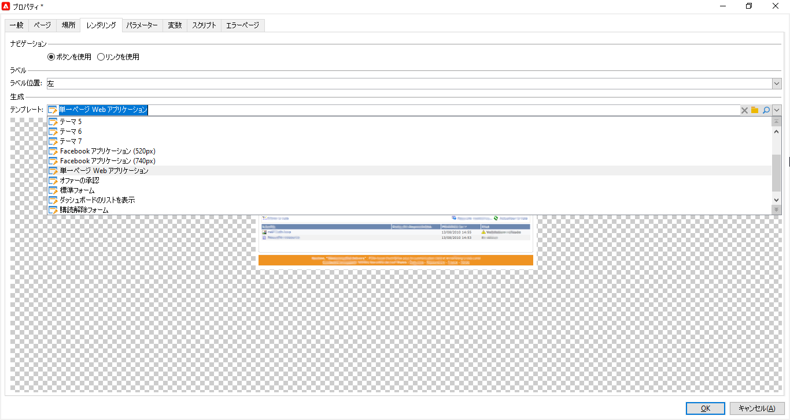

# ユースケース：概要の作成{#use-cases-creating-overviews}

次の例では、概要タイプの Web アプリケーションを作成して、データベースのすべての Web アプリケーションを表示します。次の要素を設定します。

* フォルダーのフィルター（[フォルダーのフィルターの追加](#adding-a-filter-on-a-folder)を参照）
* 新しい Web アプリケーションを作成するためのボタン（[新しい Web アプリケーションを設定するためのボタンの追加](#adding-a-button-to-configure-a-new-web-application)を参照）
* リスト内の各エントリ用の詳細表示（[リストへの詳細の追加](#adding-detail-to-a-list)を参照）
* 各リンク編集ツールごとのフィルター（[リンクエディターを使用したフィルターの作成](#creating-a-filter-using-a-link-editor)を参照）
* 更新リンク（[更新リンクの作成](#creating-a-refresh-link)を参照）


## 単一ページ Web アプリケーションの作成 {#creating-a-single-page-web-application}

1. 単一&#x200B;**[!UICONTROL ページ]** Web アプリケーションを作成し、アウトバウンドトランジションおよび次のページへのトランジションを無効にします。

   

1. ページタイトルの変更

   このタイトルは、概要ヘッダーおよび Web アプリケーションの概要に表示されます。

1. Web アプリケーションプロパティで、**[!UICONTROL 単一ページ Web アプリケーション]**&#x200B;テンプレートを選択することで、アプリケーションのレンダリングを修正します。

   

1. Web アプリケーションの&#x200B;**[!UICONTROL ページ]**&#x200B;アクティビティを開いて、リストを開きます（**[!UICONTROL 静的要素／リスト]**）。
1. リストの「**[!UICONTROL データ]**」タブで、**[!UICONTROL Web アプリケーション]**&#x200B;ドキュメントタイプを選択し、**[!UICONTROL ラベル]**、**[!UICONTROL 作成日]**&#x200B;および&#x200B;**[!UICONTROL アプリケーションのタイプ]**&#x200B;出力列を選択します。
1. 「**[!UICONTROL フィルター]**」サブタブで、次に示すように、Web アプリケーションのみを表示して、表示からテンプレートを除外するために、次のフィルターを作成します。

   

1. ページの設定ウィンドウを閉じて、「**[!UICONTROL プレビュー]**」をクリックします。

   データベースで使用可能な Web アプリケーションのリストが表示されます。

   

## フォルダーのフィルターの追加 {#adding-a-filter-on-a-folder}

概要では、Adobe Campaign ツリーでの場所に応じてデータにアクセスすることを選択できます。これが、フォルダーのフィルターです。フォルダーのフィルターを概要に追加するには、次の手順に従います。

1. Web アプリケーションの&#x200B;**[!UICONTROL ページ]**&#x200B;ノードにカーソルを置いて、**[!UICONTROL フォルダーを選択]**&#x200B;要素を追加します（**[!UICONTROL 高度なコントロール／フォルダーを選択]**）。
1. 表示される&#x200B;**[!UICONTROL ストレージ]**&#x200B;ウィンドウで、「**[!UICONTROL 変数を編集]**」リンクをクリックします。
1. ニーズに合わせて変数ラベルを変更します。
1. 値 **folder** で変数名を変更します。

   >[!NOTE]
   >
   >変数の名前は、フォルダーにリンクした要素の名前（スキーマで定義）に一致する必要があります（つまり、この場合は **folder**）。テーブルを参照する際に、この名前を再利用する必要があります。

1. 変数に **[!UICONTROL XML]** タイプを適用します。

   

1. **[!UICONTROL ページを更新]**&#x200B;インタラクションを選択します。

   

1. リストにカーソルを置いて、「**[!UICONTROL 詳細設定]**」タブで、リストの「**[!UICONTROL フォルダーのフィルター XPath]**」タブで前に作成した変数を参照します。フォルダーリンクに関係している要素の名前（つまり **folder**）を使用する必要があります。

   

   >[!NOTE]
   >
   >この段階では、Web アプリケーションは、アプリケーションコンテキスト内にないので、フィルターは、フォルダーでテストできません。

## 新しい Web アプリケーションを設定するためのボタンの追加 {#adding-a-button-to-configure-a-new-web-application}

1. **[!UICONTROL ページ]**&#x200B;要素にカーソルを置いて、リンクを追加します（**[!UICONTROL 静的要素／リンク]**）。
1. 概要のボタンに表示されるので、リンクラベルを修正します。

   この例では、ラベルは &quot;**New**&quot; です。

1. 「URL」フィールドに URL（**xtk://open/?schema=nms:webApp&amp;form=nms:newWebApp**）を挿入します。

   >[!NOTE]
   >
   >**nms:webApp** は、Web アプリケーションスキーマと一致します。
   >
   >**nms:newWebApp** は、新しい Web アプリケーション作成ウィザードと一致します。

1. URL を同じウィンドウで表示することを選択します。
1. 「画像」フィールドに Web アプリケーションアイコン **/nms/img/webApp.png** を追加します。

   このアイコンは、「**[!UICONTROL 新規]**」ボタンに表示されます。

1. 「**[!UICONTROL スタイル]**」フィールドに &quot;**button**&quot; と入力します。

   このスタイルは、前に選択した&#x200B;**[!UICONTROL 単一ページ Web アプリケーション]**&#x200B;テンプレートで参照されます。

   

## リストへの詳細の追加 {#adding-detail-to-a-list}

概要でリストを設定する場合、リストの各エントリに関する追加の詳細を表示することを選択できます。

1. 前に作成したリスト要素にカーソルを置きます。
1. 「**[!UICONTROL 一般]**」タブで、ドロップダウンリストから&#x200B;**[!UICONTROL 列と追加詳細]**&#x200B;表示モードを選択します。

   

1. 「**[!UICONTROL データ]**」タブで、**[!UICONTROL プライマリキー]**、**[!UICONTROL 内部名]**&#x200B;および&#x200B;**[!UICONTROL 説明]**&#x200B;列を追加して、各列に対して「**[!UICONTROL 非表示フィールド]**」オプションを選択します。

   

   これで、この情報は、各エントリの詳細にのみ表示されます。

1. 「**[!UICONTROL 追加の情報]**」タブで、次のコードを追加します。

   ```
   <div class="detailBox">
     <div class="actionBox">
       <span class="action"><a title="Open" class="linkAction" href="xtk://open/?schema=nms:webApp&form=nms:webApp&pk=
       <%=webApp.id%>">Open...</a></span>
       <% 
       if( webApp.@appType == 1 ) { //survey
       %>
       <span class="action"><a target="_blank" title="Reports" class="linkAction" href="/xtk/report.jssp?_context=selection&
         _schema=nms:webApp&_selection=<%=webApp.@id%>
         &__sessiontoken=<%=document.controller.getSessionToken()%>">Reports</a></span>
       <% 
       } 
       %>
     </div>
     <div>
       Internal name: <%= webApp.@internalName %>
     </div>
     <%
     if( webApp.desc != "" )
     {
     %>
     <div>
       Description: <%= webApp.desc %>
     </div>
     <% 
     } 
     %>
   </div>
   ```

>[!NOTE]
>
>JavaScript ライブラリは、サーバー上で更新するのに 5 分かかります。サーバーを再起動して、この遅延を待機するのを回避できます。

## リストのフィルターと更新 {#filtering-and-updating-the-list}

ここでは、特定のオペレーターによって作成された Web アプリケーションの概要を表示するフィルターを作成します。このフィルターは、リンクエディターで作成されます。オペレーターを選択したら、リストを更新してフィルターを適用します。これには、更新リンクを作成する必要があります。

これら 2 つの要素は、概要で視覚的にグループ化させるために、同じコンテナにグループ化されます。

1. **[!UICONTROL ページ]**&#x200B;要素にカーソルを置いて、**[!UICONTROL コンテナ／標準]**&#x200B;を選択します。
1. 列数を &quot;**2**&quot; に設定し、リンクエディターおよびリンクがお互い隣になるようにします。

   

   要素のレイアウトについては、[この節](../../web/using/about-web-forms.md)を参照してください。

1. **dottedFilter** を適用します。

   このスタイルは、前に選択した&#x200B;**[!UICONTROL 単一ページ Web アプリケーション]**&#x200B;テンプレートで参照されます。

   

### リンクエディターを使用したフィルターの作成 {#creating-a-filter-using-a-link-editor}

1. 前のステージで作成したコンテナにカーソルを置いて、**[!UICONTROL 高度なコントロール]**&#x200B;メニューからリンクエディターを挿入します。
1. 自動的に開くストレージウィンドウで、「**[!UICONTROL 変数]**」オプションを選択してから、「**[!UICONTROL 変数を編集]**」リンクをクリックして、データをフィルターするための XML 変数を作成します。

   

1. ラベルを修正します。

   概要の「**[!UICONTROL フィルター]**」フィールドの隣に表示されます。

1. アプリケーションスキーマとしてオペレーターテーブルを選択します。

   

1. リスト要素にカーソルを置いて、**[!UICONTROL データ／「フィルター」]**&#x200B;タブでフィルターを作成します。

   * **式：**「作成者」リンクの外部キー
   * **演算子：**&#x200B;等しい
   * **値：**&#x200B;変数
   * **次の場合に考慮：**&#39;$(var2/@id)&#39;!=&quot;
   

>[!CAUTION]
>
>Web アプリケーションユーザーは、情報にアクセスするための適切な Adobe Campaign 権限を持つ識別されたオペレーターである必要があります。このタイプの設定は、匿名 Web アプリケーションに対しては機能しません。

### 更新リンクの作成 {#creating-a-refresh-link}

1. コンテナにカーソルを置いて、**[!UICONTROL 静的要素]**&#x200B;メニューで&#x200B;**[!UICONTROL リンク]**&#x200B;を挿入します。
1. ラベルを修正します。
1. **[!UICONTROL リスト内のデータを更新]**&#x200B;を選択します。
1. 前に作成したリストを追加します。

   

1. 「**[!UICONTROL 画像]**」フィールドに更新アイコン **/xtk/img/refresh.png ** を追加します。
1. 次に示すように、並べ替え矢印を使用して、Web アプリケーションの様々な要素を認識します。

   

これで、Web アプリケーションが設定されました。「**[!UICONTROL プレビュー]**」タブをクリックしてプレビューします。


