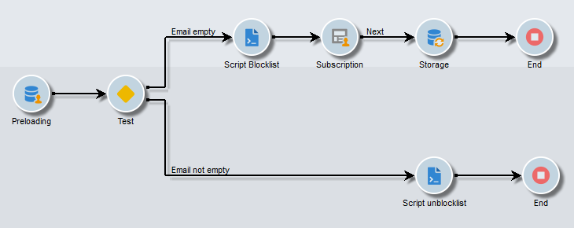
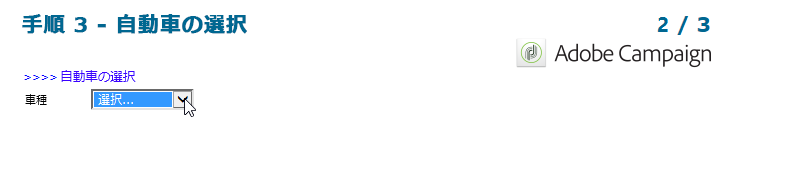

# ユースケース：Web フォーム{#use-cases-web-forms}

## 二重のオプトインを備えた購読フォームの作成 {#create-a-subscription--form-with-double-opt-in}

情報サービスを提供する場合、受信者は、リンクされたすべての通信を受信するために購読する必要があります。不適切な通信を避け、受信者が意図的に購読したことを確認するために、購読の確認リクエストを送信して、二重のオプトインを作成することをお勧めします。確認メッセージに含まれるリンクをユーザーがクリックした場合にのみ、購読が有効になります。

この例は、次のシナリオに基づいています。

1. 一時的なサービスを購読するためのチェックボックスが含まれた、Web サイト上のニュースレターの購読フォームの作成。このサービスにより、購読確認メッセージを配信できます。
1. Web フォームにリンクされた配信テンプレートを使用した、購読確認配信の作成。これには確認リンクが含まれています。この確認リンクは、ニュースレター購読用のフォームを呼び出して、購読承認メッセージを表示します。

### 手順 1 - 情報サービスの作成 {#step-1---creating-information-services}

1. 受信者に提供されるニュースレター購読サービスを作成します。ニュースレターの作成方法について詳しくは、[この節](../../delivery/using/about-services-and-subscriptions.md)を参照してください。

   

1. 2 番目の情報サービスとして、購読確認メッセージを送信するための配信テンプレートにリンクされた一時的なサービスを作成します。

   

### 手順 2 - 確認メッセージの作成 {#step-2---creating-confirmation-messages}

確認メッセージは、一時的なサービスレベルで参照される専用の配信テンプレートを使用して送信されます。

1. **[!UICONTROL エクスプローラー]**&#x200B;で、**[!UICONTROL リソース／テンプレート／配信テンプレート]**&#x200B;を選択します。
1. 購読確認メッセージを送信するための配信テンプレートを作成します。
1. 「**[!UICONTROL E メールパラメーター]**」の「**[!UICONTROL 宛先]**」ボタンをクリックして、受信者ではなく、購読ターゲットマッピングに配信テンプレートを関連付けます。

   

1. この配信の受信者は、承認を確認していないので、まだデータベースでブラックリストに登録されています。この通信を受信するには、このテンプレートに基づいて配信を承認して、ブラックリストに登録された受信者をターゲットにする必要があります。

   これを実行するには、「**[!UICONTROL 除外]**」タブをクリックします。

1. 「**[!UICONTROL 編集]**」リンクをクリックし、「**[!UICONTROL 今後連絡を希望しない受信者を除外 (ブラックリスト)]**」オプションのチェックをオフにします。

   

   >[!CAUTION]
   >
   >このオプションは、このタイプのコンテキストでのみ無効にできます。

1. 配信をパーソナライズし、確認リンクをメッセージコンテンツに挿入します。このリンクをクリックすると、購読確認を記録する Web フォームにアクセスできます。

   

1. DCE で URL を Web フォームにリンクします。Web フォームはまだ作成していないので、作成したらすぐに値を置き換えます。

   

1. 最後に、先ほど作成した一時的なサービスにこのテンプレートをリンクします。

   

### 手順 3 - 購読フォームの作成 {#step-3---creating-the-subscription-form}

Web フォームでは、受信者の購読と購読確認の両方が可能です。

Web フォームのワークフローには、次のアクティビティが含まれます。



これをおこなうには、以下の手順に従います。

1. Web フォームを作成し、**[!UICONTROL ニュースレターの購読（subNewsletter）]**&#x200B;テンプレートを選択します。

   

1. 購読を希望する受信者宛ての確認メッセージを追加したいので、「**[!UICONTROL 編集]**」タブで、既存のワークフローを設定する必要があります。

   そのためには、「**[!UICONTROL プリロード]**」ボックスをダブルクリックして、次のように設定します。

   

   これは、ユーザーが確認メッセージのリンクを使用してこのフォームにアクセスする場合、ユーザーのプロファイル情報が読み込まれることを意味します。Web サイトのページを使用して Web フォームにアクセスする場合、情報は読み込まれません。

1. 「**[!UICONTROL テスト]**」アクティビティをワークフローに追加します。

   

   「**[!UICONTROL テスト]**」アクティビティは、受信者の E メールに関連付けることができます。ここでは、次のように設定します。

   

1. 2 つの「**[!UICONTROL スクリプト]**」アクティビティをワークフローに追加します。

   

   1 つ目の「**[!UICONTROL スクリプト]**」アクティビティでは、ニュースレターの購読を確認していない受信者をブラックリストに登録します。このアクティビティの内容は、次のようにする必要があります。

   ```
   ctx.recipient.@blackList=1
   ```

   

   2 つ目の「**[!UICONTROL スクリプト]**」アクティビティでは、ユーザーに送信される配信を承認し、ユーザーによるニュースレターの購読の登録をおこないます。スクリプトの最後の 2 行を使用して、受信者を一時フォルダーから別のフォルダーに転送できます。また、これらの行は、受信者が購読を確認するとすぐに既存のプロファイルと紐付けられます。

   ```
   ctx.recipient.@blackList=0
   nms.subscription.Subscribe("INTERNAL_NAME_OF_THE_NEWSLETTER", ctx.recipient, false)
   ctx.recipient.folder = <folder name="nmsRootRecipient"/>
   nms.subscription.Unsubscribe("TEMP", ctx.recipient)
   ```

   >[!NOTE]
   >
   >**[!UICONTROL Temp]** パーティションは、ワークフローを使用して定期的にパージすることもできます。

   

1. 「**[!UICONTROL 購読]**」アクティビティをダブルクリックし、購読フォームをパーソナライズして、先ほど作成した一時的なサービスにチェックボックスをリンクします。

   

1. フォームページで入力された情報を保存するために、「**[!UICONTROL ストレージ]**」アクティビティを設定します。

   このアクティビティを使用すると、専用の一時的な受信者プロファイルを、データベースのプロファイルとは別に作成し、一時的な受信者プロファイルにメッセージを送信できます。

   

   >[!NOTE]
   >
   >紐付けオプションを定義しないようにする必要があります。

1. ユーザーにメッセージを表示する 2 つの「**[!UICONTROL 終了]**」アクティビティを追加します。

   2 つ目の「**[!UICONTROL 終了]**」ボックスは、購読手続きが完了したときに確認メッセージを表示します。

   

1. Web フォームを作成し、設定すると、確認メッセージを送信するための配信テンプレートで参照できるようになります。

   

### 手順 4 - フォームのパブリッシュとテスト {#step-4---publishing-and-testing-the-form}

これで、ユーザーがアクセスできるようにフォームをパブリッシュできます。


ニュースレターの購読には、次の手順が含まれます。

1. Web サイトのユーザーは、購読ページにログオンし、フォームを承認します。

   

   ブラウザーのメッセージで、リクエストを受け付けたことが通知されます。

   

   ユーザーは、Adobe Campaign データベースの **[!UICONTROL Temp]** フォルダーに追加され、プロファイルがブラックリストに登録されます。この登録は、ユーザーが E メールによる購読確認を完了するまで続きます。

   

1. 購読を承認するためのリンクに含まれる確認メッセージがユーザーに送信されます。

   

1. ユーザーがこのリンクをクリックすると、承認ページがブラウザーに表示されます。

   

   Adobe Campaign では、ユーザープロファイルが更新されます。

   * ユーザーがブラックリストの登録から除外され、
   * 情報サービスの購読が登録されます。

      

## 選択した値に応じた異なるオプションの表示 {#displaying-different-options-depending-on-the-selected-values}

次の例では、ユーザーは自動車のタイプを選択するよう求められます。選択したタイプに応じて、利用可能な自動車のカテゴリを表示できます。つまり、ユーザーの選択によって、右側に表示される項目が変わることを意味します。



* ユーザーが「自家用車」を選択すると、「コンパクト」から「ミニバン」の選択肢が提供されます。

   

* ユーザーが「商用車」を選択すると、選択肢がドロップダウンリストで表示されます。

   

この例では、車両のタイプはデータベースに格納されていません。ドロップダウンリストは次のように設定されます。


この情報は、ローカル変数に格納されます。

右側の列の条件付き表示は、コンテナで設定されます。


* 自家用車用のフィールドの条件付き表示：

   

* 商用車用のフィールドの条件付き表示：

   

