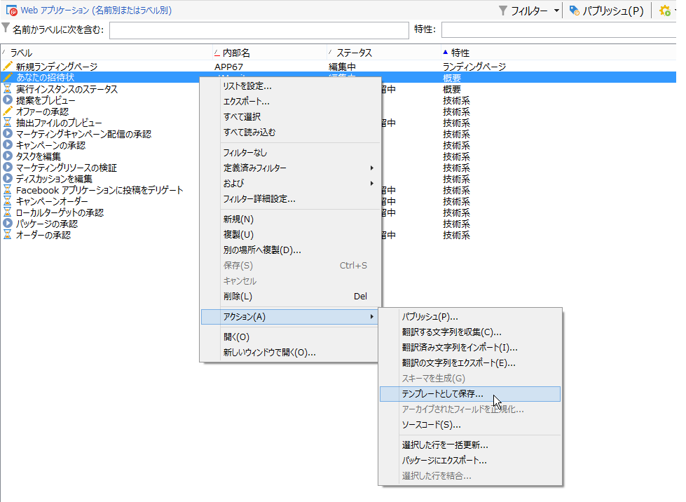
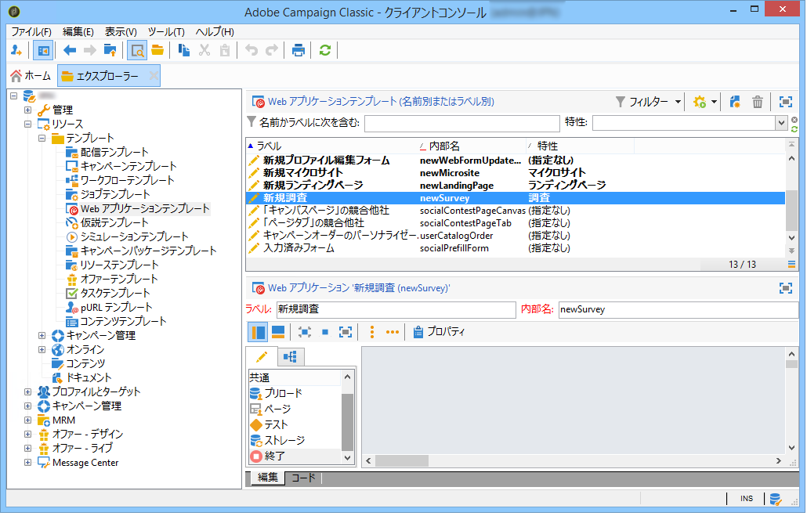
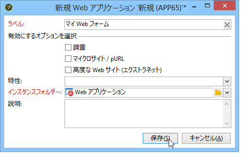

# Web フォームテンプレートの使用{#using-a-web-form-template}

フォームテンプレートは、再利用可能な設定で、新しいフォームを作成できます。デフォルトでは、フォームテンプレートはWebアプリケーションテンプレートと共にノードに保存 **[!UICONTROL Resources > Templates > Web application templates]** されます。

ここから、新しいテンプレートを作成するか、既存のフォームをテンプレートに変換できます。

## Convert an existing form into a template {#convert-an-existing-form-into-a-template}

フォームは、テンプレートに変更して、その設定を再利用できます。To do this, select the form, right-click and select **[!UICONTROL Actions > Save as template...]**.

このアクションにより、Web アプリケーションを作成するウィンドウが開きます。テンプレートの名前と説明を入力し、保存先のフォルダーを選択できます。

## Create a new form template {#create-a-new-form-template}

To create a Web form template, right-click the list of Web application templates and select **[!UICONTROL New]**. You can also use the **[!UICONTROL New]** button above the list of templates.

テンプレートの名前を入力します。In the **[!UICONTROL Instance folder]** field, select the folder where the Web forms created based on this template are saved. The **[!UICONTROL Nature]** field lets you add descriptive information to sort and/or filter your various Web application templates.

Click the **[!UICONTROL Save]** button to create the template, then build the content of this template and define its parameters.

これで、新しいフォームを作成する際に、このテンプレートを選択できます。
