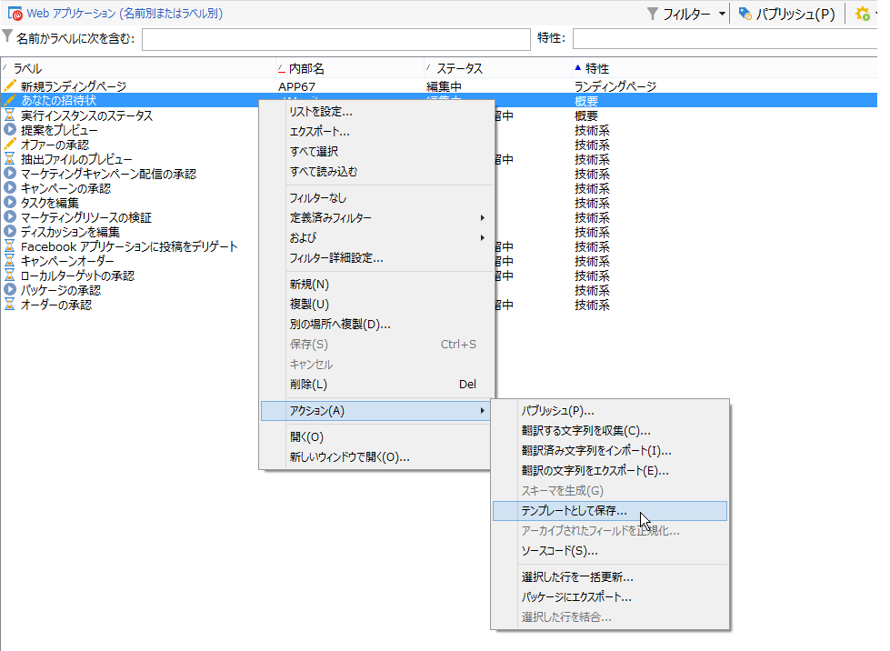
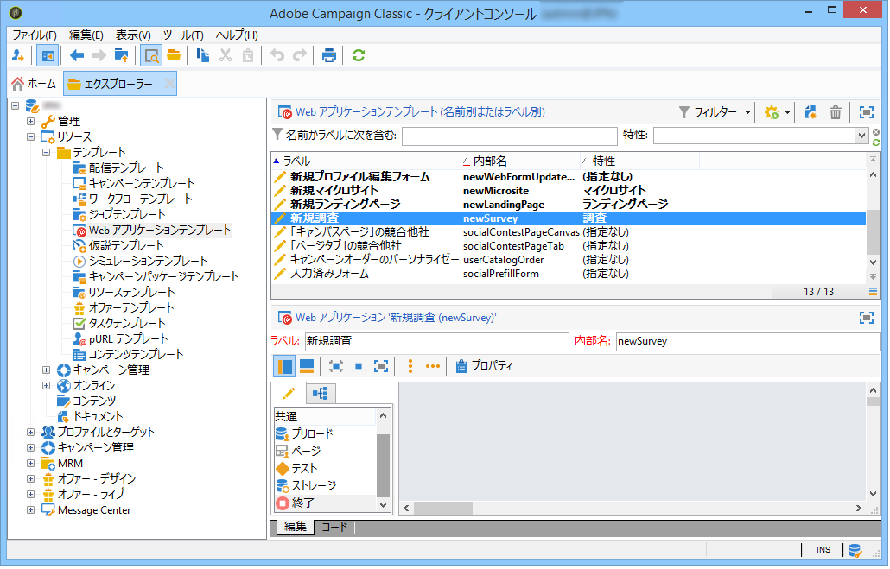
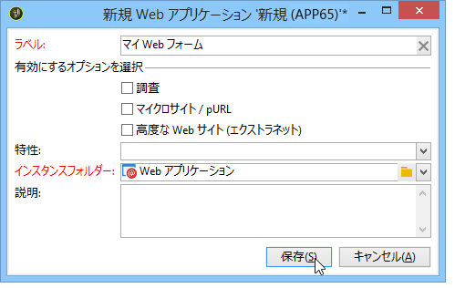

# Web フォームテンプレートの使用{#using-a-web-form-template}

フォームテンプレートは、再利用可能な設定で、新しいフォームを作成できます。 デフォルトでは、フォームテンプレートは、Web アプリケーションテンプレートと共に&#x200B;**[!UICONTROL リソース／テンプレート／Web アプリケーションテンプレート]**&#x200B;ノードに格納されています。

ここから、新しいテンプレートを作成したり、既存のフォームをテンプレートに変換したりできます。

## 既存フォームからテンプレートへの変換 {#convert-an-existing-form-into-a-template}

フォームは、テンプレートに変更して、その設定を再利用できます。 これをおこなうには、フォームを選択し、右クリックして&#x200B;**[!UICONTROL アクション／テンプレートとして保存]**&#x200B;を選択します。

このアクションにより、Web アプリケーションを作成するウィンドウが開きます。 テンプレートの名前と説明を入力し、保存先のフォルダーを選択できます。

## 新しいフォームテンプレートの作成 {#create-a-new-form-template}

Web フォームテンプレートを作成するには、Web アプリケーションテンプレートのリストを右クリックして、**[!UICONTROL 新規]**&#x200B;をクリックします。 また、テンプレートのリストの上にある&#x200B;**[!UICONTROL 新規]**&#x200B;ボタンを使用することもできます。

テンプレートの名前を入力します。 「**[!UICONTROL インスタンスフォルダー]**」フィールドで、このテンプレートに基づいて作成された Web フォームが保存されるフォルダーを選択します。 「**[!UICONTROL 特性]**」フィールドを使用すると、説明情報を追加して、様々な Web アプリケーションテンプレートを並べ替えたり、フィルターしたりできます。

「**[!UICONTROL 保存]**」ボタンをクリックしてテンプレートを作成し、このテンプレートのコンテンツを作成して、パラメーターを定義します。

これで、新しいフォームを作成する際に、このテンプレートを選択できます。
