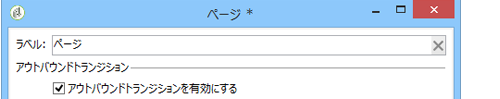
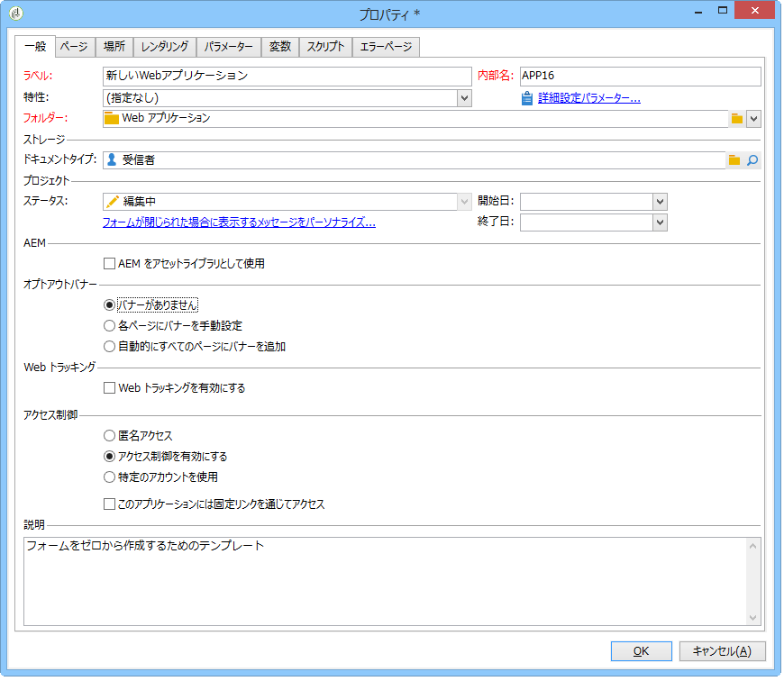

# Web アプリケーショントラッキングのオプトアウト{#web-application-tracking-opt-out}

Adobe Campaign では、Cookie または Web ビーコンによる行動のトラッキングからオプトアウトしたエンドユーザーの Web 行動のトラッキングを停止できます。これには、エンドユーザーにその選択肢を提示するため、バナーを表示する機能が含まれています。このバナーは Web アプリケーションやランディングページに追加することができます。

エンドユーザーが cookie あるいは web ビーコンによる行動のトラッキングからオプトアウトした場合、その情報は JavaScript API で Adobe Campaign トラッキングサーバーに送信されます。オプトアウトの選択肢を提示する前に、オプトインの選択肢をエンドユーザーに提示すること（あるいは他の法的条件）を義務付けている地域もあります。適用される法令を遵守してください。

## バナーの設定 {#configuring-the-banner-}

Web アプリケーションまたはランディングページに表示するには、バナーを設定する必要があります。

Adobe Campaign は、サンプルバナーを提供します（ニーズに合わせて変更する必要があります）。このバナーのバージョンは、コンテンツモデルフォルダー内のパーソナライゼーションブロックとして表示されます。[このページ](../../delivery/using/personalization-blocks.md)を参照してください。

>[!CAUTION]
>
>独自のバナーを作成するには、標準バナーをパーソナライズする必要があります。

バナーを有効化するには、Web アプリケーションプロパティを設定する必要があります。「Webアプリケーシ [ョンの設計」の節を参照](../../web/using/designing-a-web-application.md) 。

Web トラッキングが有効化されている場合、次の設定ができます。

* 「バナーがありません」
* 「各ページにバナーを手動設定」：このオプションを選択し、各ページのページプロパティでバナーを選択します。

   

* 「自動的にすべてのページにバナーを追加」：Web アプリケーションプロパティで直接バナーを選択します。

   

>[!NOTE]
>
>同一の動作をする Web アプリケーションバージョン 5 の互換性モードが利用可能です。

標準バナーは次の構造になっています。

```
<div onClick="NL.ClientWebTracking.closeOptOutBanner(this);" id="defaultOptOutBanner">
  <p>Please insert your message here
   <a onClick="NL.ClientWebTracking.allow();" class="optout-accept">Accept</a>
   <a onClick="NL.ClientWebTracking.forbid();" class="optout-decline">Refuse</a>
  </p>
</div>
      
```

「**ここにメッセージを挿入してください**」の部分をトラッキング情報が含まれるブロックに置き換える必要があります。この置き換えは、オプトアウトバナーに関する新たなパーソナライゼーションブロック内で実行する必要があります。

バナーは専用の CSS と共に提供されます。ただし、Web ページを作成して設定する際に、スタイルを上書きできます。[このページ](../../web/using/content-editor-interface.md)を参照してください。

## API を使用したオプトアウト Cookie の設定 {#setting-the-opt-out-cookie-using-api}

Adobe Campaign は cookie 値の管理およびユーザー設定の回復に利用できる API を提供します。

cookie の名前は **acoptout** です。共通の値は、以下のとおりです。

* 0：ユーザーが Web トラッキングを許可しました（デフォルト値）
* 1：ユーザーが Web トラッキングを禁止しました
* null：ユーザーは未選択ですが、デフォルト値として Web トラッキングが許可されています

バナーをカスタマイズするのに利用可能なクライアント側の API は以下のとおりです。

* **NL.ClientWebTracking.allow()**:ウェブトラッキングを許可するオプトアウトcookieの値を設定します。 Web トラッキングは、デフォルトで許可されています。
* **NL.ClientWebTracking.forbid()**:ウェブトラッキングを禁止するオプトアウトcookieの値を設定します。 Web トラッキングの禁止にはユーザーからのインプットが必要です。
* **NL.ClientWebTracking.closeOptOutBanner(bannerDomElt)**:ユーザーが「承認」または「拒否」ボタンをクリックした後に、オプトアウトcookieバナーを閉じます。 （クリックイベントバブリング段階の間）。

   bannerDomElt {DOMElement} 削除しなければならない cookie バナーのルート DOM 要素

* **NL.ClientWebTracking.hasUserPrefs()**:ユーザーがウェブトラッキングの環境設定を選択した場合、trueを返します。
* **NL.ClientWebTracking.getUserPrefs()**:ユーザーの環境設定を定義するオプトアウトcookieの値を返します。

JSSP を記述する必要がある場合、サーバー側 API を利用できます。

* **NL.ServerWebTracking.generateOptOutBanner(escapeJs)**：JSSP ページに挿入するオプトアウトバナーのマークアップを生成します。

   **escapeJs {Boolean}**：生成されたマークアップを JavaScript 内で使用するためにエスケープする必要がある場合、true にします。

   ページ内でプリントする必要があるオプトアウトバナーのマークアップの HTML を返します。

* **NL.ServerWebTracking._displayOptOutBanner()**

   管理者がオプトアウトバナーを選択した後にオプトアウトバナーが表示される必要がある場合に true を返します

   このコードは、管理者が Web オプトアウトバナーの使用を既に選択している場合に呼び出されます。

   バナーは、ユーザーがトラッキングを許可するか拒否するかをまだ選択していない場合に、表示されます。

* **NL.ServerWebTracking.renderOptOutBanner(escapeJs)**

   オプトアウトバナーのマークアップを JSSP ページに挿入することでレンダリングします。&lt;% と %> 間の JSSP と同様に呼び出されます。

   **escapeJs {Boolean}**：生成されたマークアップを JavaScript 内で使用するためにエスケープする必要がある場合、true にします。

JSSP の例：

```
<%@ page import="/nl/core/shared/nl.js" %>
<!doctype html>
<%
NL.require('/nl/core/shared/webTracking.js');
NL.client.require('/nl/core/shared/webTracking.js');
%>
<html>
<head>
<%==NL.client.deps()%>
</head>

<body>

<!-- TEST USING SERVER API IN JSSP -->
<% 
var webTracking = new NL.ServerWebTracking(request, 'optOutBanner');
webTracking.renderOptOutBanner();
%>

<!-- TEST USING SERVER API IN A SCRIPT -->
<!--
<% 
var webTracking = new NL.ServerWebTracking(request, 'optOutBanner');
%>
<script>var el = document.createElement('div'); el.innerHTML =  "<% webTracking.renderOptOutBanner(true); %>";document.body.appendChild(el);</script>
-->

<!-- TEST OF THE CLIENT API -->
<!--
<div onClick="NL.ClientWebTracking.closeOptOutBanner(this);" id="defaultOptOutBanner">
  <p>Please insert your message here
   <a onClick="NL.ClientWebTracking.allow();" class="optout-accept">Accept</a>
   <a onClick="NL.ClientWebTracking.forbid();" class="optout-decline">Refuse</a>
  </p>
</div>
-->
</body>
</html>
```

