# Web フォームの回答{#web-forms-answers}

## 回答ストレージフィールド {#response-storage-fields}

フォームへの回答は、データベースのフィールドか、一時的にローカル変数に保存できます。回答のストレージモードは、フィールド作成時に選択されます。It can be edited via the **[!UICONTROL Edit storage...]** link.

フォームの各入力フィールドについて、次のストレージオプションを使用できます。

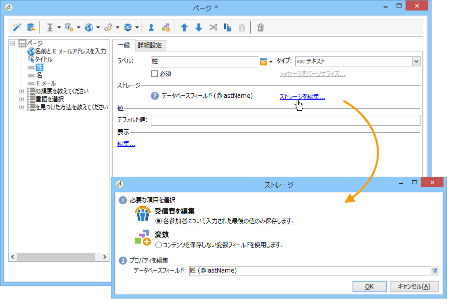

* **[!UICONTROL Edit a recipient]**

   データベースのフィールドを選択できます。ユーザーの回答はこのフィールドに格納されます。各ユーザーに対して、最後に入力した値のみが保存されます。プロファイルに追加されます。データベー [スへのデータの格納を参照](#storing-data-in-the-database)。

* **[!UICONTROL Variable]**

   情報をデータベースに格納したくない場合、変数を使用できます。ローカル変数はアップストリームを宣言できます。詳しくは、デ [ータのローカル変数への格納を参照してください](#storing-data-in-a-local-variable)。

### Storing data in the database {#storing-data-in-the-database}

To save the data in an existing field of the database, click the **[!UICONTROL Edit expression]** icon and select it from the list of available fields.

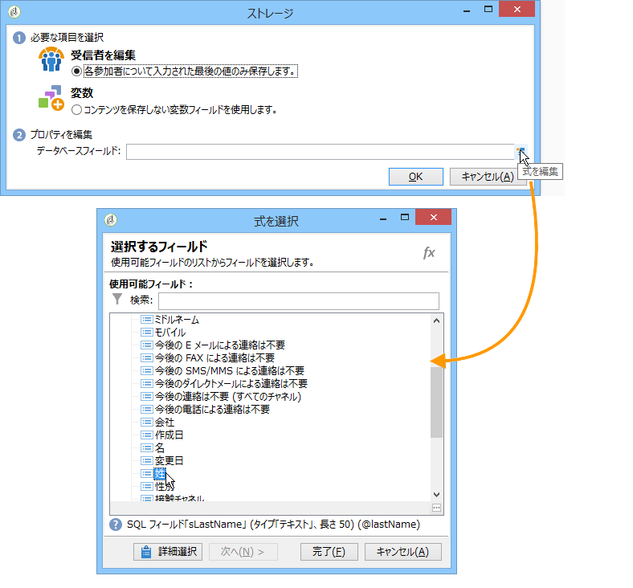

>[!NOTE]
>
>デフォルトの参照ドキュメントは、**nms:recipient** スキーマです。To view it or to choose a new one, select the form from the list, and click the **[!UICONTROL Properties]** button.

### ローカル変数へのデータの格納 {#storing-data-in-a-local-variable}

ローカル変数を使用すると、データがデータベースに格納されなくても、そのページまたは別のページで再利用して、例えば、フィールドの表示に関する条件を配置したり、メッセージをパーソナライズしたりできます。

これは、未保存のフィールドの値を使用して、ページ上のオプションのグループの表示を承認できることを意味します。次のページでは、車両のタイプはデータベースに格納されていません。

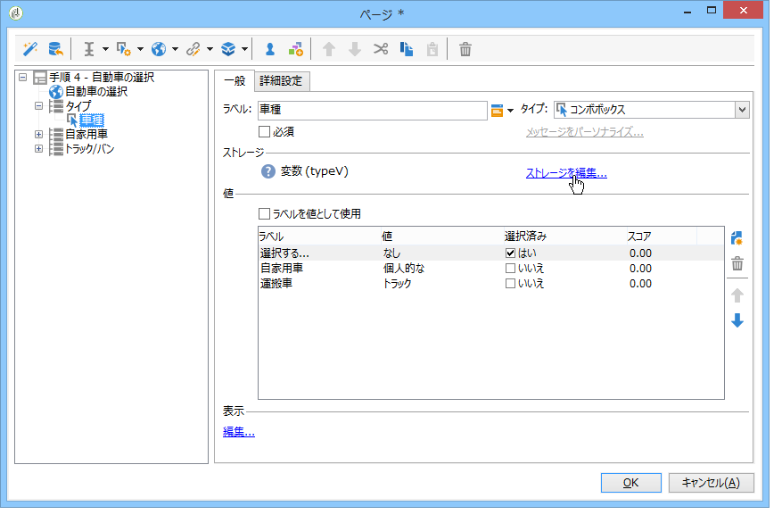

It is stored in a variable which must be selected when the drop-down box is created, or via the **[!UICONTROL Edit storage...]** link.

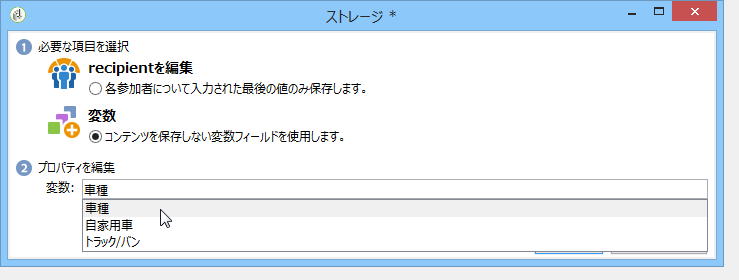

You can display existing variables and create new ones via the **[!UICONTROL Edit variables...]** link. Click the **[!UICONTROL Add]** button to create a new variable.

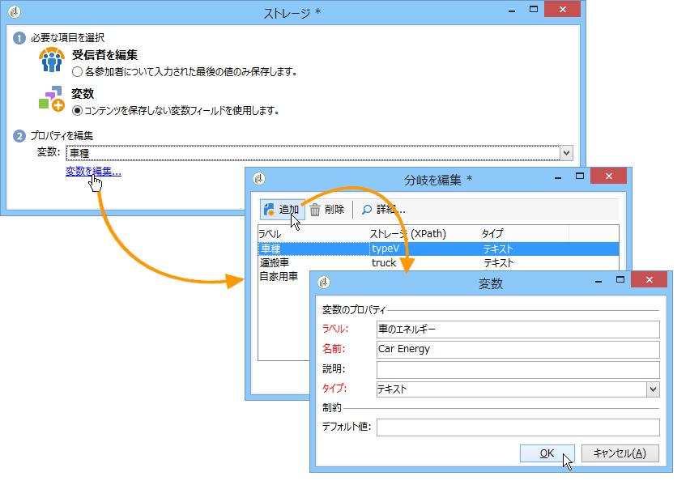

追加された変数は、ページの入力フィールドが作成される際に、ローカル変数のリストで使用できます。

>[!NOTE]
>
>各フォームについて、変数のアップストリームを作成できます。To do this, select the form and click the **[!UICONTROL Properties]** button. The **[!UICONTROL Variables]** tab contains the local variables for the form.

**条件が設定されたローカルストレージの例**

上記の例では、自家用車の関するデータを含むコンテナは、表示条件で示されたように、ドロップダウンリストから **[!UICONTROL Private]** オプションが選択されている場合にのみ表示されます。

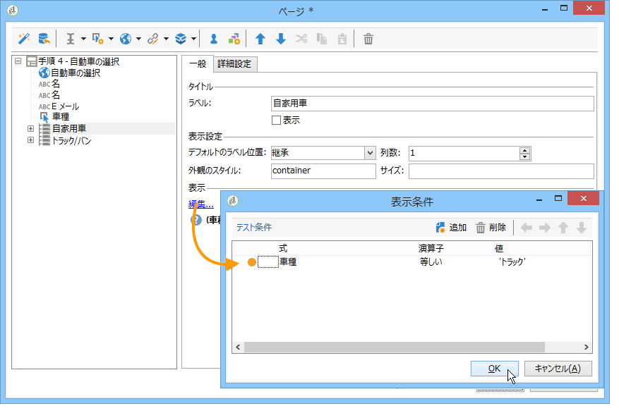

ユーザーが自家用車を選択すると、Web フォームは次のオプションを提供します。

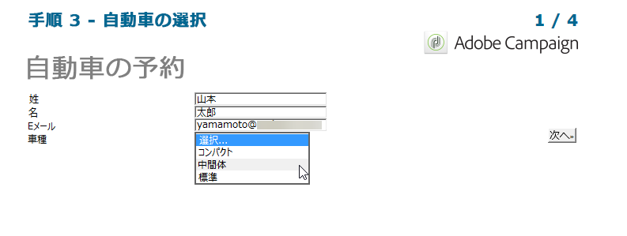

商用車に関するデータを保持するコンテナは、表示条件に表されるように、Professional オプションが選択された場合に表示されます。

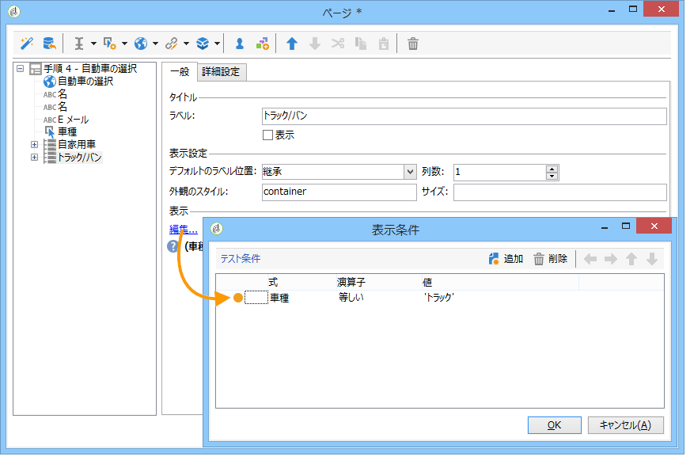

つまり、ユーザーが商用車を選択すると、フォームは次のオプションを提供します。

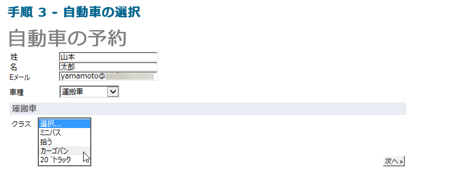

## 収集された情報の使用 {#using-collected-information}

各フォームについて、提供された回答は、フィールドまたはラベルで再利用できます。次の構文を使用する必要があります。

* データベースのフィールドに格納されたコンテンツの場合：

   ```
   <%=ctx.recipient.@field name%
   ```

* ローカル変数に格納されたコンテンツの場合：

   ```
   <%= ctx.vars.variable name %
   ```

* HTML テキストフィールドに格納されたコンテンツの場合：

   ```
   <%== HTML field name %
   ```

   >[!NOTE]
   >
   >Unlike the other fields for which `<%=` characters are replaced with escape characters, the HTML content is saved as is by using the `<%==` syntax.

## Web フォームの回答の保存 {#saving-web-forms-answers}

フォームのページで収集した情報を保存するには、ダイアグラムにストレージボックスを配置する必要があります。

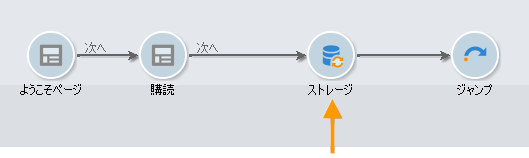

このボックスを使用するには、次の 2 つの方法があります。

* If the Web form is accessed via a link sent in an email, and if the user accessing the application is already in the database, you can check the **[!UICONTROL Update the preloaded record]** option. 詳しくは、「電子メールでのフォーム [の配信」を参照してください](../../web/using/publishing-a-web-form.md#delivering-a-form-via-email)。

   この場合、Adobe Campaign は、ユーザープロファイルの暗号化されたプライマリキー（Adobe Campaign が各プロファイルに割り当てた一意の識別子）を使用します。プリロードボックスを使用して情報をプリロードするように設定する必要があります。詳しくは、「フォームデータのプリロ [ード」を参照してください](../../web/using/publishing-a-web-form.md#pre-loading-the-form-data)。

   >[!CAUTION]
   >
   >このオプションは、E メールアドレス（入力するフィールドがある場合）を含むユーザーデータを上書きします。新しいプロファイルを作成するためには使用できず、フォームのプリロードボックスの使用が必要です。

* データベースの受信者のデータをエンリッチメントするには、ストレージボックスを編集して、紐付けキーを選択します。内部使用の場合（通常、イントラネットシステム）、または、例えば新しいプロファイルを作成するために使用されるフォームの場合、紐付けフィールドを選択できます。このボックスは、Web アプリケーションの様々なページで使用されるデータベースのすべてのフィールドを提供します。

   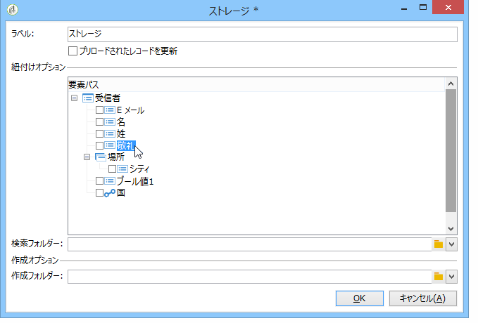

By default, the data is imported into the database by an **[!UICONTROL Update or insertion]** operation: if it exists in the database, the element is updated (for example, the selected newsletter or the e-mail address entered). 存在しない場合、情報は追加されます。

ただし、この動作を変更できます。これをおこなうには、要素のルートを選択して、ドロップダウンリストから実行する操作を選択します。

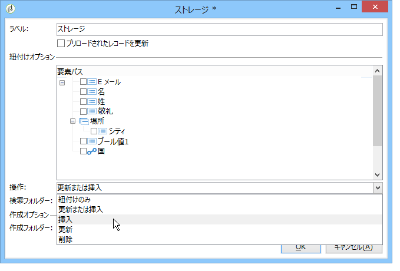

紐付けについて検索フォルダーを選択したり、新しいプロファイルについて作成フォルダーを選択したりできます。これらのフィールドが空の場合、プロファイルについてオペレーターのデフォルトフォルダーを検索したり、そこにプロファイルを作成したりします。

>[!NOTE]
>
>Possible operations are: **[!UICONTROL Simple reconciliation]**, **[!UICONTROL Update or insertion]**, **[!UICONTROL Insertion]**, **[!UICONTROL Update]**, **[!UICONTROL Deletion]**.\
>オペレーターのデフォルトのフォルダーは、オペレーターが書き込み権限を持つ最初のフォルダーです。\
>[この節](../../platform/using/access-management.md)を参照してください。

