# A/B テスト{#a-b-testing}

E メール配信の複数のコンテンツがあり、どのバージョンがターゲットの母集団に対し効果的なコンテンツであるのかを見極めたい場合、一部の受信者に対し異なるバージョンを送信してその中から最も成功率の高かったものを選び出し、それを残りの受信者に送信するといったことが可能です。

この使用例では、ターゲティングワークフローを使用して、2 つの E メール配信コンテンツを比較します。どちらの配信でも、メッセージとテキストは同一とし、レイアウトのみを変更します。

ターゲットの母集団は 3 つに分割します。2 つのテストグループと、その他の母集団です。各テストグループに別々のバージョンを配信します。配信完了から 5 日間の待機期間を設定します。この待機期間の終了後に結果を集め、開封率の最も高いものを見極めます。次に、最もスコアの高い配信コンテンツをスクリプトで復元し、テストグループとして使用しなかった母集団に送信します。

どの配信で最もスコアが高いのかを判断する基準は、個々のニーズに応じて変わる可能性がある点に注意してください。開封率、クリックスルー率、購読率、応答度などが、この判断基準の候補として挙げられます。

また、この使用例で説明したテストでは 2 つの配信だけしか扱っていませんが、必要に応じてもっと多くのバージョンをテストすることもできます。その場合は、単にアクティビティをワークフローに追加するだけです。

A/B テストを作成するには、次の手順に従います

* [手順1:ターゲット設定ワークフローの作成](#step-1--creating-a-targeting-workflow)
* [手順2:母集団サンプルの設定](#step-2--configuring-population-samples)
* [手順3:2つの配信テンプレートの作成](#step-3--creating-two-delivery-templates)
* [手順4:ワークフローでの配信の設定](#step-4--configuring-the-deliveries-in-the-workflow)
* [手順5:スクリプトの作成](#step-5--creating-the-script)
* [手順7:ワークフローの開始](#step-7--starting-the-workflow)
* [手順8:結果を分析しています](#step-8--analyzing-the-result)。

## Step 1: Creating a targeting workflow {#step-1--creating-a-targeting-workflow}

You need to create your workflow in the **[!UICONTROL Targeting and Workflows]** tab of a campaign. アクティビティとは、2つのアクティビティ( **[!UICONTROL Query]** アクティビティ、アクティビティ、アクテ **[!UICONTROL Split]** ィビティ、アク **[!UICONTROL Email delivery]** ティビティ)にリンクされたア **[!UICONTROL Wait]** クティビティで構成さ **[!UICONTROL JavaScript code]****[!UICONTROL Delivery]** れます。

1. まだ作成していない場合は、キャンペーンを作成します（詳細は、この[節](../../campaign/using/setting-up-marketing-campaigns.md#creating-a-campaign)を参照してください）。

   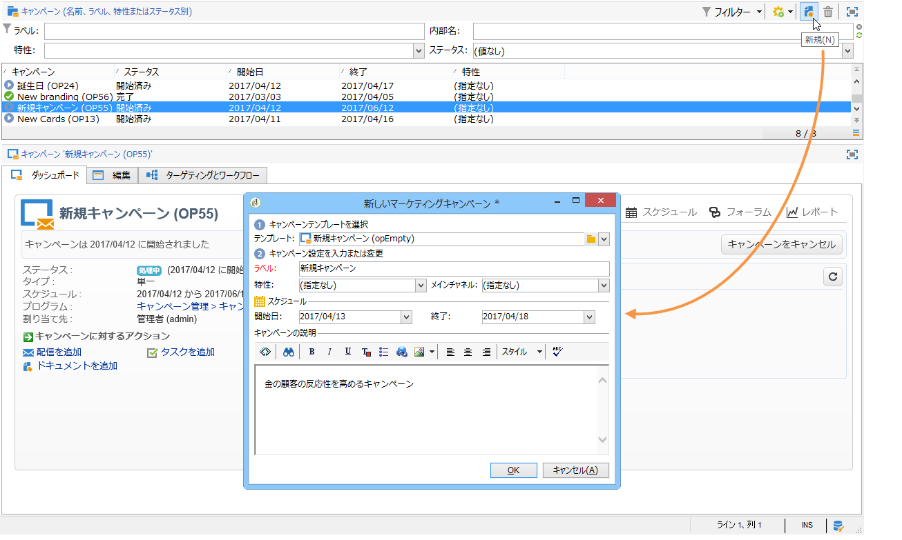

1. Go to the **[!UICONTROL Targeting and Workflows]** tab.

   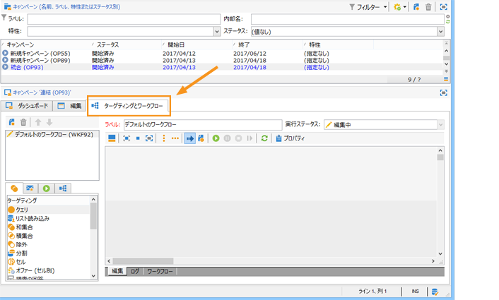

1. Change the label of the existing workflow or click **[!UICONTROL Add]** to create a new one (for more on this, refer to this [section](../../campaign/using/marketing-campaign-deliveries.md#selecting-the-target-population)).

   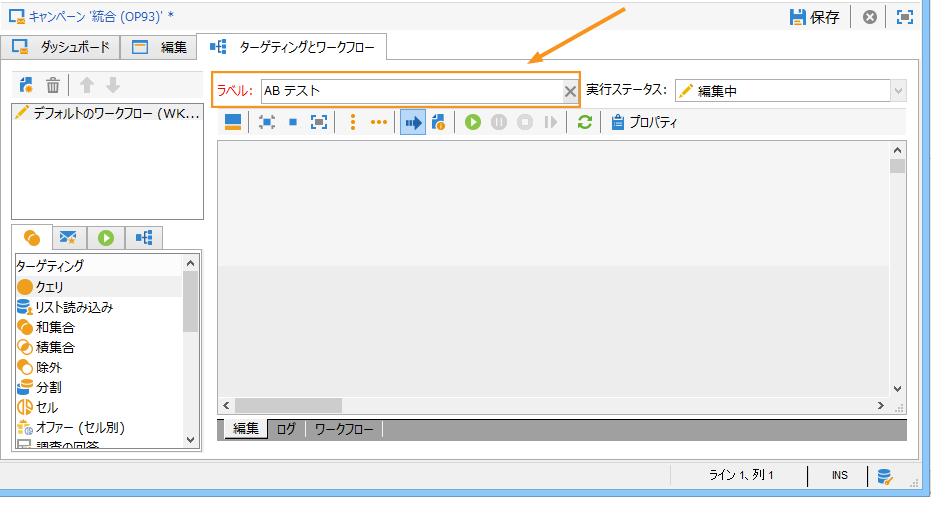

1. （タブ）、（タブ）、2（タブ）、2（タブ）、 **[!UICONTROL Query]****[!UICONTROL Target]****[!UICONTROL Split]****[!UICONTROL Target]****[!UICONTROL Email deliveries]****[!UICONTROL Deliveries]****[!UICONTROL Wait]****[!UICONTROL Flow Control]****[!UICONTROL JavaScript code]****[!UICONTROL Actions]****[!UICONTROL Delivery]****[!UICONTROL Actions]** （タブ）、アクティビティ（タブ）、アクティビティ（タブ）、アクティビティ（タブ）、アクティビティ（タブ）、アクティビティ（タブ）を含むワークフロー図にマウスを使用してアクティビティをドラッグ&amp;ドロップします。

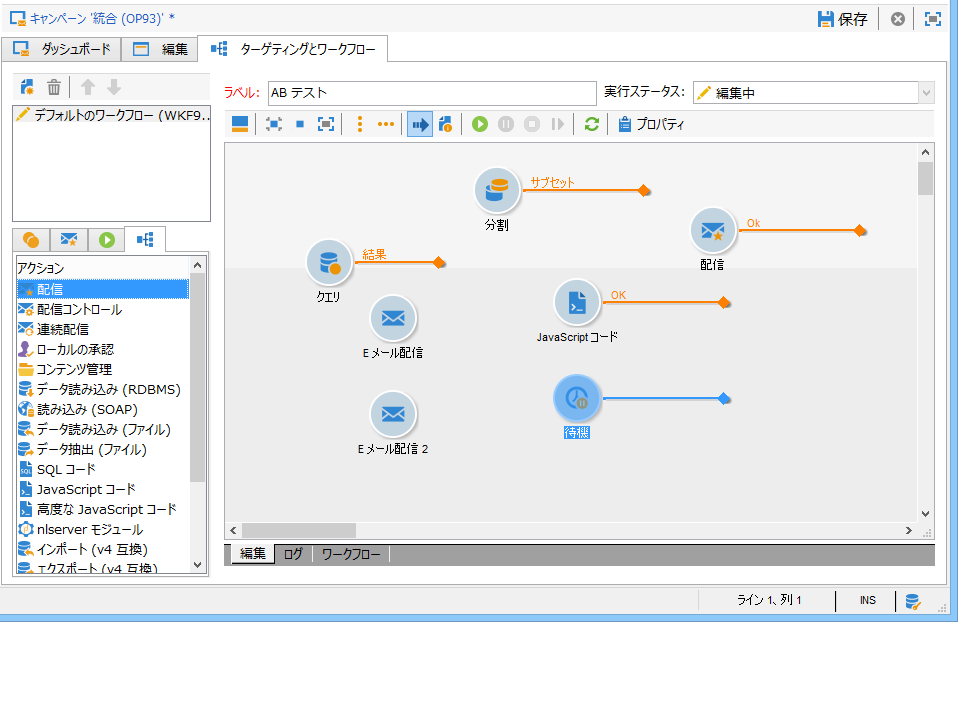

## 手順2:母集団サンプルの設定 {#step-2--configuring-population-samples}

### 「クエリ」アクティビティの設定{#configuring-the-query-activity}

* アクティビティをダブルクリ **[!UICONTROL Query]** ックします。

   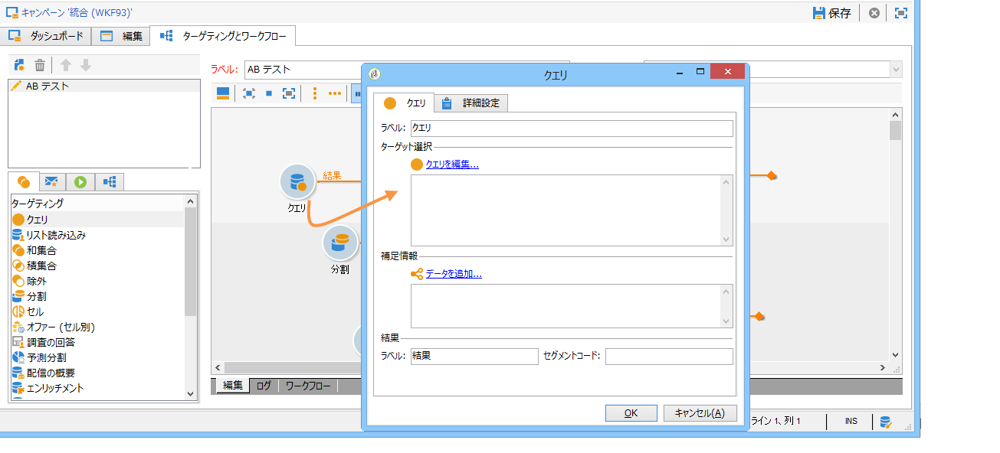

* Click the **[!UICONTROL Edit query]** link and select the recipients you want to target.

   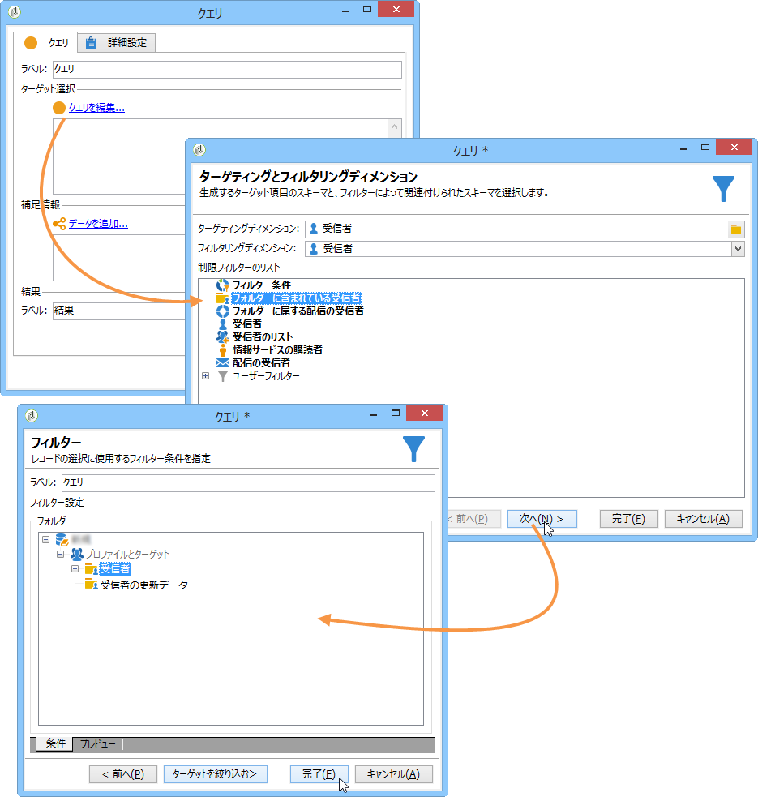

* アクティビティを **[!UICONTROL Query]** アクティビティにリン **[!UICONTROL Split]** クします。

   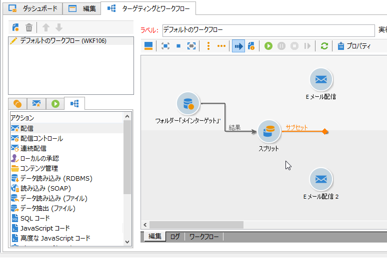

### 分割アクティビティの設定 {#configuring-the-split-activity}

このアクティビティでは、配信 A を受信する母集団、配信 B を受信する母集団、その他の母集団といったように複数の母集団を作成することができます。ランダムな抽出をおこなうことで、各配信の母集団の部分のみをターゲティングすることが可能です。

1. 母集団 A の作成

   * アクティビティをダブルクリ **[!UICONTROL Split]** ックします。

      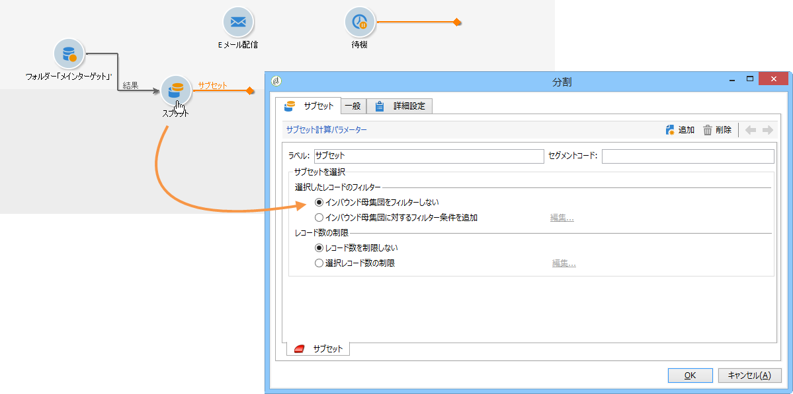

   * 既存のタブで、ラベルを母集団 A に変更します。

      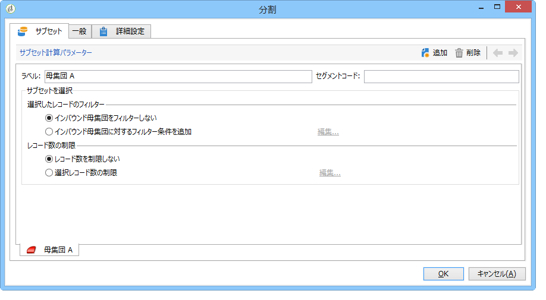

   * オプションを選 **[!UICONTROL Limit the selected records]** 択します。

      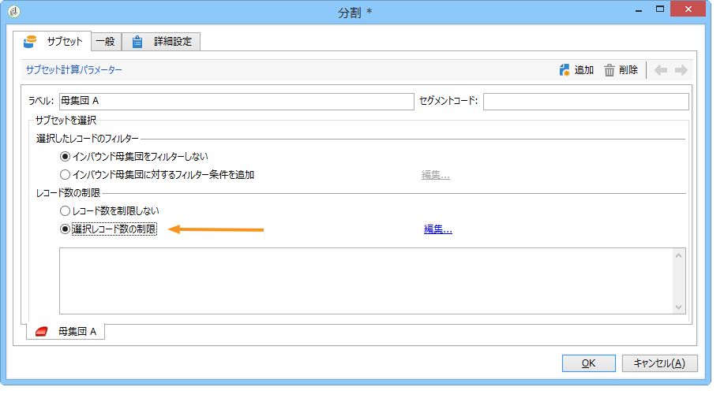

   * リンクをクリ **[!UICONTROL Edit]** ックし、を選択し **[!UICONTROL Activate random sampling]**&#x200B;てをクリックしま **[!UICONTROL Next]**&#x200B;す。

      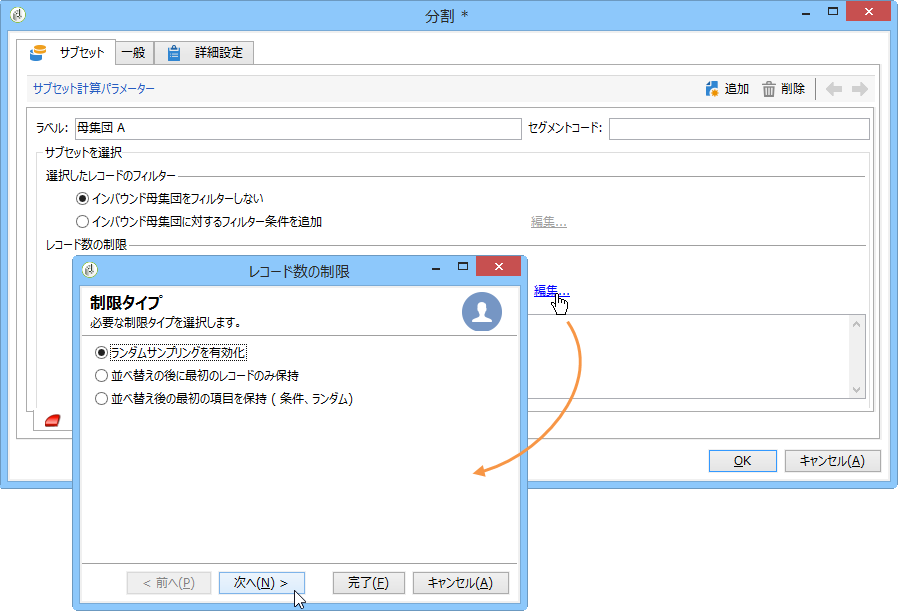

   * Set the threshold to 10%, then click **[!UICONTROL Finish]**.

      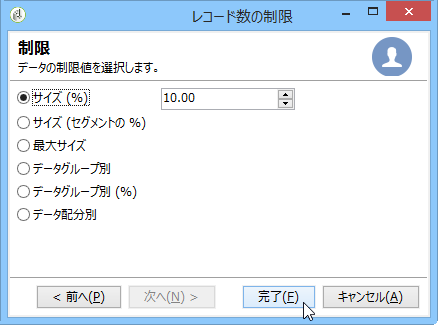

1. 母集団 B の作成

   * Click **[!UICONTROL Add]** to create a new tab for population B.

      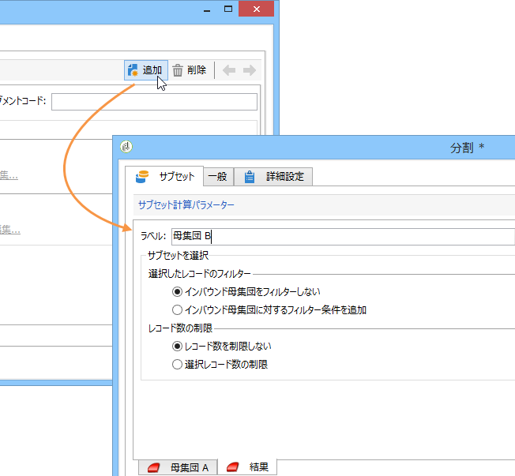

   * A と同じように、母集団を 10% に制限します。

      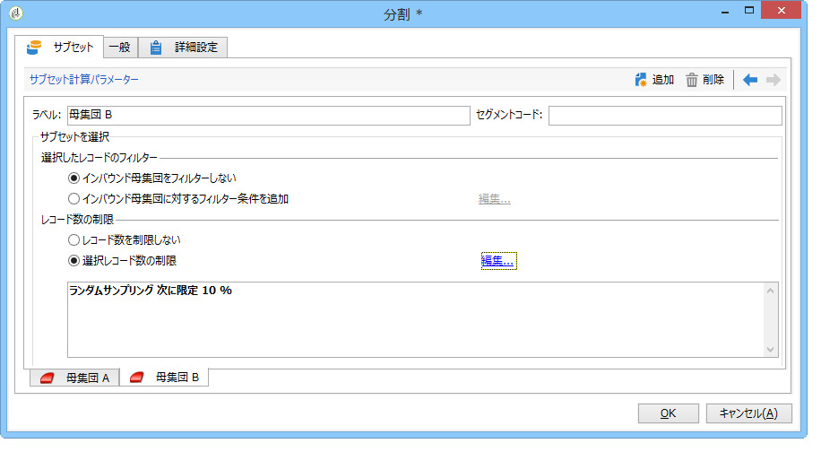

1. その他の母集団の作成

   * Go to the **[!UICONTROL General]** tab.

      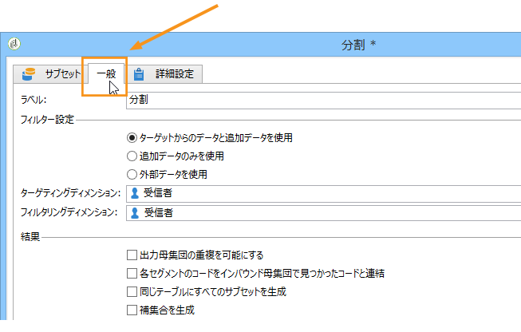

   * 選択 **[!UICONTROL Generate complement]**.

      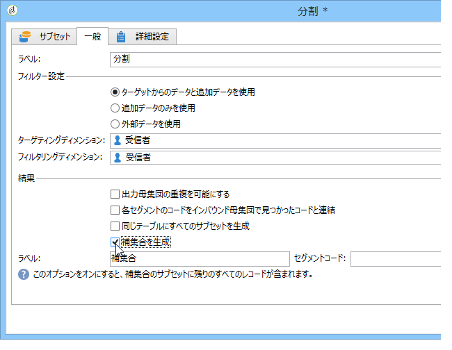

   * ラベルを変更して、この母集団には A も B も含まれないように指定し、「**[!UICONTROL OK]**」をクリックしてアクティビティを閉じます。

      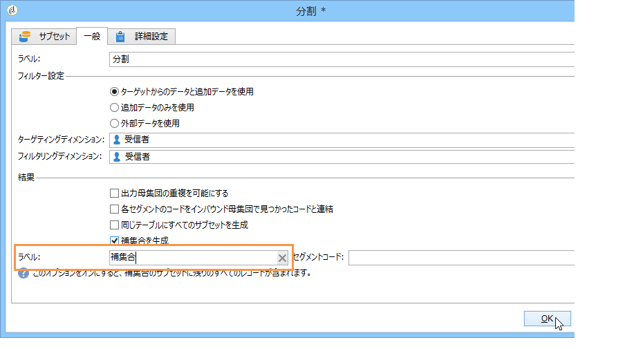

## Step 3: Creating two delivery templates {#step-3--creating-two-delivery-templates}

ここでは、2 つの配信テンプレートを作成します。Each template will be referenced in an **[!UICONTROL Email delivery]** activity linked to the **[!UICONTROL Split]** activity. 詳しくは、[この節](../../delivery/using/about-templates.md)を参照してください。

1. フォルダに移動 **[!UICONTROL Resources > Delivery template]** します。
1. Duplicate the **[!UICONTROL Email]** delivery template.

   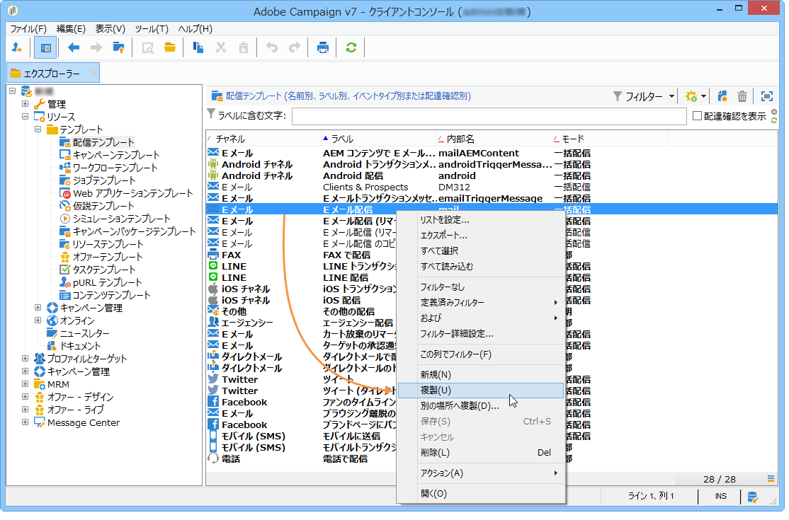

1. 配信 A に使用するコンテンツを作成します。

   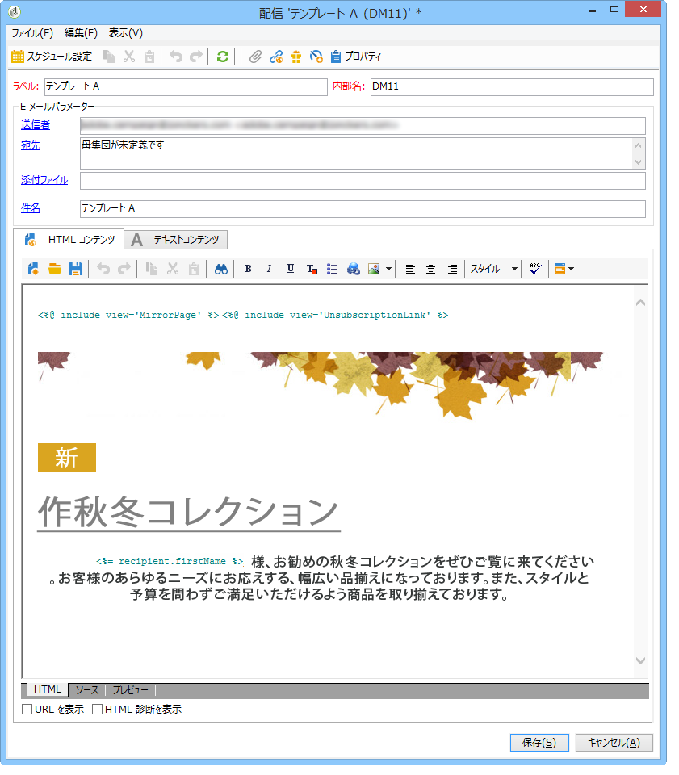

1. この手順を繰り返し、配信 B のテンプレートも作成します。

   

## Step 4: Configuring the deliveries in the workflow {#step-4--configuring-the-deliveries-in-the-workflow}

次のステップで配信を設定します。前の段階で作成された3つの集団に対する運命を定めています。手 [順2:母集団サンプルの設定](#step-2--configuring-population-samples)。 最初の 2 つの配信では、母集団 A と母集団 B にそれぞれ異なるコンテンツを送信することができます。一方、3 番目の配信は、A の配信も B の配信も受信しない母集団用のものです。このコンテンツはスクリプトで割り出します。A のコンテンツと B のコンテンツのどちらかと同一のものになり、どちらのコンテンツの開封率が高いかに応じて決まります。We need to configure a wait period for the third delivery, to find out the outcome of deliveries A and B. This is why the third delivery includes a **[!UICONTROL Wait]** activity.

1. Go to the **[!UICONTROL Split]** activity and link the transition destined for population A to one of the email deliveries already in the workflow.

   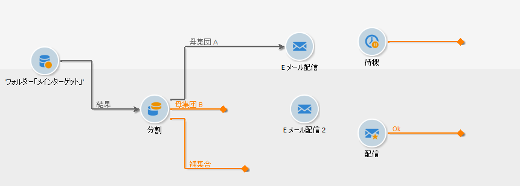

1. 配信をダブルクリックして開きます。
1. ドロップダウンリストで、配信 A のテンプレートを選択します。

   

1. Click **[!UICONTROL Continue]** to view the delivery, then save it.

   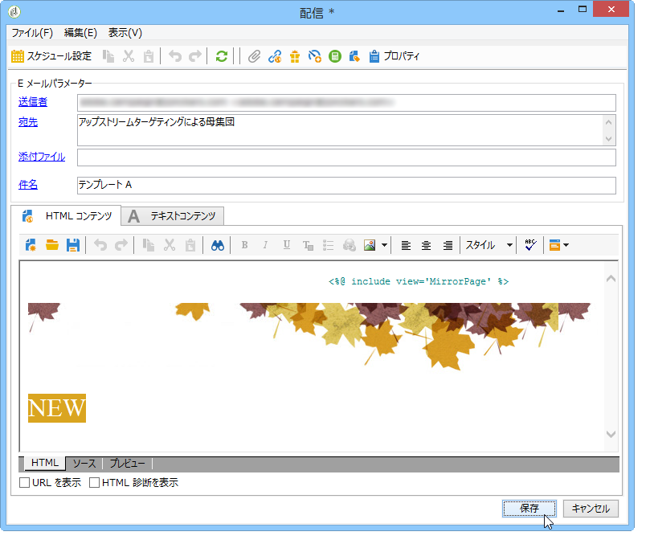

1. Link the transition of the **[!UICONTROL Split]** activity destined for population B to the second email delivery.

   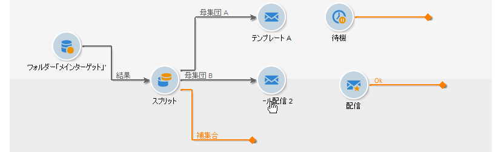

1. 配信を開き、配信 B のテンプレートを選択し、配信を保存します。

   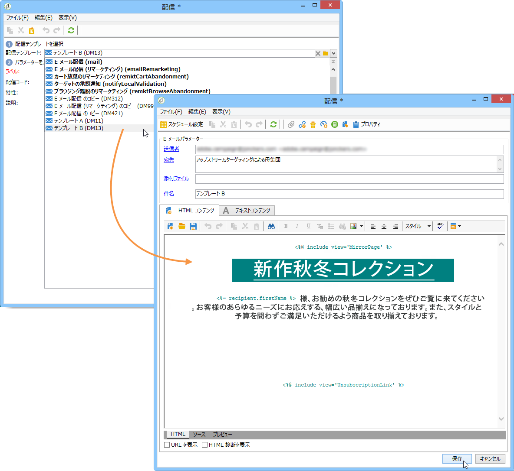

1. Link the transition destined for the remaining population to the **[!UICONTROL Wait]** activity.

   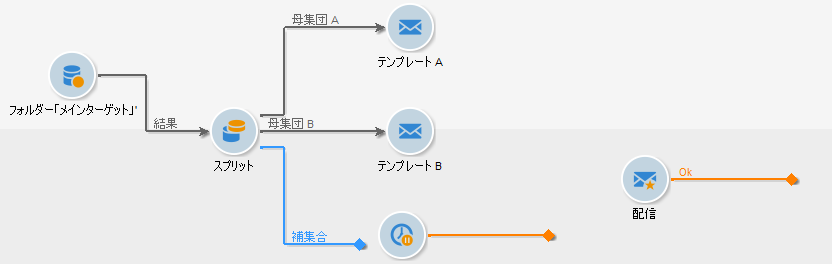

1. Open the **[!UICONTROL Wait]** activity and configure a 5-day waiting period.

   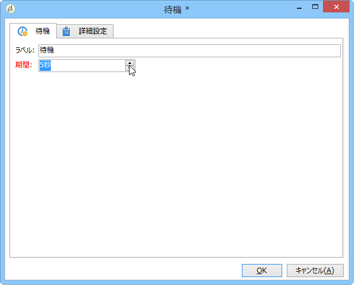

1. アクティビティを **[!UICONTROL Wait]** アクティビティにリン **[!UICONTROL JavaScript code]** クします。

   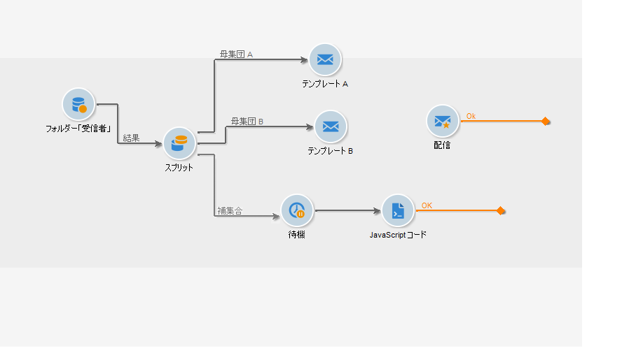

## 手順5:スクリプトの作成 {#step-5--creating-the-script}

その他の母集団用の配信コンテンツを、スクリプトで割り出します。このスクリプトでは、最も開封率の高い配信について情報を復元し、その内容を最終の配信にコピーします。

### スクリプトの例 {#example-of-a-script}

ターゲティングワークフローで、以下のようにスクリプトを使用します。For more on this, refer to [Implementation](#implementation).

```
 // query the database to find the winner (best open rate)
   var winner = xtk.queryDef.create(
     <queryDef schema="nms:delivery" operation="get">
       <select>
         <node expr="@id"/>
         <node expr="@label"/>
         <node expr="[@operation-id]"/>
         <node expr="[@workflow-id]"/>
       </select>
       <where>
         <condition expr={"@FCP=0 and [@workflow-id]= " + instance.id}/>
       </where>
       <orderBy>
         <node expr="[indicators/@estimatedRecipientOpenRatio]" sortDesc="true"/>
       </orderBy>
     </queryDef>).ExecuteQuery()
   
   // create a new delivery object and initialize it by doing a copy of
   // the winner delivery
   var delivery = nms.delivery.create()
   delivery.Duplicate("nms:delivery|" + winner.@id)

   // append 'final' to the delivery label
   delivery.label = winner.@label + " final"

   // link the delivery to the operation to make sure it will be displayed in
   // the campaign dashboard. This attribute needs to be set manually here since 
   // the Duplicate() method has reset it to its default value => 0
   delivery.operation_id = winner.@["operation-id"]
   delivery.workflow_id = winner.@["workflow-id"]

   // adjust some delivery parameters to make it compatible with the 
   // "Prepare and start" option selected in the Delivery tab of this activity
   delivery.scheduling.validationMode = "manual"
   delivery.scheduling.delayed = 0
 
   // save the delivery in database
   delivery.save()
 
   // store the new delivery Id in event variables
   vars.deliveryId = delivery.id
```

スクリプトの詳細については、「スクリプトの [詳細」を参照してください](#details-of-the-script)。

### 実装 {#implementation}

1. アクティビティを **[!UICONTROL JavaScript code]** 開きます。
1. 「スクリプトの例」で提供さ [れたスクリプトを](#example-of-a-script) 、ウィンドウにコピ **[!UICONTROL JavaScript code]** ーします。

   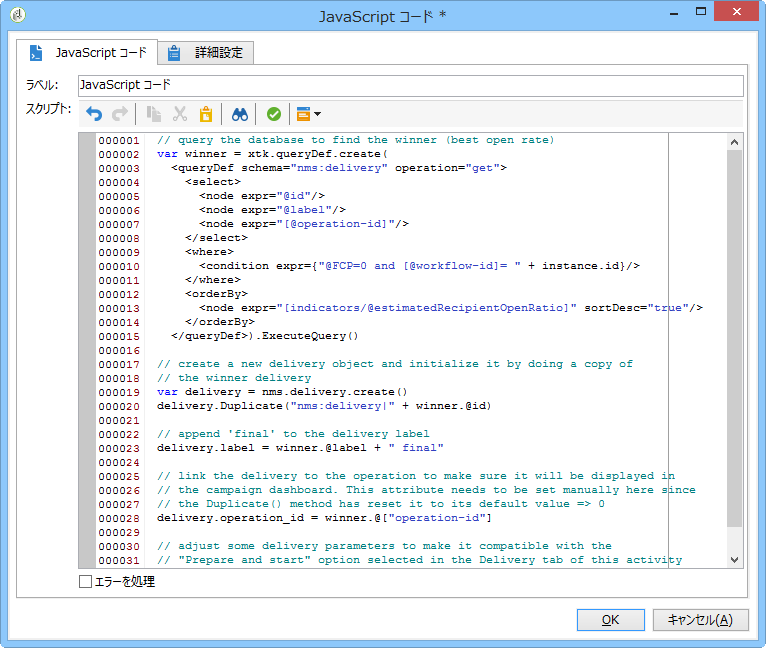

1. In the **[!UICONTROL Label]** field, enter the name of the script, i.e.

   ```
   <%= vars.deliveryId %>
   ```

   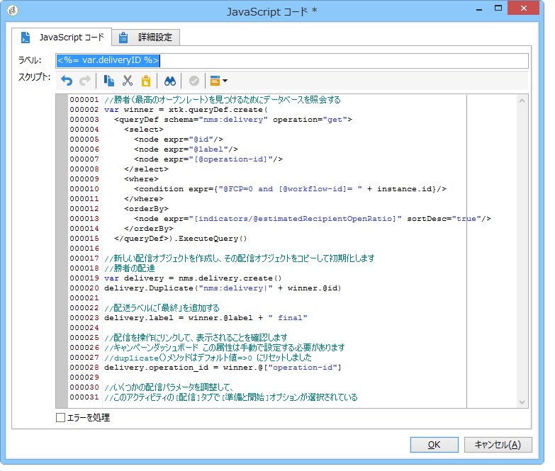

1. アクティビティを閉 **[!UICONTROL JavaScript code]** じます。
1. ワークフローの保存

### スクリプトの詳細 {#details-of-the-script}

このセクションでは、スクリプトの様々な機能とその動作モードについて詳しく説明します。

* まずはじめは、クエリです。**queryDef** コマンドでは、ターゲティングワークフローを実行して作成した配信を「**NmsDelivery**」テーブルから復元することや、それらの配信を推定の開封率に応じて並べ替えることでき、開封率の高い配信の情報が復元されます。

   ```
   // query the database to find the winner (best open rate)
      var winner = xtk.queryDef.create(
        <queryDef schema="nms:delivery" operation="get">
          <select>
            <node expr="@id"/>
            <node expr="@label"/>
            <node expr="[@operation-id]"/>
          </select>
          <where>
            <condition expr={"@FCP=0 and [@workflow-id]= " + instance.id}/>
          </where>
          <orderBy>
            <node expr="[indicators/@estimatedRecipientOpenRatio]" sortDesc="true"/>
          </orderBy>
        </queryDef>).ExecuteQuery()
   ```

* 開封率の最も高い配信を複製します。

   ```
    // create a new delivery object and initialize it by doing a copy of
    // the winner delivery
   var delivery = nms.delivery.create()
   delivery.Duplicate("nms:delivery|" + winner.@id)
   ```

* 複製した配信のラベルを変更し、&quot;**final**&quot; という単語を追加します。

   ```
   // append 'final' to the delivery label
   delivery.label = winner.@label + " final"
   ```

* キャンペーンのダッシュボードに配信をコピーします。

   ```
   // link the delivery to the operation to make sure it will be displayed in
   // the campaign dashboard. This attribute needs to be set manually here since 
   // the Duplicate() method has reset it to its default value => 0
   delivery.operation_id = winner.@["operation-id"]
   delivery.workflow_id = winner.@["workflow-id"]
   ```

   ```
   // adjust some delivery parameters to make it compatible with the 
   // "Prepare and start" option selected in the Delivery tab of this activity
   delivery.scheduling.validationMode = "manual"
   delivery.scheduling.delayed = 0
   ```

* 配信をデータベースに保存します。

   ```
   // save the delivery in database
   delivery.save()
   ```

* 複製した配信の一意の識別子をワークフロー変数として保存します。

   ```
   // store the new delivery Id in event variables
   vars.deliveryId = delivery.id
   ```

### その他の選択基準 {#other-selection-criteria}

上記の例では、E メールの開封率に応じて配信するコンテンツを選択することができます。次のようなその他の配信固有の指標を基にすることが可能です。

* Best click throughput: `[indicators/@recipientClickRatio]`,
* Highest reactivity rate (email open and clicks in the message): `[indicators/@reactivity]`,
* 最低苦情率： `[indicators/@refusedRatio]` （sortDesc属性にはfalse値を使用）、
* Highest conversion rate: `[indicators/@transactionRatio]`,
* Number of pages visited following the reception of a message: `[indicators/@totalWebPage]`,
* Lowest unsubscription rate: `[indicators/@optOutRatio]`,
* トランザクション金額: `[indicators/@amount]`.

## Step 6: Defining the final delivery {#step-6--defining-the-final-delivery}

A/B テストの勝者を選択するスクリプトの作成後は、最終配信のパラメーターを定義できます。

1. アクティビティ **[!UICONTROL JavaScript code]** を残りのアクティビティに接 **[!UICONTROL Delivery]** 続します。
1. Open the **[!UICONTROL Delivery]** activity.
1. このアクティビティ **[!UICONTROL Generate an outbound transition]** でワークフローを終了するには、このオプションの選択を解除します。
1. その他のオプションはデフォルト値のままにしておきます。

   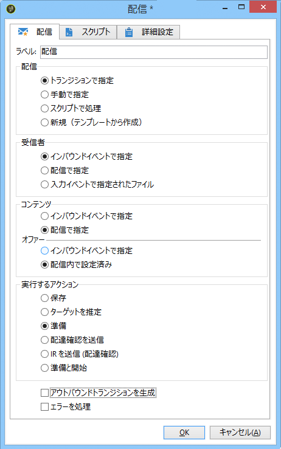

By preparing the delivery specified in the transition (defined via the **[!UICONTROL Javascript Code]** activity), you will be then able to approve it and to start the sending, as described in the next step.

## 手順7:ワークフローの開始 {#step-7--starting-the-workflow}

1. ワークフロー **[!UICONTROL Start]** をクリックします。

   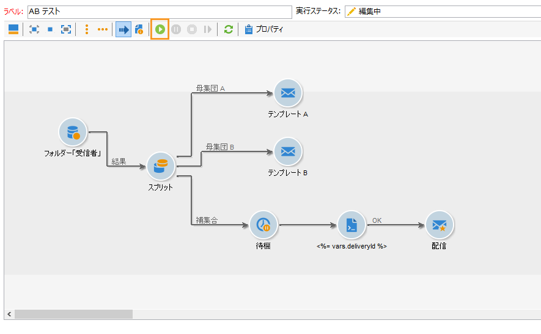

1. キャンペーンダッシュボードで、配信 A と配信 B のターゲットとコンテンツを承認します。
1. 配信を確定します。
1. 5 日間の待機が終了した後に、どのコンテンツが割り出されたのかを判断します。

   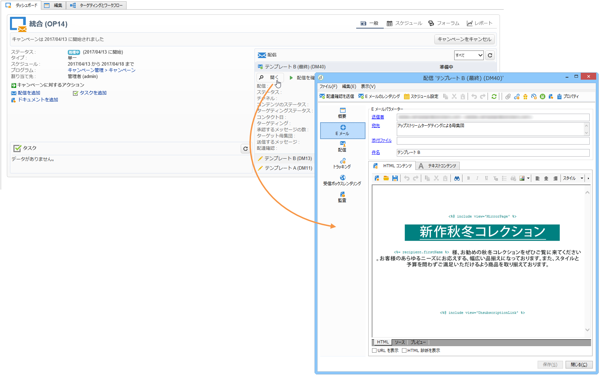

   このケースでは、テンプレート B が選択されます。

1. 3 番目の配信のコンテンツが決定したら、ターゲットとコンテンツを承認します。

## 手順8:結果の分析 {#step-8--analyzing-the-result}

テストの配信が完了したら、どの受信者に配信をおこなったかをチェックし、開封の有無を確認します。

* To find out which recipients have been targeted, open a delivery via the campaign dashboard and click the **[!UICONTROL Delivery]** tab.

   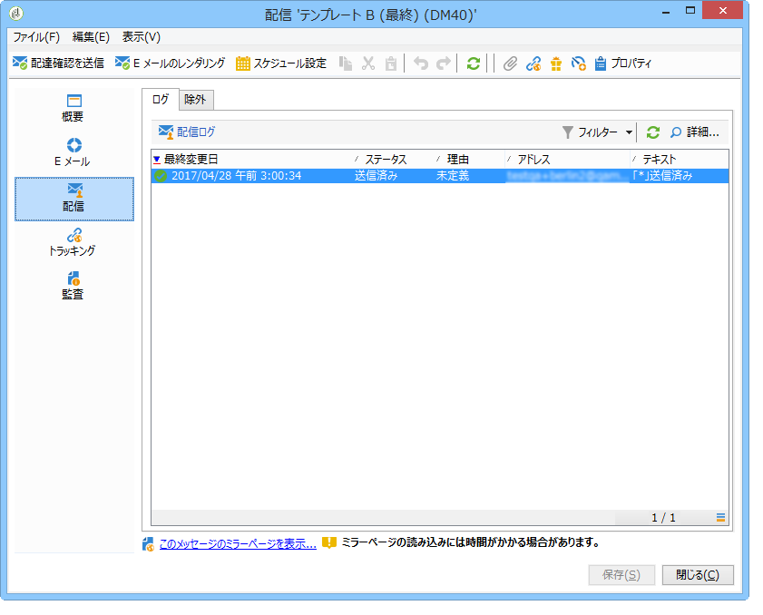

* To find out whether the delivery has been opened, go to the **[!UICONTROL Tracking]** tab.

   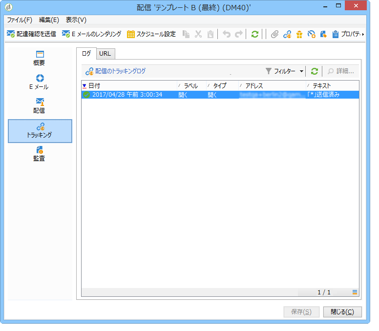

* ほかの配信との比較

   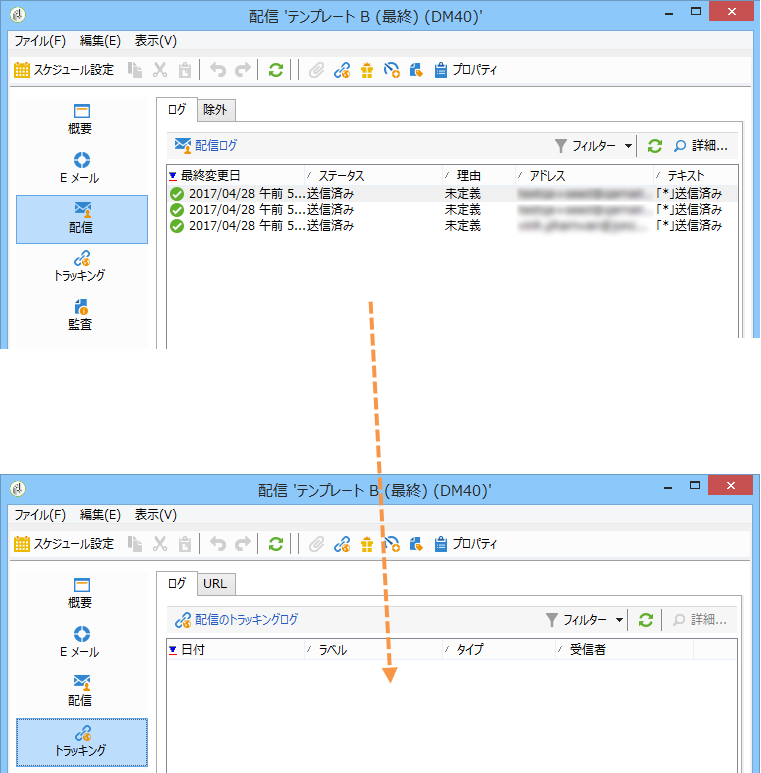

この例では、配信 B の開封率が最も高くなっています。これは、コンテンツ B が最終の配信で使用されることを意味します。

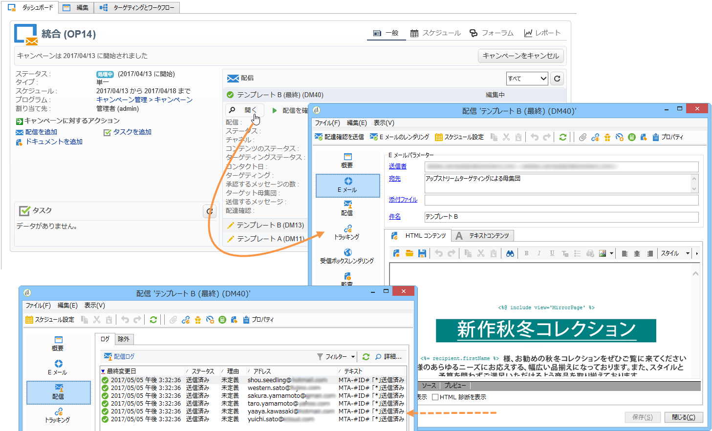

