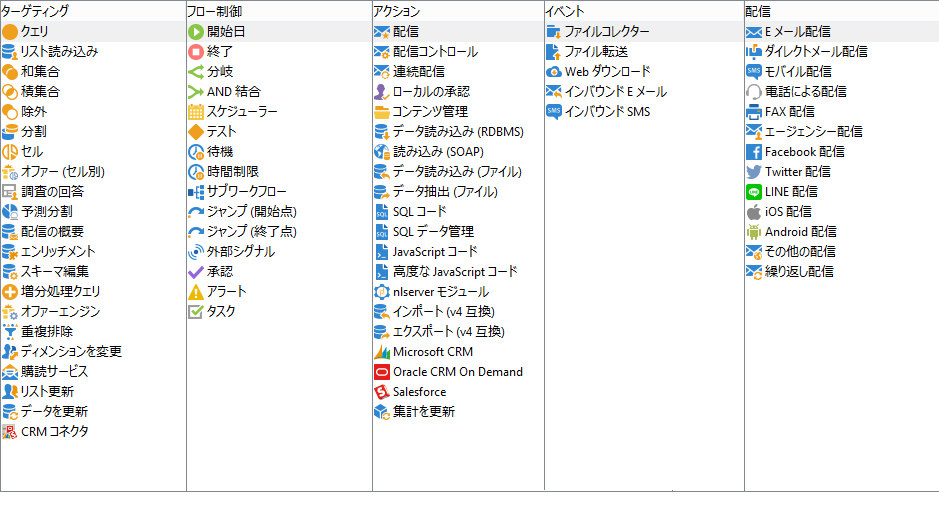

# アクティビティについて{#about-activities}

この節では、使用可能なアクティビティすべてについて説明します。使用可能なアクティビティは、ワークフローが作成/編集されたノードまたはコンテキストに応じて異なります。例えば、キャンペーン内で作成されたワークフローには、チャネル固有の配信アクティビティがあります。

ワークフローアクティビティはカテゴリごとにグループ分けされます。同時に 4 つのタブを使用できます。

In the campaign workflows, the **[!UICONTROL Events]** tab is replaced by the **[!UICONTROL Deliveries]** tab. The activities in this tab are detailed in the [Action activities](../../workflow/using/about-action-activities.md) section.

詳しくは、以下を参照してください。

* [ターゲット設定アクティビティについて](../../workflow/using/about-targeting-activities.md)
* [データのインポート](../../workflow/using/importing-data.md)
* [ワークフローの実行](../../workflow/using/executing-a-workflow.md)
* [ワークフローのベストプラクティス](../../workflow/using/workflow-best-practices.md)
