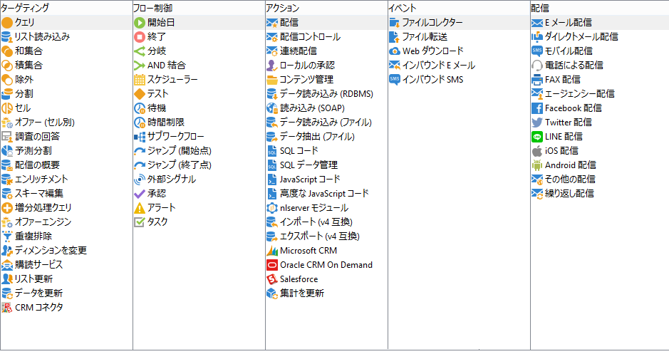

# ワークフローアクティビティ{#wf-activities}

この節では、使用可能なアクティビティすべてについて説明します。 使用可能なアクティビティは、ワークフローが作成/編集されたノードまたはコンテキストに応じて異なります。 例えば、キャンペーン内で作成されたワークフローには、チャネル固有の配信アクティビティがあります。

ワークフローアクティビティはカテゴリごとにグループ分けされます。 同時に 4 つのタブを使用できます。

キャンペーンワークフローでは、「**[!UICONTROL イベント]**」タブが「**[!UICONTROL 配信]**」タブに置き換えられます。 このタブのアクティビティについて詳しくは、[アクションアクティビティ](about-action-activities.md)の節を参照してください。

詳しくは、以下を参照してください。

* [ターゲティングアクティビティについて](about-targeting-activities.md)
* [ワークフローの実行](starting-a-workflow.md)
* [ワークフローのベストプラクティス](workflow-best-practices.md)
