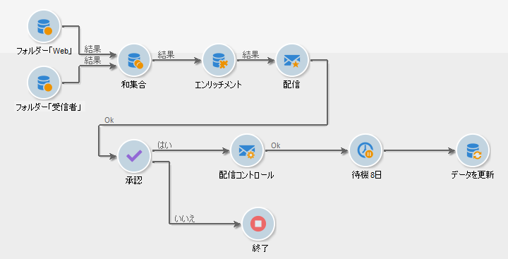

# ワークフローを使用した自動化 {#gs-workflows}

Adobe Campaignのワークフローを使用すると、チームはプラットフォーム全体でエンドツーエンドのビジネスプロセスを合理化および自動化できます。 直感的なグラフィカルインターフェイスを使用すると、データのセグメント化、キャンペーンの実行、ファイル処理、ユーザーの承認などのタスクを調整するワークフローを、すべて 1 か所で設計および管理できます。

例えば、リモートサーバーからファイルを取得し、その内容を抽出し、Adobe Campaign サーバーにシームレスにデータを読み込むプロセスを自動化できます。これにより、手作業を減らし、運用効率を高めることができます。 ワークフローエンジンにより、すべてのステップが確実に実行され、表示と制御のために追跡されます。

>[!BEGINTABS]

>[!TAB  ワークフロードキュメント ]

ワークフロー管理の詳細については、[Campaign v8 ドキュメント ](https://experienceleague.adobe.com/docs/campaign/automation/workflows/introduction/about-workflows.html?lang=ja){target=_blank} を参照してください。

{target=_blank}

>[!TAB  参考になるリンク ]

ワークフロー管理に関連する主な手順については、Campaign v8 ドキュメントを参照してください。

* [ ワークフローアクティビティ ](https://experienceleague.adobe.com/docs/campaign/automation/workflows/wf-activities/activities.html?lang=ja){target=_blank}：アクティビティは、タスクテンプレートです。 ワークフローには、ターゲティング、フロー制御、アクションアクティビティおよびイベントアクティビティが含まれます。

* [ ワークフローの作成 ](https://experienceleague.adobe.com/docs/campaign/automation/workflows/introduction/build-a-workflow.html?lang=ja){target=_blank}：ターゲティング、キャンペーン、テクニカルワークフローの作成および実行方法を説明します。

* [ ベストプラクティス ](https://experienceleague.adobe.com/docs/campaign/automation/workflows/introduction/workflow-best-practices.html?lang=ja){target=_blank}:Campaign ワークフローのパフォーマンスを最適化し、ワークフローのデザインを改善し、正しい設定を定義するためのガイドラインを説明します。

* [ ワークフローの監視 ](https://experienceleague.adobe.com/docs/campaign/automation/workflows/monitoring-workflows/monitor-workflow-execution.html?lang=ja){target=_blank}：ワークフローの実行を監視して、すべてが正しく実行されていることを確認する方法を説明します。

* [ ワークフローのユースケース ](https://experienceleague.adobe.com/docs/campaign/automation/workflows/use-cases/workflow-use-cases.html?lang=ja){target=_blank}：ワークフローを使用できるコンテキストと、エンドツーエンドのユースケースを通じてワークフローを実装する方法について学びます。

>[!ENDTABS]

<!--

Adobe Campaign uses workflows to:

* Carry out targeting campaigns. [Learn more](building-a-workflow.md#implementation-steps-)
* Build campaigns: for each campaign, the **[!UICONTROL Workflow]** tab lets you build the target and create the deliveries. [Learn more](building-a-workflow.md#campaign-workflows)
* Perform technical processes: cleanup, collecting tracking information or provisional calculations. [Learn more](building-a-workflow.md#technical-workflows)

A workflow can mean both a process definition (the workflow model, which is a representation of what is supposed to happen) and an instance of this process (a workflow instance, which is a representation of what is actually happening).

The workflow template describes the various tasks to be performed and how they are linked together. The task templates are called activities and are represented by icons. They are linked together by transitions.

Each workflow contains:

* **[!UICONTROL Activities]**

  An activity describes a task template. The various activities available are represented on the diagram by icons. Each type has common properties and specific properties. For example, while all activities have a name and label, only the **[!UICONTROL Approval]** activity has an assignment.

  In a workflow diagram, a given activity can produce multiple tasks, in particular when there is a loop or recurrent (periodic) actions.

  All workflow activities are listed in [this section](about-activities.md), including use cases and samples.

* **[!UICONTROL Transitions]**

  Transitions enable you to link activities and to define their sequence. A transition links a source activity to a destination activity. There are several sorts of transitions, which depend on the source activity. Some transitions have additional parameters such as a duration, a condition or a filter.

  A transition which is not linked to a destination activity is colored orange and the arrow head is shown as a diamond.

  >[!NOTE]
  >
  >A workflow containing unterminated transitions can still be executed: a warning message will be generated and the workflow will pause once it reaches the transition but it will not generate an error. It is thus possible to start a workflow without it being finished and to add to it as you go along.

  For more information about how to build a workflow, refer to [this section](building-a-workflow.md).

* **[!UICONTROL Worktables]**

  The worktable contains all the information carried by the transition. Each workflow uses several worktables. The data conveyed in these tables can be accelerated and used throughout the workflow's life cycle, as long as it is not purged. Indeed, unneeded tables are purged each time the workflow is passivated, and possibly during the execution of the largest workflows to avoid overloading the server.

  Learn more on workflow data and tables in [this section](how-to-use-workflow-data.md).

## Key principles and best practices{#principles-workflows}

Refer to these sections to find guidance and best practices to automate processes with workflows:

* Learn more about workflow activities in [this page](how-to-use-workflow-data.md).
* Learn how to build a workflow in [this section](building-a-workflow.md).
* Discover how to use workflows to import data in Campaign in [this section](../../platform/using/import-export-workflows.md).
* Workflow best practices are detailed in [this page](workflow-best-practices.md).
* Find guidance about workflow execution in [this section](starting-a-workflow.md).
* Learn how to monitor workflows in [this page](monitoring-workflow-execution.md).
* Learn how to grant access to users to use workflows in [this page](managing-rights.md).

-->