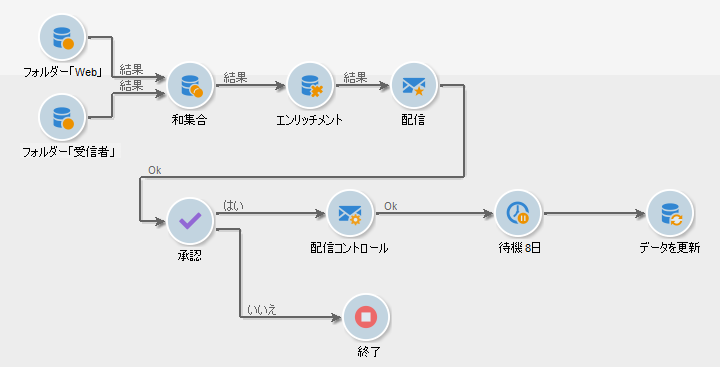

# Get started with workflows{#about-workflows}

## ワークフローについて

Adobe Campaign には、アプリケーションサーバーの様々なモジュールのプロセスおよびタスク全体にわたって調整できるワークフローモジュールが含まれています。この包括的なグラフィカル環境を使用すると、セグメント化、キャンペーン実行、ファイル処理、人の参加などを含むプロセスを設計できます。ワークフローエンジンは、これらのプロセスを実行およびトラッキングします。

例えば、ワークフローを使用して、サーバーからファイルをダウンロードしたり、ファイルを解凍したり、ファイルに含まれるレコードを Adobe Campaign データベースにインポートしたりできます。

また、通知したり、プロセスを選択および承認したりできる 1 人または複数のオペレーターをワークフローに参加させることもできます。この方法では、配信アクションを作成し、1 人または複数のオペレーターにタスクを割り当てて、コンテンツに取り組んだり、ターゲットを指定したり、配信開始前に配達確認を承認したりできます。

ワークフローは、キャンペーン管理プロセスの様々なコンテキストおよびステージで発生します。

Adobe Campaign では、ワークフローを使用して次のことをおこないます。

* キャンペーンのターゲティングの実行。詳しくは、[実装の手順](../../workflow/using/building-a-workflow.md#implementation-steps-)を参照してください。
* キャンペーンの作成：キャンペーンごとに、「**[!UICONTROL ワークフロー]**」タブを使用してターゲットを作成したり、配信を作成したりできます。詳しくは、[キャンペーンワークフロー](../../workflow/using/building-a-workflow.md#campaign-workflows)を参照してください。
* テクニカルプロセスの実行：クリーンアップ、トラッキング情報の収集または試算。詳しくは、[テクニカルワークフロー](../../workflow/using/building-a-workflow.md#technical-workflows)を参照してください。

ワークフローは、プロセス定義（想定される結果を表すワークフローモデル）と、このプロセスのインスタンス（実際に実行中の処理を表すワークフローインスタンス）の両方を意味します。

ワークフローテンプレートは、実行されるさまざまなタスクと、タスク同士の関係を示すものです。タスクテンプレートは、アクティビティと呼ばれ、アイコンで表されます。タスクテンプレートは、トランジションによって相互にリンクされています。

各ワークフローには次が含まれます。

* **[!UICONTROL アクティビティ]**

   アクティビティは、タスクテンプレートを図示したものです。使用可能な各種アクティビティは、ダイアグラム内にアイコンで示されます。各タイプは、共通のプロパティと固有のプロパティを持ちます。例えば、すべてのアクティビティには共通して名前とラベルがありますが、「**[!UICONTROL 承認]**」アクティビティには固有の「割り当て」があります。

   ワークフローのダイアグラムでは、指定されたアクティビティが、特にループまたは繰り返し（定期的）アクションがある場合に複数のタスクを生成できます。

   すべてのワークフローアクティビティのリストは、使用例やサンプルとともに[この節](../../workflow/using/about-activities.md)で確認できます。

* **[!UICONTROL トランジション]**

   トランジションを使用して、アクティビティをリンクし、アクティビティのシーケンスを定義できます。トランジションは、ソースアクティビティを宛先アクティビティにリンクします。ソースアクティビティに応じて、トランジションにはいくつかの種類があります。一部のトランジションには、期間や条件、フィルターなどの追加のパラメータがあります。

   宛先アクティビティにリンクされていないトランジションはオレンジ色で示され、矢じりはひし形になります。

   >[!NOTE]
   >
   >未終了のトランジションを含んでいても、ワークフローは実行可能です。その場合、警告メッセージが生成され、トランジションに到達するとワークフローはいったん一時停止しますが、エラーは生成されません。つまり、トランジションを終了せずにワークフローを開始したり、未終了のトランジションをワークフローに追加することができます。

   ワークフローの構築方法について詳しくは、[この節](../../workflow/using/building-a-workflow.md)を参照してください。

* **[!UICONTROL 作業用テーブル]**

   作業用テーブルには、トランジションによって実行されるすべての情報が含まれます。各ワークフローは、複数の作業用テーブルを使用します。作業用テーブルに伝達されたデータは、パージされない限り、ワークフローをスムースに処理するためにライフサイクル全体で使用されます。不要なテーブルは、ワークフローが休止状態になるたびにパージされます。また、最大のワークフローの実行中にサーバーの過負荷を回避する目的でパージされることがあります。

   ワークフローのデータおよびテーブルについて詳しくは、[この節](../../workflow/using/how-to-use-workflow-data.md)を参照してください。

## 主な原則とベストプラクティス

ワークフローを使用してプロセスを自動化するためのガイダンスとベストプラクティスを見つけるには、次の節を参照してください。

* ワークフローアクティビティの詳細については、 [このページを参照してください](../../workflow/using/how-to-use-workflow-data.md)。
* この節では、ワークフローの構築方法を説明 [します](../../workflow/using/building-a-workflow.md)。
* ワークフローを使用してキャンペーンにデータをインポートする方法については、 [この節を参照してください](../../workflow/using/importing-data.md)。
* ワークフローのベストプラクティスについては、 [このページで詳しく説明します](../../workflow/using/workflow-best-practices.md)。
* ワークフローの実行に関するガイダンスは、 [この節で説明し](../../workflow/using/starting-a-workflow.md)ます。
* このページでワークフローを監視する方法 [を説明します](../../workflow/using/monitoring-workflow-execution)。
* このページでワークフローを使用するためのユーザーへのアクセス権を付与する方法 [を説明します](../../workflow/using/managing-rights.md)。
