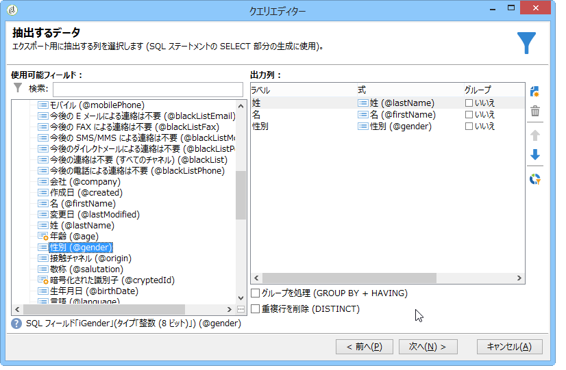
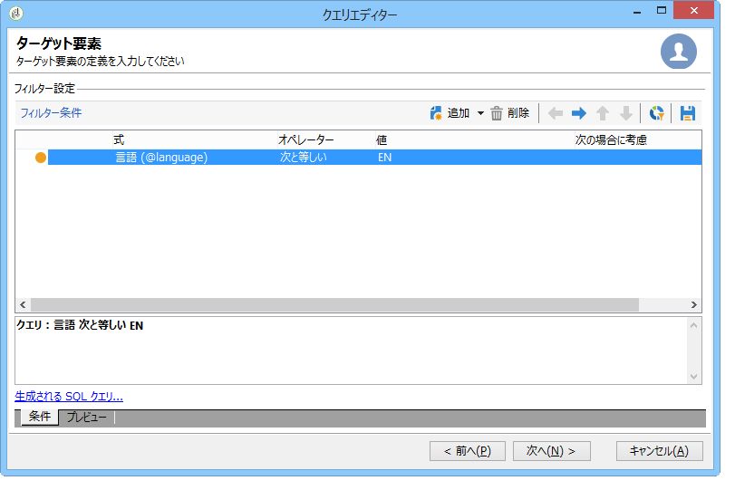
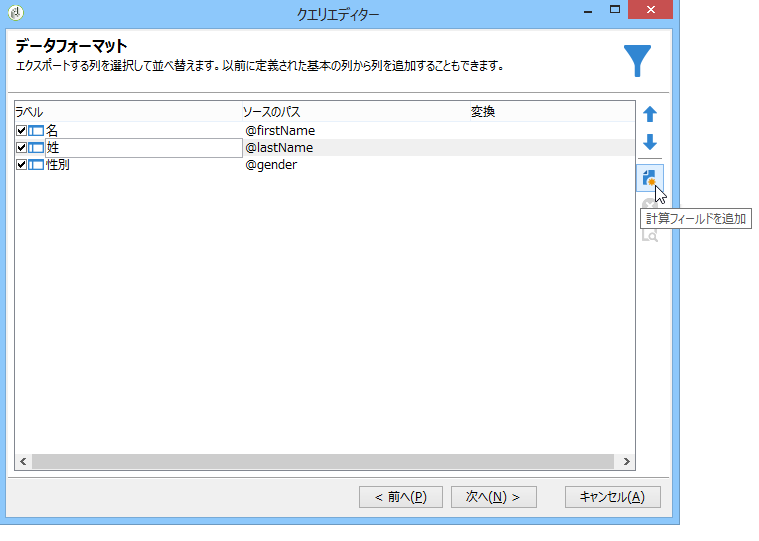
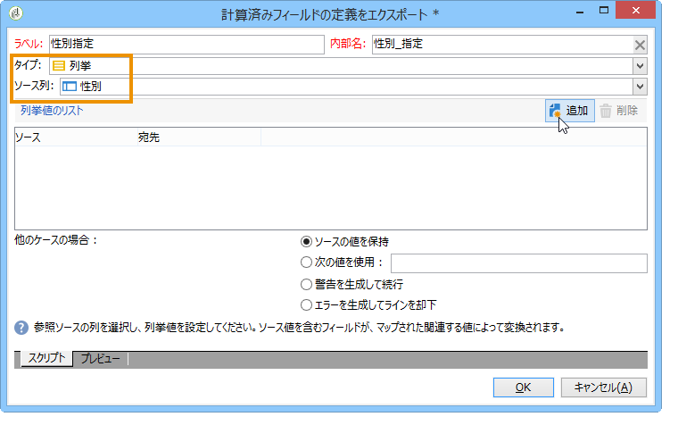
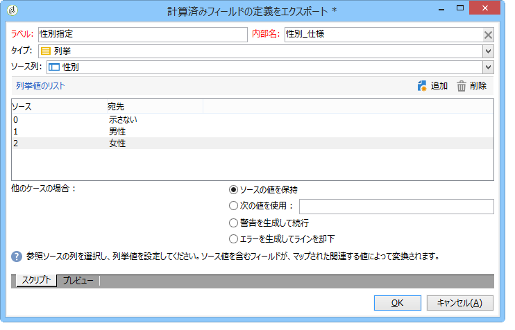
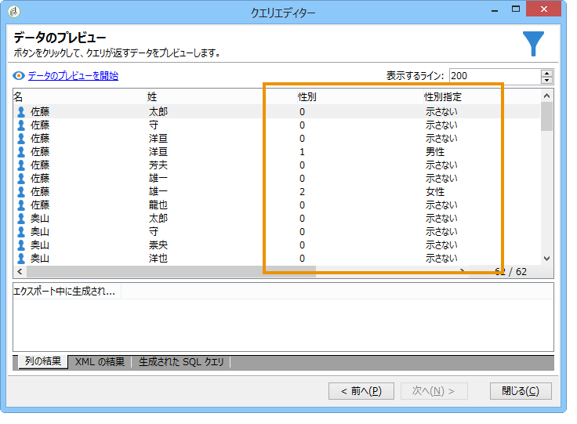
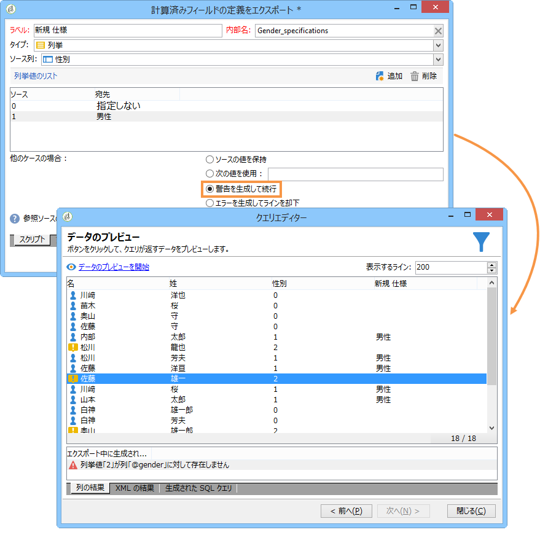
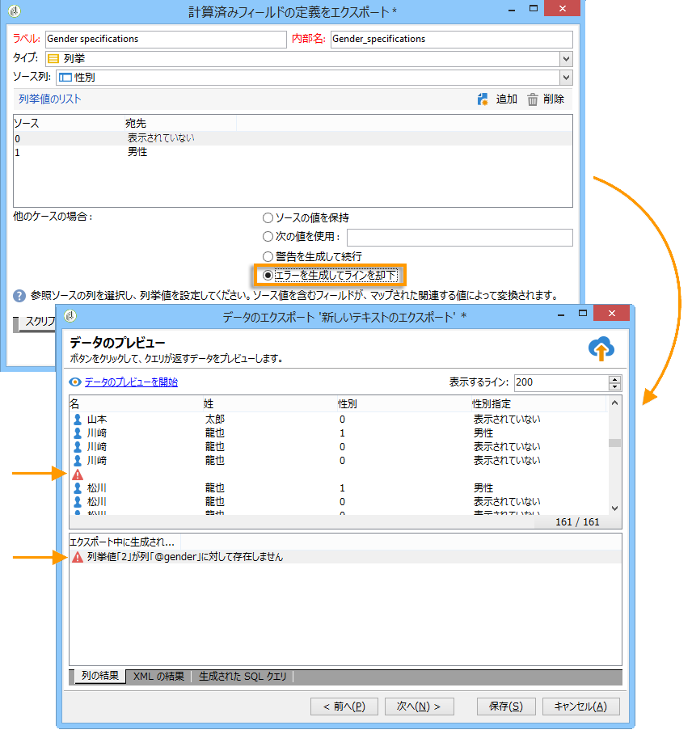

# 列挙タイプ計算フィールドの追加 {#adding-an-enumeration-type-calculated-field}

Here we want to create a query with an **[!UICONTROL Enumerations]** type calculated field. このフィールドでは、データのプレビューウィンドウに追加の列が生成されます。この列では、各受信者について結果として返される数値（0、1 および 2）を指定します。新しい列の各値に性別が割り当てられます。&quot;1&quot;は&quot;Male&quot;、&quot;2&quot;は&quot;Female&quot;、&quot;0&quot;と等しい場合は&quot;Not indicated&quot;です。

* どのテーブルを選択する必要がありますか。

   受信者テーブル（nms:recipient）

* 出力列に選択するフィールドは何ですか。

   「姓」、「名」、「性別」

* どのような条件に基づいて情報をフィルターしますか。

   受信者の言語

次の手順に従います。

1. 汎用クエリエディターを開き、受信者テーブル（**[!UICONTROL nms:recipient]**）を選択します。
1. ウィンドウ **[!UICONTROL Data to extract]** で、とを選 **[!UICONTROL Last name]**&#x200B;択し **[!UICONTROL First name]** ます **[!UICONTROL Gender]**。

   

1. In the **[!UICONTROL Sorting]** window, click **[!UICONTROL Next]**: no sort is necessary for this example.
1. で、を **[!UICONTROL Data filtering]**&#x200B;選択しま **[!UICONTROL Filtering conditions]**&#x200B;す。
1. In the **[!UICONTROL Target element]** window, set a filter condition to collect recipients who speak English.

   

1. ウィンドウで、 **[!UICONTROL Data formatting]** をクリックしま **[!UICONTROL Add a calculated field]**&#x200B;す。

   

1. ウィンドウのウ **[!UICONTROL Type]** ィンドウに移動し、 **[!UICONTROL Export calculated field definition]** を選択しま **[!UICONTROL Enumerations]**&#x200B;す。

   新しい計算フィールドで参照する列を定義します。To do this, select the **[!UICONTROL Gender]** column in the drop-down menu of the **[!UICONTROL Source column]** field: the destination values will coincide with the **[!UICONTROL Gender]** column.

   

   「**ソース**」および「**宛先**」の値を定義します。宛先の値によってクエリ結果が読みやすくなります。このクエリは受信者の性別を返し、結果は 0、1 または 2 のいずれかになります。

   「source-destination」行を入力するたびに、次の行をクリ **[!UICONTROL Add]** ックしま **[!UICONTROL List of enumeration values]**&#x200B;す。

   * In the **[!UICONTROL Source]** column, enter the source value for each gender (0,1,2) in a new line.
   * 列に、次 **[!UICONTROL Destination]** の値を入力します。行「0」の「未指定」、行「1」の「男性」、行「2」の「女性」。
   関数を選択 **[!UICONTROL Keep the source value]** します。

   「**[!UICONTROL OK]**」をクリックして計算フィールドを承認します。

   

1. ウィンドウで、 **[!UICONTROL Data formatting]** をクリックしま **[!UICONTROL Next]**&#x200B;す。
1. プレビューウィンドウで、を選択しま **[!UICONTROL start the preview of the data]**&#x200B;す。

   追加の列で 0、1 および 2 の性別が定義されます。

   * 0 は「不明」
   * 1 は「男性」
   * 2 は「女性」
   

   例えば、に性別「2」を入力せず、フィールドの機能が選択さ **[!UICONTROL List of enumeration values]**&#x200B;れている場 **[!UICONTROL Generate a warning and continue]** 合、警 **[!UICONTROL In other cases]** 告ログが表示されます。 このログは、性別「2」（女性）が入力されていないことを示します。データプレビューウィンドウの **[!UICONTROL Logs generated during export]** フィールドに表示されます。

   

   もう 1 つの例では、列挙値「2」が入力されていないとします。関数を選択し **[!UICONTROL Generate an error and reject the line]** ます。すべての性別「2」の受信者は、異常値や、行内の他の情報（姓と名など）を引き上げます。はエクスポートされません。 An error log is displayed in the **[!UICONTROL Logs generated during export]** field of the data preview window. このログは、列挙値「2」が入力されていないことを示します。

   
