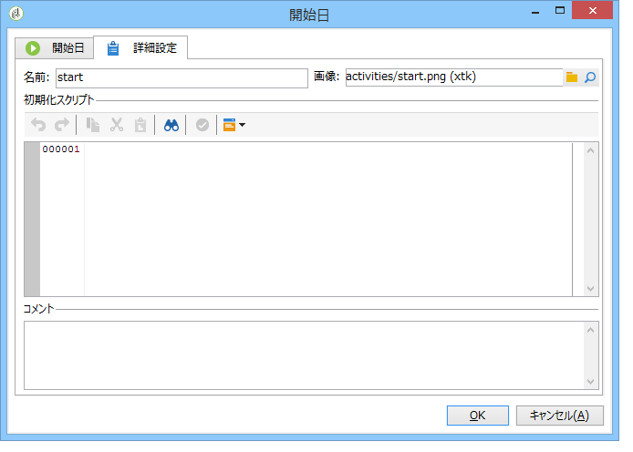
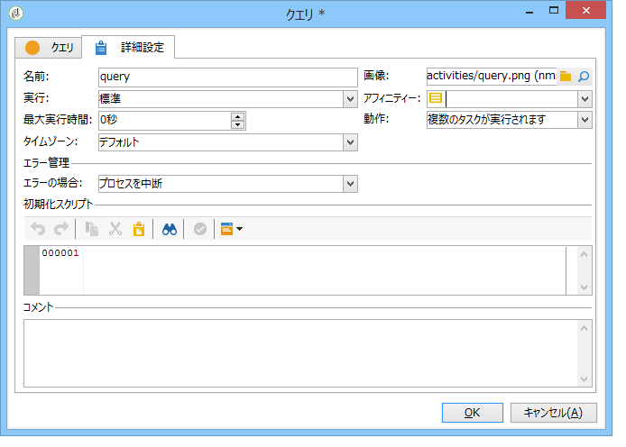

# 詳細設定パラメーター{#advanced-parameters}

The properties screen of an activity has an **[!UICONTROL Advanced]** tab that lets you define a behavior in case of errors, the execution period for the activity; and lets you enter an initialization script. このタブには、次の 2 つのバージョンがあります。

* a simplified version (for **[!UICONTROL Start]** and **[!UICONTROL End]** activities for instance)

   

* a more detailed version (for the **[!UICONTROL Query]** activity, for instance)

   

The fields to be entered in the **[!UICONTROL Advanced]** tab are detailed in the following sections.

## 名前 {#name}

このフィールドにはアクティビティの内部名を入力します。

## 画像 {#image}

このフィールドでは、アクティビティにリンクする画像を変更できます。For more on this, refer to: [Managing activity images](../../workflow/using/managing-activity-images.md).

## 実行 {#execution}

このフィールドでは、タスクがトリガーされたときに実行されるアクションを定義できます。次の 3 つのオプションが使用可能です。

これらのオプションは通常、アクティビティを右クリックしてカート内で選択します。

* **[!UICONTROL Normal]**:アクティビティは通常どおり実行されます。
* **[!UICONTROL Do not activate]**:このタスクと（同じブランチ内の）次のすべてのタスクは実行されません。
* **[!UICONTROL Activate but do not execute]**:このタスクと（同じ分岐内の）次のすべてのタスクが自動的に停止します。 これは、タスクが起動された場合にその状態のままでタスクを保留中にしたいときに役立ちます。To execute the task manually, right-click the activity and select **[!UICONTROL Normal execution]**.

## アフィニティ {#affinity}

このフィールドでは、特定のマシン上でアクティビティを強制的に実行することができます。For more on this, refer to: [Managing propensity](../../workflow/using/managing-propensity.md).

## Max. 実行期間 {#max--execution-period}

このフィールドでは、長時間にわたりタスクが完了しない場合の警告を設定できます。ワークフローの動作に影響を与えることはありません。If the task isn&#39;t finished by the time the **[!UICONTROL Max. execution period]** is over, the **[!UICONTROL Instance monitoring]** page will show a warning for this workflow. This page is accessed via the **[!UICONTROL Monitoring]** tab of the home page.

## 動作 {#behavior}

このフィールドでは、非同期タスクを使用する際に適用する動作を定義できます。次の 2 つのオプションが使用可能です。

* **[!UICONTROL Several tasks authorized]**:最初のタスクが完了していない場合でも、一度に複数のタスクを実行できます。
* **[!UICONTROL The current task has priority]**:進行中のタスクが優先されます。 なんらかのタスクが進行中である限り、ほかのタスクは実行されません。

## タイムゾーン {#time-zone}

このフィールドでは、アクティビティのタイムゾーンを選択できます。詳しくは、以下を参照してください。タイム [ゾーンの管理](../../workflow/using/managing-time-zones.md)。

## エラーの場合 {#in-case-of-errors}

このフィールドでは、アクティビティでエラーが発生した場合に実行するアクションを定義できます。次の 2 つのオプションが使用可能です。

* **[!UICONTROL Stop the process]**:ワークフローは自動的に停止します。 Its status changes to **[!UICONTROL Failed]**. 問題が解決したら、ワークフローを再起動します。
* **[!UICONTROL Ignore]**:このタスクと（同じブランチ内の）次のすべてのタスクは実行されません。 このオプションは、繰り返しタスクに役立ちます。上流で分岐にスケジューラーが設定されている場合、タスクは次の実行日に通常どおり起動します。

## 初期化スクリプト {#initialization-script}

このフィールドでは、変数を初期化したり、アクティビティのプロパティを変更したりできます。詳しくは、次を参照してください。 [JavaScriptスクリプトとテンプレート](../../workflow/using/javascript-scripts-and-templates.md)。

## コメント {#comment}

The **[!UICONTROL Comment]** field is a free field that lets you add a description.
