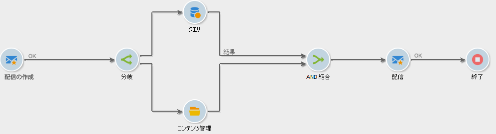

# AND 結合{#and-join}

結合は、先行するすべてのアクティビティが完了しているなど、すべてのインバウンドトランジションが有効化されている場合にのみ、アウトバウンドトランジションをトリガーします。 これにより、ワークフローを続行する前に、特定のアクティビティを確実に完了させるようにできます。

例えば、コンテンツの作成と配信の自動送信のコンテキストで AND 結合アクティビティを使用して、ターゲットのクエリとコンテンツの更新手順が完了した後にのみ配信が開始されるようにできます。 該当する使用例については、[この節](../../delivery/using/automating-via-workflows.md#creating-the-delivery-and-its-content)を参照してください。

>[!NOTE]
>
>異なるターゲティングディメンションで設定されたインバウンドトランジションは、**[!UICONTROL AND-join]** アクティビティを使用して結合できません。

アウトバウンドに送られるアクティビティの母集団は、アクティビティ内のインバウンドトランジション間のメインセットを選択することで、決定されます。

アウトバウンドトランジションには、インバウンドトランジションの母集団の 1 つのみを含むことができます。 アクティビティが設定されていない場合、アウトバウンドトランジションにより、インバウンド母集団のいずれかがランダムに選択されます。

>[!CAUTION]
>
>「**AND 結合**」タイプアクティビティの場合、イベント変数は結合されますが、同じ変数を 2 回定義した場合、競合が生じ、値が未確定になります。 詳しくは、[この節](javascript-scripts-and-templates.md#event-variables)を参照してください。
