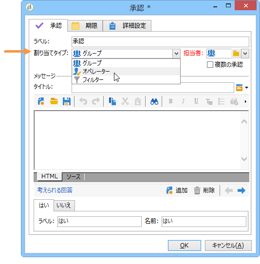
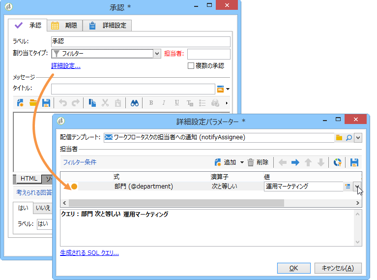
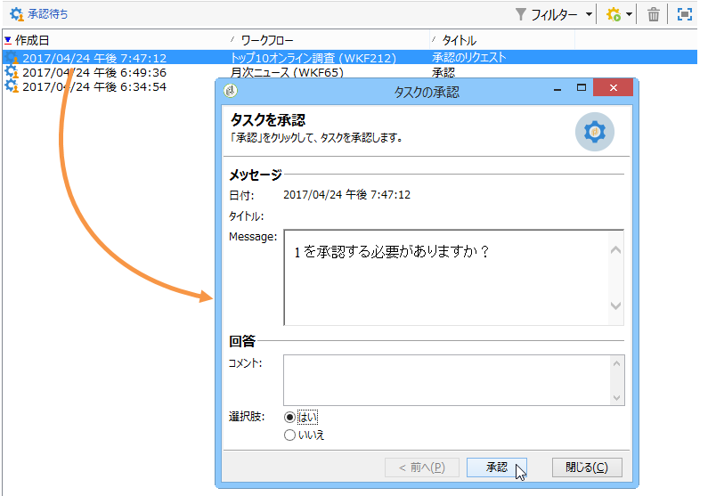
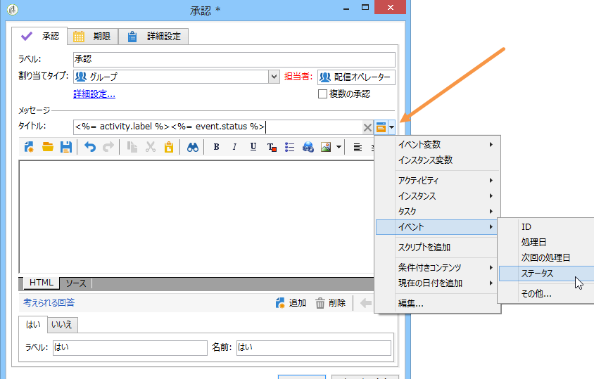

# 承認{#approval}

**承認**&#x200B;タスクは、オペレーターの関与を必要とします。オペレーターにはタスクが割り当てられ、E メールメッセージ内にリンクされた Web ページを使用するか、コンソールを使用して回答できます。

## タスク割り当て {#task-assignment}

デフォルトで、承認はオペレーターのグループに割り当てられます。このグループは、「ニュースレターコンテンツグループ」や「ニュースレターターゲットグループ」などのロールを表します。グループ内の各オペレーターが回答できますが、最初の回答だけが反映されます（複数の承認が存在する場合を除く）。

必要に応じて、承認タスクを 1 人のオペレーターに割り当てるか、フィルターによって定義されたオペレーターのセットに割り当てることができます。

* To select a single operator, select the **[!UICONTROL Operator]** value in the **[!UICONTROL Assignment type]** field and select the relevant operator in the drop-down list of the **[!UICONTROL Assignee]** field.

   

   >[!CAUTION]
   >
   >選ばれたオペレーターだけに、タスクの承認権限が与えられます。

* 承認オペレーターをフィルターするクエリを定義できます。To do this, select the **[!UICONTROL Filter]** value in the **[!UICONTROL Assignment type]** field and click the **[!UICONTROL Advanced parameters...]** link to define filtering conditions, as shown in the following example:

   

単独承認の場合は、オペレーターの選択に対応するトランジションが有効化され、タスクが完了します。他のオペレーターは回答できません。

複数承認の場合、各オペレーターの選択に対応するトランジションが有効化されます。グループの全オペレーターが回答するか、タスクの期限が切れた時点でタスクが完了となります。

このアクティビティは処理をブロックしないので、回答を待機している間ワークフローは他のタスクを実行できます。

オペレーターは、自分に割り当てられたタスクをコンソールから承認できます。管理者権限を持つオペレーターは、任意のオペレーターに割り当てられたタスクの表示と削除ができますが、それらのタスクに回答することはできません。

アクティビティのタイトルまたはメッセージ本文を編集しても、現在のタスクに影響しませんが、一方で選択肢を変更した場合、現在のタスクに直接影響し、新しい選択肢のリストが自動的に継承されます。

**承認タイプ** のタスクは、次のノードからアクセスで **[!UICONTROL Administration > Production > Objects created automatically > Approvals pending]** きます。演算子は、このビューを介して承認フォームに直接アクセスできます。

## プロパティ {#properties}

カスタマイズ変数は、レビュー担当者に送信するメッセージに使用でき、メッセージのタイトルまたは本文に挿入できます。

このフ **[!UICONTROL Title]** ィールドには、メッセージのタイトルが含まれます。これは、送信された電子メールメッセージの件名です。 タイトルおよびメッセージの本文は JavaScript テンプレートになっているので、ワークフローの状況に応じて計算される値が含まれます。

エディターの下部のセクションで、選択肢となる回答のリストを定義します。回答ごとに対応するトランジションがあります。名前は内部識別子、ラベルは選択肢のリストに表示される文字列です。

Click the **[!UICONTROL Advanced parameters...]** link to select the delivery template to be used to notify operators. デフォルトテンプレート（内部名は&#39;notifyAssignee&#39;）は、タイトルとメッセージを取得し、回答に使用された Web ページへのリンクを追加します。

テンプレートを編集してメッセージのレイアウトをカスタマイズできますが、コピーを作成してもかまいません。ターゲットメカニズム（外部ファイル、ターゲットマッピング）は、通知を正しく処理するのに必要なので、編集できません。

An approval example is shown in [Defining approvals](../../workflow/using/executing-a-workflow.md#defining-approvals).

## 出力パラメーター {#output-parameters}

* **[!UICONTROL response]**

   回答に関連するコメント

* **[!UICONTROL responseOperator]**

   回答したオペレーターの ID。このフィールドには数値が入りますが、**[!UICONTROL String]** フィールドです。

