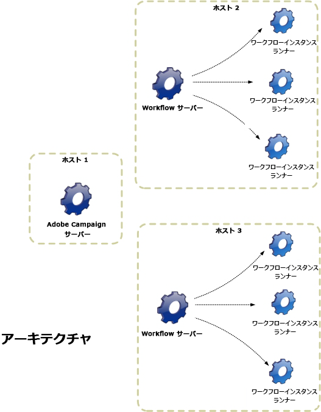

# アーキテクチャ {#architecture}

ワークフローは特定のモジュールによって処理されます。 このモジュールは、複数のサーバーから起動し、処理の負荷を分散することができます。

* 「ワークフローインスタンスランナー」（runwf）プロセスは、所定のワークフローインスタンスのすべてのタスクを実行します。 一定期間、実行されるタスクがない場合、プロセスは「passive」になります。つまり、データベース内でステータスを保存し、停止します。
* 「ワークフローサーバー」（wfserver）モジュールは、現在のワークフローインスタンスを監視します。 実行するタスクがある場合、このモジュールは対応するインスタンスを有効化（または再有効化）するプロセスを作成します。
