# ワークフローの作成 {#building-a-workflow}

ここでは、Campaign での新しいワークフローの作成に関する主な原則とベストプラクティスについて説明します。

* ワークフローの作成（「[新規ワークフローの作成](#creating-a-new-workflow)」を参照）
* ワークフローダイアグラムのデザイン（「[アクティビティの追加とリンク](#adding-and-linking-activities)」を参照）
* アクティビティのパラメーターおよびプロパティへのアクセス（「[アクティビティの設定](#configuring-activities)」を参照）
* ターゲティングワークフローのデザイン（「[ターゲティングワークフロー](#targeting-workflows)」を参照）
* ワークフローを使用したキャンペーンの実施（「[キャンペーンワークフロー](#campaign-workflows)」を参照）
* テクニカルワークフローのアクセスと作成（「[テクニカルワークフロー](#technical-workflows)」を参照）
* テンプレートを使用したワークフローの作成（「[ワークフローテンプレート](#workflow-templates)」を参照）

## 新しいワークフローの作成 {#creating-a-new-workflow}

From the **[!UICONTROL Explorer]**, access a workflow folder. デフォルトでは、//を使 **[!UICONTROL Profiles and Targets]** 用で **[!UICONTROL Jobs]** きます **[!UICONTROL Targeting workflows]**。

Click the **[!UICONTROL New]** button located above the list of workflows.

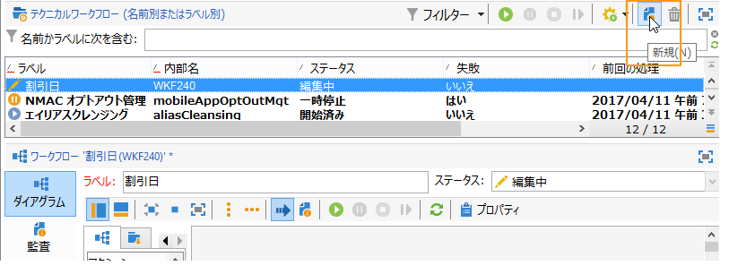

Or, you can also use the **[!UICONTROL Create]** button in the workflow overview (**[!UICONTROL Monitoring]** > **[!UICONTROL Workflow]** link).

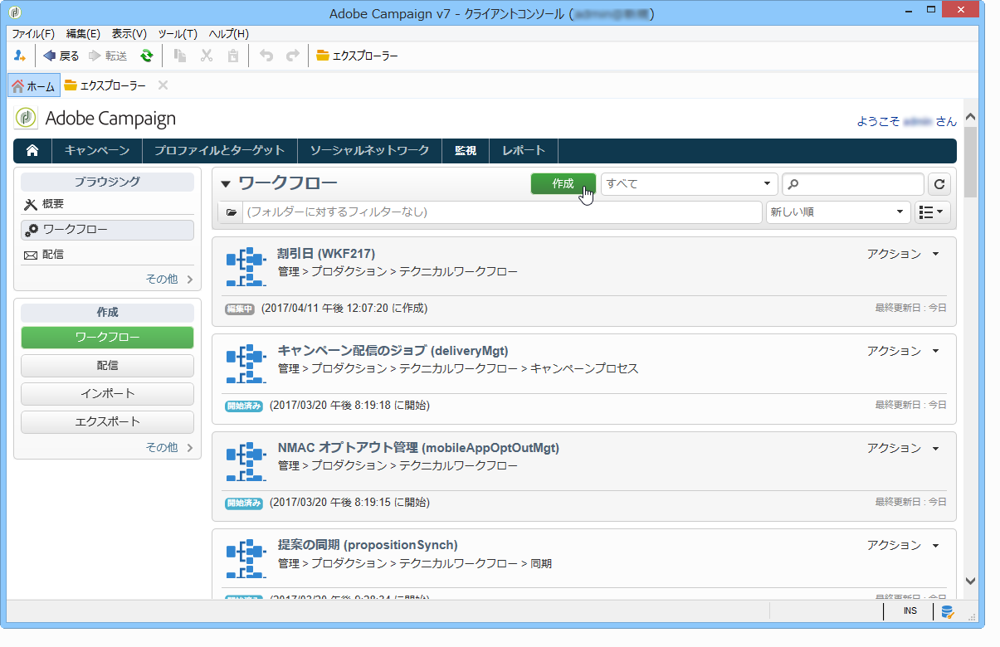

Enter a label and click **[!UICONTROL Save]**.

>[!NOTE]
>
>ワークフローのアクティビティの内部名またはワークフロー自体の内部名を変更した場合は、変更した内部名が正しく反映されるように、ワークフローを閉じる前に必ず保存してください。

## アクティビティの追加とリンク {#adding-and-linking-activities}

ここでは、各種アクティビティを定義し、ダイアグラム内で互いにリンクする必要があります。設定のこの段階では、ダイアグラムラベルとワークフローステータスを確認できます（編集中）。ウィンドウの下部セクションは、ダイアグラムの編集のみに使用されます。この領域には、ツールバー、アクティビティのパレット（左側）、ダイアグラム自体（右側）があります。

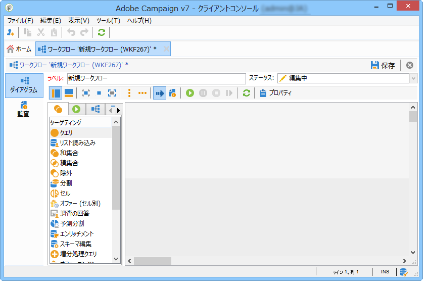

>[!NOTE]
>
>パレットが表示されない場合、ツールバーの 1 番目のボタンをクリックして、パレットを表示します。

アクティビティは、パレットのタブごとに、カテゴリ別にグループ分けされます。利用できるタブおよびアクティビティは、ワークフロータイプに応じて異なります（テクニカルワークフロー、ターゲティングワークフロー、キャンペーンワークフロー）。

* 1 番目のタブには、ターゲティングアクティビティとデータ操作アクティビティが含まれています。これらのアクティビティについて詳しくは、ターゲ [ット設定アクティビティ](../../workflow/using/about-targeting-activities.md)。
* 2 番目のタブには、主に、その他のアクティビティの調整に使用されるスケジューリングアクティビティが含まれます。これらのアクティビティは、フロー制 [御アクティビティで詳しく説明しま](../../workflow/using/about-flow-control-activities.md)す。
* 3 番目のタブには、ワークフロー内で使用できるツールとアクションが含まれています。これらのアクティビティの詳細は、アクシ [ョンアクティビティ](../../workflow/using/about-action-activities.md)。
* 4 番目のタブには、メールの受信や、サーバーへのファイルの到着など、所定のイベントに基づくアクティビティが含まれています。これらのアクティビティの詳細は、イベ [ントアクティビティ](../../workflow/using/about-event-activities.md)。

ダイアグラムを作成するには

1. パレット内でアクティビティを選択し、ドラッグ＆ドロップ操作を使用してダイアグラムに移動することで、アクティビティを追加します。

   ダイアグラムに「**開始**」アクティビティを追加し、次に「**配信**」アクティビティを追加します。

   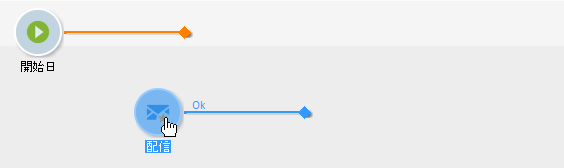

1. 「**開始**」アクティビティトランジションをドラッグして「**配信**」アクティビティにドロップし、2 つのアクティビティをリンクさせます。

   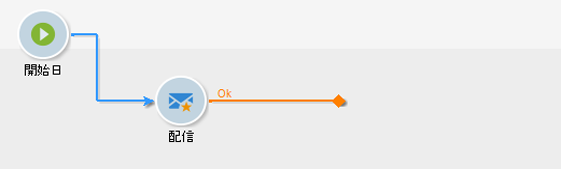

   トランジションの最後に新しいアクティビティを配置することで、直前のアクティビティと自動的にリンクできます。

1. 必要なアクティビティを追加し、次の図に示すように、互いにリンクさせます。

   

>[!CAUTION]
>
>同じワークフロー内でアクティビティをコピーして貼り付けることができます。 ただし、異なるワークフロー間で貼り付けアクティビティをコピーすることはお勧めしません。 配信やスケジューラーなどのアクティビティに関連付けられた一部の設定は、宛先ワークフローの実行中に競合やエラーを引き起こす可能性があります。 代わりに、ワークフローの複製をお勧 **めします** 。 詳しくは、ワークフローの複製を参 [照してください](#duplicating-workflows)。

### 追加のレイアウトオプション {#additional-layout-options}

以下の要素を使用して、グラフの表示とレイアウトを変更できます。

* **ツールバーの使用**

   ダイアグラムの編集ツールバーを使用して、レイアウトにアクセスし、ワークフローの関数を実行します。

   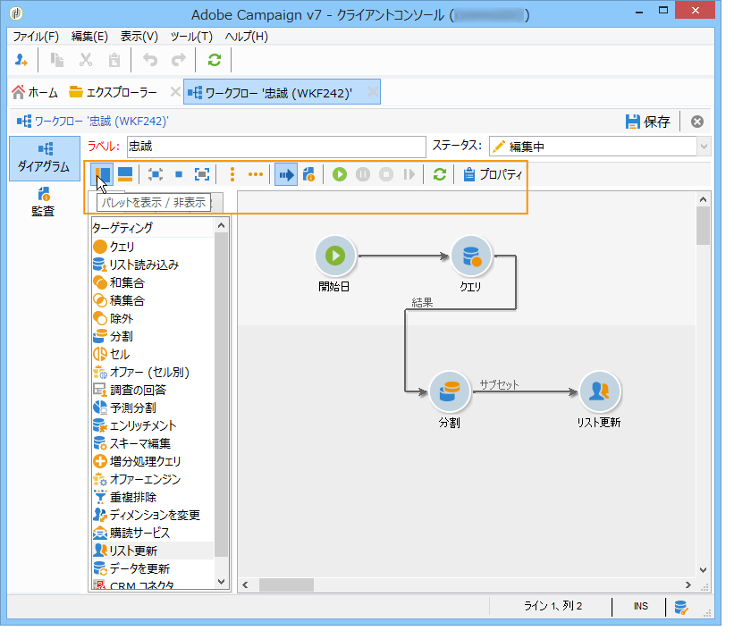

   これにより、パレットと概要の表示や、ダイアグラムのオブジェクトの配置やサイズなど、編集ツールのレイアウトを適用できます。

   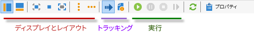

   詳細なターゲティングワークフローのトラッキングおよび開始に関連するアイコンについて詳しくは、この[節](../../campaign/using/marketing-campaign-deliveries.md#creating-a-targeting-workflow)を参照してください。

* **オブジェクトの整列**

   アイコンを整列するには、アイコンを選択し、アイコンまたはアイコ **[!UICONTROL Align vertically]** ンをクリ **[!UICONTROL Align horizontally]** ックします。

   連続していないアクティビティを選択したり、1 つまたは複数アクティビティの選択を解除するには、**Ctrl** キーを同時に押します。すべての選択を解除するには、ダイアグラムの背景をクリックします。

* **画像の管理**

   ダイアグラムの背景画像や、各種アクティビティを表す画像をカスタマイズできます。アクティビティ [画像の管理を参照してください](../../workflow/using/managing-activity-images.md)。

## アクティビティの設定 {#configuring-activities}

Double-click an activity to configure it or right-click and select **[!UICONTROL Open...]**.

>[!NOTE]
>
>Campaign ワークフローアクティビティについて詳しくは、[この節](../../workflow/using/about-activities.md)を参照してください。

1 番目のタブには、基本設定が含まれます。The **[!UICONTROL Advanced]** tab contains the additional parameters, which are used particularly for defining behavior when an error is encountered, specifying the execution duration for an activity, and for entering an initialization script.

アクティビティへの理解を深め、ワークフローの読みやすさを改善するには、アクティビティにコメントを入力します。入力したコメントは、オペレーターがアクティビティの上にマウスを置くと表示されます。

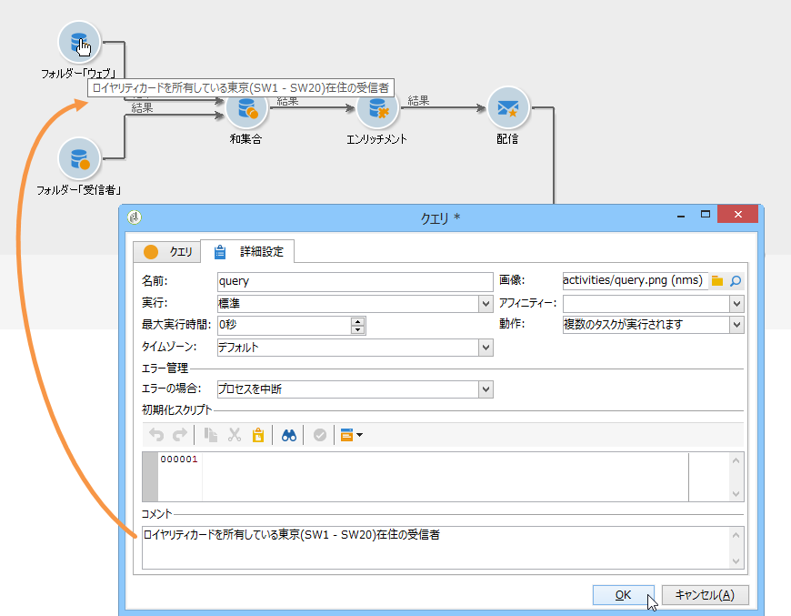

## ターゲティングワークフロー {#targeting-workflows}

ターゲティングワークフローにより、配信ターゲットをいくつか作成できます。ワークフローアクティビティを使用して、クエリを作成し、指定した条件に基づく和集合または除外を定義して、スケジューリングを追加することができます。このターゲティングの結果は、配信アクションのターゲットとして機能するリストに自動転送できます。

これらのアクティビティに加えて、データ管理の各種オプションを使用することで、データを操作して、高度な機能にアクセスし、複雑なターゲティングの問題を解決できます。For more on this, refer to [Data Management](../../workflow/using/targeting-data.md#data-management).

これらのアクティビティはすべて、1 番目のワークフロータブにあります。

>[!NOTE]
>
>ターゲティングアクティビティについて詳しくは、この[節](../../workflow/using/about-activities.md)を参照してください。

ターゲット設定ワークフローは、Adobe Campaignツリーのノ **[!UICONTROL Profiles and Targets > Jobs > Targeting workflows]** ードまたはホームページのメニューを介して作 **[!UICONTROL Profiles and Targets > Targeting workflows]** 成および編集できます。

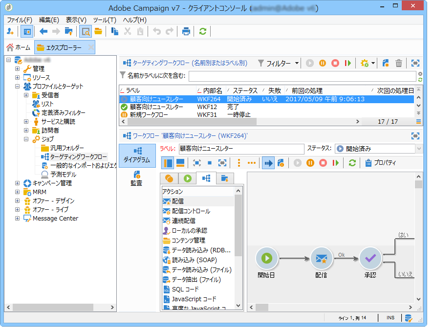

キャンペーンのフレームワーク内のターゲティングワークフローは、すべてのキャンペーンワークフローとともに保存されます。

### 実装の手順 {#implementation-steps-}

ターゲティングデータの作成ステージの手順は、次のとおりです。

1. For identifying data in the database, refer to [Creating queries](../../workflow/using/targeting-data.md#creating-queries).
1. 配信ニーズを満たすデータを準備する方法については、「データの [強化と変更」を参照してくださ](../../workflow/using/targeting-data.md#enriching-and-modifying-data)い。
1. For using data to perform updates or within a delivery, refer to [Updating the database](../../workflow/using/how-to-use-workflow-data.md#updating-the-database).

ターゲティング中に実行されたすべてのエンリッチメントと処理の結果はパーソナライゼーションフィールドに保存され、このフィールド経由でアクセスされます。具体的には、特にパーソナライズしたメッセージの作成などに使用されます。For more on this, refer to [Target data](../../workflow/using/executing-a-workflow.md#target-data)

### ターゲティングとフィルタリングディメンション {#targeting-and-filtering-dimensions}

データのセグメント化操作では、ターゲティングキーは、フィルタリングディメンションとマッピングされます。ターゲティングディメンションは、受信者、契約の受益者、オペレーター、購読者など、ターゲットされる母集団を操作ごとに定義します。フィルタリングディメンションを使用して契約の所有者、ニュースレターの購読者など、特定の条件に基いて母集団を選択できます。

例えば、5年以上生命保険の契約を持つ顧客を選択するには、次のターゲットディメンションを選択します。クライ **アント** 、および次のフィルターディメンション：契 **約者**。 次に、クエリアクティビティ内でフィルタリング条件を定義します。

ターゲティングディメンションの選択ステージでは、互換性のあるフィルタリングディメンションだけがインターフェイスに表示されます。

これらの 2 つのディメンションは、関連付けられている必要があります。Thus, the content of the **[!UICONTROL Filtering dimension]** list depends on the targeting dimension specified in the first field.

例えば、受信者の場合（「**受信者**」）、次のフィルタリングディメンションが使用可能になります。

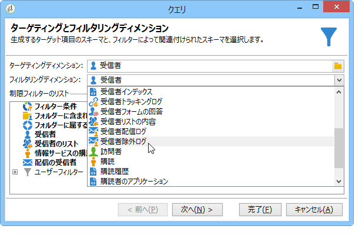

「**Web アプリケーション**」の場合、リストには次のフィルタリングディメンションが表示されます。

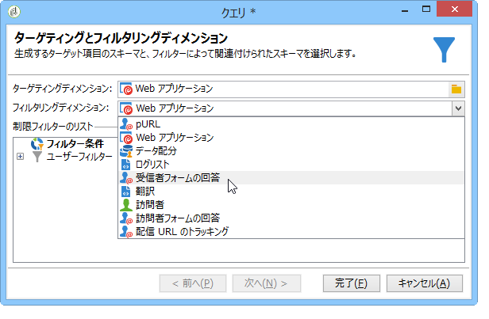

## キャンペーンワークフロー {#campaign-workflows}

For each campaign, you can create workflows to be executed from the **[!UICONTROL Targeting and workflows]** tab. これらのワークフローは、各キャンペーンに固有です。

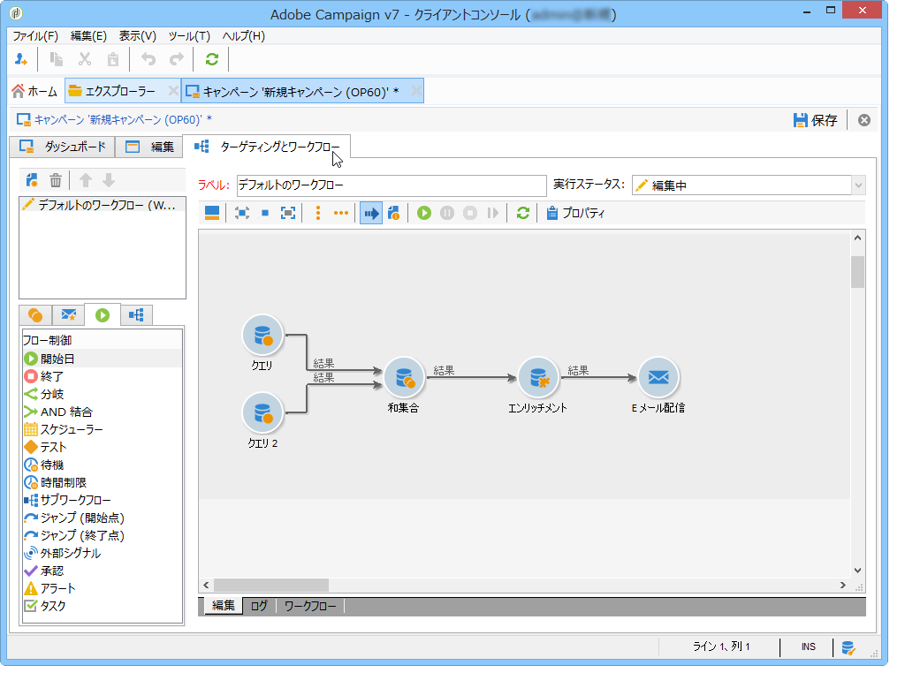

このタブには、すべてのワークフロー用のものと同じアクティビティが含まれます。They are presented in the [Implementation steps](#implementation-steps-) section.

ターゲティングキャンペーンに加えて、キャンペーンワークフローにより、すべての使用可能なチャネル用の配信全体を作成して設定できます。ワークフローで作成されたこれらの配信は、キャンペーンのダッシュボードから使用できます。

すべてのキャンペーンワークフローはノードの下に集 **[!UICONTROL Administration > Production > Objects created automatically > Campaign workflows]** 中します。

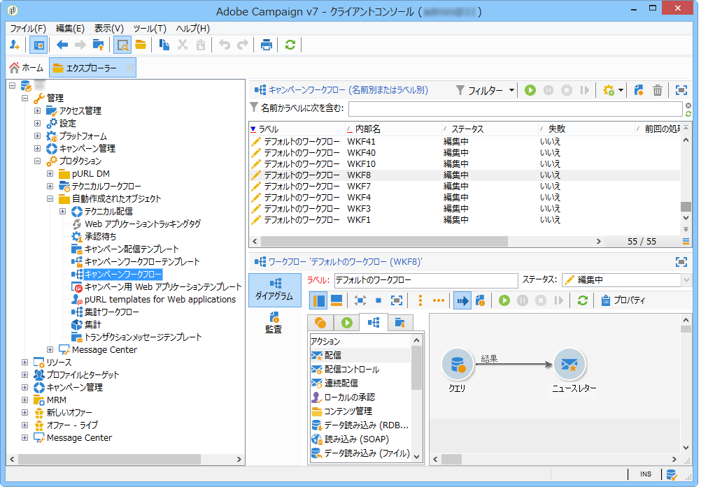

キャンペーンワークフローおよび実装例について詳しくは、この[ページ](../../campaign/using/marketing-campaign-deliveries.md#building-the-main-target-in-a-workflow)を参照してください。

## テクニカルワークフロー {#technical-workflows}

テクニカルワークフローは、Adobe Campaign に付属し、そのまま使用できる形で提供されます。テクニカルワークフローとは、サーバー上で定期的に実行するようにスケジュールされた操作またはジョブです。テクニカルワークフローを使用して、データベースのメンテナンスを実施したり、配信に関するトラッキング情報を転送したり、配信に対する暫定的なプロセスを設定することができます。技術ワークフローはノードを介して設定 **[!UICONTROL Administration > Production > Technical workflows]** されます。

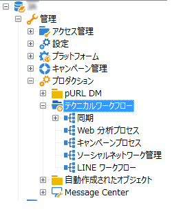

テクニカルワークフローの作成には、ネイティブテンプレートを使用可能です。ニーズに合わせてテンプレートをカスタマイズすることもできます。

The **[!UICONTROL Campaign process]** subfolder centralizes the workflows required for executing processes within the campaigns: task notification, stock management, cost calculation, etc.

>[!NOTE]
>
>各モジュールにインストールされているテクニカルワークフローのリストは、[専用のセクション](../../workflow/using/about-technical-workflows.md)から使用できます。

You can create other technical workflows in the **[!UICONTROL Administration > Production > Technical workflows]** node of the tree structure. ただし、このプロセスを実行できるのは、エキスパートユーザーに限られます。

提供されるアクティビティは、ターゲティングワークフローで提供されるものと同じです。For more on this, refer to [Implementation steps](#implementation-steps-).

## ワークフローテンプレート {#workflow-templates}

ワークフローテンプレートには、プロパティ全体の設定が含まれます。ダイアグラム内に連結されているアクティビティの範囲が含まれることもあります。この設定は、設定済み要素を一定数含む新規ワークフローを作成する場合に再利用できます。

既存のテンプレートに基づいて新規ワークフローテンプレートを作成したり、ワークフローをテンプレートに直接変換することができます。

Workflow templates are stored in the **[!UICONTROL Resources > Templates > Workflow templates]** node of the Adobe Campaign tree.

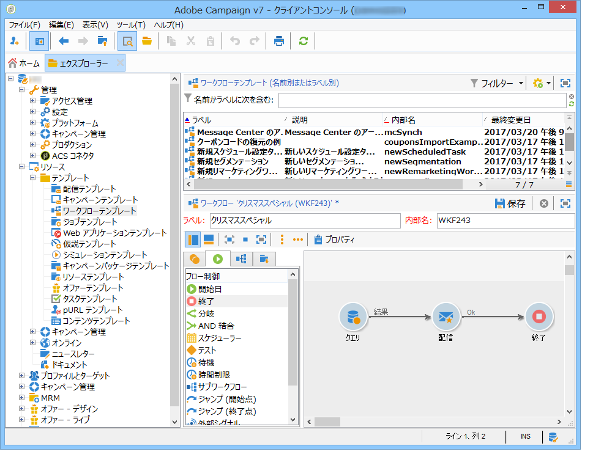

通常のワークフローのプロパティに加えて、テンプレートのプロパティには、このテンプレートに基づいて作成されたワークフローの実行ファイルを指定できます。

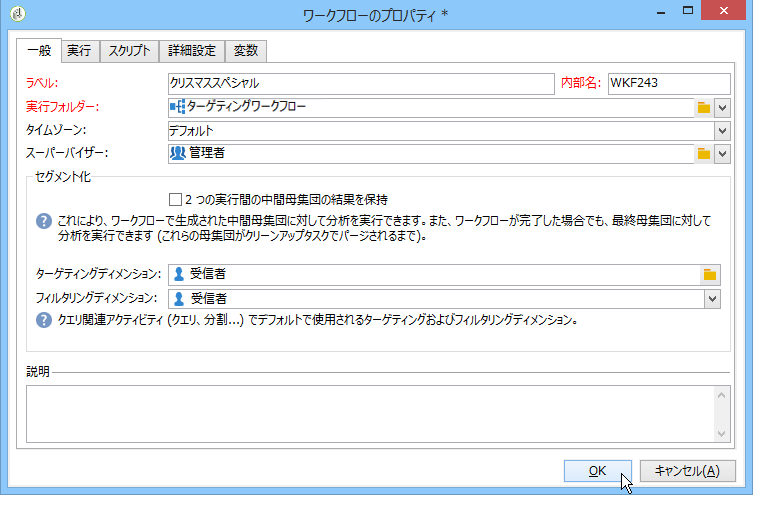

## ワークフローの複製 {#duplicating-workflows}

様々なタイプのワークフローを複製できます。 複製後は、ワークフローの変更はワークフローのコピーに引き継がれません。

>[!CAUTION]
>
>コピー&amp;ペーストはワークフローで使用できますが、「複製」を使用することをお勧め **します**。 アクティビティがコピーされると、その設定全体が保持されます。 配信アクティビティ（電子メール、SMS、プッシュ通知など）の場合は、アクティビティに添付された配信オブジェクトもコピーされ、クラッシュする可能性があります。

1. ワークフローを右クリックします。
1. 「複製」を **クリックしま**&#x200B;す。

   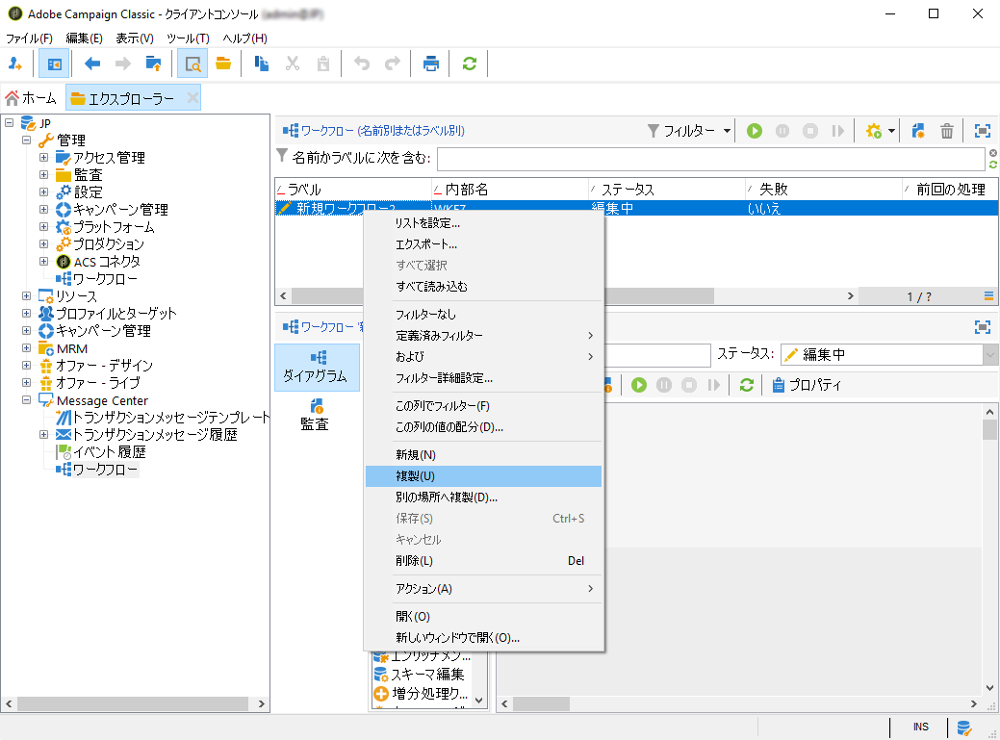

1. ワークフローウィンドウで、ワークフローのラベルを変更します。
1. 「**保存**」をクリックします。

重複した機能は、キャンペーンのビューでは直接使用できません。

ただし、インスタンス上のすべてのワークフローを表示するビューを作成できます。 このビューでは、「複製先」を使用してワークフローを複 **製できます**。

**まず、ビューを作成します。**

1. エクスプ **ローラ**&#x200B;で、ビューを作成するフォルダに移動します。
1. 右クリックし、新しいフォルダーを追加/ **プロセスに移動し** 、「ワ **ークフロー**」を選 **択します**。

   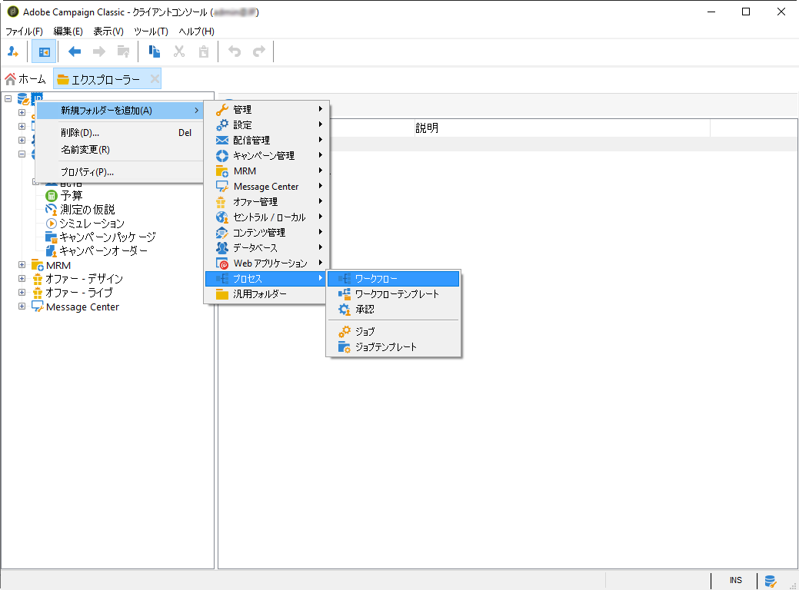

新しいフォルダ **ー** 「Workflows」が作成されます。

1. Right-click and select **Properties**.
1. 「制限」 **で**、「 **Folder is a view** 」をチェックし、「 **Save**」をクリックします。

   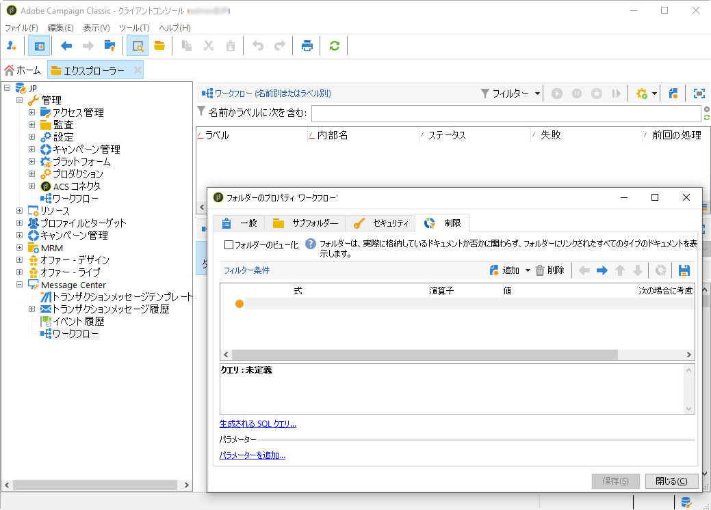

これで、フォルダーにインスタンスのすべてのワークフローが入力されます。

**キャンペーンワークフローの複製**

1. ワークフロービューでキャンペーンワークフローを選択します。
1. [複製先]を右ク **リックします**。
   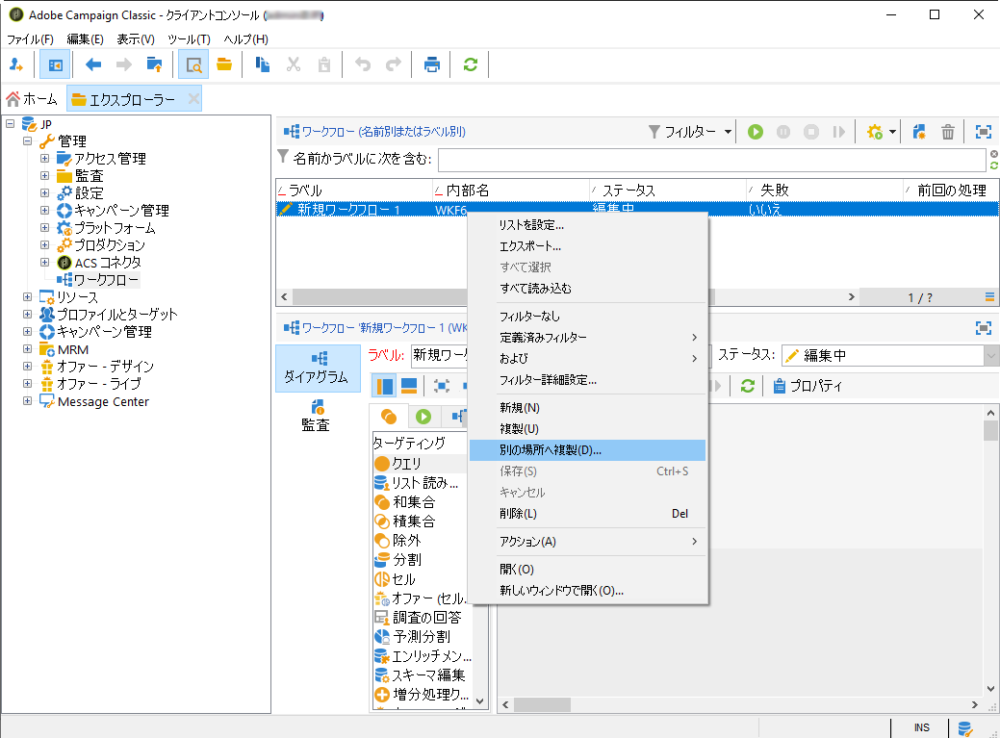
1. ラベルを変更します。
1. 「**保存**」をクリックします。

複製したワークフローは、ワークフロービューで確認できます。
