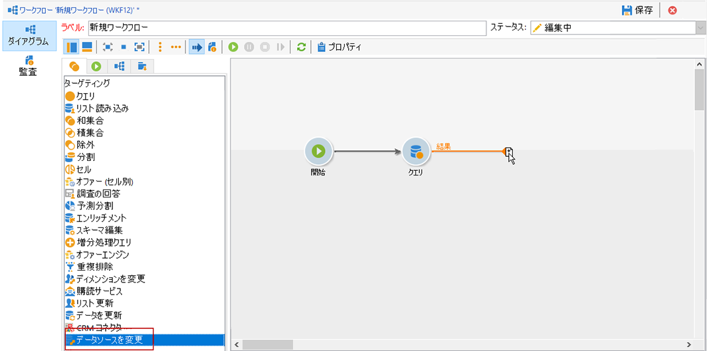
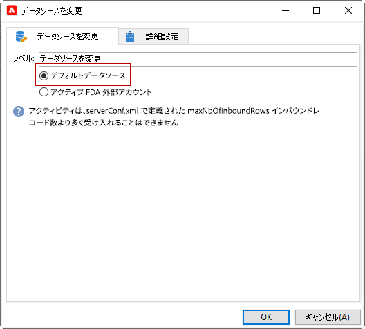
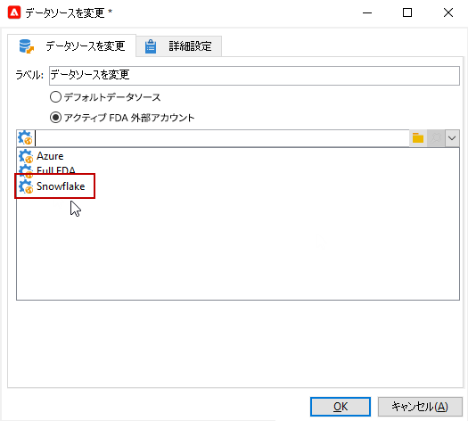

# データソースを変更 {#change-data-source}

>[!NOTE]
>
> 「**[!UICONTROL データソースを変更]**」アクティビティは、「**[!UICONTROL 外部データへのアクセス (Federated Data Access)]** パッケージでのみ使用できます。 Adobe Campaign Classic の組み込みパッケージについて詳しくは、[このページ](../../installation/using/installing-campaign-standard-packages.md)を参照してください。

「**[!UICONTROL データソースを変更]**」アクティビティを使用すると、ワークフロー&#x200B;**[!UICONTROL 作業用テーブル]**&#x200B;のデータソースを変更できます。これにより、FDA、FFDA、ローカルデータベースなど、様々なデータソースにわたって、より柔軟にデータを管理できます。

**[!UICONTROL 作業用テーブル]**を使用すると、Adobe Campaign Classic ワークフローでデータを処理し、ワークフローアクティビティとデータを共有できます。
デフォルトでは、**[!UICONTROL 作業用テーブル]**&#x200B;は、クエリ対象のデータのソースと同じデータベースに作成されます。

例えば、クラウドデータベースに格納された&#x200B;**[!UICONTROL プロファイル]**&#x200B;テーブルに対してクエリを実行する場合、同じクラウドデータベースに&#x200B;**[!UICONTROL 作業用テーブル]**を作成します。
これを変更するには、「**[!UICONTROL データソースを変更]**」アクティビティを追加して、**[!UICONTROL 作業用テーブル]**&#x200B;に別のデータソースを選択します。

なお、「**[!UICONTROL データソースを変更]**」アクティビティを使用する場合、ワークフローの実行を続行するには、クラウドデータベースに戻す必要があります。

「**[!UICONTROL データソースを変更]**」アクティビティを使用するには：

1. ワークフローを作成します。

1. 「**[!UICONTROL クエリ]**」アクティビティでターゲット受信者にクエリを実行します。

   「**[!UICONTROL クエリ]**」アクティビティについて詳しくは、[このページ](../../workflow/using/query.md#creating-a-query)を参照してください。

1. 「**[!UICONTROL ターゲティング]**」タブで、「**[!UICONTROL データソースを変更]**」アクティビティを追加します。

   

1. 「**[!UICONTROL データソースを変更]**」アクティビティをダブルクリックして、「**[!UICONTROL デフォルトデータソース]**」を選択します。

   クエリの結果を含んだ作業用テーブルが、デフォルトの PostgreSQL データベースに移動されます。

   

1. 「**[!UICONTROL アクション]**」タブから、「**[!UICONTROL JavaScript コード]**」アクティビティをドラッグ＆ドロップして、作業用テーブルに対して単一の操作を実行します。

   「**[!UICONTROL JavaScript コード]**」アクティビティについて詳しくは、[JavaScript コードと高度な JavaScript コード](../../workflow/using/sql-code-and-javascript-code.md#javascript-code)ページを参照してください。

1. 別の「**[!UICONTROL データソースを変更]**」アクティビティを追加して、クラウドデータベースに戻ります。

1. アクティビティをダブルクリックし、「**[!UICONTROL アクティブ FDA 外部アカウント]**」を選択してから、対応する&#x200B;**[!UICONTROL 外部データベース]**&#x200B;の外部アカウントを選択します。

   

1. これで、ワークフローを開始できます。
