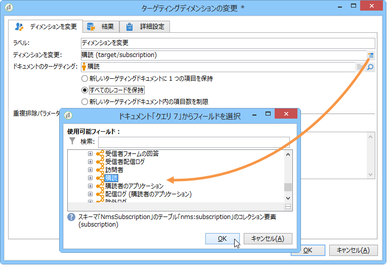
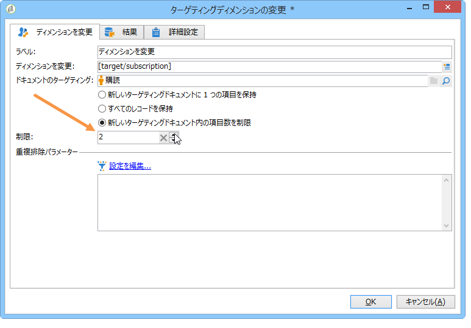
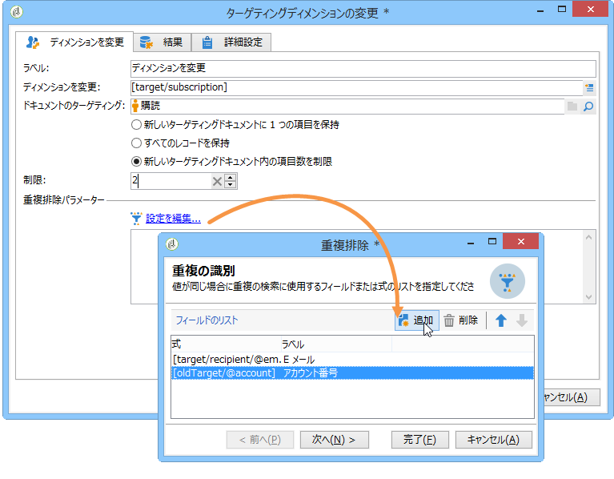
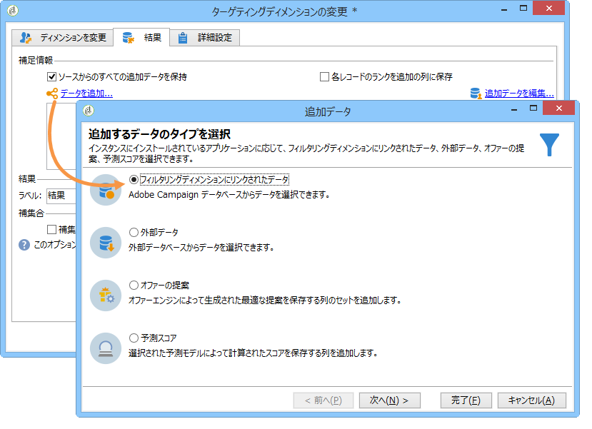
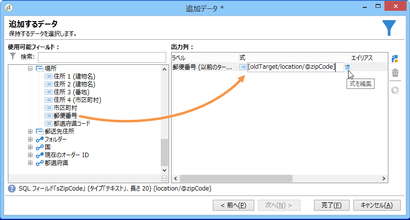
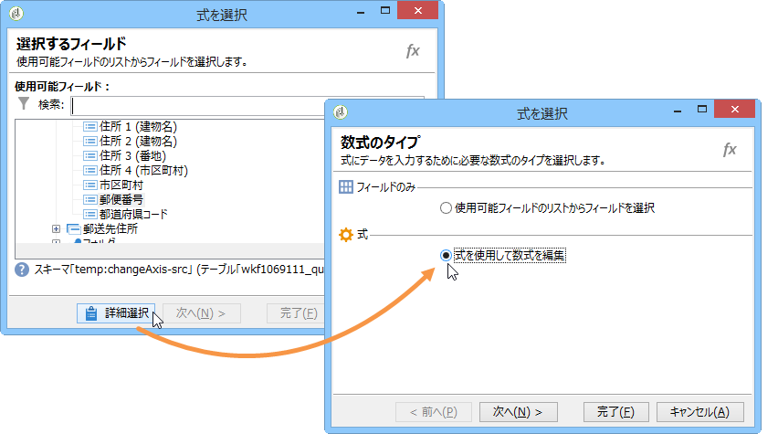
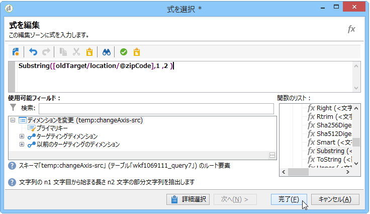
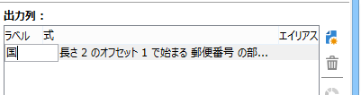
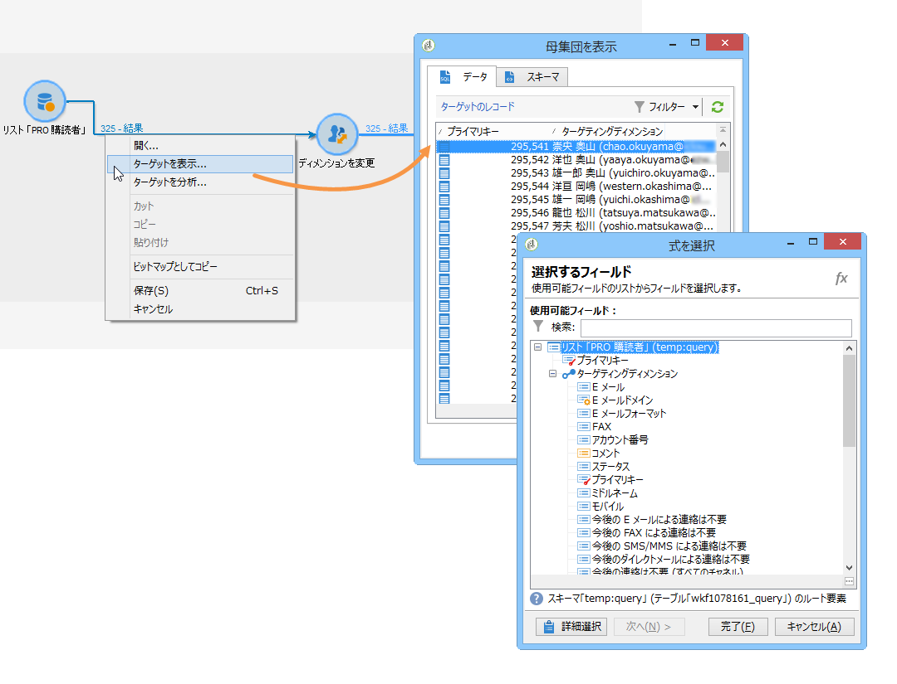
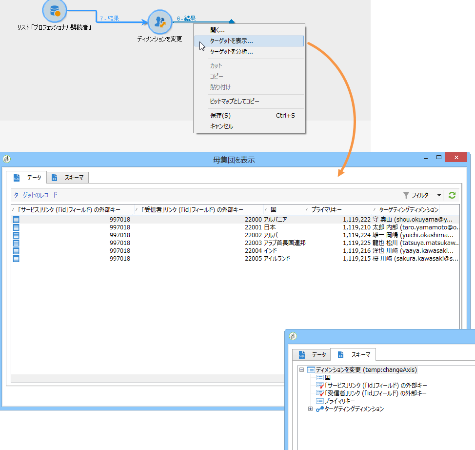

# ディメンションを変更{#change-dimension}

「ディメンションを変更」アクティビティを使用して、ターゲットの構築サイクル中にターゲティングディメンションを変更できます。軸の移動は、データテンプレートと入力ディメンションに依存します。これにより、「契約」ディメンションから「クライアント」ディメンションに切り替えることができます。

さらに、このアクティビティを使用して、新規ターゲットの追加列を定義できます。

データの重複排除条件を定義することもできます。

## 設定モード {#configuration-mode}

「ディメンションの変更」アクティビティを設定するには、次の手順に従います。

1. Select the new targeting dimension via the **[!UICONTROL Change dimension]** field.

   

1. ディメンションの変更時に、すべての要素を保持することも、出力に含める要素を選択することもできます。次の例では、重複の最大件数が 2 に設定されています。

   

   レコードを1つだけ保持する場合は、コレクションが作業スキーマに表示されます。このコレクションは、最終結果でターゲットにならないすべてのレコードを表します（1つのレコードのみが保持されるため）。 ほかのすべてのコレクションと同様に、このコレクションを使用して、集計を自動生成したり、列内の情報を取得したりできます。

   For example, if you change the **[!UICONTROL Customers]** dimension to the **[!UICONTROL Recipients]** dimension, it will be possible to target customers of a specific store, while adding the number of purchases made.

1. この情報の一部のみを保持するように選択する場合、重複管理モードで設定できます。

   

   青い矢印を使用して、重複処理の優先順位を定義できます。

   上の例では、受信者はまず E メールアドレスに基づいて重複排除され、次に必要に応じてアカウント番号に基づいて重複排除されます。

1. The **[!UICONTROL Result]** tab lets you add additional information.

   例えば、**Substring**&#x200B;タイプ関数を使用して、郵便番号に基づいて国を収集できます。手順は次のとおりです。

   * リンクをクリ **[!UICONTROL Add data...]** ックし、を選択しま **[!UICONTROL Data linked to the filtering dimension]**&#x200B;す。

      

      >[!NOTE]
      >
      >For information on creating and managing additional columns, refer to [Adding data](../../workflow/using/query.md#adding-data).

   * Select the previous targeting dimension (before axis switch) and select the **[!UICONTROL Zip Code]** in the recipient&#39;s **[!UICONTROL Location]** sub-tree, then click **[!UICONTROL Edit expression]**.

      

   * をクリック **[!UICONTROL Advanced selection]** し、を選択しま **[!UICONTROL Edit the formula using an expression]**&#x200B;す。

      

   * リストで提供される関数を使用して、実行される計算を指定します。

      

   * 最後に、作成した列のラベルを入力します。

      

1. ワークフローを実行して、この設定の結果を確認します。次の図に示すように、ディメンションアクティビティの変更前と変更後のテーブル内のデータを比較し、さらにワークフローテーブルの構造も比較します。

   

   

