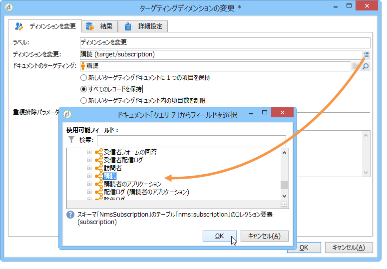
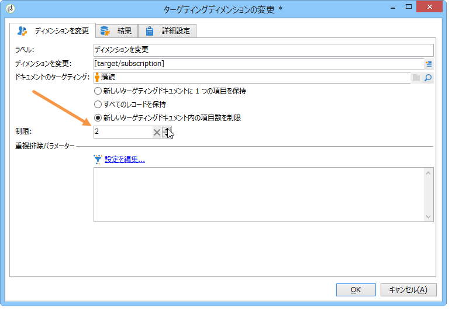
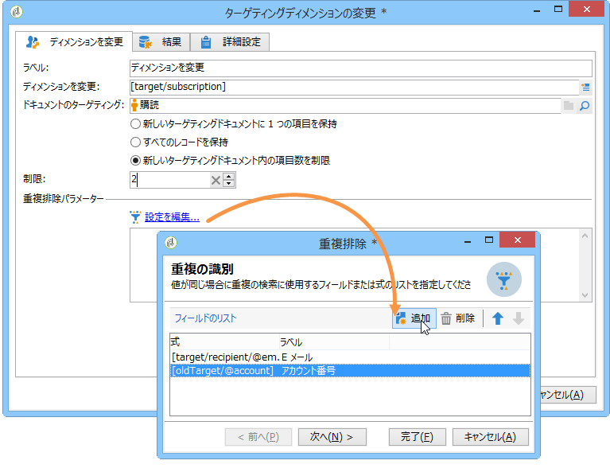
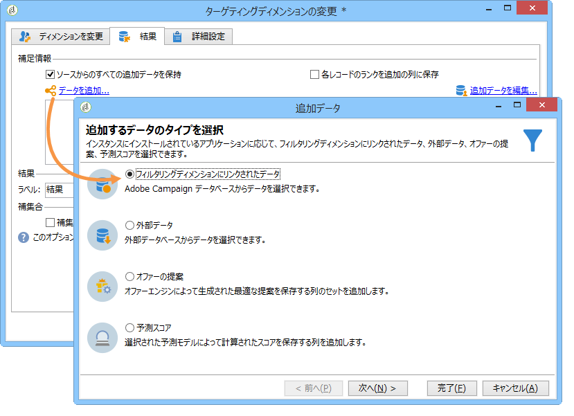
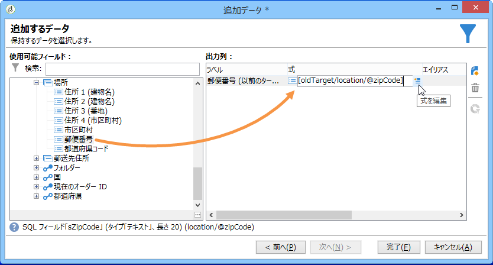
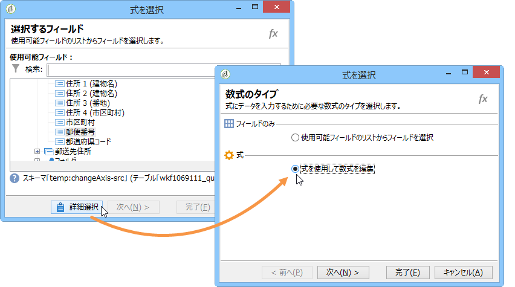
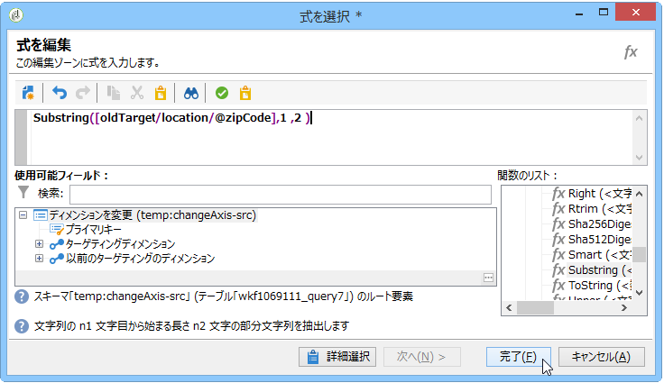
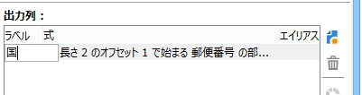
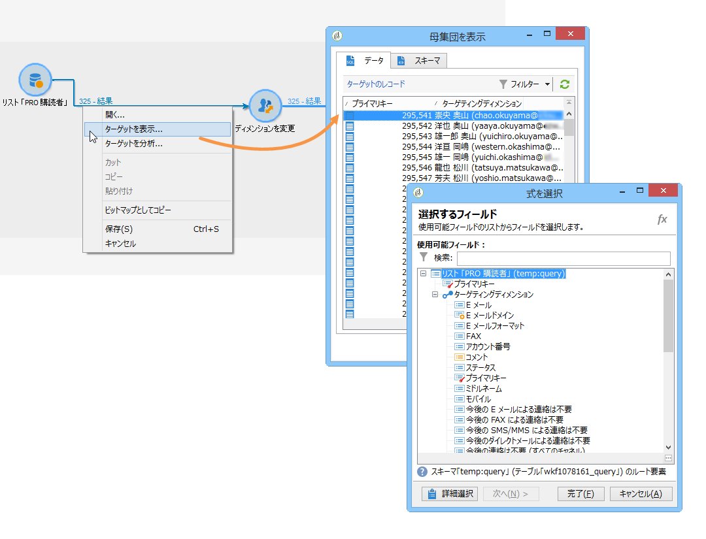
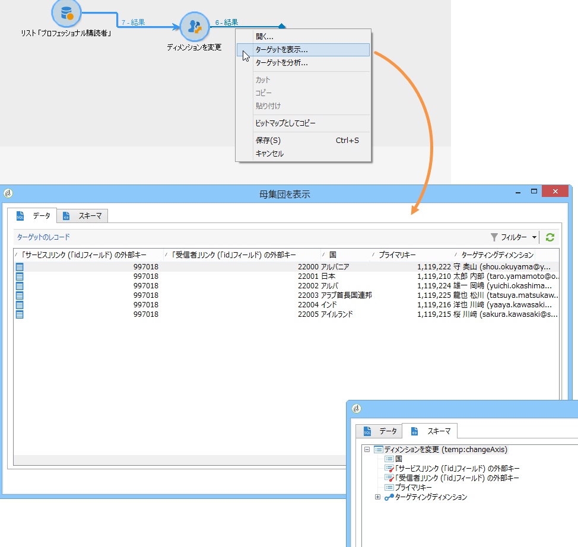

# ディメンションを変更{#change-dimension}

「ディメンションを変更」アクティビティを使用して、ターゲットの構築サイクル中にターゲティングディメンションを変更できます。 軸の移動は、データテンプレートと入力ディメンションに依存します。 これにより、「契約」ディメンションから「クライアント」ディメンションに切り替えることができます。

さらに、このアクティビティを使用して、新規ターゲットの追加列を定義できます。

データの重複排除条件を定義することもできます。

## 設定モード {#configuration-mode}

「ディメンションの変更」アクティビティを設定するには、次の手順に従います。

1. 新しいターゲティングディメンションを「**[!UICONTROL ディメンションを変更]**」フィールド経由で選択します。

   

1. ディメンションの変更時に、すべての要素を保持することも、出力に含める要素を選択することもできます。 次の例では、maxです。 重複の数は2に設定されます。

   

   レコードを 1 つだけ保持する場合は、1 つのコレクションが作業スキーマに表示されます。このコレクションは、最終結果でターゲットにならないすべてのレコードを表します（1 つのレコードのみが保持されるため）。 ほかのすべてのコレクションと同様に、このコレクションを使用して、集計を自動生成したり、列内の情報を取得したりできます。

   例えば、「**[!UICONTROL 顧客]**」ディメンションを「**[!UICONTROL 受信者]**」ディメンションに変更すると、購入数を追加するだけでなく、特定の店舗の顧客のターゲティングが可能になります。

1. この情報の一部のみを保持するように選択する場合、重複管理モードで設定できます。

   

   青い矢印を使用して、重複処理の優先度を定義できます。

   上の例では、受信者はまずメールアドレスに基づいて重複排除され、次に必要に応じてアカウント番号に基づいて重複排除されます。

1. 「**[!UICONTROL 結果]**」タブで、追加情報を追加できます。

   例えば、**Substring**&#x200B;タイプ関数を使用して、郵便番号に基づいて国を収集できます。 手順は次のとおりです。

   * 「**[!UICONTROL データを追加...]**」リンクをクリックし、「**[!UICONTROL フィルタリングディメンションにリンクされたデータ]**」を選択します。

     

     >[!NOTE]
     >
     >追加列の作成と管理について詳しくは、[データの追加](query.md#adding-data)を参照してください。

   * 以前のターゲティングディメンション（軸変更の前）を選択し、受信者の「**[!UICONTROL 場所]**」サブツリーで「**[!UICONTROL 郵便番号]**」を選択して「**[!UICONTROL 式を編集]**」をクリックします。

     

   * 「**[!UICONTROL 詳細選択]**」をクリックし、「**[!UICONTROL 式を使用して数式を編集]**」を選択します。

     

   * リストで提供される関数を使用して、実行される計算を指定します。

     

   * 最後に、作成した列のラベルを入力します。

     

1. ワークフローを実行して、この設定の結果を確認します。 次の図に示すように、ディメンションアクティビティの変更前と変更後のテーブル内のデータを比較し、さらにワークフローテーブルの構造も比較します。

   

   
