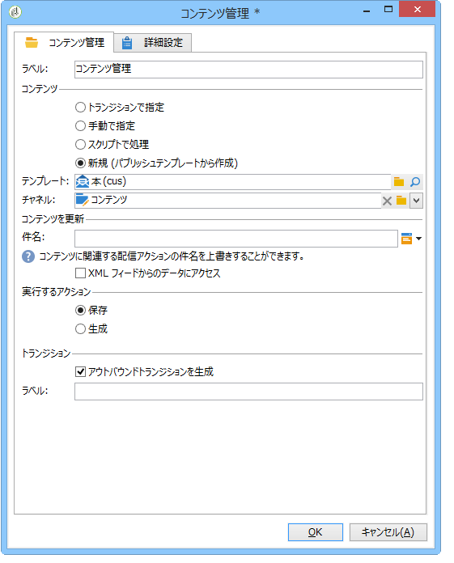
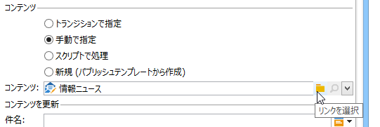
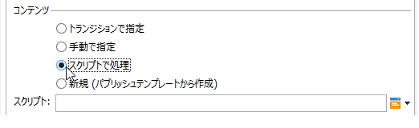
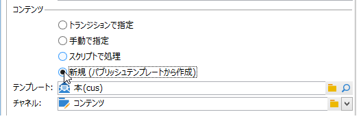
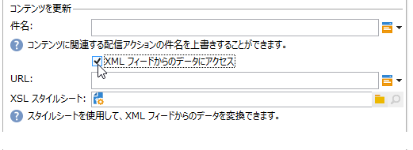
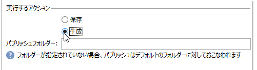

# コンテンツ管理{#content-management}

「**コンテンツ管理**」アクティビティでは、コンテンツの作成と操作、およびこのコンテンツに基づくファイルの生成をおこなうことができます。その後、このコンテンツを「配信」アクティビティ経由で配信できます。

>[!CAUTION]
>
>コンテンツ管理は、オプションの Adobe Campaign モジュールです。使用許諾契約書を確認してください。

アクティビティのプロパティは、3 つの手順に分かれています。

* **コンテンツの選択**：以前に作成されたコンテンツから選ぶか、アクティビティ経由でコンテンツを作成します。
* **コンテンツの更新**：コンテンツの件名を変更するか、すべての XML コンテンツをインポートします。
* **アクション**：生成されるコンテンツを保存または生成できます。

   

   Adobe Campaign でのコンテンツ管理の設定と使用について詳しくは、この[節](../../delivery/using/about-content-management.md)を参照してください。

1. **コンテンツ**

   * **[!UICONTROL Specified in the transition]**

      このオプションでは、トランジションで指定されたコンテンツを使用できます。つまり、コンテンツ管理を有効化するイベントは、変数 **[!UICONTROL contentId]** を含む必要があります。この変数は、先行するコンテンツカスタマーサービスまたは任意のスクリプトによって設定できます。

   * **[!UICONTROL Explicit]**

      This option lets you select a content already created, via the **[!UICONTROL Content]** field. This field is visible only when the **[!UICONTROL Explicit]** option is selected.

      

   * **[!UICONTROL Calculated by a script]**

      コンテンツ ID がスクリプトによって自動生成されます。The **[!UICONTROL Script]** field lets you define a JavaScript template evaluating the identifier (primary key) of the content. This field is visible only when the **[!UICONTROL Calculated by a script]** option is selected.

      

   * **[!UICONTROL New, created from a publication template]**

      パブリッシュテンプレートを使用して、新しいコンテンツを作成します。This new content will be saved in the file specified in the **[!UICONTROL String]** field. The **[!UICONTROL Template]** field specifies the publication template to be used to create the content.

      

1. **コンテンツを更新**

   * **[!UICONTROL Subject]**

      コンテンツの件名を変更できます。

   * **[!UICONTROL Access to data from an XML feed]**

      XSL スタイルシート経由でダウンロードした XML ドキュメントからコンテンツを構築できます。このオプションが選択されている場合、「**[!UICONTROL URL]**」フィールドは XML コンテンツのダウンロード URL を指定します。The **[!UICONTROL XSL stylesheet]** lets you specify the stylesheet to be used to transform the downloaded XML document. このプロパティはオプションです。

      

1. **実行するアクション**

   * **[!UICONTROL Save]**

      作成または変更したコンテンツを保存します。

      アウトバウンドトランジションは 1 回のみ有効化され、コンテンツはパラメーターとして変数 **[!UICONTROL contentId]** に保存されます。

   * **[!UICONTROL Generate]**

      「ファイル」タイプのパブリッシュによって、コンテンツを保存し、変換テンプレートごとに出力ファイルを生成します。

      

      生成されたファイルごとにアウトバウンドトランジションが有効化され、コンテンツ ID がパラメーターとして変数 **[!UICONTROL contentId]** に、ファイル名は変数 **[!UICONTROL filename]** に保存されます。

## 入力パラメーター {#input-parameters}

* contentId

このオプションが有効な場合に使用するコンテンツ **[!UICONTROL Specified in the transition]** の識別子です。

## 出力パラメーター {#output-parameters}

* contentId

   コンテンツ識別子

* filename

   Full name of the generated file if the selected action is **[!UICONTROL Generate]**.

## 例 {#examples}

この[節](../../delivery/using/automating-via-workflows.md#examples)の例を参照してください。
