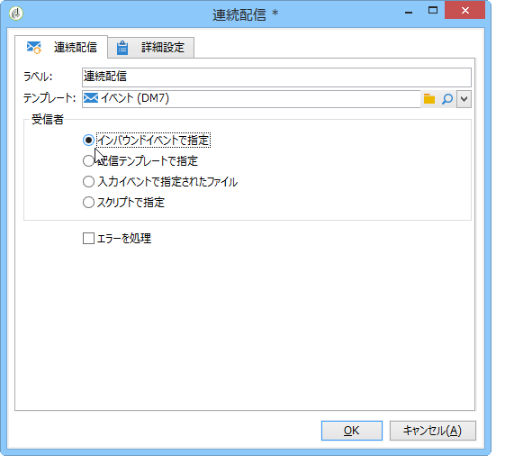

# 連続配信{#continuous-delivery}

「**連続配信**」タイプアクションでは、既存の配信に新しい受信者を追加できます。この配信タイプにより、毎回新しい配信を作成する必要がなくなります。このモードは、特に、容量不足のアラートや通知の送信が必要になった場合などに効率的です。配信テンプレートレベルで、関連する配信のラベル（およびキャンペーンフォルダー）を計算するスクリプトを指定できます。スクリプトがまだ存在しない配信を計算すると、その配信が計算中に作成されます。

「**[!UICONTROL エラーを処理]**」オプションは、エラーが生成された場合に有効化される特定のトランジションを表示します。この場合、ワークフローはエラーモードに入らず、実行は継続されます。

対象となるエラーは、ファイルシステムエラーです（ファイルを移動できない、ディレクトリにアクセスできない、など）。

このオプションは、無効な値など、アクティビティの設定に関するエラーは処理しません。

## 入力パラメーター {#input-parameters}

* tableName
* schema

各インバウンドイベントは、これらのパラメーターによって定義されるターゲットを指定する必要があります。

「**[!UICONTROL インバウンドイベントで指定]**」オプションが選択されている場合のみ。

## 出力パラメーター {#output-parameters}

* tableName
* schema
* recCount

この 3 つの値セットは、オンザフライ配信によって生成されたターゲットを識別します。**[!UICONTROL tableName]** はターゲットの識別子を記憶するテーブル名、**[!UICONTROL schema]** は母集団のスキーマ（通常は nms:recipient）、**[!UICONTROL recCount]** はテーブル内の要素の数です。

補集合に関連付けられたトランジションは、同じパラメーターを持ちます。
