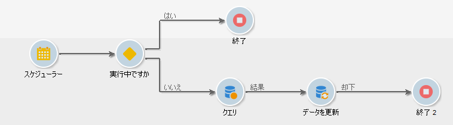
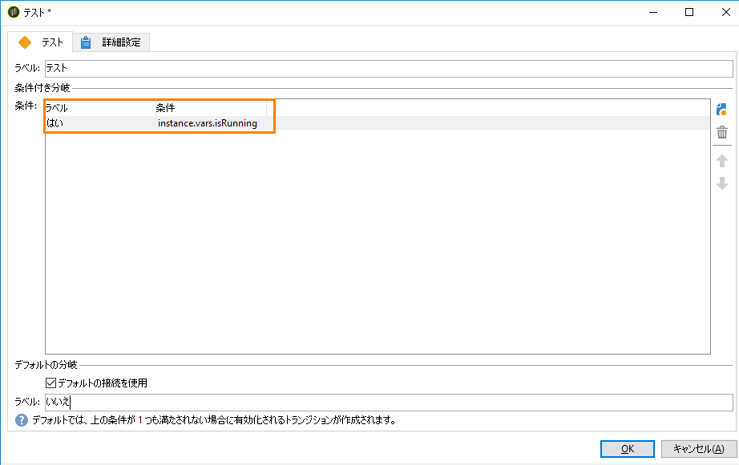
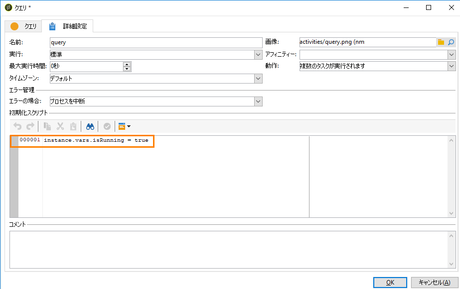
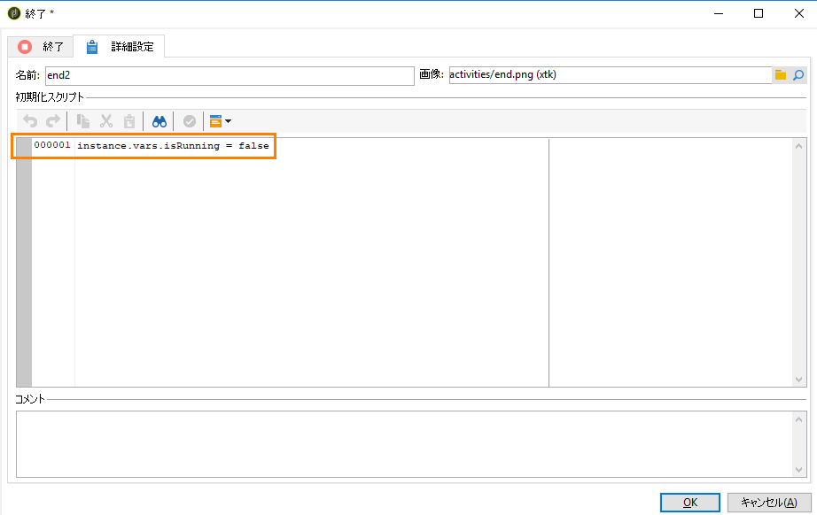

# データ更新の調整{#coordinating-data-updates}

この使用例では、1 つのワークフローを複数実行する場合に、付随する複数の更新を管理できるワークフローの作成について詳述します。

この目的は、別の更新操作を実行する前に、更新プロセスが終了していることを確認することです。そのためには、インスタンス変数を設定し、インスタンスが実行中かどうかワークフローに確認させて、ワークフローの実行を継続し、更新をおこなうべきか決定します。

このワークフローは次の要素から構成されます。

* 特定の頻度でワークフローを実行する&#x200B;**スケジューラー**&#x200B;アクティビティ。
* 既にワークフローが実行しているかどうかを確認する&#x200B;**テスト**&#x200B;アクティビティ。
* ワークフローがまだ実行していない場合の&#x200B;**クエリ**&#x200B;アクティビティおよび&#x200B;**データを更新**&#x200B;アクティビティ。その後に実行され、ワークフローインスタンス変数を false に再初期化する&#x200B;**終了**&#x200B;アクティビティ。
* ワークフローが既に実行している場合の&#x200B;**終了**&#x200B;アクティビティ。

ワークフローを構築するには、以下の手順に従います。

1. **スケジューラー**&#x200B;アクティビティを追加し、必要に応じて頻度を設定します。
1. ワークフローが既に実行しているかどうかを確認する&#x200B;**テスト**&#x200B;アクティビティを追加し、次のように設定します。

   >[!NOTE]
   >
   >「isRunning」は、この例のために選択したインスタンス変数名です。これは、組み込み変数ではありません。

   

1. 「**いいえ**」の分岐に&#x200B;**終了**&#x200B;アクティビティを追加します。これにより、既にワークフローが実行している場合は、何も実行されません。
1. 「**はい**」の分岐に、必要なアクティビティを追加します。この例では、**クエリ**&#x200B;アクティビティおよび&#x200B;**データを更新**&#x200B;アクティビティです。
1. Open the first activity, then add the **instance.vars.isRunning = true** command in the **[!UICONTROL Advanced]** tab. これにより、インスタンス変数が実行中に設定されます。

   

1. Add an **End** activity at the end of the **[!UICONTROL Yes]** fork, then add the **instance.vars.isRunning = false** command in the **[!UICONTROL Advanced]** tab.

   これにより、ワークフローが実行している間は、何も実行されません。

   

**関連トピック：**

* [同時複数実行の防止](../../workflow/using/monitoring-workflow-execution.md#preventing-simultaneous-multiple-executions)
* [データを更新アクティビティ](../../workflow/using/update-data.md)

